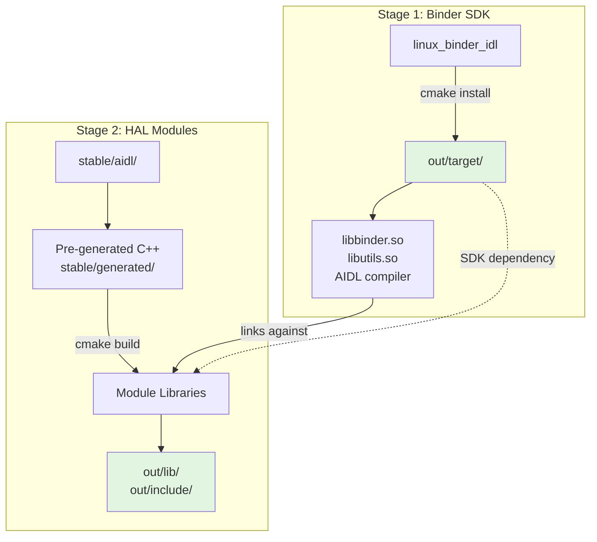

# RDK HAL Aidl Interface

**RDK-HALIF-AIDL** is an open-source framework that standardizes hardware
abstraction layers using Android AIDL. It provides a structured, IPC-driven
interface for seamless communication between system components and hardware
devices.

Designed for embedded platforms, **RDK-HALIF-AIDL** ensures efficient hardware
interaction, modular development, and interoperability with Android-based
ecosystems.

Complete documentation: [https://rdkcentral.github.io/rdk-halif-aidl/](https://rdkcentral.github.io/rdk-halif-aidl/)

## Architecture



### Directory Structure

```text
rdk-halif-aidl/
├── build-tools/
│   └── linux_binder_idl/     # Android Binder SDK (independent project)
├── stable/
│   ├── aidl/                 # AIDL interface definitions (versioned)
│   ├── generated/            # Pre-generated C++ code (committed)
│   └── dependencies.txt      # Module dependency graph
├── out/
│   ├── target/               # Complete deployment SDK
│   │   ├── lib/
│   │   │   ├── binder/       # Binder runtime libraries
│   │   │   └── halif/        # HAL interface libraries
│   │   ├── include/
│   │   │   ├── binder_sdk/   # Binder headers
│   │   │   └── halif/        # HAL interface headers
│   │   ├── bin/              # AIDL compiler
│   │   └── .sdk_ready        # Completion marker
└── <module>/                 # HAL module directories (boot, videodecoder, etc.)
    └── current/
        ├── CMakeLists.txt    # Module build configuration
        ├── hfp-*.yaml        # HAL Feature Profile
        └── com/rdk/hal/      # AIDL source files
```

## Quick Start

### Development Environment (Interface Authors)

**Purpose**: Modify AIDL interfaces, generate C++ code, validate compatibility

```bash
# 1. Install Binder SDK for development
./install_binder.sh

# 2. Modify AIDL interfaces in <module>/current/
vim boot/current/com/rdk/hal/boot/IBoot.aidl

# 3. Build and validate interface
./build_interfaces.sh boot

# 4. Commit generated code
git add stable/
git commit -m "Update boot interface"
```

**Development Tools**: `install_binder.sh`, `build_interfaces.sh`, `freeze_interface.sh`

⚠️ **These scripts are NOT used in production builds**

### Production Build (Yocto/BitBake)

**Purpose**: Compile pre-generated C++ code into production libraries

```bash
# Prerequisites:
# - linux_binder SDK provided by build system (not install_binder.sh)
# - Pre-generated code in stable/generated/ (committed to repo)

# Build HAL libraries using CMake
cmake -S . -B build \
      -DINTERFACE_TARGET=all \
      -DAIDL_SRC_VERSION=current \
      -DBINDER_SDK_DIR=${STAGING_DIR}/usr

cmake --build build -j$(nproc)

# Output: out/target/lib/halif/*.so
#         out/target/include/halif/*
```

**Production Requirements**:

- ✅ CMake 3.8+
- ✅ linux_binder SDK (from build system, not this repo)
- ✅ Pre-generated C++ code (stable/generated/)
- ❌ Does NOT require: Python, AIDL compiler, interface generation

## Build Workflows

### Development Workflow (Interface Authors Only)

**When to use**: Modifying AIDL interface definitions

```bash
# 1. Install Binder SDK with AIDL compiler (development only)
./install_binder.sh

# 2. Modify interfaces, generate C++, validate
./build_interfaces.sh <module>

# 3. Freeze versions when stable
./freeze_interface.sh <module>
```

**What happens**:

- AIDL compiler generates C++ from `.aidl` files
- Generated code placed in `stable/generated/`
- Compatibility validation runs
- Generated code is committed to repository

**Tools used**: Python scripts, AIDL compiler, validation framework

---

### Production Workflow (Yocto/BitBake)

**When to use**: Building deployable HAL libraries from pre-generated code

```bash
# Prerequisites (provided by build system):
# - linux_binder SDK installed to ${STAGING_DIR}/usr
# - libbinder.so, libutils.so, aidl-cpp headers

# Build HAL libraries
cmake -S . -B build \
      -DINTERFACE_TARGET=all \
      -DBINDER_SDK_DIR=${STAGING_DIR}/usr

cmake --build build
cmake --install build
```

**What happens**:

- CMake compiles pre-generated C++ (stable/generated/)
- Links against system-provided linux_binder SDK
- Produces `lib{module}-vcurrent-cpp.so` libraries
- Installs to `${OUT_DIR}/target/lib/halif/`

**Tools used**: CMake, C++ compiler, system linker

**Does NOT require**:

- ❌ `install_binder.sh` (SDK from build system)
- ❌ `build_interfaces.sh` (C++ pre-generated)
- ❌ Python or AIDL compiler

---

### Yocto Recipe Pattern

```bitbake
DEPENDS = "linux-binder"

do_configure() {
    cmake -S ${S} -B ${B} \
          -DINTERFACE_TARGET=all \
          -DBINDER_SDK_DIR=${STAGING_DIR}${prefix}
}

do_compile() {
    cmake --build ${B}
}

do_install() {
    install -d ${D}${libdir}
    install -m 0755 ${B}/out/target/lib/halif/*.so ${D}${libdir}/
    
    install -d ${D}${includedir}/halif
    cp -r ${B}/out/target/include/halif/* ${D}${includedir}/halif/
}
```

## Configuration

### Production Build Variables (CMake)

Used when building HAL libraries for deployment:

| Variable            | Purpose                     | Default                 | Required |
|---------------------|-----------------------------|-------------------------|----------|
| `INTERFACE_TARGET`  | Module(s) to build          | `all`                   | No       |
| `AIDL_SRC_VERSION`  | Version to build            | `current`               | No       |
| `BINDER_SDK_DIR`    | linux_binder SDK location   | `out/target`            | **Yes**  |
| `OUT_DIR`           | Output directory            | `out`                   | No       |

**Example**:

```bash
cmake -B build \
      -DINTERFACE_TARGET=boot \
      -DBINDER_SDK_DIR=/usr
```

### Development Build Variables (Scripts)

Used by `install_binder.sh` and `build_interfaces.sh` only:

| Variable            | Purpose                     | Default                 |
|---------------------|-----------------------------|-------------------------|
| `BINDER_SDK_DIR`    | Where to install SDK        | `out/target`            |
| `BINDER_SOURCE_DIR` | Existing binder source      | `build-tools/linux_...` |

**Not used in production Yocto builds**.

See [TWO_STAGE_BUILD.md](TWO_STAGE_BUILD.md) for detailed workflows.

## Copyright and License

**RDK-HALIF-AIDL** is Copyright 2024 RDK Management and licensed under the
Apache License, Version 2.0. See the LICENSE and NOTICE files in the top-level
directory for further details.
