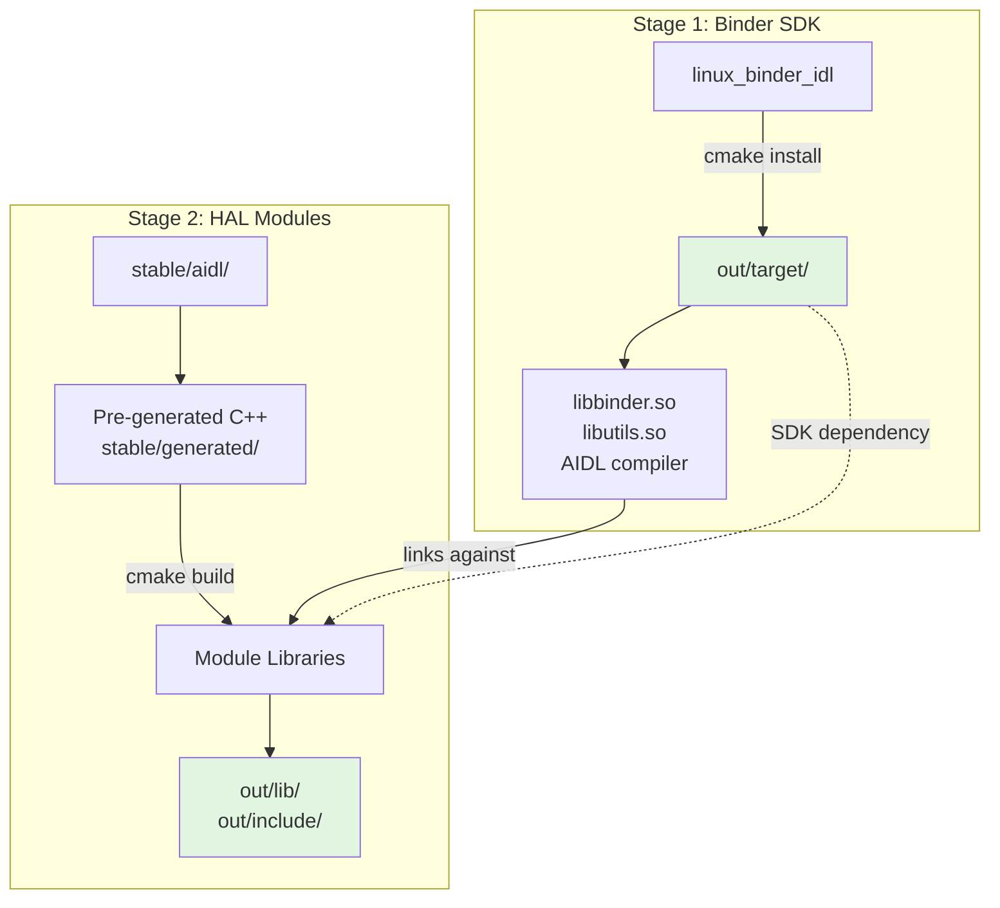

# RDK HAL Aidl Interface

**RDK-HALIF-AIDL** is an open-source framework that standardizes hardware
abstraction layers using Android AIDL. It provides a structured, IPC-driven
interface for seamless communication between system components and hardware
devices.

Designed for embedded platforms, **RDK-HALIF-AIDL** ensures efficient hardware
interaction, modular development, and interoperability with Android-based
ecosystems.

Complete documentation: [https://rdkcentral.github.io/rdk-halif-aidl/](https://rdkcentral.github.io/rdk-halif-aidl/)

## Architecture



### Directory Structure

```text
rdk-halif-aidl/
├── build-tools/
│   └── linux_binder_idl/     # Android Binder SDK (independent project)
├── stable/
│   ├── aidl/                 # AIDL interface definitions (versioned)
│   ├── generated/            # Pre-generated C++ code (committed)
│   └── dependencies.txt      # Module dependency graph
├── out/
│   ├── target/               # Complete deployment SDK
│   │   ├── lib/
│   │   │   ├── binder/       # Binder runtime libraries
│   │   │   └── halif/        # HAL interface libraries
│   │   ├── include/
│   │   │   ├── binder_sdk/   # Binder headers
│   │   │   └── halif/        # HAL interface headers
│   │   ├── bin/              # AIDL compiler
│   │   └── .sdk_ready        # Completion marker
└── <module>/                 # HAL module directories (boot, videodecoder, etc.)
    └── current/
        ├── CMakeLists.txt    # Module build configuration
        ├── hfp-*.yaml        # HAL Feature Profile
        └── com/rdk/hal/      # AIDL source files
```

## Quick Start

### For Interface Consumers (Using Pre-Generated Code)

```bash
# 1. Build Binder SDK (once)
./install_binder.sh

# 2. Build HAL modules
./build_module.sh boot          # Build specific module
./build_module.sh all           # Build all modules

# 3. Deploy complete SDK
scp -r out/target/* target:/usr/
```

### For Interface Authors (Modifying AIDL)

```bash
# 1. Build complete toolchain
./build_interfaces.sh <module>

# 2. Commit generated code
git add stable/
git commit -m "Update <module> interface"
```

## Build System Integration

### Local Development (Default)

Uses default paths - no configuration needed:

```bash
./install_binder.sh              # SDK → out/target/
./build_module.sh all            # Modules → out/target/lib/halif/,
                                 #           out/target/include/halif/
```

### Yocto/BitBake

Override paths via environment or CMake:

```bash
# Option 1: Environment variables
BINDER_SDK_DIR=${D}${prefix} ./install_binder.sh

# Option 2: Direct CMake
cmake -S build-tools/linux_binder_idl -B build/binder \
      -DCMAKE_INSTALL_PREFIX=${D}${prefix}
```

### Standalone linux_binder_idl

The Binder SDK can be built independently:

```bash
cd build-tools/linux_binder_idl
cmake -B build -DCMAKE_INSTALL_PREFIX=/usr/local
cmake --build build
```

## Configuration

All paths are configurable via environment variables or CMake arguments:

| Variable            | Purpose                   | Default                 |
|---------------------|---------------------------|-------------------------|
| `BINDER_SDK_DIR`    | SDK install location      | `out/target`            |
| `BINDER_SOURCE_DIR` | Existing binder source    | `build-tools/...`       |
| `OUT_DIR`           | Module output directory   | `out`                   |
| `INTERFACE_TARGET`  | Module to build           | `all`                   |

Example:

```bash
BINDER_SDK_DIR=/opt/sdk ./install_binder.sh
cmake -B build -DOUT_DIR=/opt/modules -DINTERFACE_TARGET=boot
```

See [TWO_STAGE_BUILD.md](TWO_STAGE_BUILD.md) for detailed build workflows.

## Copyright and License

**RDK-HALIF-AIDL** is Copyright 2024 RDK Management and licensed under the
Apache License, Version 2.0. See the LICENSE and NOTICE files in the top-level
directory for further details.
