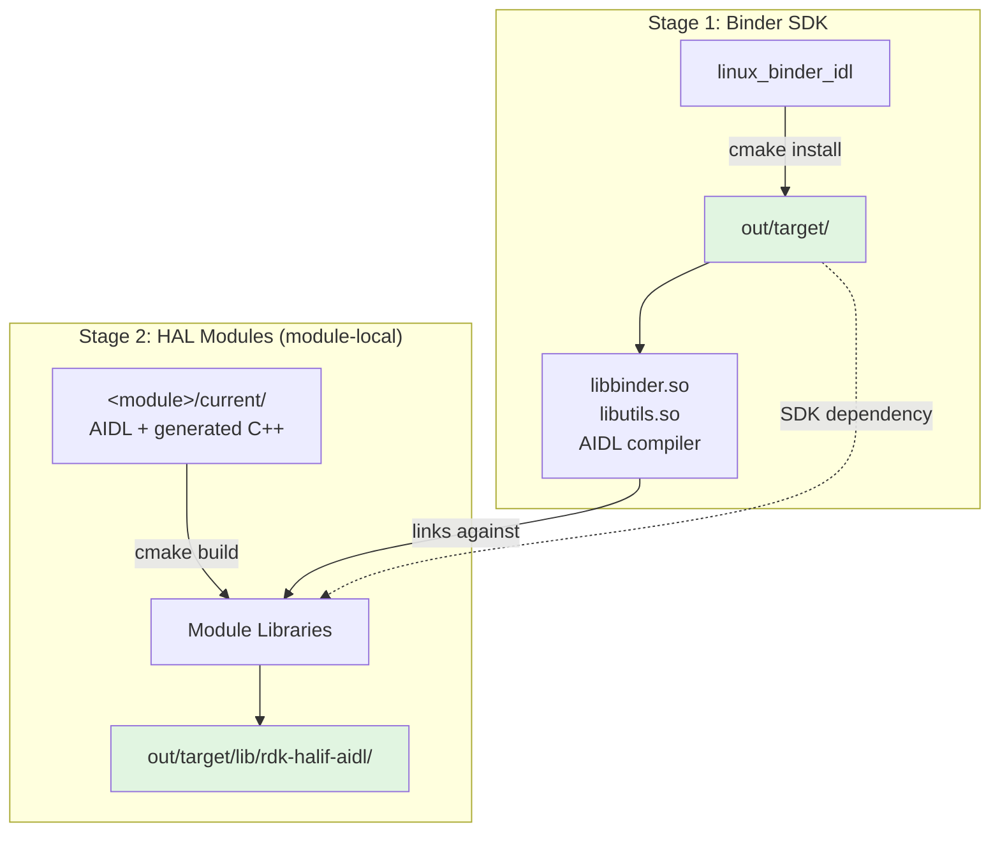

# RDK HAL Aidl Interface

**RDK-HALIF-AIDL** is an open-source framework that standardizes hardware
abstraction layers using Android AIDL. It provides a structured, IPC-driven
interface for seamless communication between system components and hardware
devices.

Designed for embedded platforms, **RDK-HALIF-AIDL** ensures efficient hardware
interaction, modular development, and interoperability with Android-based
ecosystems.

Complete documentation: [https://rdkcentral.github.io/rdk-halif-aidl/](https://rdkcentral.github.io/rdk-halif-aidl/)

## Architecture


```mermaid
graph TB
    subgraph "Stage 1: Binder SDK"
        A[linux_binder_idl] -->|cmake install| B[out/target/]
        B --> C[libbinder.so<br/>libutils.so<br/>AIDL compiler]
    end

    subgraph "Stage 2: HAL Modules (module-local)"
        D["&lt;module&gt;/current/<br/>AIDL + generated C++"] -->|cmake build| F[Module Libraries]
        C -->|links against| F
        F --> G[out/target/lib/rdk-halif-aidl/]
    end

    B -.->|SDK dependency| F

    style B fill:#e1f5e1
    style G fill:#e1f5e1
```

**Stage 1 (Binder SDK)**: The `linux_binder_idl` project in `build-tools/` is an independent Android Binder port built as a separate Yocto recipe (linux-binder). See the [linux_binder_idl BUILD guide](https://github.com/rdkcentral/linux_binder_idl/blob/develop/BUILD.md) for Yocto recipe integration and runtime setup.

### Directory Structure

Each component is **self-contained**: its AIDL, generated C++, docs and build
configuration all live within the component directory. A component has a
`current/` (in-development) directory and one directory per **released
version**. There is no central `stable/` tree.

```text
rdk-halif-aidl/
├── build-tools/
│   └── linux_binder_idl/     # Android Binder SDK (independent project)
├── out/
│   └── target/               # Complete deployment SDK
│       ├── lib/
│       │   ├── binder/       # Binder runtime libraries
│       │   └── halif/        # HAL interface libraries (lib<module>-vcurrent-cpp.so)
│       ├── bin/              # AIDL compiler
│       └── .sdk_ready        # Completion marker
├── versions.yaml             # Which version of each component to build
└── <module>/                 # HAL component directory (boot, videodecoder, ...)
    ├── metadata.yaml         # Component identity, version, RAG status
    ├── current/              # In-development version
    │   ├── interface.yaml    # AIDL interface definition (layout: module-local)
    │   ├── CMakeLists.txt    # Component build configuration
    │   ├── hfp-*.yaml        # HAL Feature Profile
    │   ├── com/rdk/hal/      # AIDL source files
    │   ├── include/ src/     # Generated C++ (committed)
    │   └── docs/             # Component documentation
    └── <version>/            # A released snapshot (e.g. 0.1.0.0) — same layout
        └── .hash             # Integrity hash of the released AIDL contract
```

A **release** is a plain copy of `current/` into a `<version>/` directory
(`./release.sh`), where `<version>` is the component's `metadata.yaml`
`version:`. Released directories are controlled, immutable snapshots.

## Quick Start

### Development workflow (interface authors)

**Purpose**: modify AIDL interfaces, regenerate C++, build the libraries.

```bash
# 1. Build the Binder SDK (once)
./build_binder.sh

# 2. Edit AIDL in a component's current/ directory
vim bootreason/current/com/rdk/hal/bootreason/IBootReason.aidl

# 3. Build — regenerates the module-local C++ and compiles the library
./build_modules.sh bootreason          # one component
./build_modules.sh all           # every component

# 4. Commit — AIDL and generated C++ live together in the component
git add bootreason/current/
git commit -m "Update boot interface"
```

Generated C++ is written into `bootreason/current/{include,src}/` and committed, so a
production build needs no Python or AIDL toolchain.

### Releasing

Releases are a full-cohort sweep — every component is bumped together
according to its change class and snapshotted under `<module>/<version>/`.
Per-component releases are not supported by design.

To "release just one component", land a focused PR touching only that
component and run the cohort release. Components with no changes don't
bump and don't get a new snapshot, so the effect is the same as a
single-component release would have been.

```bash
./release.sh                 # dry-run: auto-detects next release version
                             # from the latest tag, prints the --apply line
./release.sh --apply         # apply the release (writes metadata.yaml,
                             # creates snapshots, updates mkdocs nav,
                             # branch + tag)
```

### Consuming the interfaces (build with CMake directly)

Integrators and production build systems (Yocto/BitBake, buildroot, a CMake
superbuild) **invoke CMake directly** and select what to build through `-D`
switches. The `build_*.sh` wrapper scripts are developer/architecture-team tools
that require a native host toolchain and refuse to run in a cross/OpenEmbedded
environment. See [Third-Party Build Integration](docs/standards/build_integration.md)
for the full contract and reference recipes.

libbinder is built and staged by the separate **`linux-binder`** recipe
(`DEPENDS = "linux-binder"`). The HAL libraries are then built **per component**
from that staged SDK — each `<module>/<version>/` is self-contained (committed
C++, its own CMakeLists, **no linux_binder_idl toolchain source needed**):

```bash
# For each released <module>/<version>. A staged SDK is flat, so headers and
# libs share one prefix — point both BINDER_SDK_DIR and BINDER_SDK_INCLUDE_DIR
# at it (they differ only in the local dev tree).
cmake -S <module>/<version> -B build \
      -DBINDER_SDK_DIR=${STAGING_DIR}/usr \
      -DBINDER_SDK_INCLUDE_DIR=${STAGING_DIR}/usr
cmake --build build
cmake --install build
```

Compiles the committed module-local C++ into `lib<module>-v<version>-cpp.so`.
Requires only CMake, a C++ compiler and the staged linux_binder SDK — no Python,
no AIDL compiler, and no linux_binder_idl source.

> **Note (#635):** the one-shot root build (`cmake -S . -DINTERFACE_TARGET=all`)
> is the **integrated dev** path — it pulls in the linux_binder_idl toolchain
> (`CMakeLists.inc`) and so requires that source tree. It is **not** for a
> standalone Yocto recipe; use the per-component build above.

### Version manifest (`versions.yaml`)

`versions.yaml` is the manifest of which version of each component to build —
`current` (the in-development interface) or a released `<version>/` snapshot.
`./build_modules.sh manifest` builds the set it lists:

```bash
./build_modules.sh manifest               # build everything in versions.yaml
./build_modules.sh manifest --file alt.yaml
```

A component absent from the manifest falls back to its `default:` entry.

## Scripts

These are developer and architecture-team tools: they require a native host
toolchain and refuse to run in a cross/OpenEmbedded environment. Integrators
build with CMake directly — see [Consuming the interfaces](#consuming-the-interfaces-build-with-cmake-directly).

| Script | Role |
| ------ | ---- |
| `build_binder.sh` | **Stage 1** — clone, build and install the Binder SDK into `out/target/`. |
| `build_modules.sh` | **Stage 3** — compile the HAL libraries (`.so`) from each component's generated C++. The CMake configure step regenerates any missing sources. `build_modules.sh manifest` builds the set in `versions.yaml`. |
| `build_interfaces.sh` | **Admin / orchestration** — stages the Binder SDK then delegates the build to `build_modules.sh`; also test/clean helpers. |
| `release.sh` | Snapshot a component's `current/` into a versioned, controlled release directory (`<module>/<version>/`). |
| `check_aidl_changes.sh` | Hash-based detection of AIDL source changes. |
| `docs/build_docs.sh` | Build or serve the documentation site (mkdocs). |
| `freeze_interface.sh` | Legacy AIDL-freeze tooling — retained for reference, not used by the module-local release model. |

---

### Yocto Recipe Pattern

```bitbake
# Yocto dependency: linux-binder recipe provides SDK automatically
DEPENDS = "linux-binder"

do_configure() {
    # Compiler and flags are passed via environment variables
    # CMake will automatically use CC, CXX, CFLAGS, CXXFLAGS, LDFLAGS
    CC="${CC}" CXX="${CXX}" \
    CFLAGS="${CFLAGS}" CXXFLAGS="${CXXFLAGS}" LDFLAGS="${LDFLAGS}" \
    cmake -S ${S} -B ${B} \
          -DINTERFACE_TARGET=all \
          -DBINDER_SDK_DIR=${STAGING_DIR}${prefix} \
          -DBINDER_SDK_INCLUDE_DIR=${STAGING_DIR}${prefix}
}

do_compile() {
    cmake --build ${B} -j ${PARALLEL_MAKE}
}

do_install() {
    install -d ${D}${libdir}
    install -m 0755 ${B}/out/target/lib/rdk-halif-aidl/*.so ${D}${libdir}/

    # Note: Headers not needed on target (runtime only)
    # For development packages, create separate -dev recipe
}
```

**Compiler Configuration**:

The build system respects externally-defined compiler and flags through environment variables:

- **`CC`** - C compiler (e.g., `arm-linux-gnueabihf-gcc`)
- **`CXX`** - C++ compiler (e.g., `arm-linux-gnueabihf-g++`)
- **`CFLAGS`** - C compiler flags (e.g., `-O2 -march=armv7-a`)
- **`CXXFLAGS`** - C++ compiler flags (e.g., `-O2 -march=armv7-a -std=c++17`)
- **`LDFLAGS`** - Linker flags (e.g., `-Wl,--hash-style=gnu`)

These variables are automatically detected and applied by CMake when set in the environment.
Yocto's build system automatically provides these variables with appropriate cross-compilation settings.

## Configuration

### Production Build Variables (CMake)

Used when building HAL libraries for deployment:

| Variable                 | Purpose                           | Default      | Required |
|--------------------------|-----------------------------------|--------------|----------|
| `INTERFACE_TARGET`       | Module(s) to build                | `all`        | No       |
| `AIDL_SRC_VERSION`       | Version to build                  | `current`    | No       |
| `BINDER_SDK_DIR`         | linux_binder SDK libs location    | `out/target` | **Yes**  |
| `BINDER_SDK_INCLUDE_DIR` | linux_binder SDK headers location | `out/build`  | Yocto    |
| `OUT_DIR`                | Output directory                  | `out`        | No       |

`BINDER_SDK_DIR` and `BINDER_SDK_INCLUDE_DIR` differ only in the local dev
tree (libs in `out/target`, headers in `out/build`). A Yocto-staged SDK is
flat, so set both to the same staging prefix.

**Example**:

```bash
cmake -B build \
      -DINTERFACE_TARGET=boot \
      -DBINDER_SDK_DIR=/usr
```

### Development Build Variables (Scripts)

Used by `build_binder.sh` and `build_interfaces.sh` only:

| Variable            | Purpose                     | Default                 |
|---------------------|-----------------------------|-------------------------|
| `BINDER_SDK_DIR`    | Where to install SDK        | `out/target`            |
| `BINDER_SOURCE_DIR` | Existing binder source      | `build-tools/linux_...` |

**Not used in production Yocto builds**.

The full two-stage dev and production build workflows are covered in the
[Quick Start](#quick-start) section above. See
[Third-Party Build Integration](docs/standards/build_integration.md) for the
full consumer/integrator build contract.

## Additional Documentation

- **[linux_binder_idl BUILD guide](https://github.com/rdkcentral/linux_binder_idl/blob/develop/BUILD.md)** - Binder SDK recipe build guide
  - Yocto/BitBake recipe examples for linux-binder SDK
  - Cross-compilation configuration for ARM targets (aarch64, armhf)
  - Kernel configuration and runtime setup
  - Systemd service configuration
  - 32-bit userspace on 64-bit kernel support

- **[docs/standards/build_integration.md](docs/standards/build_integration.md)** - Consumer/integrator build contract: direct-CMake switches, required variables, reference BitBake/Bob recipes

- **[tests/README.md](tests/README.md)** - On-demand build verification
  - `tests/smoke/smoke_test.sh` - exercises the `all`, `manifest` and per-version build paths
  - `tests/yocto/` - emulates the Yocto production build offline

## Copyright and License

**RDK-HALIF-AIDL** is Copyright 2024 RDK Management and licensed under the
Apache License, Version 2.0. See the LICENSE and NOTICE files in the top-level
directory for further details.
