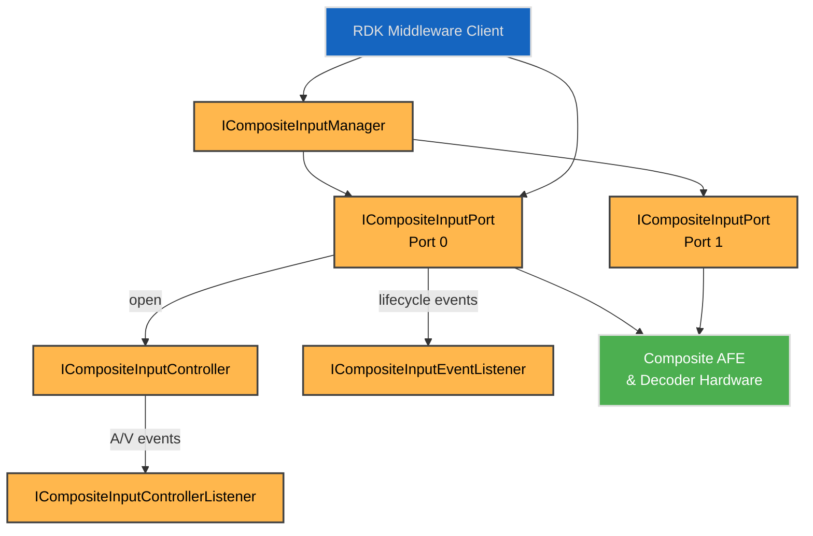
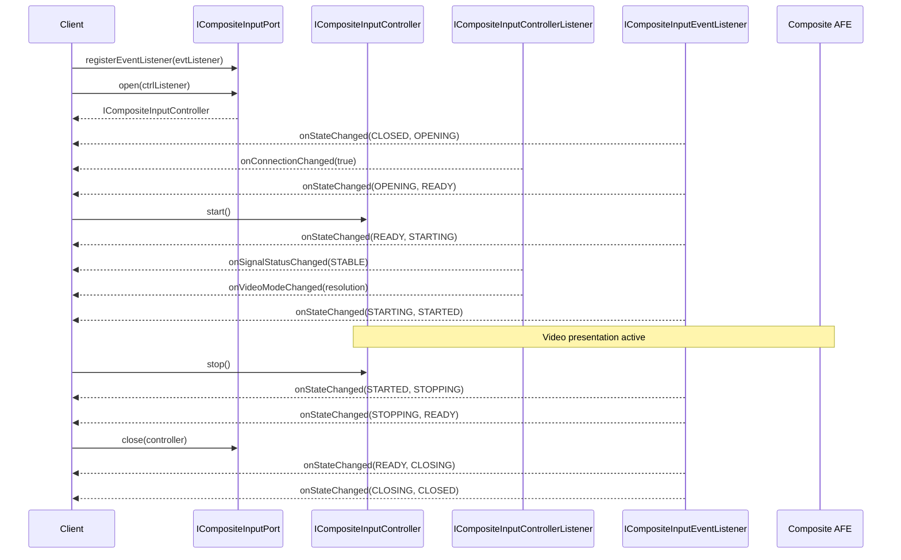
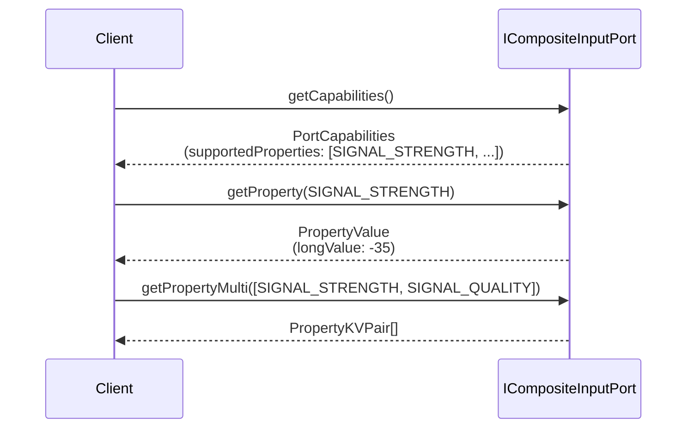
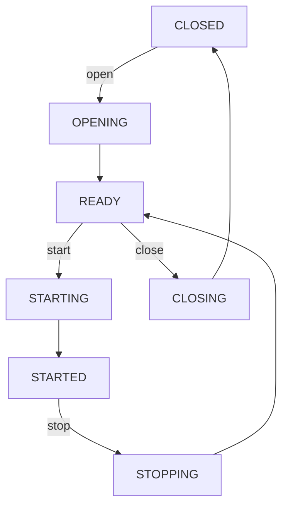

# Composite Input HAL Interface

## Overview

The `CompositeInput` HAL interface manages analog composite video input ports on the platform. It abstracts composite video signal detection, port lifecycle, and presentation control into a uniform interface for use by middleware or applications.

This interface is intended to be used by the composite input management components in the RDK platform. It supports multiple composite input ports, each with its own capabilities, state machine, and controller interface.

Video scaling, positioning, and aspect-ratio control are handled separately by the [Plane Control](../../../planecontrol/current/docs/plane_control.md) HAL. Audio routing (if supported) is handled by the platform's audio subsystem.

---

!!! info "References"
    |||
    |-|-|
    | **Interface Definition**     | [compositeinput](https://github.com/rdkcentral/rdk-halif-aidl/tree/main/compositeinput/current/com/rdk/hal/compositeinput) |
    | **HAL Interface Type**       | [AIDL and Binder](../../../docs/introduction/aidl_and_binder.md) |

---

!!! tip "Related Pages"
    - [HAL Feature Profile](../../../docs/key_concepts/hal/hal_feature_profiles.md)
    - [HAL Interface Overview](../../../docs/key_concepts/hal/hal_interfaces.md)
    - [HDMI Input](../../../hdmiinput/current/docs/hdmi_input.md)
    - [Plane Control](../../../planecontrol/current/docs/plane_control.md)

## Functional Overview

Each composite input port is exposed as an `ICompositeInputPort` interface. Clients can:

* Query static `PortCapabilities`
* Open the port to acquire an `ICompositeInputController`
* Start or stop composite input presentation
* Read runtime properties and telemetry metrics via `getProperty()` / `getPropertyMulti()`
* Receive connection, signal, and video mode callbacks via `ICompositeInputControllerListener`
* Observe port lifecycle and property changes via `ICompositeInputEventListener`

The `ICompositeInputManager` provides discovery of port IDs and exposes global `PlatformCapabilities`.

---

## Implementation Requirements

| #                           | Requirement                                                               | Comments                                          |
| --------------------------- | ------------------------------------------------------------------------- | ------------------------------------------------- |
| **HAL.CompositeInput.1**    | The service shall support enumeration of available composite input ports. | Use `ICompositeInputManager.getPortIds()`          |
| **HAL.CompositeInput.2**    | The service shall allow clients to query port-specific capabilities.      | See `ICompositeInputPort.getCapabilities()`        |
| **HAL.CompositeInput.3**    | The service shall emit connection events to the controller owner.         | Via `ICompositeInputControllerListener.onConnectionChanged()` |
| **HAL.CompositeInput.4**    | The service shall emit signal status events to the controller owner.      | Via `ICompositeInputControllerListener.onSignalStatusChanged()` |
| **HAL.CompositeInput.5**    | The service shall enforce `maximumConcurrentStartedPorts`.                | `start()` throws `EX_ILLEGAL_STATE` if limit exceeded |
| **HAL.CompositeInput.6**    | Port lifecycle shall follow the open/close + start/stop controller pattern. | Mirrors the HDMI input controller pattern |
| **HAL.CompositeInput.7**    | Property keys shall be `PortProperty` enum values declared in the HFP YAML. | Discoverable via `PortCapabilities.supportedProperties` |
| **HAL.CompositeInput.8**    | Telemetry metrics shall be first-class `PortProperty` keys (METRIC_* prefix). | No separate metrics parcelable; read via `getProperty()` |

---

## Interface Definitions

| AIDL File                              | Description                                                          |
| -------------------------------------- | -------------------------------------------------------------------- |
| `ICompositeInputManager.aidl`          | Manager interface for port discovery and platform capabilities       |
| `ICompositeInputPort.aidl`             | Per-port interface for lifecycle, status, properties, and listener registration |
| `ICompositeInputController.aidl`       | Exclusive write controller: start/stop, setProperty, resetMetrics    |
| `ICompositeInputControllerListener.aidl` | Controller callbacks: connection, signal status, video mode changes |
| `ICompositeInputEventListener.aidl`    | Multi-client observer: state transitions and property changes        |
| `PlatformCapabilities.aidl`            | Platform-wide capabilities and feature flags                         |
| `PortCapabilities.aidl`                | Port-specific capabilities (supported properties)                    |
| `PortStatus.aidl`                      | Polled snapshot: connection, signal status, video mode               |
| `PortProperty.aidl`                    | Enum of runtime status and telemetry metric keys                     |
| `Port.aidl`                            | Port metadata (name, description)                                    |
| `State.aidl`                           | Port lifecycle states                                                |
| `SignalStatus.aidl`                    | Signal status enum (NO_SIGNAL, UNSTABLE, STABLE, NOT_SUPPORTED)      |
| `VideoResolution.aidl`                 | Video resolution and format information                              |
| `PropertyKVPair.aidl`                  | Key-value pair for batch property operations                         |
| `PropertyMetadata.aidl`               | Property type metadata for runtime discovery                         |

---

## Initialization

The HAL service should be initialized via a systemd unit and must register with the Service Manager under the name defined in `ICompositeInputManager.serviceName` (`"composite_input"`). It must be ready before middleware components attempt to query or bind.

The systemd unit file should include [Wants](https://www.freedesktop.org/software/systemd/man/latest/systemd.unit.html#Wants=) or [Requires](https://www.freedesktop.org/software/systemd/man/latest/systemd.unit.html#Requires=) directives to start any platform driver services it depends upon.

---

## Product Customization

Each composite input port:

* Is uniquely identified via `ICompositeInputManager.getPort(portId)`
* Declares supported properties via `PortCapabilities.supportedProperties` (a `PortProperty[]`)
* May be limited by platform-wide rules, e.g. `PlatformCapabilities.maximumConcurrentStartedPorts`

### Maximum Concurrent Started Ports

`PlatformCapabilities.maximumConcurrentStartedPorts` defines the maximum number of ports that can be in STARTED state simultaneously. Most platforms set this to 1.

* If `start()` is called when the limit is reached, the call fails with `EX_ILLEGAL_STATE`.
* Clients must `stop()` an existing port before starting another.

---

## System Context



---

## Resource Management

* Composite input ports are identified by logical IDs (0 to maxPorts-1)
* A port must be opened via `open()` before use; this returns an exclusive `ICompositeInputController`
* Only one client can hold the controller at a time
* If the controller-owning client crashes, `stop()` and `close()` are implicitly called
* Event listeners can be registered/unregistered independently of the controller lifecycle
* `close()` requires the port to be in READY state (i.e., stopped first)

---

## Operation and Data Flow

### Discovery and Initialization

1. Client queries `ICompositeInputManager.getPlatformCapabilities()` for platform-wide information
2. Client retrieves port IDs via `ICompositeInputManager.getPortIds()`
3. Client obtains port interfaces via `ICompositeInputManager.getPort(portId)`
4. Client queries per-port capabilities via `ICompositeInputPort.getCapabilities()`

### Port Activation Sequence



### Property Query



---

## State Machine / Lifecycle



---

## Controller Listener (ICompositeInputControllerListener)

Delivered exclusively to the controller owner (passed into `open()`). Carries real-time A/V signal events.

| Event                      | Description                                     | Guaranteed delivery                      |
| -------------------------- | ----------------------------------------------- | ---------------------------------------- |
| `onConnectionChanged()`    | Cable connected or disconnected                 | Always during OPENING; on HPD thereafter |
| `onSignalStatusChanged()`  | Signal status changed (e.g. NO_SIGNAL → STABLE) | Always during STARTING                   |
| `onVideoModeChanged()`     | Detected resolution/format changed              | After signal stabilization               |

## Event Listener (ICompositeInputEventListener)

Available to any registered observer. Carries lifecycle and property events.

| Event                      | Description                                     |
| -------------------------- | ----------------------------------------------- |
| `onStateChanged()`         | Port state transition (e.g. CLOSED → OPENING)   |
| `onPropertyChanged()`      | Runtime property or metric value changed         |

---

## Signal Detection

The HAL implementation internally detects the video standard (NTSC, PAL, SECAM) and provides the digitized video resolution via the `VideoResolution` parcelable. Video standard detection is handled internally by the platform's analog frontend and is not exposed as an API-level concept.

Detection sequence:

1. Cable connection detected → `onConnectionChanged(true)` during OPENING
2. Port opened → READY state
3. `start()` called → STARTING state
4. Signal detection → `onSignalStatusChanged(UNSTABLE)` then `onSignalStatusChanged(STABLE)`
5. Format detected → `onVideoModeChanged(resolution)`
6. Port reaches STARTED state → video presentation begins

---

## Properties and Telemetry

Runtime status and telemetry metrics are unified as `PortProperty` enum keys, read via `getProperty()` / `getPropertyMulti()` and written (where writable) via `ICompositeInputController.setProperty()`.

### Runtime Status Keys (0–999)

| Key                | Type    | Access    | Description                                      |
| ------------------ | ------- | --------- | ------------------------------------------------ |
| `SIGNAL_STRENGTH`  | Long    | Read-only | Signal strength in dBm                           |
| `SIGNAL_QUALITY`   | Integer | Read-only | Aggregated signal quality percentage (0–100)     |

### Telemetry Metric Keys (1000+)

| Key                            | Type | Access    | Description                                           |
| ------------------------------ | ---- | --------- | ----------------------------------------------------- |
| `METRIC_SIGNAL_LOCK_TIME`      | Long | Read-only | Average signal lock time in ms                        |
| `METRIC_SIGNAL_DROPS`          | Long | Read-only | Total signal drop count since last reset              |
| `METRIC_UPTIME`                | Long | Read-only | Total uptime in ms since last reset                   |
| `METRIC_SIGNAL_LOCK_COUNT`     | Long | Read-only | Successful lock acquisition count since last reset    |
| `METRIC_LAST_SIGNAL_LOCK_TIME` | Long | Read-only | Most recent lock acquisition time in ms               |
| `METRIC_LAST_RESET_TIMESTAMP`  | Long | Read-only | Wall-clock timestamp (ms since epoch) of last reset   |

All `METRIC_*` keys are reset atomically by `ICompositeInputController.resetMetrics()`.

---

## Platform Capabilities (HFP)

The HAL Feature Profile YAML defines platform-specific capabilities and property keys:

```yaml
compositeinput:
  interfaceVersion: current

  ports:
    - id: 0
      name: "Front Panel Composite"
      description: "Front panel composite video input"

      # PortProperty enum identifiers supported on this port
      supportedProperties:
        - SIGNAL_STRENGTH
        - SIGNAL_QUALITY
        - METRIC_SIGNAL_LOCK_TIME
        - METRIC_SIGNAL_DROPS
        - METRIC_UPTIME
        - METRIC_SIGNAL_LOCK_COUNT
        - METRIC_LAST_SIGNAL_LOCK_TIME
        - METRIC_LAST_RESET_TIMESTAMP

      propertyMetadata:
        - key: SIGNAL_STRENGTH
          type: LONG
          readOnly: true
          isMetric: false
          description: "Signal strength in dBm"

  platformCapabilities:
    halVersion: "1.0.0"
    maxPorts: 2
    maximumConcurrentStartedPorts: 1

    supportedProperties:
      - SIGNAL_STRENGTH
      - SIGNAL_QUALITY
      - METRIC_SIGNAL_LOCK_TIME
      - METRIC_SIGNAL_DROPS
      - METRIC_UPTIME
      - METRIC_SIGNAL_LOCK_COUNT
      - METRIC_LAST_SIGNAL_LOCK_TIME
      - METRIC_LAST_RESET_TIMESTAMP

    features:
      macrovisionDetectionSupported: false
```

---

## Error Handling

| Exception                  | Method               | Condition                                        |
| -------------------------- | -------------------- | ------------------------------------------------ |
| `EX_ILLEGAL_STATE`         | `open()`             | Port is not in CLOSED state                      |
| `EX_ILLEGAL_STATE`         | `close()`            | Port is not in READY state                       |
| `EX_ILLEGAL_STATE`         | `start()`            | Port is not in READY state, or concurrent limit exceeded |
| `EX_ILLEGAL_STATE`         | `stop()`             | Port is not in STARTED state                     |
| `EX_ILLEGAL_STATE`         | `resetMetrics()`     | Port is not in STARTED state                     |
| `EX_ILLEGAL_ARGUMENT`      | `getPort()`          | Port ID out of range                             |
| `EX_ILLEGAL_ARGUMENT`      | `getProperty()`      | Invalid PortProperty enum value                  |
| `EX_ILLEGAL_ARGUMENT`      | `getPropertyMulti()` | Empty array or unknown PortProperty value        |
| `EX_UNSUPPORTED_OPERATION` | `setProperty()`      | Property is read-only                            |
| `EX_NULL_POINTER`          | `open()`             | Listener is null                                 |
| `EX_NULL_POINTER`          | `close()`            | Controller is null                               |

---

## Implementation Notes

### Composite Video Legacy Support

Composite video is a legacy analog format primarily used for:

* Retro gaming consoles
* DVD players and VCRs
* Legacy camcorders and cameras
* Backward compatibility with older equipment

Modern platforms typically provide 1–2 composite input ports for legacy device support, with most inputs using HDMI.

### Interlaced Video Handling

All composite video standards are interlaced:

* **NTSC**: 525i59.94 (480 active lines, ~59.94 Hz field rate)
* **PAL/SECAM**: 625i50 (576 active lines, 50 Hz field rate)

The HAL implementation should perform deinterlacing in the vendor layer before presentation. The `VideoResolution` parcelable indicates whether the source is interlaced.

### Video Scaling

Video scaling, positioning, and aspect-ratio control are not exposed on this interface. Composite input video, once presented via `start()`, is scaled and positioned by the display pipeline through the planecontrol HAL (`com.rdk.hal.planecontrol`). Clients migrating from the legacy `dsCompositeInScaleVideo()` API should configure the video plane via `IPlaneControl` rather than looking for an equivalent method on this interface.
