# CryptoEngine HAL

## Overview

The CryptoEngine HAL provides standalone cryptographic operations independent of key storage. It abstracts platform-specific crypto acceleration (TEE) or software fallback (OpenSSL) behind a uniform AIDL interface.

The engine operates on caller-provided key material and configuration. It has no concept of key storage or ownership — it receives keys, performs operations, and returns results.

Excluded: key storage, key lifecycle, and access policy.

---

## References

!!! info References
|||
|-|-|
|**Interface Definition**|[cryptoengine/current](./com/rdk/hal/cryptoengine/)|
|**API Documentation**| Generated from AIDL Javadoc comments |
|**HAL Interface Type**| AIDL and Binder |
|**HAL Feature Profile**| [hfp-cryptoengine.yaml](./hfp-cryptoengine.yaml) |

---

## Related Pages

!!! tip "Related Pages"
- [KeyVault HAL](../../keyvault/current/document.md) — key storage and lifecycle; attaches a CryptoEngine for operations on vault-managed keys
- [HAL Feature Profile](./hfp-cryptoengine.yaml) — platform-specific capability declaration

---

## Functional Overview

The CryptoEngine HAL has three layers:

| Interface | Role |
|-----------|------|
| `ICryptoEngine` | Top-level manager. Enumerates capabilities and opens sessions. |
| `ICryptoEngineController` | Per-session controller. Provides streaming (`begin`/`update`/`finish`) and one-shot crypto operations. |
| `ICryptoOperation` | Handle for an in-progress streaming operation. |

The engine supports:

- **Symmetric encryption/decryption** — AES-CBC, AES-CTR, AES-GCM, AES-ECB, ChaCha20-Poly1305
- **Asymmetric encryption/decryption** — RSA-OAEP
- **Signing/verification** — HMAC, ECDSA, Ed25519, RSA-PSS, RSA-PKCS1-v1_5
- **Key agreement** — ECDH (P-256, P-384, X25519)
- **Key wrapping** — AES-KW, RSA-OAEP
- **Key derivation** — HKDF, PBKDF2, DH, NFLX-DH
- **Digest** — SHA-1, SHA-2-224, SHA-2-256, SHA-2-384, SHA-2-512
- **Random number generation** — hardware RNG when available

---

## Implementation Requirements

| # | Requirement | Comments |
|---|-------------|---------|
| HAL.CE.1 | The service shall register with Binder Service Manager using the service name `CryptoEngine`. | Defined as `ICryptoEngine.serviceName`. |
| HAL.CE.2 | The service shall support at least 32 concurrent streaming operations. | Per HFP `maxConcurrentOperations`. |
| HAL.CE.3 | `begin()` shall return `EX_ILLEGAL_STATE` when the concurrent operation limit is reached. | Callers must `finish()` or `abort()` existing operations. |
| HAL.CE.4 | One-shot methods (`encrypt`, `decrypt`, `computeDigest`, `computeHmac`) shall be stateless and thread-safe. | No session required for one-shot use. |
| HAL.CE.5 | `generateRandom()` shall use the platform hardware RNG when available. | Fallback to software CSPRNG is acceptable. |
| HAL.CE.6 | GCM authentication tag verification failure shall return `EX_SERVICE_SPECIFIC`. | Must not return partial plaintext on tag failure. |
| HAL.CE.7 | After `finish()` or `abort()`, the `ICryptoOperation` handle shall be invalidated. | Further calls to `update()`/`finish()` return `EX_ILLEGAL_STATE`. |

---

## Interface Definitions

| AIDL File | Description |
|-----------|-------------|
| `ICryptoEngine.aidl` | Top-level manager: capabilities query, session open/close |
| `ICryptoEngineController.aidl` | Per-session controller: streaming and one-shot crypto operations |
| `ICryptoOperation.aidl` | In-progress operation handle: update/finish/abort |
| `CryptoConfig.aidl` | Parcelable: full configuration for a crypto operation |
| `EngineCapabilities.aidl` | Parcelable: advertised algorithms, modes, and limits |
| `Algorithm.aidl` | Enum: AES, EC, HMAC, RSA, CHACHA20_POLY1305 |
| `BlockMode.aidl` | Enum: CBC, CTR, GCM, ECB, KW |
| `PaddingMode.aidl` | Enum: NONE, PKCS7, RSA_OAEP, RSA_PSS, RSA_PKCS1_V1_5 |
| `Digest.aidl` | Enum: SHA-1, SHA-2 family |
| `EcCurve.aidl` | Enum: P-256, P-384, Ed25519, X25519 |
| `KeyDerivation.aidl` | Enum: HKDF, PBKDF2, NFLX_DH, DH |
| `KeyPurpose.aidl` | Enum: ENCRYPT, DECRYPT, SIGN, VERIFY, AGREE_KEY, WRAP_KEY, UNWRAP_KEY, DERIVE_KEY, DERIVE_BITS |
| `SecurityLevel.aidl` | Enum: SOFTWARE, TEE |

---

## Initialization

1. The platform starts the CryptoEngine HAL service process.
2. The service registers `ICryptoEngine` with Binder Service Manager under the name `CryptoEngine`.
3. Clients obtain the `ICryptoEngine` proxy via Service Manager lookup.
4. Clients call `getCapabilities()` to discover supported algorithms and limits.
5. Clients call `open()` to obtain an `ICryptoEngineController` session.

The CryptoEngine operates standalone with no dependencies on other HAL services.

---

## Product Customization

Platform vendors customize the engine via the HAL Feature Profile ([hfp-cryptoengine.yaml](./hfp-cryptoengine.yaml)):

- **Security level** — `TEE` or `SOFTWARE`
- **Supported algorithms, block modes, padding modes, digests, EC curves, KDFs**
- **Supported key sizes** per algorithm
- **Maximum concurrent operations**
- **Hardware acceleration** availability

The `EngineCapabilities` parcelable returned by `getCapabilities()` reflects these settings at runtime.

---

## System Context

The CryptoEngine HAL runs as an REE process. For TEE-backed engines (`securityLevel: TEE`), all crypto operations are delegated to the Trusted Application via the TEE client API. For software engines, operations use a software backend (e.g. OpenSSL).

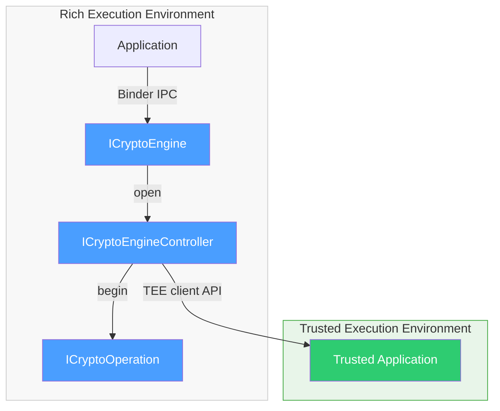

- The CryptoEngine is the **only REE component that talks to the TA**. All crypto operations (encrypt, decrypt, sign, derive, etc.) are forwarded to the TA when the engine's security level is TEE.
- The engine receives key material, configuration, and data. It does not know or care where the key material came from.
- For `securityLevel: SOFTWARE`, the engine uses a software backend (e.g. OpenSSL) and does not communicate with the TA.

---

## Session Model

The CryptoEngine is not a singleton. `ICryptoEngine` is a manager that creates independent sessions. Each session is an `ICryptoEngineController` that can run multiple concurrent operations.

```text
ICryptoEngine (one service, registered with Binder)
  ├── open() → ICryptoEngineController (session 1)
  │     ├── begin() → ICryptoOperation (operation A)
  │     └── begin() → ICryptoOperation (operation B)
  ├── open() → ICryptoEngineController (session 2)
  │     └── begin() → ICryptoOperation (operation C)
  └── close(session)
```

### Three interface levels

| Interface | Lifecycle | What it does |
|-----------|-----------|--------------|
| `ICryptoEngine` | One per service | Service lookup, capability query, session open/close. |
| `ICryptoEngineController` | One per `open()` call | Streaming operations (`begin`), one-shot operations (`encrypt`, `decrypt`, `computeHmac`, `computeDigest`, `generateRandom`). Each controller is an independent session. |
| `ICryptoOperation` | One per `begin()` call | Feed data (`update`), complete (`finish`), or cancel (`abort`). Handle is invalidated after `finish()` or `abort()`. |

### Full session lifecycle

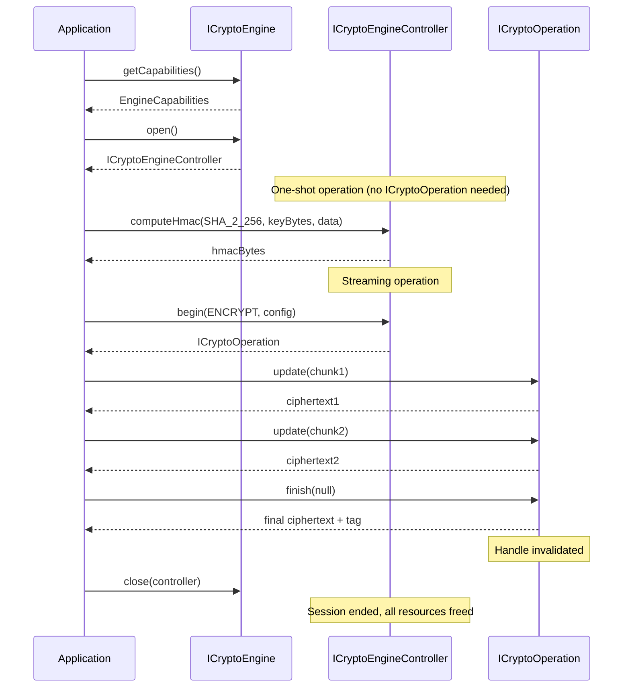

### Resource management

- Multiple controllers can be open concurrently (each is an independent session).
- Each controller can have multiple concurrent operations up to `maxConcurrentOperations`.
- One-shot methods (`encrypt`, `computeHmac`, etc.) do not consume an operation slot.
- If a client process dies, Binder death notification triggers cleanup of all its sessions and operations.

---

## Use Cases

The CryptoEngine operates standalone with caller-provided key material.

### HMAC Signing

**If you need to** sign requests or data for integrity verification using a key the caller holds:

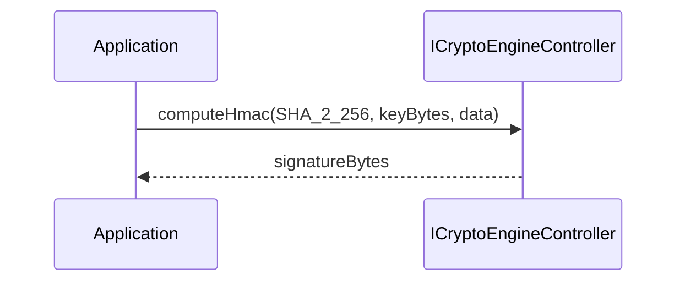

For larger payloads, use the streaming model:

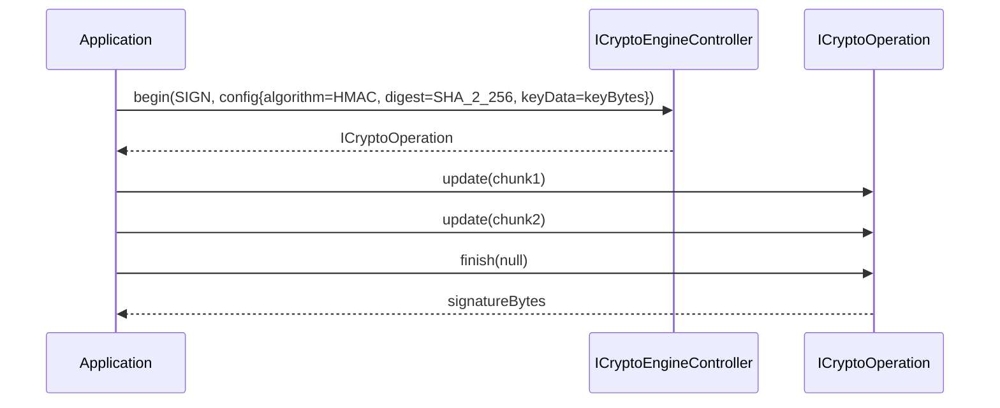

### Hashing (Digest)

**If you need to** compute a hash of data for integrity checking:

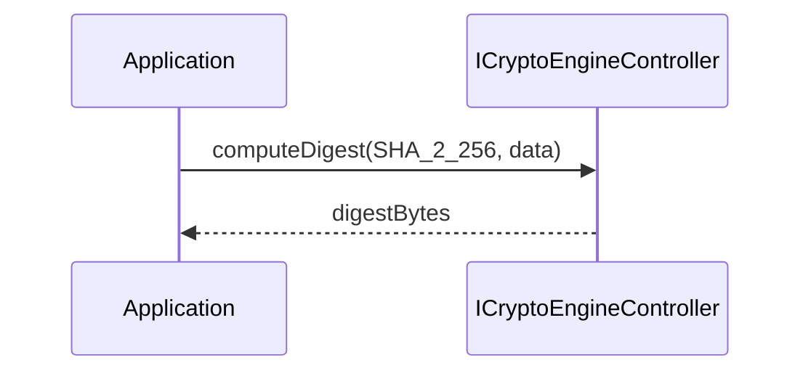

No key required. Stateless one-shot operation.

### Standalone Encryption / Decryption

**If you need to** encrypt or decrypt data with a caller-provided key:

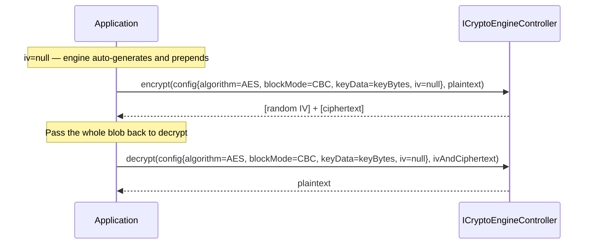

### IV Handling Convention

When `config.iv` is **null**, the engine auto-generates a cryptographically random IV and prepends it to the ciphertext output. On decrypt, the engine reads the IV from the first bytes of the input. The caller stores the entire blob as-is — no separate IV management needed.

| Mode | IV size | Encrypt output (iv=null) | Decrypt input |
|------|---------|--------------------------|---------------|
| AES-CBC | 16 bytes | `[16-byte IV] + [ciphertext]` | same blob |
| AES-CTR | 16 bytes | `[16-byte IV] + [ciphertext]` | same blob |
| AES-GCM | 12 bytes | `[12-byte nonce] + [ciphertext] + [16-byte tag]` | same blob |
| ChaCha20-Poly1305 | 12 bytes | `[12-byte nonce] + [ciphertext] + [16-byte tag]` | same blob |

When `config.iv` is **provided**, the engine uses it as-is and does NOT prepend it to the output. The caller is responsible for storing and providing the IV on decrypt. This mode is for callers that need explicit IV control (e.g. protocols with their own IV management).

### HMAC / Signature Verification

**If you need to** verify a signature or HMAC against received data:

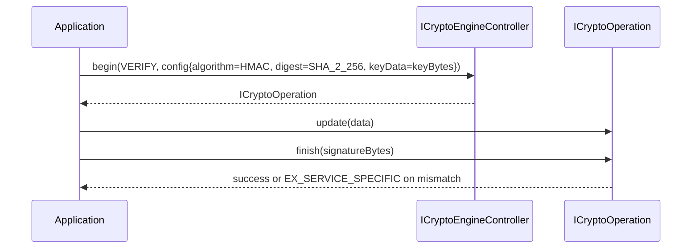

Works the same way for ECDSA, RSA-PSS, and RSA-PKCS1-v1_5 verification — change the algorithm and provide the public key.

### Key Wrapping / Unwrapping

**If you need to** wrap a key for secure transport or unwrap a received wrapped key:

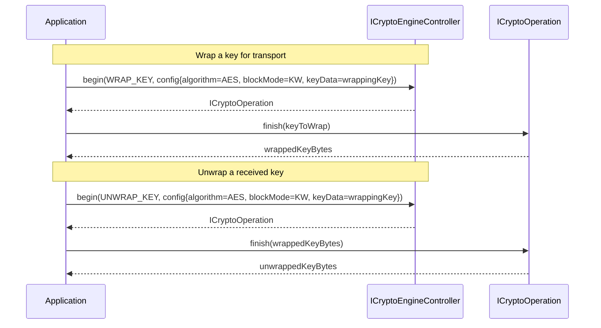

### Key Derivation (standalone)

**If you need to** derive raw key bytes (e.g. for use as a session token or to pass to another system):

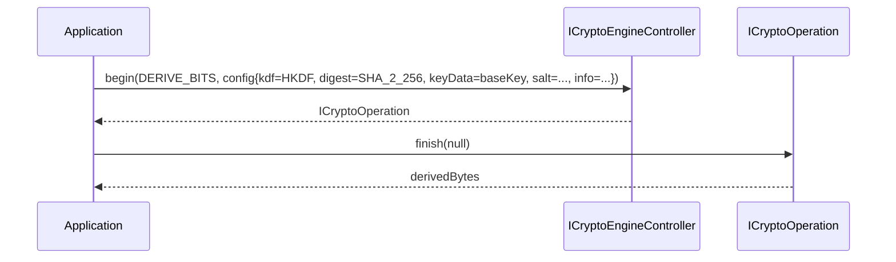

### Random Number Generation

**If you need** cryptographically secure random bytes:

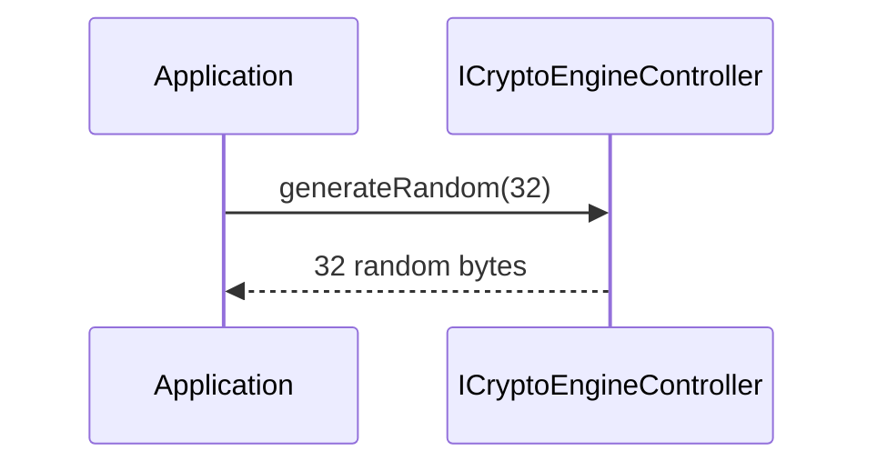

Uses the platform hardware RNG when available.

---

## Operation and Data Flow

### Streaming operations (begin / update / finish)

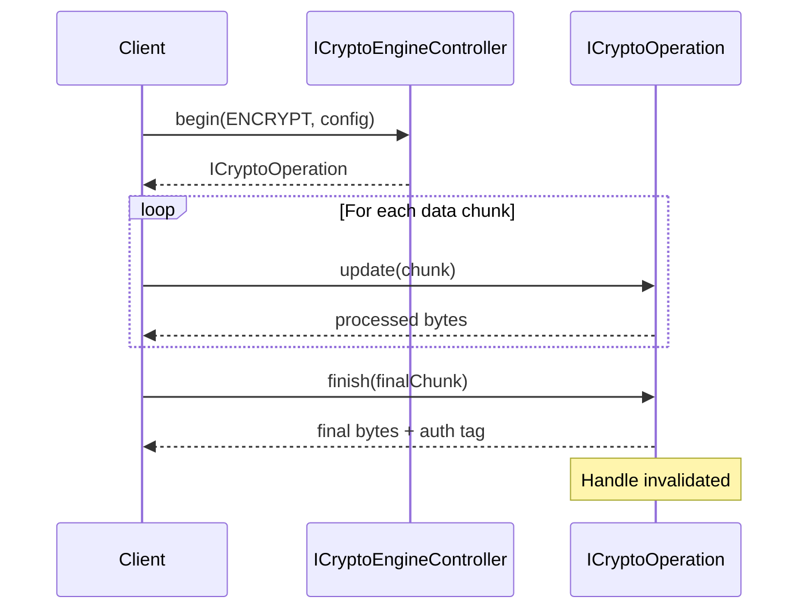

### One-shot operations

For small payloads, clients can skip the streaming model:

- `encrypt(config, plaintext)` — equivalent to `begin(ENCRYPT) + finish(plaintext)`
- `decrypt(config, ciphertext)` — equivalent to `begin(DECRYPT) + finish(ciphertext)`
- `computeDigest(digest, data)` — stateless hash, no session required
- `computeHmac(digest, key, data)` — stateless HMAC

---

## Event Handling

The CryptoEngine HAL does not emit asynchronous events. All operations are synchronous request/response over Binder.

For asynchronous lifecycle events (deep sleep, key invalidation), see the [KeyVault HAL](../../keyvault/current/document.md) and its `IKeyVaultEventListener`.

---

## State Machine / Lifecycle

### Operation lifecycle

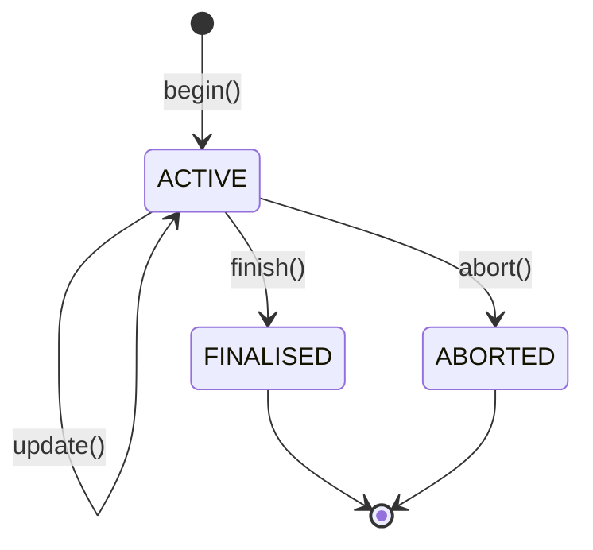

- `begin()` creates an `ACTIVE` operation.
- `update()` can be called zero or more times while `ACTIVE`.
- `finish()` completes the operation and returns final output.
- `abort()` discards all state without producing output.
- After `finish()` or `abort()`, the `ICryptoOperation` handle is invalidated.

---

## Error Handling

| Exception | Meaning |
|-----------|---------|
| `EX_ILLEGAL_ARGUMENT` | Invalid configuration, unsupported key size, empty input. |
| `EX_ILLEGAL_STATE` | Operation on an invalidated handle, max sessions/operations reached. |
| `EX_UNSUPPORTED_OPERATION` | Algorithm or mode not supported by this engine. |
| `EX_SERVICE_SPECIFIC` | GCM/Poly1305 authentication tag verification failure, or internal engine error. |

On any exception, output parameters contain undefined memory and must not be used.
