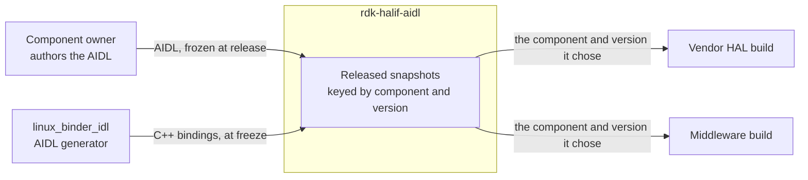
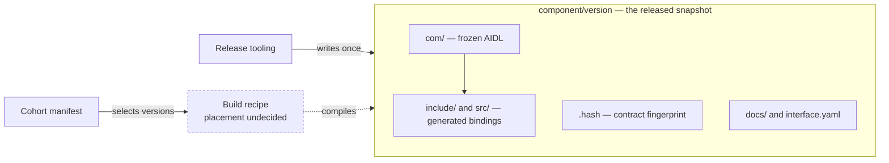
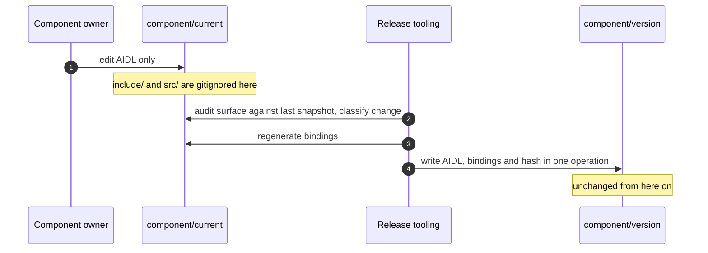

# HLA: What a Released HAL Snapshot Contains

## Document Information

| Field | Value |
|---|---|
| Status | 🔴 DRAFT |
| Version | Issue #1 |
| Author | RDK-E Architecture |
| Reviewers | Assigned on the pull request |
| Parent | [HAL Delivery & Versioning SOP](../governance/versioning-sop.md) |

---

## Summary

**What it is.** A released `rdk-halif-aidl` snapshot is what a vendor HAL and a
middleware build against. This document states what a snapshot contains, who
may write it, and how a consumer selects the version it builds against, so that
a packaging change is assessed against stated requirements.

**The shape.** Each `<component>/<version>/` holds the frozen AIDL, the C++
bindings generated from it at release, its contract hash and its documentation.
The release tooling is its only writer, and nothing edits it afterwards. Each
consumer selects a `(component, version)` pair, and several versions of one
component build side by side in one integration.

**Why this shape.** Both processes compile the same generated code, because each
side is a client of some interfaces in a component and a server of others.
Consumer build hosts carry no AIDL generator, and the generator is versioned
independently of the interfaces, so shipping the bindings is what gives every
integrator the same code.

**What it costs.** Across the 34 released snapshots the generated C++ is 130,361
lines against 42,848 lines of AIDL, about three times the contract it derives
from. A generator fix reaches a released snapshot only through a deliberate
refreeze.

**What is still open.** Whether a generator-free build host is a requirement or
a convenience, which decides between shipping bindings and regenerating at build
time; and whether the build recipe moves out of the version directories, which
today each carry a `CMakeLists.txt`. Both are in [Open Issues](#open-issues).

---

## Overview

### Purpose

Integrating teams have written bespoke recipes to unpick a release, and
proposals to change the build have repeatedly required editing released
snapshots. Both come from the same gap: no stated rule for what a released
snapshot is. This document states that rule as requirements, and records the
options assessed against them.

### Scope

- **In scope:** what a `<component>/<version>/` directory holds; how a consumer discovers and selects a version; where build infrastructure lives relative to a frozen snapshot; how generated bindings are produced and committed.
- **Out of scope:** the AIDL contract of any individual component (each component's own docs); the runtime compatibility check a client applies ([Ref 3](#references)); the Yocto recipes an integrator writes, which are theirs to own ([Ref 2](#references)).

### Success Criteria

- **Technical:** two consumers in one integration build against different versions of the same component, each resolving headers, sources and dependencies without hardcoded paths, on a build host carrying no AIDL generator.
- **Product:** an integrator adopts a released snapshot without writing a bespoke recipe to unpick it ([Ref 5](#references)).

---

## Assumptions

These bound everything below. If one is wrong, the architecture changes rather than the detail.

1. **The interface is used symmetrically.** Each side is a client of some interfaces in a component and a server of others, so neither side can be shipped half a binding set ([Ref 1](#references)).
2. **C++ is the only binding backend.** Committing generated code is tractable for one backend; a second multiplies the generated volume and the review load.
3. **Consumers cross-compile in build environments this repository does not set.** RDK-E sets the distro and recipes for most consumers today, so this is a decision not to impose a generator on them rather than a hard constraint.
4. **The generator is versioned independently of the interfaces.** `linux_binder_idl` releases on its own cadence, so which generator produced a binding varies between snapshots.
5. **Released snapshots are contract-immutable.**

---

## Terminology

- **Snapshot** — a released `<component>/<version>/` directory.
- **Binding** — C++ generated from AIDL: the `Bp` proxy the caller holds and the `Bn` stub the implementer derives from.
- **Cohort** — the set of component versions an integration pins and builds together.
- **Era** — the compatibility generation of a component's version scheme; crossing an era is a compatibility boundary ([Ref 9](#references)).

---

## Context and Drivers

- **Drivers:** integrators wrote bespoke recipes because a release carried no standard way to resolve a component's headers, libraries and dependencies ([Ref 5](#references)). Build changes were made by editing released snapshots, with no rule to assess them against.
- **Version pins:** each side builds against a version it chose and runs against that version or a later minor of it ([Ref 1](#references)). In era `0` vendor and middleware must align on the major, which couples their release cadences; after the AIDL freeze the vendor can hold a major while the middleware moves on. Discovery must therefore resolve the version a consumer states, not whichever version is installed.
- **Strategic alignment:** standard Linux packaging for consumption, and AOSP's separation of contract from build recipe ([Ref 6](#references)), without AOSP's regenerate-at-build model.

---

## Requirements

### Functional

| Requirement | The architecture must | Traced to |
|---|---|---|
| **Chosen version** | Let a consumer build against a `(component, version)` pair it chose, independently of what any other consumer selects. | [Ref 1](#references) |
| **No hardcoded paths** | Let a consumer resolve a component's headers, sources, libraries and transitive dependencies without hardcoded paths. | [Ref 5](#references) |
| **Side-by-side versions** | Let two consumers in one integration build against different versions of the same component. | [Ref 1](#references) |
| **Immutable snapshot** | Keep a released `<component>/<version>/` directory unchanged after release. | [Ref 4](#references) |
| **Tooling-only writes** | Commit generated bindings only through the release tooling, and only into a frozen snapshot. | [Ref 4](#references) |
| **Documented implementation surface** | Document the surface an engineer implements, per released version. | [Ref 7](#references) |

### Non-functional

| Requirement | Target | How it is proven |
|---|---|---|
| **No generator on the build host** | A C++ cross-toolchain and nothing else | A consumer builds in a container with no generator present |
| **Deterministic bindings** | Byte-identical across integrators for a given release | Regenerate from `<version>/com/` and diff against the committed `<version>/{include,src}` |
| **Integration cost** | One line in a recipe, two in CMake | The consumer example builds and links through both `find_package` and `pkg-config` |

---

## Architecture Options Considered

| Option | Description | Pros | Cons | Decision |
|---|---|---|---|---|
| **A: Commit AIDL and generated bindings** | A snapshot carries the frozen AIDL and the C++ produced from it | Meets *No generator on the build host* and *Deterministic bindings* by default; the shipped code is the reviewed code; gives *Documented implementation surface* something to document | Generated volume; a generator fix reaches released snapshots only by deliberate refreeze | **Accepted** — the only option meeting *Deterministic bindings* and *Documented implementation surface* without further machinery |
| **B: Commit AIDL only, consumers regenerate** | AOSP's model ([Ref 6](#references)) | Smallest repository; a generator fix reaches every consumer on its next build | Needs a generator on every build host; output varies with the generator each integrator holds; nothing to document the implementation surface from | **Rejected** — fails *No generator on the build host* and *Deterministic bindings* while generators vary by integrator |
| **C: Ship both, state which path is supported** | The AIDL is already in the snapshot, so an integrator may regenerate | Costs nothing; an integrator who prefers B takes it knowingly | Each snapshot must record which generator froze it | **Accepted as an addition to A** |
| **D: Document the AIDL, treat bindings as disposable** | Pairs B with a Doxygen mapping of the AIDL | Cheapest route to contract documentation; works today | Documents the contract, not the surface engineers implement | **Rejected as a substitute; adopted as a complement** |

---

## Proposed Architecture

**A released snapshot is the frozen contract plus the bindings generated from it, addressed by `(component, version)` and written only by the release tooling.**

### Components

| Component | Owner | Owns | Must build |
|---|---|---|---|
| **`<component>/<version>/`** | rdk-halif-aidl maintainers | The frozen AIDL, its bindings, its hash and its documentation | A CI check that regenerates each snapshot's bindings from its AIDL and diffs them |
| **`<component>/current/`** | Component owners | The AIDL under development; commits no bindings | Nothing new |
| **Release tooling** | rdk-halif-aidl maintainers | The only writer of a snapshot; regenerates the bindings and writes contract and bindings in one operation | Record the generator version in every snapshot it writes |
| **Cohort manifest** | Each consuming layer | Which version of each component a layer builds by default. The build closure adds every `(component, version)` a dependent links, so several versions of one component build side by side | Nothing new |
| **Build recipe** | rdk-halif-aidl maintainers | How a snapshot is compiled; today a `CMakeLists.txt` inside each version directory, and the staged layout that carries the version in the library name and the header path ([Ref 8](#references)) | A consumer example that builds through `find_package` and `pkg-config` |

---

## High Level Design

### How does a snapshot come to exist?

[`release.sh`](../../scripts/release.sh) regenerates from the authored AIDL and
writes contract and bindings together, so the two cannot diverge through a
manual step.

Committing bindings under `current/` would reintroduce drift: a binding that
depends on a contributor remembering to commit it goes stale, and a toolchain
that rewrites it at build time hides the staleness until an incremental build
trips over it.

---

## Key Architecture Decisions

> **Decision:** A frozen snapshot carries both the AIDL and the bindings generated from it; `current/` carries only the AIDL.
>
> - **Rationale:** consumers compile the bindings, so the release must contain them (assumption 1); `current/` has no consumer, so bindings committed there buy nothing and drift.
> - **Consequence:** the repository carries the generated C++ for every released version, permanently.
> - **Risk:** a generator defect is baked into every released snapshot. The signal is a generator fix that consumers cannot obtain without a re-release.

> **Decision:** The release tooling is the only writer of committed bindings.
>
> - **Rationale:** it makes *Tooling-only writes* checkable rather than a matter of discipline.
> - **Consequence:** any process that needs to touch a snapshot is added to that tooling rather than performed by hand.
> - **Risk:** a hand-edited snapshot carries none of these guarantees, and nothing detects one until the drift check exists.

---

## Open Issues

| Issue | Owner | Resolution |
|---|---|---|
| Is *No generator on the build host* binding, or a convenience? | RDK-E Architecture | **Open.** RDK-E controls the distro; a pinned `linux-binder-native` recipe would put the generator on every build host, and codegen for a whole HAL takes seconds. If it is a convenience, Option B becomes materially stronger. |
| Is the generator version pinned across platforms? | RDK-E Architecture | **Open.** Pinning makes assumption 4 false and removes the determinism argument for Option A. It costs a flag-day whenever the generator moves, instead of absorbing the change per component at freeze time. |
| On a generator defect, is a snapshot refrozen deliberately, or does the fix wait for the next release? | RDK-E Architecture | **Open.** Refreezing touches released snapshots; regenerating at build time fixes every consumer on the next build but changes a certified ABI without anyone deciding to. A risk preference, not a technical question. |
| Does the build recipe move out of the version directories? | RDK-E Architecture | **Open.** Moving it into one definition generated from the cohort manifest and each component's `interface.yaml` makes *Immutable snapshot* enforceable: a build change touches no released snapshot, the freeze step stops rewriting build logic, and the dependency graph has one home instead of three. The cost is a migration touching every component at once. |
| Does the installed discovery surface carry the version? | RDK-E Architecture | **Open.** The staged tree already carries the version in the library name and the header path, which meets *Chosen version* and *Side-by-side versions* ([Ref 8](#references)). A CMake package config or `.pc` file published to a shared prefix is what *No hardcoded paths* asks for; an unversioned one cannot express a version request and would lose the other two. |

---

## Risks

| Risk | Impact | Mitigation |
|---|---|---|
| A generator defect is baked into released snapshots | Every consumer of that release compiles the defect; the fix needs a refreeze and a re-release | The release tooling records the generator version in each snapshot, so affected releases are identifiable |
| A snapshot's bindings drift from its AIDL | The release ships bindings that do not match its own contract | The CI drift check on released snapshots |

---

## Dependencies

| Dependency | On whom | Needed for |
|---|---|---|
| **BINDER-F-001** — the generator carries documentation comments from the AIDL into the generated headers ([Ref 7](#references)) | `linux_binder_idl` | *Documented implementation surface* |
| **BINDER-F-002** — the generator produces byte-identical output for identical AIDL at a given generator version | `linux_binder_idl` | *Deterministic bindings* |
| **BINDER-F-003** — generated output identifies the generator version that produced it | `linux_binder_idl` | Recording the generator version per snapshot |
| **BINDER-F-004** — binder helper headers are emitted only for interfaces, not for parcelables or enums | `linux_binder_idl` | Generated volume |
| **BINDER-F-005** — generated code compiles without diagnostics under `-Werror` at C++17 | `linux_binder_idl` | *Integration cost* |
| Consumer smoke test through `find_package` and `pkg-config` | rdk-halif-aidl CI | *Integration cost* |

The `BINDER-F` identifiers are tracked by the generator's own contract ([Ref 10](#references)).

---

## Security Implications

All No except:

| Does this feature… | Answer |
|---|---|
| Add, use or change open-source packages? | Yes — the snapshot ships generated C++ under the repository licence, which licence scanning inspects directly. |
| Introduce new C, C++ or bash components? | Yes — the generated bindings, produced by the generator and reviewed as part of the release. |

---

## References

| # | Title | Link |
|---|---|---|
| 1 | How each side uses a component, which code it compiles, and how it selects a version | [HAL Interface Usage](../key_concepts/hal/hal_interface_usage.md) |
| 2 | The per-component build and staging contract for integrators | [Third-Party Build Integration](../standards/build_integration.md) |
| 3 | Client-side version discovery, capability gating and fallback | [Client Usage of Stable AIDL](../whitepapers/client_usage_of_stable_aidl.md) |
| 4 | What is committed where, and who may write a snapshot | [HAL Delivery & Versioning SOP](../governance/versioning-sop.md) |
| 5 | Packaging gap: consumers hardcoding paths | <https://github.com/rdkcentral/rdk-halif-aidl/issues/666> |
| 6 | AOSP stable AIDL: freeze mechanics and `versions_with_info` | <https://source.android.com/docs/core/architecture/aidl/stable-aidl> |
| 7 | Generator strips Doxygen comments from generated headers | <https://github.com/rdkcentral/linux_binder_idl/issues/28> |
| 8 | The layout in force: version selection, role mount points, and where the version sits | [`rdk-halif-aidl.bb`](../../tests/yocto/meta-rdk-halif-aidl/recipes-halif/rdk-halif-aidl/rdk-halif-aidl.bb) |
| 9 | The version scheme and the era rules | [Versioning Guide](../standards/versioning-guide.md) |
| 10 | What the generator guarantees: determinism, interface identity, known deviations | <https://github.com/rdkcentral/linux_binder_idl/blob/develop/CODEGEN.md> |

---

## Version History

| Version | Date | Change |
|---|---|---|
| Issue #1 | 2026-09-24 | Initial. |
