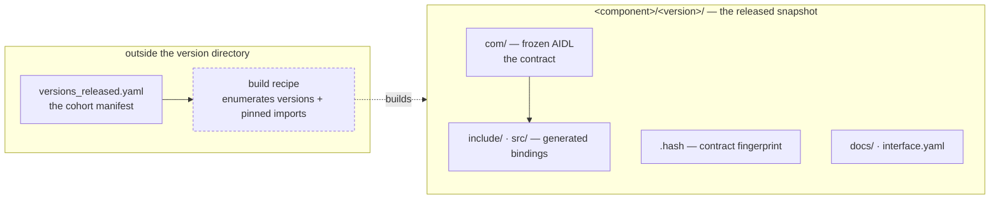
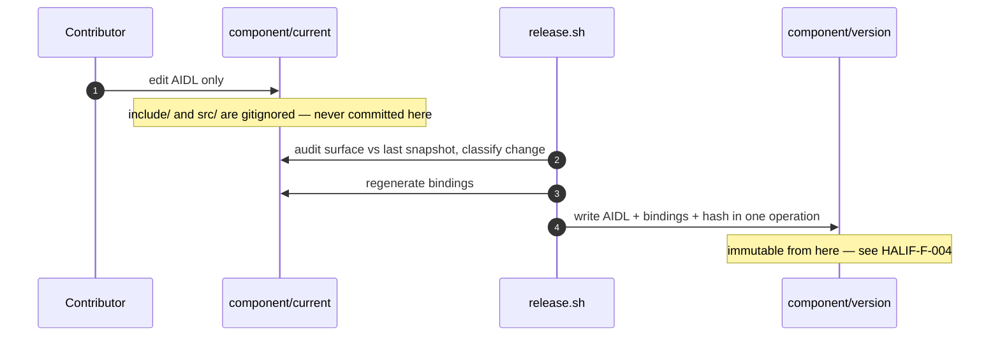

# HLA: What a Released HAL Snapshot Contains

## Document Information

| Field | Value |
|---|---|
| Status | 🔴 DRAFT |
| Version | Issue #1 |
| Author | RDK-E Architecture |
| Reviewers | Assigned on the pull request |
| Parent | [HAL Delivery & Versioning SOP](../governance/versioning-sop.md) |

---

## 1. Overview

### Purpose

A released `rdk-halif-aidl` snapshot is the artefact a vendor HAL and a
middleware build against. This document settles what that snapshot must
contain, where the recipe for building it lives, and how a consumer selects the
version it wants — so that packaging changes can be assessed against stated
requirements rather than re-argued each time one is proposed.

It leaves the field-level contract to the AIDL itself and the per-component
build contract to [Ref 2](#5-references).

### Scope

- **In scope:** what a `<component>/<version>/` directory holds; how a consumer discovers and selects a version; where build infrastructure lives relative to a frozen snapshot; how generated bindings are produced and committed.
- **Out of scope:** the AIDL contract of any individual component (each component's own docs); the runtime compatibility predicate applied by clients, which is covered in [Ref 3](#5-references); the Yocto recipes an integrator writes, which are theirs to own per [Ref 2](#5-references).

### Success Criteria

- **Technical:** two consumers in one integration build against different versions of the same component, each resolving headers, sources and dependencies without hardcoded paths, on a build host carrying no AIDL codegen toolchain.
- **Product:** an integrator adopts a released snapshot without writing a bespoke recipe to unpick it — the failure that [Ref 5](#5-references) was raised to fix.

---

## 2. Assumptions

These bound everything below. If one is wrong, the architecture changes rather than the detail.

1. **The interface is used symmetrically.** Each side is a client of some interfaces in a component and a server of others, so neither can be shipped half a binding set. See [Ref 1](#5-references).
2. **C++ is the only backend, and a cohort ships one released version per component.** This is what makes committing generated bindings tractable at all; a second backend, or many frozen versions built simultaneously, changes the answer.
3. **Consumers cross-compile in environments we do not fully control.** Weakening: we set the distro and recipes for most consumers today, so this is closer to a decision not to impose a toolchain than a hard constraint.
4. **The generator is versioned independently of the interfaces.** `linux_binder_idl` releases on its own cadence, so which generator produced a binding is a variable rather than a constant. This is reversible by decision — see [Open Issues](#3-open-issues).
5. **Released snapshots are contract-immutable and the release tooling is the sole writer of committed bindings.**

---

## 3. Open Issues

| Issue | Resolution |
|---|---|
| Is HALIF-N-001 (no codegen toolchain on a consumer build host) binding, or a convenience? | **Open.** We control the distro; a pinned `linux-binder-native` recipe would put the generator on every build host, and codegen for a whole HAL takes seconds. If it is a convenience, Option B in §8 becomes materially stronger. |
| Do we pin the generator version across platforms? | **Open.** Pinning makes assumption 4 false and retires the determinism argument. It costs a flag-day whenever the generator moves, instead of absorbing the change per component at freeze time. |
| On a generator defect, do we refreeze deliberately or absorb silently? | **Open.** Refreezing touches released artefacts across a release cycle; regenerate-at-build fixes every consumer on the next build but changes a certified ABI without anyone deciding to. A risk preference, not a technical question. |
| Should the build recipe move out of the version directories? | **Open.** Required to satisfy HALIF-F-004 enforceably; see the decision candidate in §11. |
| Should every artefact path carry the version? | **Open.** Required to satisfy HALIF-F-001 and HALIF-F-003; today only the library filename does. |
| No check proves a frozen snapshot's bindings match its AIDL. | **Open.** The `current/` invariant is enforced by the smoke test; the frozen equivalent — regenerate from `<ver>/com/` and diff against `<ver>/{include,src}` — runs nowhere. Cheap to close, and would settle the drift objection with evidence. |
| The implementation surface ships undocumented. | **Open.** Tracked as [Ref 6](#5-references). Until it lands, HALIF-F-006 is unmet and every IDE tooltip in a HAL implementation is blank. |

---

## 4. Terminology

- **Snapshot** — a released `<component>/<version>/` directory: the frozen AIDL, its generated bindings, its contract hash and its documentation.
- **Binding** — generated C++ produced from AIDL by the toolchain: the `Bp` proxy the caller holds and the `Bn` stub the implementer derives from.
- **Cohort** — the set of component versions an integration pins and builds together.
- **Era** — the compatibility generation of a component's version scheme; the era transition is a compatibility boundary.

---

## 5. References

| # | Title | Link |
|---|---|---|
| 1 | How each side uses a component, and which code it compiles | [HAL Interface Usage](../key_concepts/hal/hal_interface_usage.md) |
| 2 | The per-component build and staging contract for integrators | [Third-Party Build Integration](../standards/build_integration.md) |
| 3 | Client-side version discovery, capability gating and fallback | [Client Usage of Stable AIDL](../whitepapers/client_usage_of_stable_aidl.md) |
| 4 | The rules on what is committed where, and who may write a snapshot | [HAL Delivery & Versioning SOP](../governance/versioning-sop.md) |
| 5 | Packaging gap: consumers hardcoding paths | <https://github.com/rdkcentral/rdk-halif-aidl/issues/666> |
| 6 | Generator strips Doxygen comments from generated headers | <https://github.com/rdkcentral/linux_binder_idl/issues/28> |
| 7 | AOSP stable AIDL: freeze mechanics and `versions_with_info` | <https://source.android.com/docs/core/architecture/aidl/stable-aidl> |
| 8 | What the AIDL generator guarantees to its consumers | <https://github.com/rdkcentral/linux_binder_idl/blob/develop/CODEGEN.md> |

---

## 6. Context and Drivers

- **Drivers:** integrating teams were writing bespoke recipes to unpick a release, because the published artefact carried no standard way to resolve a component's headers, libraries and dependencies ([Ref 5](#5-references)). Separately, proposals to change the build have repeatedly required editing released snapshots, with no stated rule to assess them against.
- **Strategic alignment:** moves the repository toward standard Linux packaging conventions for consumption, and toward AOSP's separation of contract from build recipe ([Ref 7](#5-references)) for release integrity — without adopting AOSP's regenerate-at-build model, which their build shape permits and ours does not require.

---

## 7. Requirements

### 7.1 Consumption

| # | Requirement |
|---|---|
| HALIF-F-001 | A consumer **shall** build against a chosen `(component, version)` pair, independently of what any other consumer selects. |
| HALIF-F-002 | A consumer **shall** resolve a component's headers, sources, libraries and transitive dependencies without hardcoded paths. |
| HALIF-F-003 | Two consumers within one integration **shall** build against different versions of the same component. |

### 7.2 Release integrity

| # | Requirement |
|---|---|
| HALIF-F-004 | A released `<component>/<version>/` directory **shall** be immutable after release. |
| HALIF-F-005 | Generated bindings **shall** be committed only by the release tooling, and only into a frozen snapshot. |
| HALIF-F-006 | The surface an engineer implements **shall** be documented, per released version. |

### 7.3 Non-functional

| # | Requirement | Target | How it is proven |
|---|---|---|---|
| HALIF-N-001 | Consumer build-host prerequisites | A C++ cross-toolchain and nothing else; no AIDL codegen toolchain | A consumer builds in a container with no generator present |
| HALIF-N-002 | Binding determinism across integrators | Byte-identical for a given release | Regenerate from `<ver>/com/` and diff against the committed `<ver>/{include,src}` |
| HALIF-N-003 | Consumer integration cost | One line in a recipe, two in CMake | The consumer example builds and links through both `find_package` and `pkg-config` |

---

## 8. Architecture Options Considered

| Option | Description | Pros | Cons | Decision |
|---|---|---|---|---|
| **A: Commit AIDL + generated bindings** | A snapshot carries the frozen AIDL and the C++ produced from it | Satisfies HALIF-N-001 and HALIF-N-002 by default; the shipped artefact is the reviewed artefact; gives HALIF-F-006 something to document | Repository size; a generator fix reaches released snapshots only by deliberate refreeze | **Accepted** — the only option meeting HALIF-N-002 and HALIF-F-006 without additional machinery |
| **B: Commit AIDL only, consumers regenerate** | AOSP's model ([Ref 7](#5-references)) | Smallest repository; a generator fix reaches everyone on their next build | Fails HALIF-N-001 unless a generator is provisioned everywhere; fails HALIF-N-002 while the generator is a variable; leaves nothing to hang HALIF-F-006 on | **Rejected** — contingent on the first two [Open Issues](#3-open-issues); revisit if either resolves |
| **C: Ship both, state which path is supported** | Where we already are, since the AIDL is in the snapshot | Costs nothing; lets an integrator who prefers B take it knowingly | Requires recording which generator froze each snapshot | **Accepted as an addition to A** |
| **D: Document the AIDL, treat bindings as disposable** | Pairs B with a Doxygen AIDL mapping | Cheapest route to contract documentation; works today | Documents the contract surface, not the surface engineers implement — does not satisfy HALIF-F-006 | **Rejected as a substitute; adopted as a complement** |

---

## 9. Proposed Architecture

**A released snapshot is the contract plus everything derived from it, addressed by `(component, version)`; the recipe that builds it is not part of it.**

The shape follows from [Ref 1](#5-references): both processes compile the same
generated code, so the snapshot must carry a complete binding set; and each
consumer selects its own version, so every artefact in a snapshot must be
addressable by version. What the choice costs is a repository roughly twice the
size of the AIDL alone, and a generator improvement that reaches released
snapshots only when someone decides it should.

### High-level diagram

### Major components and data flow

| Component | Owns |
|---|---|
| **`<component>/<version>/`** | The frozen contract, its bindings, its hash and its documentation. Immutable after release. |
| **`<component>/current/`** | The authored AIDL under development. Commits no bindings; the toolchain regenerates them locally. |
| **Release tooling** | The only writer of a snapshot. Regenerates bindings during freeze and writes contract and bindings in one operation. |
| **Cohort manifest** | Which version of each component an integration builds. One per consuming layer. |
| **Build recipe** *(dashed — not yet outside the snapshot)* | How a snapshot is compiled. Enumerates released versions and their pinned imports. |

---

## 10. High Level Design

The ordered behaviour that matters here is the freeze, because it is the only
point at which generated code enters the repository, and every integrity
requirement rests on it.

### 10.1 How a snapshot comes to exist

`release.sh` is the sole writer. It regenerates from the authored AIDL, then
writes contract and bindings together in one operation, so the two cannot
diverge through a manual step.

Committing bindings under `current/` would reintroduce the drift this avoids: a
binding whose regeneration depends on a contributor remembering to commit it
goes stale, and a toolchain that rewrites it at build time hides the staleness
until an incremental build trips over it.

---

## 11. Key Architecture Decisions

> **Decision:** A frozen snapshot carries both the AIDL and the bindings generated from it; `current/` carries neither.
>
> - **Rationale:** consumers compile the bindings, so the release must contain them; `current/` has no consumer, so committing bindings there buys nothing and drifts.
> - **Consequence:** the repository carries roughly twice the AIDL volume, permanently and per version.
> - **Risk:** a generator defect is baked into every released snapshot. The signal is a generator fix that consumers cannot obtain without a re-release.

> **Decision:** The release tooling is the only writer of committed bindings.
>
> - **Rationale:** it is what makes HALIF-F-005 checkable rather than aspirational.
> - **Consequence:** any process that needs to touch a snapshot must be added to that tooling rather than performed by hand.
> - **Risk:** a hand-edited snapshot carries none of the guarantees this document claims, and nothing currently detects one.

### Decision candidates — not yet made

These follow from the requirements above but have not been agreed. They are
listed here rather than in the body so they can be accepted or rejected as
decisions.

> **Candidate:** Move the build recipe out of the version directories, into one definition generated from the cohort manifest and each component's `interface.yaml`.
>
> - **Satisfies:** HALIF-F-004 enforceably — a build-system change would touch no released snapshot.
> - **Consequence:** frozen directories become contract-only; the freeze step stops rewriting build logic; the dependency graph has one home rather than three.
> - **Risk:** a migration touching every component at once.

> **Candidate:** Every artefact path in an installed prefix carries its version.
>
> - **Satisfies:** HALIF-F-001 and HALIF-F-003.
> - **Consequence:** headers, sources, package configuration and pkg-config files gain a version segment, as the library filename already has.
> - **Risk:** changes installed paths for existing consumers.

---

## 12. Security Implications

| Does this feature… | |
|---|---|
| Add or change network endpoints, ports or interfaces? | No |
| Change services listening on open ports? | No |
| Change iptables rules or DSCP markings? | No |
| Add, change or require authentication between components? | No |
| Add or change connections between networked endpoints? | No |
| Use private credentials — TLS keys, shared secrets? | No |
| Store sensitive configuration, device or company information in NV or cloud? | No |
| Use, retrieve, store or transmit customer data, PII or CPNI? | No |
| Take input from users or external tools? | No |
| Use cryptographic functions directly? | No |
| Rely on existing protocols for security or encryption? | No |
| Add, use or change open-source packages? | Yes — the snapshot ships generated C++ under the repository licence, which licence scanning inspects directly. |
| Introduce new C, C++ or bash components? | Yes — the generated bindings, produced by the toolchain and reviewed as part of the release. |
| Introduce new processes? | No |

---

## 13. Risks

| Risk | Impact | Mitigation |
|---|---|---|
| A generator defect is baked into released snapshots | Every consumer of that release compiles the defect; the fix needs a refreeze and re-release | Record the generator version in the snapshot so affected releases are identifiable; decide the refreeze policy (see [Open Issues](#3-open-issues)) |
| A snapshot's bindings drift from its AIDL | The release ships a contract that does not match its own bindings | Add the frozen-equivalent drift check to CI (HALIF-N-002) |
| Build files inside version directories make immutability unenforceable | Released snapshots are edited routinely, and reviewers have no principled line | Adopt the decision candidate in §11 |
| Only the library filename carries a version | HALIF-F-001 and HALIF-F-003 cannot be met; a version request is meaningless when one version can be installed | Adopt the second decision candidate in §11 |

---

## 14. Dependencies

| Dependency | On whom | Needed for |
|---|---|---|
| BINDER-F-001 — comment preservation ([Ref 6](#5-references)) | `linux_binder_idl` | HALIF-F-006 |
| BINDER-F-002, BINDER-F-003 — determinism and generator identity | `linux_binder_idl` | HALIF-N-002, and the refreeze policy decision |
| BINDER-F-005 — clean compile under `-Werror` | `linux_binder_idl` | HALIF-N-003 |
| Consumer smoke test through `find_package` and `pkg-config` | This repository's CI | HALIF-N-003 |

---

## 15. Component Requirements

### `linux_binder_idl` — the AIDL generator

`HALIF-F-006` and `HALIF-N-002` cannot be met by this repository. They are
requirements on the generator, which is separately owned and versioned. Stated
here so the boundary is explicit; the generator's own contract is [Ref 8](#5-references).

| # | Requirement | Satisfies |
|---|---|---|
| BINDER-F-001 | The generator **shall** carry documentation comments from the AIDL into the generated C++ headers. | HALIF-F-006 |
| BINDER-F-002 | The generator **shall** produce byte-identical output for identical AIDL input at a given generator version. | HALIF-N-002 |
| BINDER-F-003 | Generated output **shall** identify the generator version that produced it. | HALIF-N-002, and the refreeze policy decision |
| BINDER-F-004 | The generator **shall** emit binder helper headers only for interfaces, not for parcelables or enums. | Snapshot size and clarity |
| BINDER-F-005 | Generated code **shall** compile without diagnostics under `-Werror` at C++17. | HALIF-N-003 |

The decision candidate on client/server separation in §11 also depends on the
generator: `Bp` and `Bn` implementations are emitted into a single translation
unit, so no packaging arrangement in this repository can separate them.

---

## Version History

| Version | Date | Change |
|---|---|---|
| Issue #1 | 2026-09-03 | Initial. Supersedes the *Generated Code in Git* whitepaper. |
