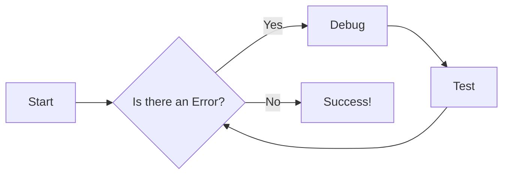

# Documentation Guide

This guide outlines the process for contributing to and maintaining the documentation. All documentation resides within the `docs` directory of the GitHub repository. We leverage ReadTheDocs ([https://readthedocs.org/](https://readthedocs.org/)) for documentation generation and the Material for MkDocs theme ([https://squidfunk.github.io/mkdocs-material/](https://squidfunk.github.io/mkdocs-material/)) for a polished and consistent user experience.

## Setting Up Your Local Environment

To work on the documentation locally:

1. **Python 3:** Ensure you have Python 3 installed and accessible on your system. You can check this by running `python3 --version` in your terminal.

2. **Install mkdocs-material:** Use pip to install the necessary documentation generation tool:

```bash
pip install mkdocs-material
```

3. **Serve the Documentation:** Navigate to the root directory of the rdk-halif-aidl repository in your terminal and run:

```bash
mkdocs serve
```

This command builds the documentation and starts a local web server. You should see output similar to:

```bash
INFO     -  Building documentation...
INFO     -  Cleaning site directory
INFO     -  Documentation built in 0.45 seconds
INFO     -  [11:51:42] Watching paths for changes: 'docs', 'mkdocs.yml'
INFO     -  [11:51:42] Serving on [http://127.0.0.1:8000/rdk-halif-aidl/](http://127.0.0.1:8000/rdk-halif-aidl/)
```

Access the documentation in your web browser at `http://localhost:8000/rdk-halif-aidl/`. The site will automatically reload when you make changes to the Markdown files in the `docs` directory.

## Structuring the Documentation

The `mkdocs.yml` file, located at the root of the repository, is crucial for defining the documentation's structure and navigation. This file dictates the hierarchy of pages and how they are linked. **Any additions or removals of documentation pages require a corresponding update to `mkdocs.yml` to maintain proper navigation.**

## Automatic Deployment

A GitHub Actions workflow is configured to automatically deploy the latest documentation to GitHub Pages at [https://rdkcentral.github.io/rdk-halif-aidl/](https://rdkcentral.github.io/rdk-halif-aidl/). The website's source code resides in the `gh-pages` branch of the repository.

## Writing Style and Guidelines

When contributing to the documentation, please adhere to the following guidelines:

* **Accuracy and Clarity:** Ensure all information is accurate, up-to-date, and easy to understand. Use clear and concise language.
* **Proofreading:** Thoroughly proofread all content for spelling, grammar, and punctuation errors before submitting changes.
* **Admonitions for Emphasis:** Use admonitions to highlight key information, warnings, notes, or tips. Material for MkDocs provides various admonition styles: [https://squidfunk.github.io/mkdocs-material/reference/admonitions/](https://squidfunk.github.io/mkdocs-material/reference/admonitions/)

!!! note "Helpful Tip"
    This is an example of a note admonition.
!!!

!!! warning "Important Consideration"
    This is a warning!
!!!

* **Code Blocks with Syntax Highlighting:** Always use code blocks for code examples and specify the language for syntax highlighting:

```python
def example_function():
    print("Hello, world!")
```

```javascript
function exampleFunction() 
{
    console.log("Hello, world!");
}
```

* **mkdocs-material Reference:** Refer to the official Material for MkDocs documentation for advanced features and customization options: [https://squidfunk.github.io/mkdocs-material/reference/](https://squidfunk.github.io/mkdocs-material/reference/)

* **Mermaid Diagrams (Preferred):** Use Mermaid ([https://mermaid.js.org/](https://mermaid.js.org/)) for creating diagrams whenever possible. Mermaid diagrams offer better accessibility, performance, and scalability compared to embedded images.


