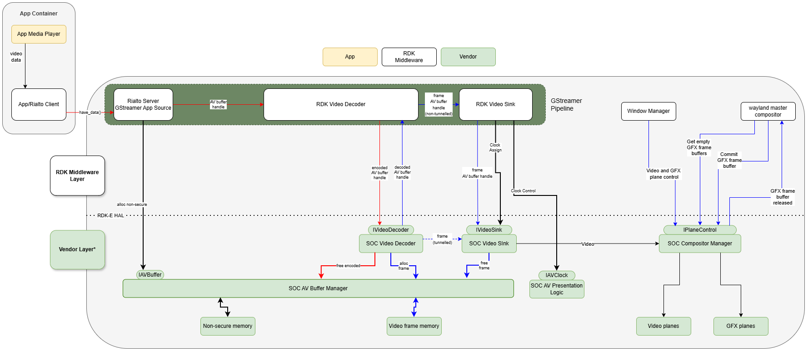
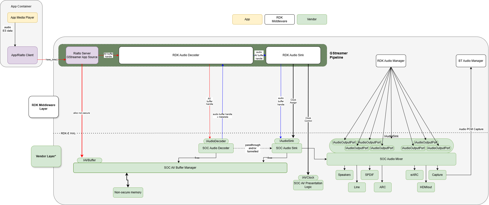

# GStreamer Examples

GStreamer Audio and Video pipelines.

In the diagrams below, the Vendor Layer components shown are conceptual.
The contract is between middleware (MW) and the Vendor Layer AIDL interfaces; these services must be provided.
Vendor component implementations are free to adopt any solutions that best match the underlying infrastructure.

## Rialto GStreamer AV Playback

### Non-secure Video

### Non-secure Audio

## RDK-E Audio/Video (AV) Pipeline Architecture

### Overview

The accompanying diagrams illustrate the RDK-E Audio and Video pipeline architectures built around an AIDL-based Hardware Abstraction Layer (HAL).

They show how media flows from application to hardware, and how the system is structured to provide:
- A clean separation between middleware and vendor implementations
- Stable, versioned AIDL interfaces
- Efficient buffer-based data flow
- Hardware-accelerated decoding and rendering

Both diagrams follow the same architectural pattern, with shared concepts (buffers, clock, HAL boundary) and domain-specific differences (audio routing vs video composition).

---

## 1. Layered Architecture (Top to Bottom)

Both diagrams are organised into three primary layers.

### Application Layer (Top Left)

The diagrams begin with the **App Container**, where:
- An application media player produces encoded audio or video streams
- Data is passed into the system via a client interface

This is represented by:
- *“App Media Player” → “App/Rialto Client”*

This is the entry point into the pipeline.

---

### RDK Middleware Layer (Centre)

The centre of the diagram shows the **GStreamer pipeline**, which is responsible for orchestrating playback.

For both audio and video, the pipeline contains:

| Audio Diagram | Video Diagram |
|---------------|----------------|
| RDK Audio Decoder | RDK Video Decoder |
| RDK Audio Sink | RDK Video Sink |

Upstream:
- A **GStreamer source (Rialto Server)** receives encoded data from the application

Downstream:
- Decoded data is passed to sink components for output or rendering

This layer:
- Does **not perform hardware operations**
- Acts purely as a **control and orchestration layer**
- Calls into the HAL via AIDL interfaces

---

### AIDL HAL Boundary (Dotted Line)

A dotted horizontal line marks the **RDK-E HAL boundary**.

This is a key architectural feature:
- Everything above = **middleware (client side)**
- Everything below = **vendor implementation (service side)**

Across this boundary:
- No direct memory sharing
- No direct in-process function calls
- All interaction happens via **AIDL interfaces (Binder IPC) and buffer handles**

This enforces:
- Process separation
- Interface stability
- Platform independence

---

### Vendor Layer (Bottom)

Below the HAL boundary is the **vendor (SoC) layer**, which contains:

- Hardware-accelerated decoders
- Buffer management systems
- Audio output / video rendering subsystems
- Clock and presentation logic

This is where all real media processing occurs.

---

## 2. Data Flow Through the Diagrams

### Common Pattern (Audio and Video)

Both diagrams show the same high-level input path:

1. Encoded media enters via the pipeline source  
2. Data is passed as an **AV buffer handle**  
3. Buffer is sent to a decoder via the HAL  

The input path is identical on every platform. How decoded output reaches the
sink depends on the decoder's output mode, described below.

Data crossing the HAL is passed as **AV buffer handles**: opaque `long`
values managed by the `IAVBuffer` service. A handle is either client-allocated
or HAL-allocated:

- Middleware allocates input buffers with `IAVBuffer.alloc()`
- The decoder allocates output frames from its own pools and hands them to
  middleware in `onFrameOutput()`

The holder of a handle either passes it to the next module (for example, the
sink) or releases it with `IAVBuffer.free()`, whichever side allocated it. To
read or write the bytes of a non-secure buffer, middleware maps its handle with
`mapHandle()` from the vendor's AV buffer helper (`libavbufferhelper.so`).

---

### Decoder Output Mode

The decoder's output path is selected by the vendor implementation. It is
**not configurable through the HAL**, and is not a choice the middleware or the
application makes.

| Mode | Decoded output | Middleware role |
|---|---|---|
| `NON_TUNNELLED` | Returned to middleware as an AV buffer handle via `onFrameOutput()` | Receives each frame and passes it to the sink |
| `TUNNELLED` | Consumed within the vendor layer; not carried by `onFrameOutput()` | Configures and controls the sink; no decoded data passes through it |

Middleware discovers which mode is in force by calling
`getCurrentOperationalMode()` on the decoder once it has reached the `STARTED`
state. The same enum (`com.rdk.hal.OperationalMode`) and the same call apply to
both the audio and the video decoder.

Control flow is unaffected by the mode: the sink is configured, started,
flushed and clocked identically in either case.

---

### Audio-Specific Flow

In the audio diagram:

- The **Audio Decoder** returns decoded frames as PCM (`FrameType.PCM`) or
  in a SoC-proprietary format (`FrameType.SOC_PROPRIETARY`)
- Compressed audio for passthrough is tunnelled to the vendor audio subsystem
  and is never returned by `onFrameOutput()`
- The **Audio Sink** forwards audio into the hardware path
- A **SoC Audio Mixer** distributes audio to multiple outputs:
  - Speakers
  - HDMI (ARC/eARC)
  - SPDIF
  - Line out

The diagram shows fan-out from the Audio Manager to multiple **Audio Output Ports**, highlighting:
- Logical routing control in middleware
- Physical routing handled in the vendor layer

---

### Video-Specific Flow

In the video diagram:

- The **Video Decoder** produces frames
- Frames reach the **Video Sink** by the path the vendor's output mode selects

After the sink:
- Frames are passed to the **SoC Compositor Manager**
- Composed with graphics
- Rendered via video and graphics planes

---

## 3. Buffer and Memory Architecture

Both diagrams highlight a shared **buffer model**:

- Buffers are allocated in the vendor layer (SoC AV Buffer Manager), by
  middleware through `IAVBuffer.alloc()` or by the decoder for its output frames
- Memory resides in **non-secure or hardware-specific memory**
- Middleware passes handles across the HAL, and maps a non-secure handle
  through the AV buffer helper when it needs the bytes

This design:
- Enables **zero-copy or low-copy operation**
- Keeps memory ownership within the vendor domain
- Decouples middleware from platform-specific details

---

## 4. Control Flow (Separate from Data)

A key architectural aspect visible in both diagrams is that:

> Data flow and control flow are explicitly separated

Control flows include:
- Decoder configuration (start, stop, flush)
- Sink configuration (format, mode)
- Output routing (audio)
- Plane setup (video)
- Clock assignment

These are handled via AIDL interfaces.

---

## 5. AV Synchronisation (Clock)

Both diagrams show the **AV Clock (`IAVClock`)**:

- Middleware assigns or controls timing
- Vendor layer enforces playback timing
- Clock is connected to:
  - Audio sink (audio diagram)
  - Video sink and presentation logic (video diagram)

This is the mechanism that enables:
- Lip-sync
- Rate correction
- Synchronisation across pipelines

---

## 6. Video Composition vs Audio Routing

The diagrams highlight a key difference:

### Audio
- Routing-centric
- Single stream → multiple outputs
- Managed via Audio Manager and Output Ports

### Video
- Composition-centric
- Multiple layers → single display output
- Managed via:
  - Compositor Manager
  - Plane Control
  - Wayland compositor

This distinction reflects the different nature of audio vs video pipelines.

---

## 7. AIDL Interface Mapping (Visible in Diagram)

The diagrams explicitly label the HAL interfaces used:

### Shared
- `IAVBuffer`
- `IAVClock`

### Audio
- `IAudioDecoder`
- `IAudioSink`
- `IAudioOutputPort`

The diagram does not label the mixer that owns the output ports. Middleware
obtains each `IAudioOutputPort` from `IAudioMixer.getAudioOutputPort()` and
sets mixer input routing with `IAudioMixerController.setInputRouting()`.

### Video
- `IVideoDecoder`
- `IVideoSink`
- `IPlaneControl`

These interfaces represent:
- The **only contract between middleware and vendor**
- A stable, versioned abstraction of hardware capabilities

---

## 8. Architectural Intent

The diagrams collectively illustrate a deliberate architectural model:

### Decoupling
- Middleware and vendor implementations evolve independently

### Stability
- AIDL provides versioned, governed interfaces

### Performance
- Buffer handles minimise copying
- Hardware acceleration remains fully utilised

### Portability
- Same middleware works across different SoCs

---

## 9. Summary

The diagrams together present a unified AV architecture where:

- Middleware orchestrates pipelines but does not perform media processing
- Vendor layers implement decoding, rendering, and hardware control
- AIDL interfaces define a strict, stable boundary between the two
- Buffers and clocks provide the common foundation across audio and video

This architecture enables scalable, portable, and high-performance media systems across a wide range of devices.
