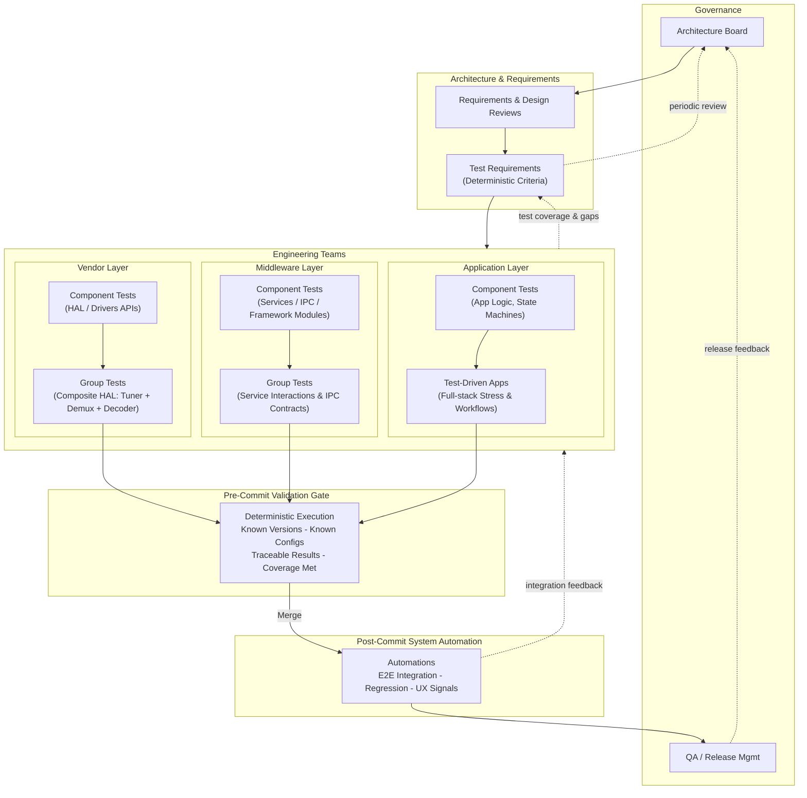
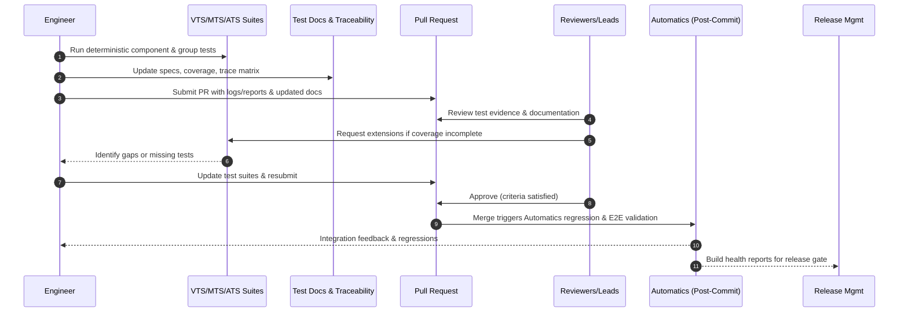
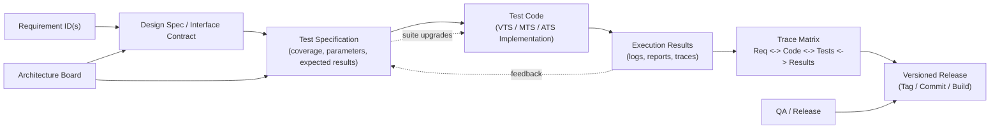

## **Document Control and Versioning**

| **Version** | **Date**   | **Author / Actor** | **Scope / Description**                                                                                                                           | **Review / Approval**        |
| ----------- | ---------- | ------------------ | ------------------------------------------------------------------------------------------------------------------------------------------------- | ---------------------------- |
| 1.0         | 2025-10-24 | **G. Weatherup**   | Initial creation of deterministic testing architecture document covering VTS/MTS/ATS pre-commit validation and Automatics post-commit automation. | Architecture Board – Pending |

---

## **1. Introduction**

RDK’s validation ecosystem is founded on **deterministic engineering principles**.
Every component, group, and layer must be **tested, approved, and documented** before integration.

Two complementary validation domains exist:

* **Engineering-Led Deterministic Testing (VTS/MTS/ATS):**
  Pre-commit validation ensuring that all code changes meet engineering requirements and design intent.

* **Post-Commit Automation (Automatics):**
  E2E system-level regression and experience validation executed via CI/CD after code integration.

This architecture enforces a **bottom-up validation flow** — determinism first, automation last.

---

## **2. Architecture Overview and Layered Validation Hierarchy**

### **2.1 Validation Layers**

| **Layer**        | **Testing Suite**                 | **Scope**                       | **Validation Focus**                                   |
| ---------------- | --------------------------------- | ------------------------------- | ------------------------------------------------------ |
| **Vendor**       | **VTS (Vendor Test Suites)**      | HALs, SoC, Device Drivers       | Deterministic hardware and interface validation        |
| **Middleware**   | **MTS (Middleware Test Suites)**  | Core Services, IPC, Frameworks  | Functional integrity and inter-service correctness     |
| **Application**  | **ATS (Application Test Suites)** | Applications, UI/UX, Full Stack | Functional validation, stack exercise, performance     |
| **System (E2E)** | **Automatics**                    | Integrated Stack                | Integration stability, regression, and user experience |

---

### **2.2 Layered Hierarchy and Feedback Flow**

---

## **3. Engineering Accountability, Documentation, and Governance**

### **3.1 Engineering Responsibilities**

Engineers must:

* Execute **VTS/MTS/ATS** suites relevant to their components.
* Upgrade suites when introducing new functionality.
* Maintain **traceability** between requirements, code, and test coverage.
* Document all deterministic testing activity in versioned form.

Testing is a **core engineering responsibility**, not a CI function.

---

### **3.2 Pull Request (PR) and Code Review Validation**

* Reviewers ensure test suites are executed and documented.
* New functionality **must extend test suites** where applicable.
* PR merges only when deterministic validation is complete.

---

### **3.3 Test Suite Documentation and Versioning**

Test documentation evolves with code:

* Test specifications and expected results must be kept current.
* Each change to code requires **corresponding test updates**.
* A **traceability matrix** links requirements ↔ code ↔ tests ↔ results.
* Historical version control identifies applicable suite versions.

> **Test suite documentation is an engineering artifact.**
> It provides traceable proof of deterministic validation.

---

### **3.4 Interface Governance**

Changes to **controlled interfaces** (e.g., HAL, AIDL, Thunder APIs):

* Follow formal **architecture review and approval**.
* Require versioning and backward compatibility validation.
* Trigger related updates in **VTS/MTS/ATS** test suites.

While detailed API governance lies outside this document, all interface changes must adhere to **engineering governance policies** for consistency and determinism.

---

## **4. Component, Group, and Layer Testing**

| **Layer**             | **Component Testing**           | **Group Testing**                   | **Goal**                                   |
| --------------------- | ------------------------------- | ----------------------------------- | ------------------------------------------ |
| **Vendor (VTS)**      | HAL/Driver APIs                 | Composite HAL modules               | Deterministic hardware/software behavior   |
| **Middleware (MTS)**  | Frameworks, IPC modules         | Service group integrations          | Service correctness, data flow integrity   |
| **Application (ATS)** | App logic, APIs, state machines | Full-stack test-driven applications | End-to-end stack validation and resilience |

Each suite validates **determinism within its scope**, building trust layer by layer without redundancy.

---

## **5. Deterministic Execution Principles**

* VTS/MTS/ATS **must never be executed through CI/CD**.
* Operate in **controlled, version-locked environments**.
* Each test must be **reproducible and traceable**.
* Known configurations, dependencies, and expected results are mandatory.
* Execution evidence feeds back into documentation and architecture reviews.

> **CI validates integration; engineering testing validates design correctness.**

---

## **6. Post-Commit Automation: Automatics**

* Executes **E2E regression and integration validation**.
* Manages **Jenkins orchestration, device management, and CI gating**.
* Verifies **build health and customer experience quality**.

Automatics assumes that all components have already been **engineering-validated**.
It confirms that deterministically proven modules **integrate cohesively** into a stable system.

---

## **7. Artifact Traceability and Versioning**

Traceability ensures that **requirements, design, code, and validation** remain synchronized throughout the product lifecycle.

---

## **8. Governance and Feedback Loops**

| **Governance Body**    | **Responsibility**                                                                    |
| ---------------------- | ------------------------------------------------------------------------------------- |
| **Architecture Board** | Defines requirements, validates design intent, approves controlled interface changes. |
| **Engineering Teams**  | Execute deterministic testing; maintain suites and documentation.                     |
| **QA / CI Teams**      | Operate Automatics for system-level regression and E2E validation.                    |
| **Release Management** | Certifies builds based on combined deterministic and automated validation results.    |

**Feedback Loops:**

1. **Architecture → Engineering:** defines design/test criteria.
2. **Engineering → Validation:** executes suites, updates documentation.
3. **Validation → Architecture:** feeds results for design evolution.
4. **Automation → Engineering:** reports integration regressions for engineering correction.

---

## **9. Engineering Lifecycle**

| **Phase**                   | **Activity**                                         | **Deliverables**                    |
| --------------------------- | ---------------------------------------------------- | ----------------------------------- |
| **Architecture Definition** | Define components, deterministic validation criteria | Requirements, validation objectives |
| **Design & Development**    | Implement code, define test behaviors                | Code, documentation                 |
| **Pre-Commit Validation**   | Execute/upgrade VTS/MTS/ATS suites                   | Test results, updated documentation |
| **PR / Code Review**        | Verify test execution and completeness               | Reviewed, approved PR               |
| **Post-Commit Validation**  | Automatics regression and E2E testing                | CI results, build reports           |
| **Release Review**          | Architecture and QA sign-off                         | Certified deterministic release     |

