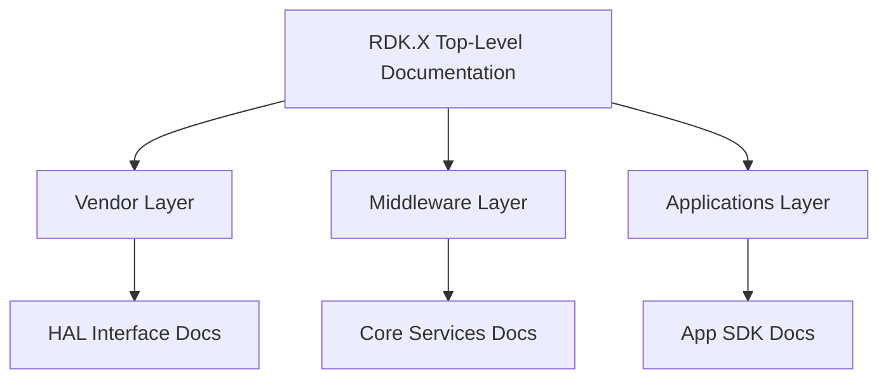
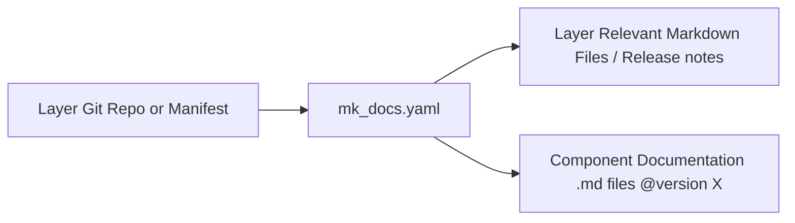
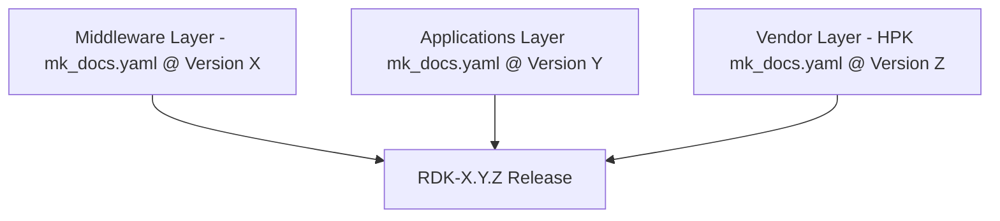

# Architecture Governance: RDK Release Documentation Structure

## **Document History**

|Version|Author|Date|Comment|
|-------|------|----|-------|
|0.1.0 (Draft)| G. Weatherup | 15 July 2025 | Draft Revision|

## **Audience and Scope**

This document defines the governance model for how RDK Release documentation is structured, owned, and maintained across layers, subsystems, and component boundaries. It outlines the architectural principles and tooling standards (e.g., `mk_docs.yaml`) that ensure consistency, traceability, and reuse of documentation throughout the development and release lifecycle.

This document is intended for:

* Architecture Working Groups defining layer boundaries and documentation strategy
* Component and layer owners responsible for generating and maintaining documentation
* Tooling and release teams coordinating documentation generation as part of the release cycle

It applies to all documentation that is versioned alongside RDK release version code and follows the structured release governance.

## **Overview**

This governance standard outlines the structured use of `mk_docs.yaml` files within the RDK documentation ecosystem. The goal is to ensure:

* Clear documentation ownership
* Consistent documentation build and release processes
* Layer-based documentation composition and reuse
* A unified "Start Here" entry point for RDK Release

## **Top-Level Documentation (`RDK Release`)**

### **Purpose**

The top-level documentation acts as the entry point to the  RDK Release X documentation suite. It provides the **who, what, and why** of RDK, and includes:

* Overview of RDK
* Architecture and layering
* Documentation navigation guidance

### **`mk_docs.yaml` Requirements**

* The top-level `mk_docs.yaml` must include links to the layer-specific documentation projects.
* Documentation is presented as per release tag (e.g. `RDK Release X.0.0`).
* Documentation per layer is included based on that tag.

## **Layer-Based Documentation**

### **Layer Structure**

Each major area of concern (e.g., Hardware Porting Kit (HPK) Vendor Layer, Middleware (MPK), Applications (APK)) is treated as a documentation **layer** with its own `mk_docs.yaml` file and documentation site.

### **Layer Ownership**

* Each layer team controls their own documentation cadence and updates.
* After initial onboarding, it is the responsibility of each layer team to maintain and update their own documentation.

### **Content Expectations**

The following content is expected for each layer:

* Overview and architecture of the layer
* Cloning instructions and repo structure
* Build and integration instructions
* Documentation standards, guidelines, and testing
* Stack and component conceptual documentation
* Release notes and changelogs

### **Location and Structure**

* The layer documentation must reside inside a Git repository or manifest repo that logically contains the layer. Only documentation that relates to the layer itself should be included here — component documentation must reside within the respective versioned component repositories.
* All content must be referenced through the layer's `mk_docs.yaml` file.

### **Sub-Layer Grouping**

* Documentation may be grouped into sub-layers if it reflects how components are released together.
* For example, the A/V Subsystem may group several components under a shared documentation and release cadence.
* The documentation structure should mirror the real-world grouping used during release.

## **Reuse and Composition**

### **Single Source of Truth**

* The **single source of truth** for a component is its own repository's documentation.
* Reuse must be done via inclusion at fixed versions in the layer build scripts.

### **Reuse Expectations**

* 100% reuse of already existing documentation is mandatory.
* Layer documentation scripts are responsible for pulling in the exact tagged versions of dependencies.
* If a component lacks documentation, the layer must not fill the gap but instead create a task for the owning team.

## **Missing Documentation Process**

If a component is undocumented:

* A Jira/task should be raised for the owning team.
* The documentation team may provide a draft, but must send a pull request against the component repo.
* The component team is responsible for review and merge.
* Until merged, documentation must not be included beyond a brief placeholder or summary.

## **Release Cadence and Tagging**

* Documentation is expected to be generated and tagged on a regular basis.
* Each release of RDK (e.g. `RDK-7.0.0`) will aggregate documentation from each layer and its respective tagged component versions.
* Layer documentation must include a changelog or release note per release.
* The release process must ensure that both the **code and documentation are updated**.
* If documentation is missed after release:

  * A **support branch** must be created and documentation committed against the existing tag.
  * Alternatively, documentation may be updated in a new release if `main` still reflects the current release state.
* See also: [git_flow_branching_strategy.md](git_flow_branching_strategy.md)

## **Summary**

This governance standard ensures modular, reusable, and up-to-date documentation with:

* Decentralised ownership and update responsibility
* Top-level orchestration for cohesive RDK releases
* Strict reuse policy to avoid duplication
* Scalable build and documentation architecture aligned to component tagging and release versions
* Real-world-aligned grouping and tagging for sub-layers and subsystems
* Support for post-release fixes via branching

