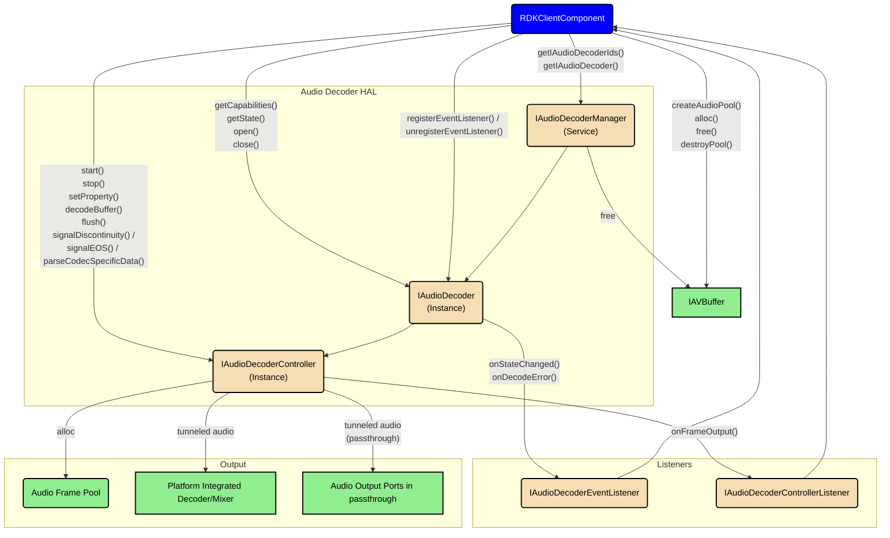
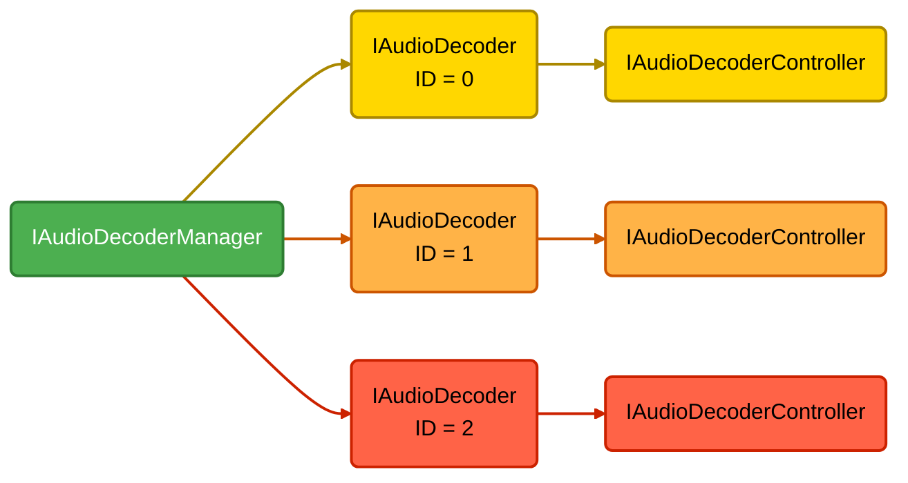
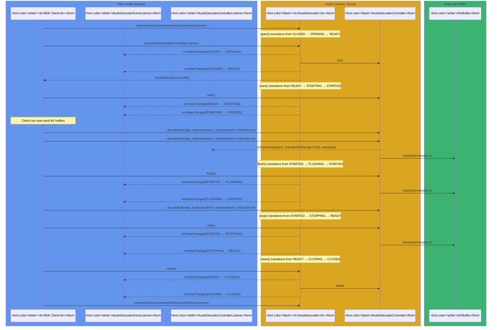

# Audio Decoder

## References

!!! info References
    |||
    |-|-|
    |**Interface Defination**|[audio_decoder/current](https://github.com/rdkcentral/rdk-halif-aidl/tree/main/audiodecoder/current)|
    |**API Documentation**| *TBD* |
    |**HAL Interface Type**|[AIDL and Binder](../../../introduction/aidl_and_binder.md)|
    |**Initialization - TBC** | [systemd](../../../vsi/systemd/current/intro.md) - **hal-audiodecodermanager.service** |
    |**VTS Tests**| TBC |
    |**Reference Implmentation - vComponent**|[https://github.com/rdkcentral/rdk-halif-aidl/tree/main/audiodecoder/current](https://github.com/rdkcentral/rdk-halif-aidl/tree/main/audiodecoder/current)|

## Related Pages

!!! tip Related Pages
    - [Audio Sink](../../audio_sink/current/audio_sink_overview.md)
    - [AV Buffer](../../av_buffer/current/av_buffer_overview.md)
    - [Session State Management](../../concepts/session_state_management/current/session_state_management.md)

## Implementation Requirements

|# | Requirement | Comments |
|---|---| ---- |
| HAL.AUDIODECODER.1 | Starting and stopping audio streams shall never produce an audible click or pop artefact due to the audio waveform the audio streaming was started or stopped at. |This requirement works in conjunction with the audio mixer. |
| HAL.AUDIODECODER.2 | An audio decoder shall indicate its support for secure audio processing through its resource capabilities. |
| HAL.AUDIODECODER.3 | An audio decoder advertising the secure audio processing capability that receives a secure buffer of compressed audio shall output decoded audio to secure buffers either returned to the client or tunnelled to the mixer.|Secure audio path must be maintained.|
| HAL.AUDIODECODER.4 | An audio decoder can tunnel decoded audio to a mixer or the vendor audio sub-system for passthrough and/or return the decoded audio as PCM to the client. |
| HAL.AUDIODECODER.5 | When the client enables the audio decoder low latency property and the audio decoder and platform support low latency audio then the audio frame metadata shall indicate low latency. |
| HAL.AUDIODECODER.6 | Each audio decoder resource shall be presented by a unique ID. |
| HAL.AUDIODECODER.7 | Each audio decoder resource shall provide an API to expose its capabilities for secure audio processing and supported codecs. |
| HAL.AUDIODECODER.8 | Only 1 client connection shall be allowed to open and control an audio decoder resource. |
| HAL.AUDIODECODER.9| Multiple client connections shall be allowed to register for events from an audio decoder resource.|
| HAL.AUDIODECODER.10 | Audio frame metadata shall be returned to a controlling client on the first audio frame decoded after an open or flush and then against not until the frame metadata changes. | Not sent on every decoded audio frame buffer unless changed since previous. |
| HAL.AUDIODECODER.11 | The audio frame output buffer from an audio decoder shall match the platform PCM audio format required for mixing. | See com.rdk.hal.audiosink.PlatformCapabilities |
| HAL.AUDIODECODER.12 | If a client process exits, the Audio Decoder server shall automatically stop and close any Audio Decoder instance controlled by that client. |

## Interface Definition

The interface can be found by following this link [audiodecoder](https://github.com/rdkcentral/rdk-halif-aidl/blob/develop/audiodecoder)

| Interface | Description |
|---| ----- |
| `IAudioDecoderManager.aidl` | Audio Decoder Manager HAL which provides access to `IAudioDecoder` resource instances. |
| `IAudioDecoder.aidl` | Audio Decoder interface for a single audio decoder resource instance. |
| `IAudioDecoderController.aidl` | Controller interface for an `IAudioDecoder` resource instance. |
| `IAudioDecoderControllerListener.aidl` | Listener callbacks interface to clients from an `IAudioDecoderController`. |
| `IAudioDecoderEventListener.aidl` | Listener callbacks interface to clients from an `IAudioDecoder`. |
| `Capabilities.aidl` | Parcelable describing the capabilities of an `IAudioDecoder` resource instance. |
| `ChannelType.aidl` | Enum list of audio channel types. |
| `Codec.aidl` | Enum list of audio codecs. |
| `CSDAudioFormat.aidl` | Enum list of audio codec specific data formats. |
| `ErrorCode.aidl` | Enum list of audio decoder error codes. |
| `FrameMetadata.aidl` | Parcelable of audio frame metadata passed from the audio decoder. |
| `PCMFormat.aidl` | Enum list of PCM coding formats. |
| `Property.aidl` | Enum list of audio decoder properties. |

## Initialization

The `systemd hal-audiodecodermanager.service` unit file is provided by the vendor layer to start the service and should include [Wants](https://www.freedesktop.org/software/systemd/man/latest/systemd.unit.html#Wants=) or [Requires](https://www.freedesktop.org/software/systemd/man/latest/systemd.unit.html#Requires=) directives to start any platform driver services it depends upon.

The Audio Decoder Manager service depends on the [Service Manager](../../../vsi/service_manager/current/service_manager.md) to register itself as a service.

Upon starting, the service shall register the `IAudioDecoderManager` interface with the [Service Manager](../../../vsi/service_manager/current/service_manager.md) using the String `IAudioDecoderManager.serviceName` and immediately become operational.

## Product Customization

The `IAudioDecoderManager.getAudioDecoderIds()` should return an array of `IAudioDecoder.Id` parcelables to uniquely represent all of the audio decoder resources supported by the vendor layer. Typically, the ID value starts at 0 for the first audio decoder and increments by 1 for each additional audio decoder.

The `Capabilities` parcelable returned by the `IAudioDecoder.getCapabilities()` function lists all of the `Codec` types supported by this audio decoder instance and indicates if the secure audio path can be used.

An audio decoder instance may support any number of audio codecs, but can only operate on one compressed audio stream in an open session. Concurrent audio decode requires multiple audio decoder instances to be opened.

## System Context

The Audio Decoder HAL can provide functionality to multiple clients.

Typically an RDK middleware GStreamer audio decoder element will work with a single `IAudioDecoder` instance and pass it AV Buffer handles for decode.

The RDK middleware resource management system will examine the number of audio decoder resources and their capabilities, so they can be allocated to streaming sessions.

## Resource Management

The `IAudioDecoderManager` provides access to one or more `IAudioDecoder` sub-interfaces which each represent an audio decoder resource instance offered by the platform.

Each `IAudioDecoder` resource instance is assigned a unique integer ID, which is used in `IAudioDecoder.Id.value` and can be read from `RESOURCE_ID` using the `IAudioDecoder.getProperty()` function.

To use an `IAudioDecoder` resource instance it must be opened by a client, which returns an `IAudioDecoderController` sub-interface to access buffer decoding and additional state controls.

!!! Important
    Any number of clients can access the `IAudioDecoderManager` service and get access to the `IAudioDecoder` sub-interfaces, but only 1 client can `open()` an `IAudioDecoder` and access its `IAudioDecoderController` sub-interface.

The diagram below shows the relationship between the Audio Decodeer HAL interfaces and resource instances.

## Codec Support

Each RDK product defines the audio codecs it requires for IP streaming, apps, broadcast, input ports and output ports.

Some codecs are subject to third party licensing agreements and may therefore only be included in some products.

The list below indicates the list of audio codecs which are mandatory for the platform to support as either software decode (non-secure) or hardware/vendor decode (potentially secure).

Where a codec is optional for hardware/vendor support and is not implemented by the vendor supplied audio decoder then it shall be implemented as an RDK software decoder if required by the product specification.

| Codec | Typical Use Case | Hardware/Vendor Support |
|---|---|---|
| MPEG-1/2 audio layer II | Broadcast streams, IP streams, files | **Mandatory** |
| MPEG-1/2 audio layer III | MP3 files | Optional |
| AAC-LC | Broadcast streams, IP streams, files | **Mandatory** |
| HE-AAC | Broadcast streams, IP streams, files | **Mandatory** |
| HE-AAC v2 | Broadcast streams, IP streams, files | **Mandatory** |
| exHE-AAC | Broadcast streams, IP streams, files | Optional |
| AAC-ELD | Apple AirPlay | Optional |
| Apple Lossless Audio Codec (ALAC) | Apple AirPlay | Optional |
| Dolby AC-3 | Broadcast streams, IP streams, files | **Mandatory** (if platform is licensed) |
| Dolby E-AC-3 | Broadcast streams, IP streams, files | **Mandatory** (if platform is licensed) |
| Dolby E-AC-3+JOC (Atmos) | Broadcast streams, IP streams, files | **Mandatory** (if platform is licensed) |
| Dolby AC-4 | Broadcast streams, IP streams | **Mandatory** (if platform is licensed) |
| USAC | IP streams | Optional |
| SBC | Bluetooth | Optional |
| FLAC | Amazon Music app, files | Optional |
| Vorbis | WebM, files | Optional |
| Opus | WebM, files | Optional |
| AVS | Broadcast streams, files | Optional |
| WMA | Files | Optional |
| RealAudio | Files | Optional |

## Encrypted Audio Playback

Encrypted audio is copied into a non-secure buffer by the application and then decrypted into a secure buffer. The secure buffer is then decoded by an audio decoder accessed through the `IAudioDecoderController` interface.

## Secure Audio Processing

Secure audio processing (SAP) is a requirement for RDK-E but not all platforms may have support initially. Audio decoder instances shall declare themselves as secure or non-secure by setting `Capabilities.supportsSecure` appropriately.

A secure audio decoder shall be able to handle secure AV buffers and decoded PCM output from the decoder shall be either contained in secure AV buffers or securely tunnelled in the vendor layer.

If any audio decoder supports SAP in non-tunnelled mode then the Audio Sink HAL must also support SAP to be able to process secure AV buffers of decoded PCM data, otherwise SAP support is optional.

## Clear PCM Audio Playback

PCM stream data can originate in the RDK media pipeline from multiple sources; from an application, from the RDK middleware or from a software audio decoder.  In these cases the PCM data does not enter an Audio Decoder and is passed directly to the Audio Sink HAL.

Clear PCM audio is copied into a non-secure AV buffer and then queued at the Audio Sink where it is then mixed for audio output.

No buffer decryption or audio decode is required for clear PCM audio buffers.

## Audio Passthrough Mode

Audio passthrough can be selected on some output ports which can be applied individually to HDMI output (STB profile), S/PDIF and ARC/eARC (TV profile) ports of the device.

Passthrough mode is intended to output the original audio stream to the sink device without decode or mixing of other audio inputs.

If the sink device on a port cannot support the audio codec being streamed, then the user selected passthrough mode cannot be honored on that port and normal audio decode and mixing shall apply.

When audio passthrough is enabled and possible, then audio stream buffers passed to the Audio Decoder HAL are tunnelled to the vendor audio subsystem for output.

In some cases the passthrough mode enabled on some output ports may have to work concurrently with other audio ports not in passthrough mode. This use case requires the audio decoder to tunnel the compressed audio for passthrough *and* decode it for mixing.

## Tunnelled and Non-Tunnelled Audio

The Audio Decoder makes its own run-time choice about whether audio is tunnelled or non-tunnelled.

Tunnelled audio is required when any audio output ports are in passthrough mode. Tunnelled audio may also be required for some audio codecs that need a vendor integrated decoder/mixer such as Dolby MS12.

When only tunnelled audio is in operation, no audio frame pool buffer handles containing decoded PCM audio are handed back to the controller client and the invalid `frameBufferHandle` value -1 is passed in `onFrameOutput()` callbacks.

## Frame Metadata

As audio frames are decoded, the metadata which related to the frames must be passed to the client over `IAudioDecoderControllerListener.onFrameOutput()`.

In non-tunnelled operating mode, the frame buffer handle and metadata related to the frame must be passed in the same `onFrameOutput()` call.

To conserve CPU load, the frame metadata is only passed with the first decoded frame after a `start()`, the first decoded frame after a `flush()` or if the frame metadata changes.

If the frame metadata does not need to be passed, then the `@nullable FrameMetadata metadata` parameter should be passed as null in `onFrameOutput()`.

When operating in tunnelled mode, if there is no frame metadata to be passed, then no call to `onFrameOutput()` should be made because there is no frame buffer handle or frame metadata to return to the client.

## Low Latency Mode

A media pipeline is operating in low latency mode when the audio decoder and video decoder (if present) are set with a `LOW_LATENCY_MODE` property to 1 (enabled).

The platform support for low latency audio is indicated in the Audio Sink HAL `PlatformCapabilities`.

## Receiver Mixed Supplementary Audio Decoding

Supplementary audio that is receiver mixed is common in TV broadcasting where the main audio and supplementary audio share a common codec but require 2 audio decoders and mixing.

An audio decoder used for supplementary audio is identical to a primary audio decoder, but the indication of its use for supplementary audio is set in the Audio Sink HAL.

Any metadata associated with the supplementary/primary audio mix levels is left to the vendor to extract and manage in the vendor layer implementation.

## Audio Stream Discontinuities

Where the client has knowledge of PTS discontinuities in the audio stream, it shall call `IAudioDecoderController.signalDiscontinuity()` between the AV buffers passed to `decodeBuffer()`.

For the first input AV buffer audio frame passed in for decode after the discontinuity, it shall indicate the discontinuity in its next output `FrameMetadata`.

## End of Stream Signalling

When the client knows it has delivered the final audio frame buffer to a decoder it shall then call `IAudioDecoderController.signalEOS()`.

The Audio Decoder shall continue to decode all buffers previously passed for decode, but no further audio buffers should be expected unless the audio decoder is first stopped and restarted or is flushed.

The Audio Decoder shall emit a `FrameMetadata` with `endOfStream=true` after all audio frames have been output from the decoder.

## Decoded Audio Frame Buffers

Decoded audio frame buffers are only passed from the audio decoder to the client when operating in non-tunnelled mode.

If the input AV buffer that contained the coded audio frame was passed in a secure buffer, then the corresponding decoded audio frame must be output in a secure audio frame buffer.

Audio frame buffers are passed back as handles in the `IAudioDecoderControllerListener.onFrameOutput()` function `frameBufferHandle` parameter. If no frame buffer handle is available to pass but the call needs to be made to provide updated `FrameMetadata` then -1 shall be passed as the handle value.

The format of the data in the decoded audio frame buffer is always PCM and described by the `FrameMetadata`.

The frame buffer handle is later passed to the Audio Sink for queuing before presentation and is then freed.

The vendor layer is expected to manage the pool of decoded audio buffers privately.

If the frame buffer pool is empty then the audio decoder cannot output the next decoded frame until a new frame buffer becomes available. While frame output is blocked, it is reasonable for the audio decoder service to either buffer additional coded input buffers or to reject new calls to `decodeBuffer()` with a `false` return value.

## Presentation Time for Audio Frames

The presentation time base units for audio frames is nanoseconds and passed in an int64 (long in AIDL definition) variable type. Video buffers shared the same time base units of nanoseconds.

When coded audio frames are passed in through AV buffer handles to `IAudioDecoderController.decodeBuffer()` the `nsPresentationTime` parameter represents the audio frame presentation time.

Calls to `IVideoDecoderControllerListener.onFrameOutput()` with frame buffer handles (non-tunnelled mode) and/or frame metadata shall use the same `nsPresentationTime`.

## Dolby MS12 and AC-4 Audio Decoding

MS12 is a platform integrated decoder/mixer which requires the compressed audio bitstreams to be tunnelled from the Audio Decoder. Decoded audio frame buffers are not expected to be returned to the RDK middleware.

The Dolby AC-4 codec is a bitstream that can contain multiple compressed audio channels which are grouped together in presentations. A presentation is a mix of one or more channels from the bitstream and is achieved in the vendor layer.

A licensed Dolby MS12 implementation is required in the vendor layer to support AC-4.

By default, an AC-4 audio decoder must use the user preferences for the presentation selection, but players shall also be able to override some or all of these settings without affecting the user preferences. Players must also be able to manually select an AC-4 presentation.

The Audio Mixer provides the platform user preferences for AC-4 default presentation selection.

The Audio Decoder also provides properties which allow for an override of the platform user preferences for the current player session.

## Audio Decoder States

The Audio Decoder HAL follows the standard Session State Management paradigm.

When an Audio Decoder session enters a `FLUSHING` or `STOPPING` transitory state it shall free any AV buffers it is holding.

The sequence diagram below shows the behavior of the callbacks.

