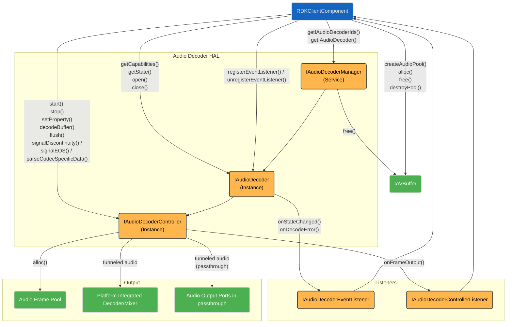
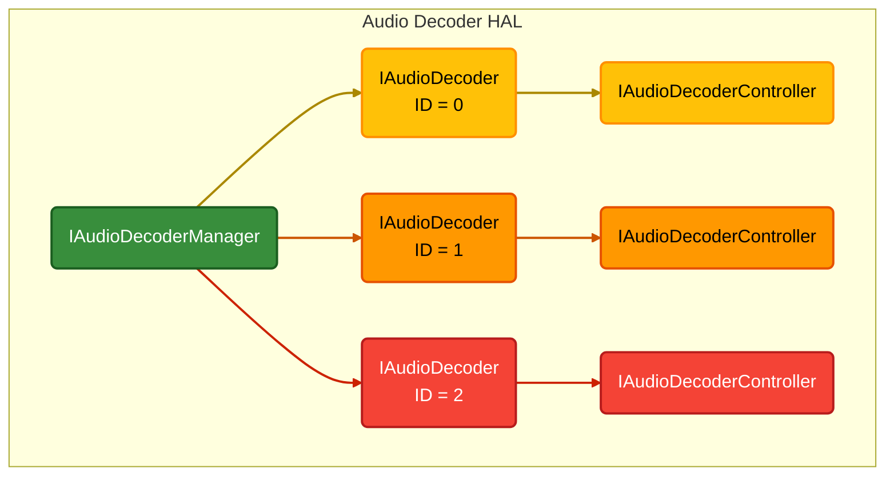
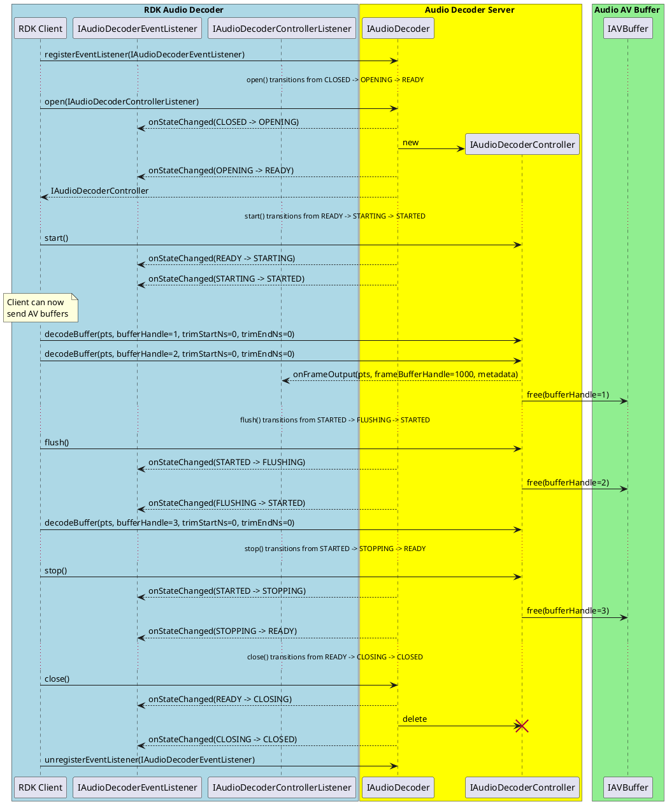

# Audio Decoder (v0.5)

- **Note: This page is an early interface version, please ingore, its here for testing of versioning in the documentation**

## Overview

The Audio Decoder Manager service provides the interfaces for compressed audio to be passed to the vendor layer for decoding.  It may be passed secure buffers if it indicates support for secure audio processing.

The output of an audio decoder can take 2 routes; non-tunnelled it comes back to the RDK media pipeline as a PCM stream and metadata or tunnelled through the vendor layer directly to the mixer.

The choice of whether audio is tunnelled or non-tunnelled has no impact on the operational mode of the video decoder.  It is possible to have tunnelled video and non-tunnelled audio.

The audio decoder can choose whether to operate in tunnelled or non-tunnelled mode when it is opened for a specific codec and does not need to always use the same mode.

PCM audio does not need decoding and therefore never passes into an audio decoder, but is routed to the [Audio Sink](../../audio_sink/current/audio_sink.md) for mixing.

The RDK middleware GStreamer pipeline contains an RDK Audio Decoder element designed specifically to work with the Audio Decoder HAL interface.

## Implementation Requirements

||Requirement|Comments|
|--|---------------|---------------|
|**HAL.AUDIODECODER.1**|Starting and stopping audio streams shall never produce an audible click or pop artefact due to the audio waveform the audio streaming was started or stopped at.|This requirement works in conjunction with the audio mixer.|
|**HAL.AUDIODECODER.2**|An audio decoder shall indicate its support for secure audio processing through its resource capabilities.|
|**HAL.AUDIODECODER.3**|An audio decoder advertising the secure audio processing capability that receives a secure buffer of compressed audio shall output decoded audio to secure buffers either returned to the client or tunnelled to the mixer.|Secure audio path must be maintained.|
|**HAL.AUDIODECODER.4**|An audio decoder can tunnel decoded audio to a mixer or the vendor audio sub-system for passthrough and/or return the decoded audio as PCM to the client.||
|**HAL.AUDIODECODER.5**|When the client enables the audio decoder low latency property and the audio decoder and platform support low latency audio then the audio frame metadata shall indicate low latency.|
|**HAL.AUDIODECODER.6**|Each audio decoder resource shall be presented by a unique ID.||
|**HAL.AUDIODECODER.7**|Each audio decoder resource shall provide an API to expose its capabilities for secure audio processing and supported codecs.||
|**HAL.AUDIODECODER.8**|Only 1 client connection shall be allowed to open and control an audio decoder resource.||
|**HAL.AUDIODECODER.9**|Multiple client connections shall be allowed to register for events from an audio decoder resource.||
|**HAL.AUDIODECODER.10**|Audio frame metadata shall be returned to a controlling client on the first audio frame decoded after an open or flush and then against not until the frame metadata changes.|Not sent on every decoded audio frame buffer unless changed since previous.|
|**HAL.AUDIODECODER.11**|The audio frame output buffer from an audio decoder shall match the platform PCM audio format required for mixing.|See `com.rdk.hal.audiosink.PlatformCapabilities`|

## Interface Definition

|Interface Definition File| Description|
|--------------------------------|-------|
|IAudioDecoderManager.aidl	|Audio Decoder Manager HAL which provides access to `IAudioDecoder` resource instances.|
|IAudioDecoder.aidl|Audio Decoder interface for a single audio decoder resource instance.|
|IAudioDecoderController.aidl	|Controller interface for an IAudioDecoder resource instance.|
|IAudioDecoderControllerListener.aidl	|Listener callbacks interface to clients from an IAudioDecoderController.|
|IAudioDecoderEventListener.aidl	|Listener callbacks interface to clients from an `IAudioDecoder`.|
|Capabilities.aidl	|Parcelable describing the capabilities of an IAudioDecoder resource instance.|
|ChannelType.aidl	|Enum list of audio channel types.|
|Codec.aidl	|Enum list of audio codecs.|
|CSDAudioFormat.aidl	|Enum list of audio codec specific data formats.|
|ErrorCode.aidl	|Enum list of audio decoder error codes.|
|FrameMetadata.aidl	|Parcelable of audio frame metadata passed from the audio decoder.|
|PCMFormat.aidl	|Enum list of PCM coding formats.|
|Property.aidl	|Enum list of audio decoder properties.|

## Initialization

The [systemd](../../../vsi/systemd/current/systemd.md) `hal-audio_decoder_manager.service` unit file is provided by the vendor layer to start the service and should include [Wants](https://www.freedesktop.org/software/systemd/man/latest/systemd.unit.html#Wants=) or [Requires](https://www.freedesktop.org/software/systemd/man/latest/systemd.unit.html#Requires=) directives to start any platform driver services it depends upon.

The Audio Decoder Manager service depends on the [Service Manager](https://wiki.rdkcentral.com/display/RDKHAL/Service+Manager+Overview) to register itself as a service.

Upon starting, the service shall register the IAudioDecoderManager interface with the [Service Manage](https://wiki.rdkcentral.com/display/RDKHAL/Service+Manager+Overview)r using the String `IAudioDecoderManager.serviceName` and immediately become operational.

## Product Customization

The IAudioDecoderManager.getAudioDecoderIds() should return an array of `IAudioDecoder.Id parcelables` to uniquely represent all of the audio decoder resources supported by the vendor layer.  Typically, the ID value starts at 0 for the first audio decoder and increments by 1 for each additional audio decoder.

The Capabilities parcelable returned by the `IAudioDecoder.getCapabilities()` function lists all of the Codec types supported by this audio decoder instance and indicates if the secure audio path can be used.

An audio decoder instance may support any number of audio codecs, but can only operate on one compressed audio stream in an open session.  Concurrent audio decode requires multiple audio decoder instances to be opened.

## System Context

The Audio Decoder HAL can provide functionality to multiple clients which exist both inside the RDK middleware.

Typically an RDK middleware GStreamer audio decoder element will work with a single IAudioDecoder instance and pass it [AV Buffer](https://wiki.rdkcentral.com/display/RDKHAL/AV+Buffer+Overview) handles for decode.

The RDK middleware resource management system will examine the number of audio decoder resources and their capabilities, so they can be allocated to streaming sessions.

## Resource Management

The IAudioDecoderManager provides access to one or more `IAudioDecoder` sub-interfaces which each represent an audio decoder resource instance offered by the platform.

Each IAudioDecoder resource instance is assigned a unique integer ID, which is used in IAudioDecoder.Id.value and can be read from RESOURCE_ID using the `IAudioDecoder.getProperty()` function.

To use an IAudioDecoder resource instance it must be opened by a client, which returns an `IAudioDecoderController` sub-interface to access buffer decoding and additional state controls.

Any number of clients can access the IAudioDecoderManager service and get access to the IAudioDecoder sub-interfaces, but only 1 client can open() an `IAudioDecoder` and access its `IAudioDecoderController` sub-interface.

The diagram below shows the relationship between the interfaces and resource instances.

## Encrypted Audio Playback

Encrypted audio is copied into a non-secure buffer by the application and then decrypted into a secure buffer.  The secure buffer is then decoded by an audio decoder accessed through the IAudioDecoderController  interface.

## Secure Audio Processing

Secure audio processing (SAP) is a requirement for RDK-E but not all platforms may have support initially. Audio decoder instances shall declare themselves as secure or non-secure by setting Capabilities.supportsSecure appropriately.

A secure audio decoder shall be able to handle secure AV buffers and decoded PCM output from the decoder shall be either contained in secure AV buffers or securely tunnelled in the vendor layer.

If any audio decoder supports SAP in non-tunnelled mode then the Audio Sink HAL must also support SAP to be able to process secure AV buffers of decoded PCM data, otherwise SAP support is optional.

## Clear PCM Audio Playback

PCM stream data can originate in the RDK media pipeline from multiple sources; from an application, from the RDK middleware or from a software audio decoder.  In these cases the PCM data does not enter an Audio Decoder and is passed directly to the Audio Sink HAL.

Clear PCM audio is copied into a non-secure buffer and is routed to the IAudioSink where it is mixed for audio output.

No buffer decryption or audio decode is required for clear PCM audio buffers.

## Audio Passthrough Mode

Audio passthrough can be selected on some output ports which can be applied individually to HDMI output (STB profile), S/PDIF and ARC/eARC (TV profile) ports of the device.

Passthrough mode is intended to output the original audio stream to the sink device without decode or mixing of other audio inputs.

If the sink device on a port cannot support the audio codec being streamed, then the user selected passthrough mode cannot be honored on that port and normal audio decode and mixing shall apply.

When audio passthrough is enabled and possible, then audio stream buffers passed to the Audio Decoder HAL are tunnelled to the vendor audio subsystem for output.

In some cases the passthrough mode enabled on some output ports may have to work concurrently with other audio ports not in passthrough mode.  This use case requires the audio decoder to tunnel the compressed audio for passthrough and decode it for mixing.

## Tunnelled and Non-Tunnelled Audio

The Audio Decoder makes its own run-time choice about whether audio is tunnelled or non-tunnelled.

Tunnelled audio is required when any audio output ports are in passthrough mode.  Tunnelled audio may also be required for some audio codecs that need a vendor integrated decoder/mixer such as Dolby MS12.

When only tunnelled audio is in operation, no audio frame pool buffer handles containing decoded PCM audio are handed back to the controller client and the invalid frameBufferHandle value -1 is passed in onFrameOutput() callbacks.

## Low Latency Mode

A media pipeline is operating in low latency mode the audio decoder HAL and video decoder HAL (if present) are set with a LOW_LATENCY_MODE property to 1 (enabled).

The platform support for low latency audio is indicated is the Audio Sink Capabilities parcelable.

## Receiver Mixed Supplementary Audio Decoding

Supplementary audio that is receiver mixed is common in TV broadcasting where the main audio and supplementary audio share a common codec but require 2 audio decoders and mixing.

An audio decoder used for supplementary audio is identical to a primary audio decoder, but the indication of its use for supplementary audio is set in the Audio Sink HAL.

Any metadata associated with the supplementary/primary audio mix levels is left to the vendor to extract and manage in the vendor layer implementation.

## Audio Stream Discontinuities

Where the client has knowledge of PTS discontinuities in the audio stream, it shall call IAudioDecoderController.signalDiscontinuity() between the linear frame buffers passed to decodeBuffer().

For the first input linear buffer audio frame passed in for decode after the discontinuity, it shall indicate the discontinuity in its next output FrameMetadata, 

## End of Stream Signalling

When the client knows it has delivered the final audio frame buffer to a decoder it shall then call IAudioDecoderController.signalEOS().

The Audio Decoder shall continue to decode all buffers previously passed for decode, but no further audio buffers should be expected unless the audio decoder is first stopped and restarted or is flushed.

The Audio Decoder shall emit a FrameMetadata with endOfStream=true after all audio frames have been output from the decoder.

## Dolby MS12 and AC-4 Audio Decoding

MS12 is a platform integrated decoder/mixer which requires the compressed audio bitstreams to be tunnelled from the Audio Decoder.  Decoded audio frame buffers are not expected to be returned to the RDK middleware.

The Dolby AC-4 codec is a bitstream that can contain multiple compressed audio channels which are grouped together in presentations. A presentation is a mix of one or more channels from the bitstream is achieved in the vendor layer.

A licensed Dolby MS12 implementation is required in the vendor layer to support AC-4.

By default, an AC-4 audio decoder must use the user preferences for the presentation selection, but players shall also be able to override some or all of these settings without affecting the user preferences. Players must also be able to manually select an AC-4 presentation.

The Audio Mixer provides the platform user preferences for AC-4 default presentation selection.

The Audio Decoder also provides properties which allow for an override of the platform user preferences for the current player session.

## Audio Decoder States

The Audio Decoder HAL follows the standard [Session State Management](../../key_concepts/hal/hal_session_state_management.md)
 paradigm.

When an Audio Decoder session enters a FLUSHING or STOPPING transitory state it shall free any AV buffers it is holding.

The sequence diagram below shows the behavior of the callbacks.

