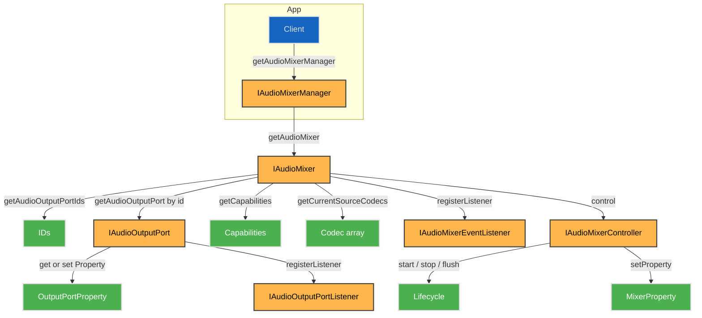
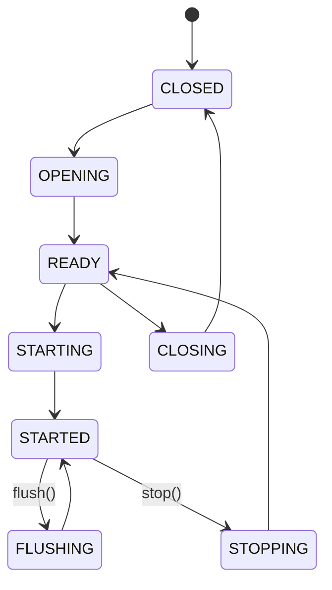

# AudioMixer HAL

## Overview

The AudioMixer HAL provides access to platform audio mixing resources, abstracting complex hardware and middleware audio routing logic into a unified interface. It supports secure and non-secure audio processing paths, input stream mixing, and output port control. The HAL exposes both static capabilities (e.g., supported codecs and content types) and dynamic control interfaces (e.g., property-based output configuration, mixing state transitions).

Multiple mixer instances can exist on a platform, each capable of mixing multiple concurrent inputs into one or more outputs. It is designed to support Dolby MS12, AC3, and PCM codecs with extensible AQ (Audio Quality) processor and parameter interfaces.

---

!!! info "References"
    |||
    |-|-|
    | **Interface Definition**     | [audiomixer/aidl](link)                                     |
    | **HAL Interface Type**       | [AIDL and Binder](../../../introduction/aidl_and_binder.md) |
    | **Initialization Unit**      | [systemd service](../../../vsi/systemd/current/systemd.md)  |

---

!!! tip "Related Pages"
    * [HAL Feature Profile](../../key_concepts/hal/hal_feature_profiles.md)
    * [HAL Interface Overview](../../key_concepts/hal/hal_interfaces.md)

---

## Functional Overview

The AudioMixer HAL enables platform-abstracted audio mixing across secure and non-secure paths. It manages input stream types (e.g., TTS, STREAM, CLIP), codecs (e.g., AC3, PCM), and output routing. Each mixer resource may expose one or more output ports with configurable properties and format negotiation.

Mixer instances are accessed and controlled via `IAudioMixer`, with additional lifecycle and runtime control through `IAudioMixerController`. Output configuration is handled per-port using `IAudioOutputPort`, which supports listener registration for runtime changes.

---

## Implementation Requirements

| #                | Requirement                                                                      | Comments               |
| ---------------- | -------------------------------------------------------------------------------- | ---------------------- |
| HAL.AUDIOMIXER.1 | The service shall expose all available mixers through `IAudioMixerManager`.      |                        |
| HAL.AUDIOMIXER.2 | Each `IAudioMixer` shall expose at least one `IAudioOutputPort`.                 |                        |
| HAL.AUDIOMIXER.3 | The mixer shall support querying `Capabilities` via `getCapabilities()`.         |                        |
| HAL.AUDIOMIXER.4 | The controller shall support `start`, `stop`, `flush`, and `signalEOS`.          |                        |
| HAL.AUDIOMIXER.5 | Output port properties shall be accessible via `getProperty` and `setProperty`.  |                        |
| HAL.AUDIOMIXER.6 | Null names returned by `getName()` or in `portName` are allowed but discouraged. | For debugging support. |

---

## Interface Definitions

| AIDL File                     | Description                                            |
| ----------------------------- | ------------------------------------------------------ |
| IAudioMixer.aidl              | Main resource control interface                        |
| IAudioMixerManager.aidl       | Interface for mixer enumeration                        |
| IAudioMixerController.aidl    | Stateful runtime mixer control                         |
| IAudioMixerEventListener.aidl | Event callbacks (errors, state changes, codec updates) |
| IAudioOutputPort.aidl         | Output port control interface                          |
| IAudioOutputPortListener.aidl | Listener interface for port events                     |
| Capabilities.aidl             | Supported input types, codecs, secure path flag        |
| Input.aidl                    | Per-input supported codec and content type definitions |
| OutputPortCapabilities.aidl   | Describes per-port format and property support         |
| OutputFormat.aidl             | Enumerates output encoding formats                     |
| TranscodeFormat.aidl          | Enumerates supported transcode formats                 |
| Property.aidl                 | Mixer-level configurable properties                    |
| OutputPortProperty.aidl       | Output port-level configurable properties              |
| AQProcessor.aidl              | Supported audio post-processing processor types        |
| AQParameter.aidl              | Audio quality configuration parameters                 |
| ContentType.aidl              | Classifies audio input usage (STREAM, CLIP, TTS)       |
| Codec.aidl                    | Imported from audiodecoder HAL                         |
| State.aidl                    | Lifecycle state machine (READY, STARTED, etc.)         |
| ConnectionState.aidl          | Physical or logical connection status for output ports |
| MixingModes.aidl              | Enumerates the mixer operating modes.                  |

---

## Initialization

The AudioMixer HAL service is initialized by systemd, registered with the Binder Service Manager, and made discoverable to the middleware through `IAudioMixerManager`. Mixer instances are statically defined in the platform configuration and reported through `getAudioMixerIds()`.

---

## Product Customization

* Mixers are uniquely identified via `IAudioMixer.Id` enum values.
* Capabilities are queried using `getCapabilities()` and may differ per instance.
* Mixer resources are declared in the HFP YAML including `isSecure`, input configurations, and multi-instance support.
* Output ports may vary in capability (formats, transcode support, AQ processors).

---

## System Context

---

## Resource Management

* Mixers are acquired via `IAudioMixerManager.getAudioMixer()`.
* Output ports are accessed using `getAudioOutputPortIds()` and `getAudioOutputPort(id)`.
* Clients may register listeners for runtime changes.
* When clients exit, cleanup is expected at the middleware layer. HAL should handle dangling references safely.

---

## Operation and Data Flow

* Mixer accepts input streams with declared `ContentType` and `Codec`.
* Inputs are processed and mixed into one or more outputs.
* Output formats can be negotiated and configured using `setProperty(OUTPUT_FORMAT)`.
* AQ processors and parameters can be configured where supported.
* Transcode or passthrough output formats are dynamically switchable if capabilities permit.

---

## Modes of Operation

Mixers can operate in secure and non-secure paths. Properties such as `MIXING_MODE`, `ACTIVE_PROFILE`, and `DEBUG_TAP_ENABLED` affect runtime behavior and are accessible via the controller’s property interface.

---

## Event Handling

| Event                 | Interface                | Description                                         |
| --------------------- | ------------------------ | --------------------------------------------------- |
| `onInputCodecChanged` | IAudioMixerEventListener | Codec/content type change on an input stream        |
| `onError`             | IAudioMixerEventListener | Platform or HAL runtime error                       |
| `onStateChanged`      | IAudioMixerEventListener | Mixer state transition notification                 |
| `onPropertyChanged`   | IAudioOutputPortListener | Property change on output port (e.g., format, mute) |

---

## State Machine / Lifecycle

Mixer sessions follow this typical state progression:

Methods like `start()`, `stop()`, `flush(reset)`, and `signalEOS()` are valid only in specific states. Errors are returned if called out of sequence.

---

## Data Format / Protocol Support

| Format       | Use Case                    | Support Level |
| ------------ | --------------------------- | ------------- |
| PCM          | Default uncompressed output | Mandatory     |
| AC3 / AC3+   | Legacy surround sound       | Optional      |
| Dolby MAT    | Advanced surround           | Optional      |
| AAC          | Streaming                   | Optional      |
| DTS / TrueHD | Future/vendor-specific      | Optional      |

---

## Platform Capabilities

Declared in the HFP YAML:

* `maxMixers`: Maximum number of concurrent mixer instances
* `supportsDolbyMS12`: Boolean flag for Dolby post-processing
* `supportsDTS`: DTS processing availability
* `supportsConcurrentApps`: Whether concurrent apps can use the mixer simultaneously
* `maxInputsPerMixer`: Maximum number of logical inputs per mixer

---

## End-of-Stream and Error Handling

* `signalEOS()` triggers end-of-stream processing for all inputs.
* `onError()` provides error propagation.
* `flush(reset=true)` resets internal state, `flush(false)` discards buffered data only.
* `signalDiscontinuity()` informs the HAL of PTS jumps or source switches.
