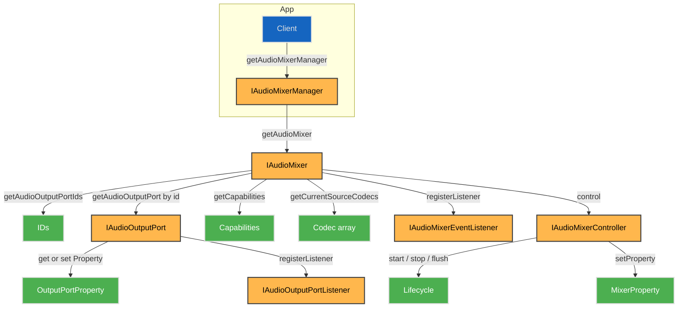
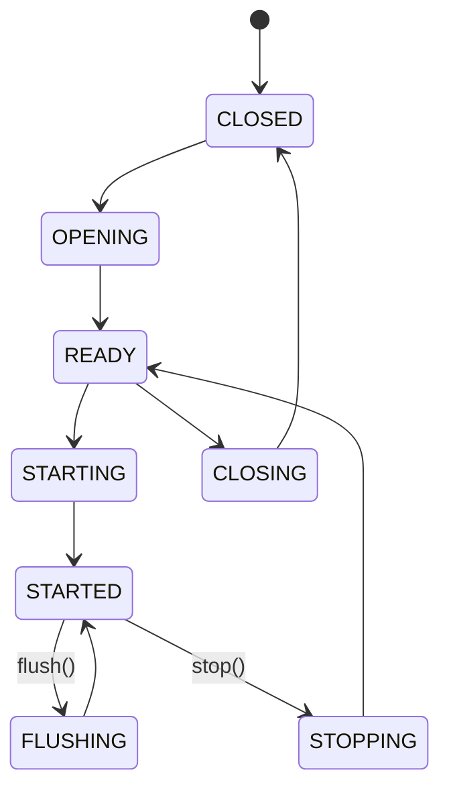
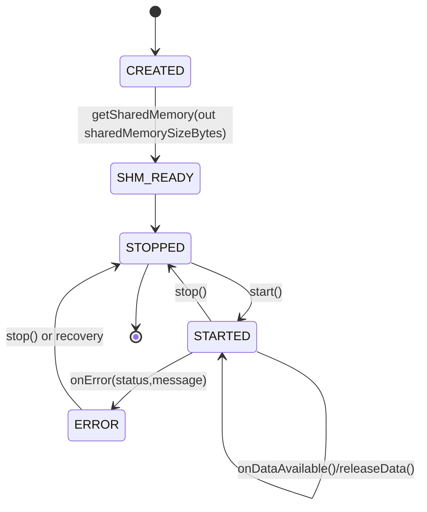

# AudioMixer HAL

## Overview

The AudioMixer HAL provides access to platform audio mixing resources, abstracting complex hardware and middleware audio routing logic into a unified interface. It supports secure and non-secure audio processing paths, input stream mixing, and output port control. The HAL exposes both static capabilities (e.g., supported codecs and content types) and dynamic control interfaces (e.g., property-based output configuration, mixing state transitions).

Multiple mixer instances can exist on a platform, each capable of mixing multiple concurrent inputs into one or more outputs. It is designed to support Dolby MS12, AC3, and PCM codecs with extensible AQ (Audio Quality) processor and parameter interfaces.

---

!!! info "References"
    |||
    |-|-|
    |**Interface Definition**|[audio_mixer/current](https://github.com/rdkcentral/rdk-halif-aidl/tree/develop/audiomixer/current)|
    |**HAL Interface Type**|[AIDL and Binder](../../../introduction/aidl_and_binder.md)|

---

!!! tip "Related Pages"
    * [HAL Feature Profile](../../key_concepts/hal/hal_feature_profiles.md)
    * [HAL Interface Overview](../../key_concepts/hal/hal_interfaces.md)

---

## Functional Overview

The AudioMixer HAL enables platform-abstracted audio mixing across secure and non-secure paths. It manages input stream types (e.g., TTS, STREAM, CLIP), codecs (e.g., AC3, PCM), and output routing. Each mixer resource may expose one or more output ports with configurable properties and format negotiation.

Mixer instances are accessed and controlled via `IAudioMixer`, with additional lifecycle and runtime control through `IAudioMixerController`. Output configuration is handled per-port using `IAudioOutputPort`, which supports listener registration for runtime changes.

---

## Implementation Requirements

| #                | Requirement                                                                      | Comments               |
| ---------------- | -------------------------------------------------------------------------------- | ---------------------- |
| HAL.AUDIOMIXER.1 | The service shall expose all available mixers through `IAudioMixerManager`.      |                        |
| HAL.AUDIOMIXER.2 | Each `IAudioMixer` shall expose at least one `IAudioOutputPort`.                 |                        |
| HAL.AUDIOMIXER.3 | The mixer shall support querying `Capabilities` via `getCapabilities()`.         |                        |
| HAL.AUDIOMIXER.4 | The controller shall support `start`, `stop`, `flush`, and `signalEOS`.          |                        |
| HAL.AUDIOMIXER.5 | Output port properties shall be accessible via `getProperty` and `setProperty`.  |                        |
| HAL.AUDIOMIXER.6 | Null values for `Capabilities.name` or `OutputPortCapabilities.portName` are allowed but discouraged. | For debugging support. |

---

## Interface Definitions

| AIDL File                     | Description                                            |
| ----------------------------- | ------------------------------------------------------ |
| IAudioMixer.aidl              | Main resource control interface                        |
| IDolbyMs12_2_6_Dap.aidl       | Dolby MS12 2.6 runtime command interface              |
| IAudioMixerManager.aidl       | Interface for mixer enumeration                        |
| IAudioMixerController.aidl    | Stateful runtime mixer control                         |
| IAudioMixerEventListener.aidl | Event callbacks (errors, state changes, codec updates) |
| IAudioOutputPort.aidl         | Output port control interface                          |
| IAudioOutputPortListener.aidl | Listener interface for port events                     |
| IAudioCapture.aidl            | Output-port audio capture control interface            |
| IAudioCaptureListener.aidl    | Audio capture callbacks                                |
| AudioCaptureData.aidl         | Audio capture metadata payload                         |
| AudioCapturePcmInfo.aidl      | PCM capture format metadata                            |
| AudioCaptureStatus.aidl       | Audio capture status/error codes                       |
| Capabilities.aidl             | Supported input types, codecs, secure path flag        |
| MixerInput.aidl               | Per-input supported codec and content type definitions |
| OutputPortCapabilities.aidl   | Describes per-port format and property support         |
| OutputFormat.aidl             | Enumerates output encoding formats                     |
| Property.aidl                 | Mixer-level configurable properties                    |
| OutputPortProperty.aidl       | Output port-level configurable properties              |
| AQProcessor.aidl              | Supported audio post-processing processor types        |
| DolbyMs12_2_6_LevellerMode.aidl | MS12 volume leveller mode enum                      |
| DolbyMs12_2_6_VirtualizerMode.aidl | MS12 surround virtualizer mode enum               |
| DolbyMs12_2_6_IeqMode.aidl    | MS12 intelligent equalizer mode enum                   |
| DolbyMs12_2_6_GeqMode.aidl    | MS12 graphic equalizer mode enum                       |
| DolbyMs12_2_6_DrcMode.aidl    | MS12 dynamic range control mode enum                   |
| DolbyMs12_2_6_DownmixMode.aidl | MS12 downmix mode enum                                |
| ContentType.aidl              | Classifies audio input usage (STREAM, CLIP, TTS)       |
| AudioSourceType.aidl          | Audio source types for mixer input routing             |
| InputRouting.aidl             | Maps audio sources to mixer inputs                     |
| Codec.aidl                    | Imported from audiodecoder HAL                         |
| State.aidl                    | Lifecycle state machine (READY, STARTED, etc.)         |
| ConnectionState.aidl          | Physical or logical connection status for output ports |
| MixingMode.aidl               | Enumerates the mixer operating modes                   |

---

## Initialization

The AudioMixer HAL service is initialized by systemd, registered with the Binder Service Manager, and made discoverable to the middleware through `IAudioMixerManager`. Mixer instances are statically defined in the platform configuration and reported through `getAudioMixerIds()`.

---

## Product Customization

* Mixers are uniquely identified via `IAudioMixer.Id` enum values.
* Capabilities are queried using `getCapabilities()` and may differ per instance.
* Mixer resources are declared in the HFP YAML including `supportsSecure`, input configurations, and multi-instance support.
* Output ports may vary in capability (formats, transcode support, AQ processors, and `supportsAudioCapture`).

---

## System Context

```mermaid
flowchart TD
  subgraph App
    A1[Client]
    A1 -->|getAudioMixerManager| B1
  end

  B1[IAudioMixerManager]
  B2[IAudioMixer]
  B3[IDs]
  B4[IAudioOutputPort]
  C1[Capabilities]
  C2[Codec array]
  C3[OutputPortProperty]
  C4[IAudioOutputPortListener]
  C5[IAudioMixerEventListener]
  D1[IAudioMixerController]
  E1[Lifecycle]
  E2[MixerProperty]

  B1 -->|getAudioMixer| B2
  B2 -->|getAudioOutputPortIds| B3
  B2 -->|getAudioOutputPort by id| B4
  B2 -->|getCapabilities| C1
  B2 -->|getCurrentSourceCodecs| C2
  B4 -->|get or set Property| C3
  B4 -->|registerListener| C4
  B2 -->|registerListener| C5
  B2 -->|control| D1
  D1 -->|start / stop / flush| E1
  D1 -->|setProperty| E2

  classDef background fill:#121212,stroke:none,color:#E0E0E0;
  classDef blue fill:#1565C0,stroke:#E0E0E0,stroke-width:2px,color:#E0E0E0;
  classDef lightGrey fill:#616161,stroke:#E0E0E0,stroke-width:2px,color:#FFFFFF;
  classDef wheat fill:#FFB74D,stroke:#424242,stroke-width:2px,color:#000000;
  classDef green fill:#4CAF50,stroke:#E0E0E0,stroke-width:2px,color:#FFFFFF;
  classDef default fill:#1E1E1E,stroke:#E0E0E0,stroke-width:1px,color:#E0E0E0;

  A1:::blue
  B1:::wheat
  B2:::wheat
  B4:::wheat
  C4:::wheat
  C5:::wheat
  D1:::wheat

  B3:::green
  C1:::green
  C2:::green
  C3:::green
  E1:::green
  E2:::green
```

---

## Resource Management

* Mixers are acquired via `IAudioMixerManager.getAudioMixer()`.
* Output ports are accessed using `getAudioOutputPortIds()` and `getAudioOutputPort(id)`.
* Clients may register listeners for runtime changes.
* When clients exit, cleanup is expected at the middleware layer. HAL should handle dangling references safely.

---

## Operation and Data Flow

* Mixer accepts input streams with declared `ContentType` and `Codec`.
* Inputs are processed and mixed into one or more outputs.
* Output formats can be negotiated and configured using `setProperty(OUTPUT_FORMAT)`.
* AQ processors and parameters can be configured where supported.
* Where `OutputPortCapabilities.supportsAudioCapture` is true, capture is created from `IAudioOutputPort.getAudioCapture(listener)`.
* Audio capture uses a shared-memory ring buffer returned by `getSharedMemory(out sharedMemorySizeBytes)`, with `releaseData()` acknowledgements after `onDataAvailable()` callbacks.
* Transcode or passthrough output formats are dynamically switchable if capabilities permit.

---

## Modes of Operation

Mixers can operate in secure and non-secure paths. Mixer properties such as `MIXING_MODE`, `MUTE`, and `DEBUG_TAP_ENABLED` affect runtime behaviour via the controller property interface. Output-port properties such as `DOLBY_MS12_AUDIO_PROFILE` are configured via `IAudioOutputPort.setProperty()`.

---

## Dolby MS12 Runtime Commands

The `IDolbyMs12_2_6_Dap` interface exposes one method per MS12 runtime command and is created from `IAudioOutputPort.getDolbyMs12_2_6_Dap()`.

Non-boolean argument constraints are declared per output port in `audiomixer/current/hfp-audiomixer.yaml` under `outputPorts[].supportedAQProcessors[].setFunctions`.

| Method | Non-boolean constraints |
| ------ | ----------------------- |
| `setBassEnhancer(boost)` | `boost` 0..100 |
| `setVolumeLeveller(mode, level)` | `mode` in {0,1,2}, `level` 0..10 |
| `setSurroundVirtualizer(mode, boost)` | `mode` in {0,1,2}, `boost` 0..96 |
| `setDialogueEnhancer(level)` | `level` 0..16 (`ac4Max` 12) |
| `setIntelligentEqualizerMode(mode)` | `mode` in {0,1,2,3,4,5,6} |
| `setGraphicEqualizerMode(mode)` | `mode` in {0,1,2,3} |
| `setDynamicRangeControlMode(mode)` | `mode` in {LINE, RF} |
| `setPostGain(gain)` | `gain` -2080..480 |
| `setDownmixMode(mode)` | `mode` in {0,1} |

For these constrained arguments, out-of-range values shall raise `EX_ILLEGAL_ARGUMENT`.

---

## Event Handling

| Event                 | Interface                | Description                                         |
| --------------------- | ------------------------ | --------------------------------------------------- |
| `onInputCodecChanged` | IAudioMixerEventListener | Codec/content type change on an input stream        |
| `onError`             | IAudioMixerEventListener | Platform or HAL runtime error                       |
| `onStateChanged`      | IAudioMixerEventListener | Mixer state transition notification                 |
| `onPropertyChanged`   | IAudioOutputPortListener | Property change on output port (e.g., format, mute) |
| `onDataAvailable`     | IAudioCaptureListener    | Audio capture frame available in shared ring buffer |
| `onStarted`           | IAudioCaptureListener    | Capture stream entered started state                |
| `onStopped`           | IAudioCaptureListener    | Capture stream entered stopped state                |
| `onError`             | IAudioCaptureListener    | Capture error notification                          |

---

## State Machine / Lifecycle

Mixer sessions follow this typical state progression:

```mermaid
stateDiagram-v2
    [*] --> CLOSED
    CLOSED --> OPENING
    OPENING --> READY
    READY --> STARTING
    STARTING --> STARTED
    STARTED --> FLUSHING : flush()
    STARTED --> STOPPING : stop()
    FLUSHING --> STARTED
    STOPPING --> READY
    READY --> CLOSING
    CLOSING --> CLOSED
```

Methods like `start()`, `stop()`, `flush(reset)`, and `signalEOS()` are valid only in specific states. Errors are returned if called out of sequence.

---

## Audio Capture Interface Lifecycle

Audio capture on an output port follows a dedicated interface lifecycle:

```mermaid
stateDiagram-v2
  [*] --> CREATED
  CREATED --> SHM_READY : getSharedMemory(out sharedMemorySizeBytes)
  SHM_READY --> STOPPED
  STOPPED --> STARTED : start()
  STARTED --> STOPPED : stop()
  STARTED --> STARTED : onDataAvailable()/releaseData()
  STARTED --> ERROR : onError(status,message)
  ERROR --> STOPPED : stop() or recovery
  STOPPED --> [*]
```

Capture data arrives through callbacks that reference shared-memory offsets and lengths, and clients must call `releaseData()` for consumed regions; calling `start()` or `stop()` out of sequence raises illegal-state errors.

---

## Shared-Memory Offset/Length Usage

Use `getSharedMemory(out sharedMemorySizeBytes)` once before `start()` to obtain both the ring-buffer descriptor and the total buffer size.

For each `onDataAvailable(offsetBytes, lengthBytes, metadata)` callback:

1. Validate the region against `sharedMemorySizeBytes`.
- `offsetBytes` must be in `[0, sharedMemorySizeBytes)`.
- `lengthBytes` must be `> 0` and `<= sharedMemorySizeBytes`.
2. Determine whether the region is contiguous or wrapped.
- Contiguous: `offsetBytes + lengthBytes <= sharedMemorySizeBytes`.
- Wrapped: `offsetBytes + lengthBytes > sharedMemorySizeBytes`.
3. Read data accordingly.
- Contiguous read uses one segment: `[offsetBytes, offsetBytes + lengthBytes)`.
- Wrapped read uses two segments:
  - Segment 1: `[offsetBytes, sharedMemorySizeBytes)`
  - Segment 2: `[0, (offsetBytes + lengthBytes) - sharedMemorySizeBytes)`
4. Acknowledge consumption with the exact callback tuple.
- Call `releaseData(offsetBytes, lengthBytes)` only after consuming the complete region.
- Do not alter or split the tuple when acknowledging.

Clients should process callbacks in order and recover from `onError(status, message)` by stopping and restarting capture as required by platform policy.

---

## Data Format / Protocol Support

| Format Enum         | Use Case                                 | Support Level |
| ------------------- | ---------------------------------------- | ------------- |
| `PCM_STEREO`        | Default uncompressed stereo output       | Platform-defined |
| `PCM_MULTICHANNEL`  | Uncompressed multichannel output         | Optional      |
| `AC3`               | Legacy surround sound                    | Optional      |
| `EAC3`              | Enhanced surround sound                  | Optional      |
| `MAT`               | Dolby MAT output                         | Optional      |
| `PASSTHROUGH`       | Bitstream passthrough                    | Optional      |
| `TRUEHD`            | Dolby TrueHD output                      | Optional      |
| `DTS` / `DTS_HD`    | DTS output modes                         | Optional      |

---

## Platform Capabilities

Declared in the HFP YAML:

* `resources`: Mixer instances, supported source types, and input codec/content capability
* `outputPorts`: Output port properties, formats, AQ processors, and `supportsAudioCapture`
* `outputPorts[].supportedAQProcessors[].setFunctions`: Non-boolean argument constraints and defaults for `IDolbyMs12_2_6_Dap` methods

---

## End-of-Stream and Error Handling

* `signalEOS()` triggers end-of-stream processing for all inputs.
* `onError()` provides error propagation.
* `flush(reset=true)` resets internal state, `flush(false)` discards buffered data only.
* `signalDiscontinuity()` informs the HAL of PTS jumps or source switches.
