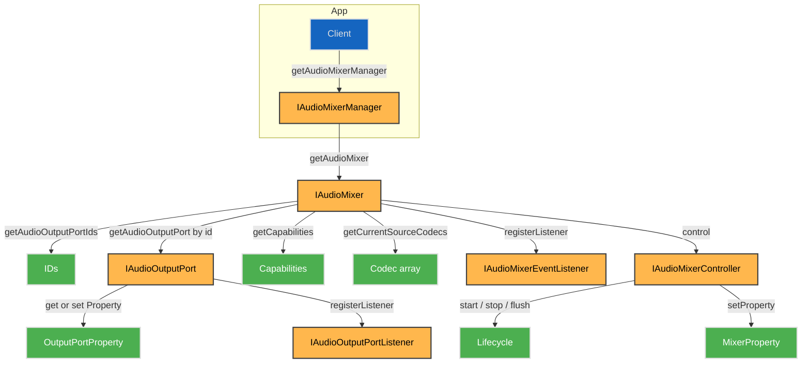
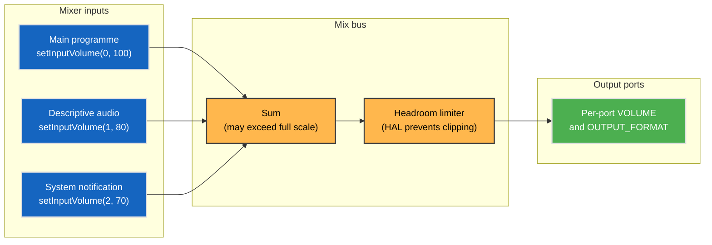
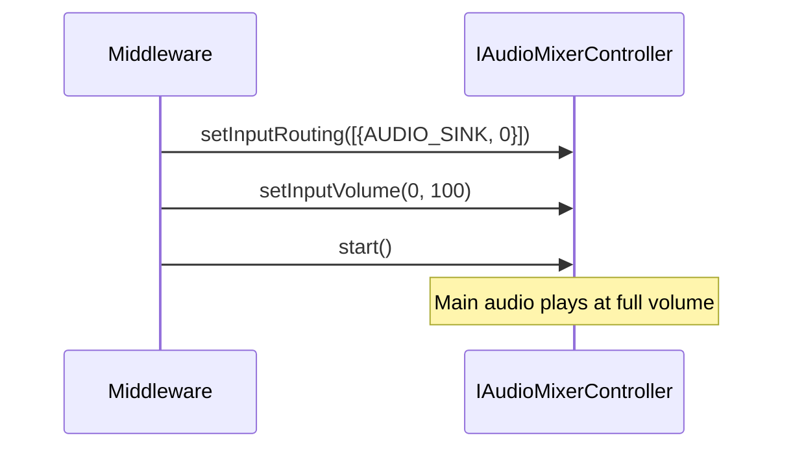
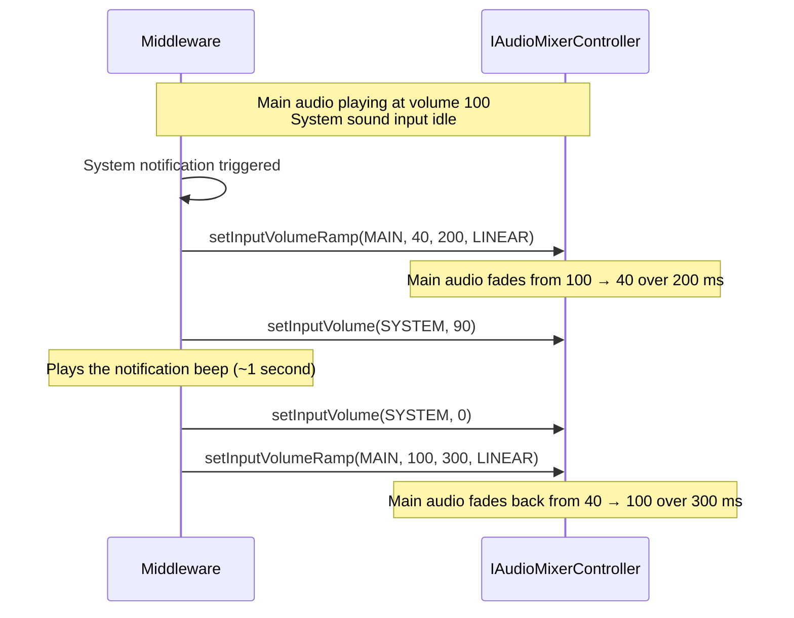
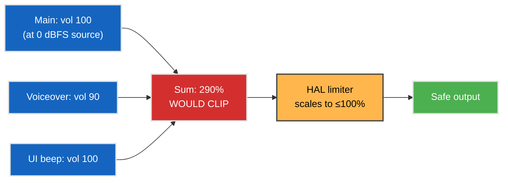
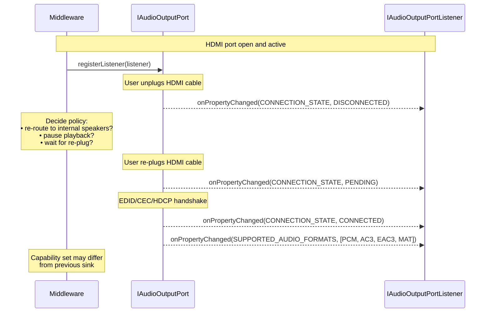
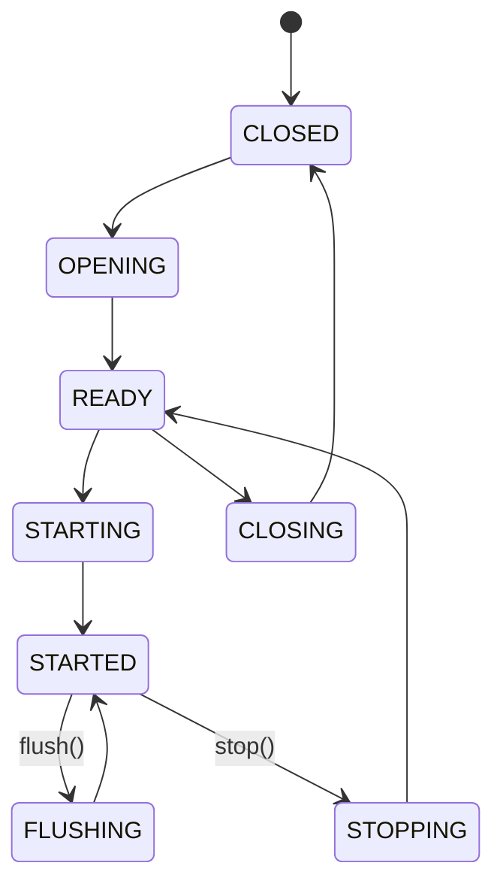

# AudioMixer HAL

## Overview

The AudioMixer HAL provides access to platform audio mixing resources, abstracting complex hardware and middleware audio routing logic into a unified interface. It supports secure and non-secure audio processing paths, input stream mixing, and output port control. The HAL exposes both static capabilities (e.g., supported codecs and content types) and dynamic control interfaces (e.g., property-based output configuration, mixing state transitions).

Multiple mixer instances can exist on a platform, each capable of mixing multiple concurrent inputs into one or more outputs. It is designed to support Dolby MS12, AC3, and PCM codecs with extensible AQ (Audio Quality) processor and parameter interfaces.

---

!!! info "References"
    |||
    |-|-|
    |**Interface Definition**|[audio_mixer/current](https://github.com/rdkcentral/rdk-halif-aidl/tree/develop/audiomixer/current)|
    |**HAL Interface Type**|[AIDL and Binder](../../../introduction/aidl_and_binder.md)|

---

!!! tip "Related Pages"
    * [HAL Feature Profile](../../key_concepts/hal/hal_feature_profiles.md)
    * [HAL Interface Overview](../../key_concepts/hal/hal_interfaces.md)

---

## Functional Overview

The AudioMixer HAL enables platform-abstracted audio mixing across secure and non-secure paths. It manages input stream types (e.g., TTS, STREAM, CLIP), codecs (e.g., AC3, PCM), and output routing. Each mixer resource may expose one or more output ports with configurable properties and format negotiation.

Mixer instances are accessed and controlled via `IAudioMixer`, with additional lifecycle and runtime control through `IAudioMixerController`. Output configuration is handled per-port using `IAudioOutputPort`, which supports listener registration for runtime changes.

---

## Implementation Requirements

| #                | Requirement                                                                      | Comments               |
| ---------------- | -------------------------------------------------------------------------------- | ---------------------- |
| HAL.AUDIOMIXER.1 | The service shall expose all available mixers through `IAudioMixerManager`.      |                        |
| HAL.AUDIOMIXER.2 | Each `IAudioMixer` shall expose at least one `IAudioOutputPort`.                 |                        |
| HAL.AUDIOMIXER.3 | The mixer shall support querying `Capabilities` via `getCapabilities()`.         |                        |
| HAL.AUDIOMIXER.4 | The controller shall support `start`, `stop`, `flush`, and `signalEOS`.          |                        |
| HAL.AUDIOMIXER.5 | Output port properties shall be accessible via `getProperty` and `setProperty`.  |                        |
| HAL.AUDIOMIXER.6 | Null values for `Capabilities.name` or `OutputPortCapabilities.portName` are allowed but discouraged. | For debugging support. |

---

## Interface Definitions

| AIDL File                     | Description                                            |
| ----------------------------- | ------------------------------------------------------ |
| IAudioMixer.aidl              | Main resource control interface                        |
| IAudioMixerManager.aidl       | Interface for mixer enumeration                        |
| IAudioMixerController.aidl    | Stateful runtime mixer control                         |
| IAudioMixerEventListener.aidl | Event callbacks (errors, state changes, codec updates) |
| IAudioOutputPort.aidl         | Output port control interface                          |
| IAudioOutputPortListener.aidl | Listener interface for port events                     |
| Capabilities.aidl             | Supported input types, codecs, secure path flag        |
| MixerInput.aidl               | Per-input supported codec and content type definitions |
| OutputPortCapabilities.aidl   | Describes per-port format and property support         |
| OutputFormat.aidl             | Enumerates output encoding formats                     |
| TranscodeFormat.aidl          | Enumerates supported transcode formats                 |
| Property.aidl                 | Mixer-level configurable properties                    |
| OutputPortProperty.aidl       | Output port-level configurable properties              |
| AQProcessor.aidl              | Supported audio post-processing processor types        |
| AQParameter.aidl              | Audio quality configuration parameters                 |
| ContentType.aidl              | Classifies audio input usage (STREAM, CLIP, TTS)       |
| AudioSourceType.aidl          | Audio source types for mixer input routing             |
| InputRouting.aidl             | Maps audio sources to mixer inputs                     |
| Codec.aidl                    | Imported from audiodecoder HAL                         |
| State.aidl                    | Lifecycle state machine (READY, STARTED, etc.)         |
| ConnectionState.aidl          | Physical or logical connection status for output ports |
| MixingMode.aidl               | Enumerates the mixer operating modes                   |

---

## Initialization

The AudioMixer HAL service is initialized by systemd, registered with the Binder Service Manager, and made discoverable to the middleware through `IAudioMixerManager`. Mixer instances are statically defined in the platform configuration and reported through `getAudioMixerIds()`.

---

## Product Customization

* Mixers are uniquely identified via `IAudioMixer.Id` enum values.
* Capabilities are queried using `getCapabilities()` and may differ per instance.
* Mixer resources are declared in the HFP YAML including `supportsSecure`, input configurations, and multi-instance support.
* Output ports may vary in capability (formats, transcode support, AQ processors).

---

## System Context


```mermaid
flowchart TD
  subgraph App
    A1[Client]
    A1 -->|getAudioMixerManager| B1
  end

  B1[IAudioMixerManager]
  B2[IAudioMixer]
  B3[IDs]
  B4[IAudioOutputPort]
  C1[Capabilities]
  C2[Codec array]
  C3[OutputPortProperty]
  C4[IAudioOutputPortListener]
  C5[IAudioMixerEventListener]
  D1[IAudioMixerController]
  E1[Lifecycle]
  E2[MixerProperty]

  B1 -->|getAudioMixer| B2
  B2 -->|getAudioOutputPortIds| B3
  B2 -->|getAudioOutputPort by id| B4
  B2 -->|getCapabilities| C1
  B2 -->|getCurrentSourceCodecs| C2
  B4 -->|get or set Property| C3
  B4 -->|registerListener| C4
  B2 -->|registerListener| C5
  B2 -->|control| D1
  D1 -->|start / stop / flush| E1
  D1 -->|setProperty| E2

  classDef background fill:#121212,stroke:none,color:#E0E0E0;
  classDef blue fill:#1565C0,stroke:#E0E0E0,stroke-width:2px,color:#E0E0E0;
  classDef lightGrey fill:#616161,stroke:#E0E0E0,stroke-width:2px,color:#FFFFFF;
  classDef wheat fill:#FFB74D,stroke:#424242,stroke-width:2px,color:#000000;
  classDef green fill:#4CAF50,stroke:#E0E0E0,stroke-width:2px,color:#FFFFFF;
  classDef default fill:#1E1E1E,stroke:#E0E0E0,stroke-width:1px,color:#E0E0E0;

  A1:::blue
  B1:::wheat
  B2:::wheat
  B4:::wheat
  C4:::wheat
  C5:::wheat
  D1:::wheat

  B3:::green
  C1:::green
  C2:::green
  C3:::green
  E1:::green
  E2:::green
```

---

## Resource Management

* Mixers are acquired via `IAudioMixerManager.getAudioMixer()`.
* Output ports are accessed using `getAudioOutputPortIds()` and `getAudioOutputPort(id)`.
* Clients may register listeners for runtime changes.
* When clients exit, cleanup is expected at the middleware layer. HAL should handle dangling references safely.

---

## Operation and Data Flow

* Mixer accepts input streams with declared `ContentType` and `Codec`.
* Inputs are processed and mixed into one or more outputs.
* Output formats can be negotiated and configured using `setProperty(OUTPUT_FORMAT)`.
* AQ processors and parameters can be configured where supported.
* Transcode or passthrough output formats are dynamically switchable if capabilities permit.

---

## Mixing, Volume, and Ducking

This section explains how audio is combined inside the mixer, how volumes are applied, and how the HAL prevents clipping when several sounds play at once. It is written for readers who have not worked with audio mixing before.

### Core concepts

**A mixer combines audio.** It takes several input streams (one per source — for example, the main programme audio, descriptive narration, and a system notification beep), adds their samples together, and produces one or more outputs (for example, HDMI to a TV, S/PDIF to a soundbar).

**Full scale and clipping.** Digital audio has a maximum amplitude called *full scale* (`+1.0` on a normalised scale, or the largest signed integer in the chosen bit depth). If you naively add two full-scale signals together you get a result that is twice full scale — which the hardware cannot represent. The peaks get *clipped* (chopped flat), which sounds harsh and distorted.

**Per-input volume vs per-output volume.** Two distinct controls:

| Control | API | Purpose |
|---|---|---|
| Per-input volume | `IAudioMixerController.setInputVolume(inputIndex, 0..100)` | How loud *this one input* contributes to the mix |
| Per-output port volume | `IAudioOutputPort` `VOLUME` property | How loud the *combined mix* leaves the device on a specific port |

Per-input volume is for relative balance between sources. Per-output volume is the master "speaker" volume.

**The HAL prevents clipping.** The mixer guarantees the output signal will not clip. When the sum of active inputs would exceed full scale, the HAL applies headroom management — typically a soft limiter on the master mix bus. Per-input volumes set via `setInputVolume()` are the *subjective* gains the application requests; the HAL handles the math to keep the output safe. Applications do not need to compute their own normalisation budget.

### How sounds combine inside the mixer


```mermaid
flowchart LR
    subgraph Inputs["Mixer inputs"]
        A["Main programme<br/>setInputVolume(0, 100)"]
        B["Descriptive audio<br/>setInputVolume(1, 80)"]
        C["System notification<br/>setInputVolume(2, 70)"]
    end

    subgraph Mix["Mix bus"]
        SUM["Sum<br/>(may exceed full scale)"]
        LIM["Headroom limiter<br/>(HAL prevents clipping)"]
    end

    subgraph Output["Output ports"]
        OUT["Per-port VOLUME<br/>and OUTPUT_FORMAT"]
    end

    A --> SUM
    B --> SUM
    C --> SUM
    SUM --> LIM --> OUT

    classDef blue fill:#1565C0,stroke:#E0E0E0,stroke-width:2px,color:#FFFFFF;
    classDef wheat fill:#FFB74D,stroke:#424242,stroke-width:2px,color:#000000;
    classDef green fill:#4CAF50,stroke:#E0E0E0,stroke-width:2px,color:#FFFFFF;

    A:::blue
    B:::blue
    C:::blue
    SUM:::wheat
    LIM:::wheat
    OUT:::green
```

The application requests volumes per input. The HAL is responsible for the headroom — applications cannot cause the output to clip by setting high volumes on multiple inputs.

### Smooth transitions: volume ramps

Setting a volume instantly is fine for steady state, but causes audible *clicks* or *zipper noise* when changed during playback. For any volume change that happens while audio is flowing, use a ramp:

```aidl
boolean setInputVolumeRamp(in int inputIndex, in int targetVolume, in int overMs, in VolumeRamp curve);
```

The HAL walks the volume from its current value to `targetVolume` over `overMs` milliseconds following the chosen curve (linear, logarithmic, etc.). Typical durations are 50–500 ms — long enough to avoid clicks, short enough to feel responsive.

### Use case 1 — Single-source playback

Main programme audio plays alone. One input is active, no special handling required.


```mermaid
sequenceDiagram
    participant App as Middleware
    participant Mix as IAudioMixerController
    App->>Mix: setInputRouting([{AUDIO_SINK, 0}])
    App->>Mix: setInputVolume(0, 100)
    App->>Mix: start()
    Note over Mix: Main audio plays at full volume
```

### Use case 2 — Ducking a system sound over main audio

The user is watching a film at full volume. A notification beep needs to play. Without ducking, the beep adds to the film and the HAL limiter kicks in — the film gets noticeably quieter for the duration of the beep, which feels glitchy. With ducking, the application explicitly attenuates the main audio for the duration of the beep, giving the beep room without the limiter doing the work.


```mermaid
sequenceDiagram
    participant App as Middleware
    participant Mix as IAudioMixerController
    Note over App,Mix: Main audio playing at volume 100<br/>System sound input idle

    App->>App: System notification triggered
    App->>Mix: setInputVolumeRamp(MAIN, 40, 200, LINEAR)
    Note over Mix: Main audio fades from 100 → 40 over 200 ms
    App->>Mix: setInputVolume(SYSTEM, 90)
    Note over App: Plays the notification beep (~1 second)
    App->>Mix: setInputVolume(SYSTEM, 0)
    App->>Mix: setInputVolumeRamp(MAIN, 100, 300, LINEAR)
    Note over Mix: Main audio fades back from 40 → 100 over 300 ms
```

The 200 ms attack and 300 ms release are typical values — fast enough to feel snappy, slow enough to avoid clicks.

### Use case 3 — Main + associated audio (`FADER_LEVEL`)

For accessibility content (descriptive video, descriptive audio), broadcast streams carry a *main* audio track and an *associated* audio track. The user (or platform) wants to balance the two — at one extreme, only the main; at the other, only the associated; in the middle, a balanced mix.

This is what `FADER_LEVEL` controls. It is **orthogonal** to per-input volume:

* `setInputVolume()` controls each input's level individually.
* `FADER_LEVEL` applies an additional cross-input balance between the main and associated inputs, *after* per-input volumes are applied.

| `FADER_LEVEL` | Effect |
|---|---|
| `0` | Main audio only (associated fully attenuated) |
| `50` | Balanced mix (default) |
| `100` | Associated audio only (main fully attenuated) |

For system-sound ducking, do **not** use `FADER_LEVEL` — it is scoped to the main/associated pair, not arbitrary inputs. Use `setInputVolumeRamp()` on the main input.

### Use case 4 — Multi-stream mix without clipping

Several sources are active at once: main film audio, an in-app voiceover, and a UI beep. All requested at high volume. The naive sum exceeds full scale.


```mermaid
flowchart LR
    A["Main: vol 100<br/>(at 0 dBFS source)"]
    B["Voiceover: vol 90"]
    C["UI beep: vol 100"]
    SUM["Sum: 290%<br/>WOULD CLIP"]
    LIM["HAL limiter<br/>scales to ≤100%"]
    OUT["Safe output"]

    A --> SUM
    B --> SUM
    C --> SUM
    SUM --> LIM --> OUT

    classDef blue fill:#1565C0,stroke:#E0E0E0,stroke-width:2px,color:#FFFFFF;
    classDef red fill:#D32F2F,stroke:#E0E0E0,stroke-width:2px,color:#FFFFFF;
    classDef wheat fill:#FFB74D,stroke:#424242,stroke-width:2px,color:#000000;
    classDef green fill:#4CAF50,stroke:#E0E0E0,stroke-width:2px,color:#FFFFFF;
    A:::blue
    B:::blue
    C:::blue
    SUM:::red
    LIM:::wheat
    OUT:::green
```

The HAL ensures the output stays within full scale. The exact mechanism (master attenuation, soft-knee limiter, per-input scaling) is a vendor implementation detail — what is guaranteed is that the output will not clip. For predictable mixes, applications should use ducking (use case 2) rather than relying on the limiter.

### Mute behaviour

Two ways to silence an input:

* **Per-input:** `setInputVolume(inputIndex, 0)` — that input stops contributing. Remaining active inputs keep their requested levels (no auto-scale-up). Restoring the volume re-introduces the input.
* **Whole mixer:** `MUTE` property on `IAudioMixerController` — silences the entire output. All inputs continue to be processed; only the final output is muted.

### Volume control summary

| API | Scope | Ramp? | Use for |
|---|---|---|---|
| `IAudioSinkController.setVolume()` / `setVolumeRamp()` | Per-stream (sink output) | Yes | Per-app or per-stream level; fade-out before stop |
| `IAudioMixerController.setInputVolume()` / `setInputVolumeRamp()` | Per mixer input | Yes | Cross-source balance; **ducking**; works for tunnelled, sink-routed, and direct (HDMI/Composite) inputs |
| `IAudioMixerController.setProperty(FADER_LEVEL)` | Main vs associated balance | No (instantaneous) | Accessibility (descriptive audio balance) |
| `IAudioOutputPort` `VOLUME` property | Per output port | Vendor-specific | Master/speaker volume |
| `IAudioMixerController.setProperty(MUTE)` | Whole mixer output | No | Hard mute of all output |

The ducking pattern (use case 2) uses `setInputVolumeRamp()` because that is the only API that works uniformly across all input source types — sinks, tunnelled decoders, and direct HDMI/Composite inputs.

---

## Output Ports

This section explains how output ports are typed, how middleware should branch on port type, what combinations are allowed simultaneously, and what happens when a connection is lost or restored at runtime.

### Port types

Each output port declares both a human-readable `portName` (for logs / diagnostics) and a programmatic `portType` from the `OutputPortType` enum. **Branch on `portType`, never on `portName`** — names are HFP-declared and may vary across platforms.

| `OutputPortType` | Typical capabilities | Notes |
|---|---|---|
| `HDMI` | PCM, AC3, EAC3, MAT, TrueHD passthrough | Hot-plug detected via `CONNECTION_STATE` |
| `SPDIF` | PCM, AC3, DTS passthrough | No hot-plug detection on most platforms |
| `OPTICAL` | Same as SPDIF (TOSLINK) | Electrically distinct, same protocol |
| `SPEAKERS` | PCM only | Always connected; no `CONNECTION_STATE` events |
| `BLUETOOTH` | A2DP codec subset (SBC mandatory; AAC / aptX / LDAC optional) | Pairing handled outside the audiomixer HAL; `CONNECTION_STATE` reflects the active A2DP link |
| `ARC` | PCM, AC3 (typical capability subset) | Logically an output despite the cable being HDMI input; format negotiation via CEC |
| `EARC` | Full HDMI audio set incl. MAT / TrueHD / Atmos | Higher bandwidth than ARC; uses Audio Return Data Channel on TMDS |
| `COMPOSITE` | PCM only | Bundled with composite video |
| `INTERNAL` | Vendor-specific | Use `portName` for differentiation |

### Allowed output combinations

Multiple output ports may be active simultaneously, subject to platform constraints. The HAL declares supported combinations indirectly via the per-port HFP entries; the runtime enforces them by rejecting incompatible `setProperty()` calls (returning `false`).

Common constraints across platforms:

* **Only one passthrough source at a time** — a compressed bitstream (AC3, DTS, MAT, etc.) can leave one output port in `OutputFormat.PASSTHROUGH`. A second port simultaneously requesting passthrough on the same source is generally rejected. Other ports must use decoded PCM or transcode.
* **Transcode is per-port** — each port independently chooses its `TRANSCODE_FORMAT`. SPDIF can transcode to AC3 while HDMI delivers MAT.
* **Internal speakers are PCM only** — they receive the decoded mix; passthrough does not apply.
* **ARC / eARC are mutually exclusive** — a port operates as one or the other based on the connected sink's capability negotiation, not both at once.

There is no API to query the full allowed-combination matrix at runtime — applications should attempt the configuration via `setProperty()` and react to a `false` return. The HFP declares per-port capabilities; the cross-port matrix is platform-specific implementation detail.

### Hot-plug and hot-unplug

Each output port carries a `CONNECTION_STATE` property (`UNKNOWN` / `DISCONNECTED` / `CONNECTED` / `PENDING` / `FAULT`). Changes are signalled via `IAudioOutputPortListener.onPropertyChanged(CONNECTION_STATE, newValue)` — clients should register the listener rather than poll.


```mermaid
sequenceDiagram
    participant App as Middleware
    participant Port as IAudioOutputPort
    participant Listener as IAudioOutputPortListener
    Note over App,Listener: HDMI port open and active

    App->>Port: registerListener(listener)
    Note over Port: User unplugs HDMI cable
    Port-->>Listener: onPropertyChanged(CONNECTION_STATE, DISCONNECTED)
    Note over App: Decide policy:<br/>• re-route to internal speakers?<br/>• pause playback?<br/>• wait for re-plug?

    Note over Port: User re-plugs HDMI cable
    Port-->>Listener: onPropertyChanged(CONNECTION_STATE, PENDING)
    Note over Port: EDID/CEC/HDCP handshake
    Port-->>Listener: onPropertyChanged(CONNECTION_STATE, CONNECTED)
    Port-->>Listener: onPropertyChanged(SUPPORTED_AUDIO_FORMATS, [PCM, AC3, EAC3, MAT])
    Note over App: Capability set may differ<br/>from previous sink
```

**HAL behaviour on disconnect:**

* In-flight audio routed to the disconnected port is silently dropped.
* The port remains **open** from the controller's perspective — the HAL does **not** implicitly close it.
* `setProperty()` calls continue to succeed (state is recorded); they take effect when the port reconnects.
* Routing decisions are middleware policy, not HAL policy. The HAL does not auto-reroute to another port.

**HAL behaviour on reconnect:**

* `CONNECTION_STATE` transitions through `PENDING` (during EDID / CEC / HDCP / pairing handshake) before `CONNECTED`.
* `SUPPORTED_AUDIO_FORMATS` and `DOLBY_ATMOS_SUPPORT` may change on reconnect — the new sink could have a different capability set than the previous one. The HAL fires `onPropertyChanged` for any capability that actually changes.
* The previously configured `OUTPUT_FORMAT` is re-applied. If the new sink does not support it (e.g. previous sink was MAT-capable, new one is not), `OUTPUT_FORMAT` falls back to `AUTO` and the HAL fires `onPropertyChanged(OUTPUT_FORMAT, ...)` with the resolved format.

For ports without hot-plug detection (`SPDIF`, `SPEAKERS`, `COMPOSITE`), the `CONNECTION_STATE` stays at `UNKNOWN` and no events are fired — the port is treated as always connected.

---

## Modes of Operation

Mixers can operate in secure and non-secure paths. Properties such as `MIXING_MODE`, `ACTIVE_AQ_PROFILE`, `MUTE`, and `DEBUG_TAP_ENABLED` affect runtime behavior and are accessible via the controller’s property interface.

---

## Event Handling

| Event                 | Interface                | Description                                         |
| --------------------- | ------------------------ | --------------------------------------------------- |
| `onInputCodecChanged` | IAudioMixerEventListener | Codec/content type change on an input stream        |
| `onError`             | IAudioMixerEventListener | Platform or HAL runtime error                       |
| `onStateChanged`      | IAudioMixerEventListener | Mixer state transition notification                 |
| `onPropertyChanged`   | IAudioOutputPortListener | Property change on output port (e.g., format, mute) |

---

## State Machine / Lifecycle

Mixer sessions follow this typical state progression:


```mermaid
stateDiagram-v2
    [*] --> CLOSED
    CLOSED --> OPENING
    OPENING --> READY
    READY --> STARTING
    STARTING --> STARTED
    STARTED --> FLUSHING : flush()
    STARTED --> STOPPING : stop()
    FLUSHING --> STARTED
    STOPPING --> READY
    READY --> CLOSING
    CLOSING --> CLOSED
```

Methods like `start()`, `stop()`, `flush(reset)`, and `signalEOS()` are valid only in specific states. Errors are returned if called out of sequence.

---

## Data Format / Protocol Support

| Format       | Use Case                    | Support Level |
| ------------ | --------------------------- | ------------- |
| PCM          | Default uncompressed output | Mandatory     |
| AC3 / AC3+   | Legacy surround sound       | Optional      |
| Dolby MAT    | Advanced surround           | Optional      |
| AAC          | Streaming                   | Optional      |
| DTS / TrueHD | Future/vendor-specific      | Optional      |

---

## Platform Capabilities

Declared in the HFP YAML:

* `maxMixers`: Maximum number of concurrent mixer instances
* `supportsDolbyMS12`: Boolean flag for Dolby post-processing
* `supportsDTS`: DTS processing availability
* `supportsConcurrentApps`: Whether concurrent apps can use the mixer simultaneously
* `maxInputsPerMixer`: Maximum number of logical inputs per mixer

---

## End-of-Stream and Error Handling

* `signalEOS()` triggers end-of-stream processing for all inputs.
* `onError()` provides error propagation.
* `flush(reset=true)` resets internal state, `flush(false)` discards buffered data only.
* `signalDiscontinuity()` informs the HAL of PTS jumps or source switches.
