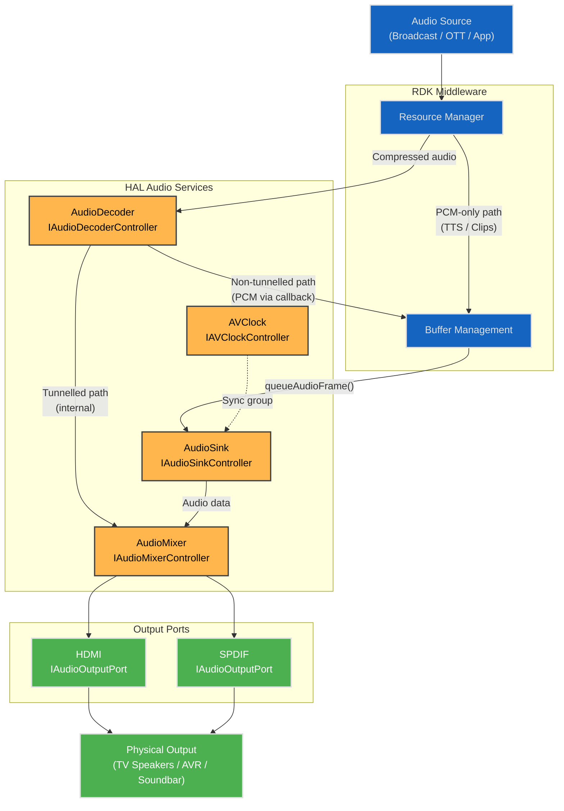
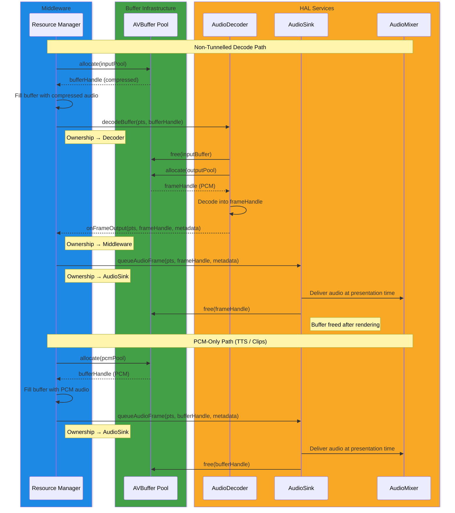
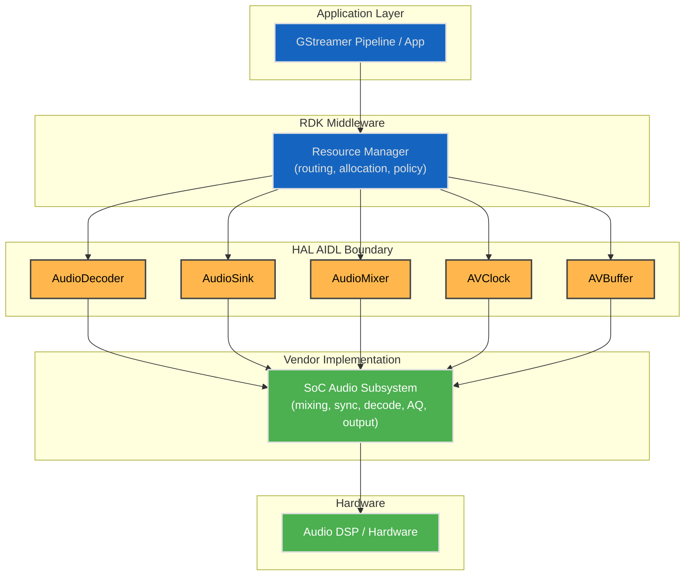
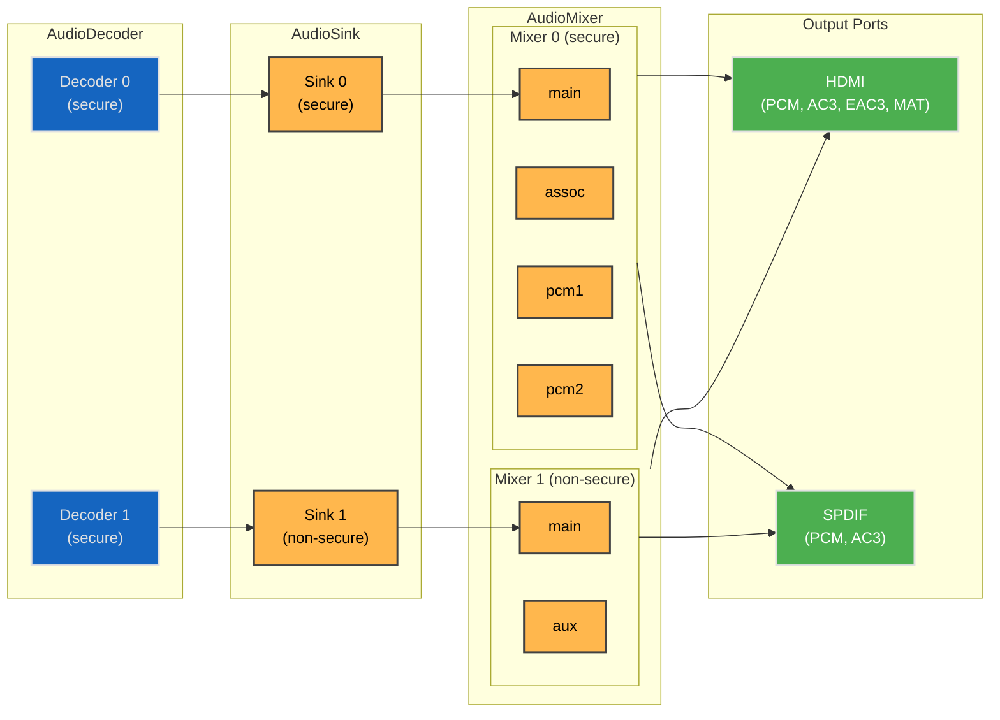
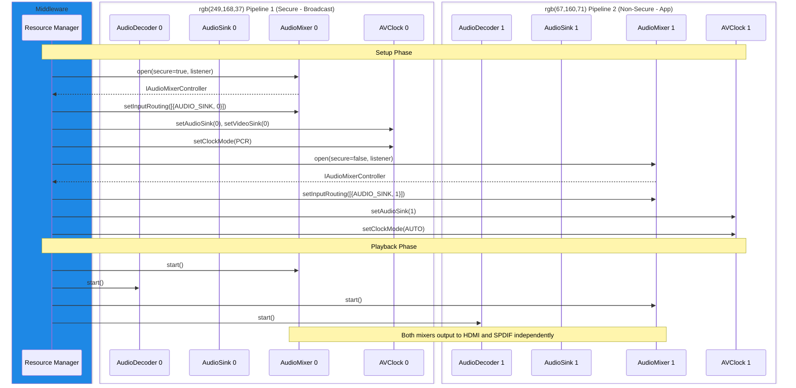
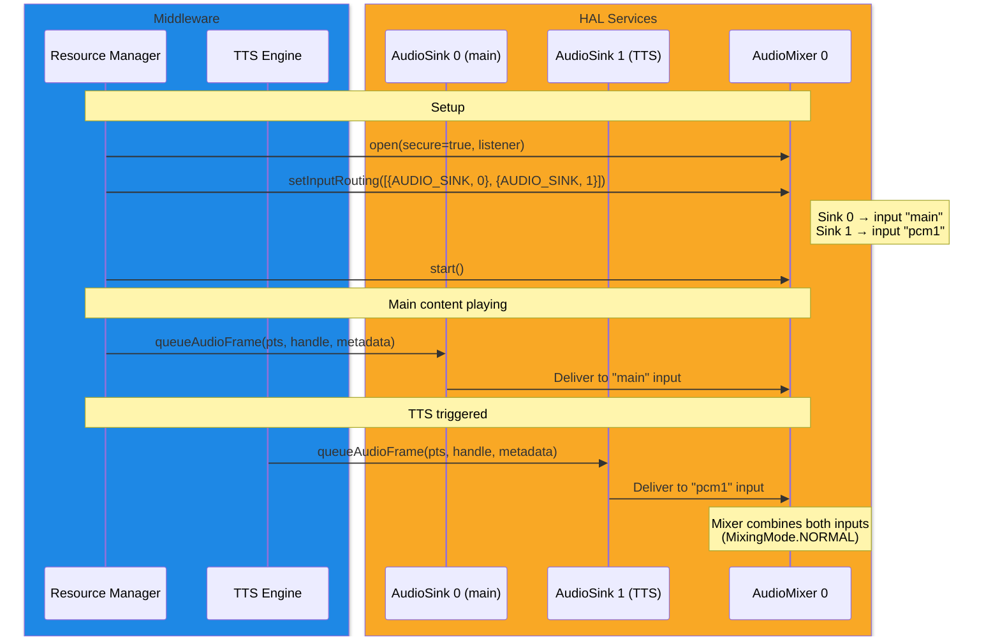

# Audio System Architecture

## Purpose

The RDK audio subsystem spans five HAL services — AudioDecoder, AudioSink, AudioMixer, AVClock, and AVBuffer — each documented individually. This document models how they work together as an integrated audio system, covering end-to-end data flow, buffer ownership, middleware and HAL responsibilities, multi-playback scenarios, and the API extensibility roadmap.

This document is intended for SoC vendors implementing HAL services, middleware developers integrating with them, and architects evaluating the design.

---

!!! info "References"
    |||
    |-|-|
    |**AudioMixer Interface**|[audiomixer/current](https://github.com/rdkcentral/rdk-halif-aidl/tree/develop/audiomixer/current/com/rdk/hal/audiomixer)|
    |**AudioSink Interface**|[audiosink/current](https://github.com/rdkcentral/rdk-halif-aidl/tree/develop/audiosink/current/com/rdk/hal/audiosink)|
    |**AudioDecoder Interface**|[audiodecoder/current](https://github.com/rdkcentral/rdk-halif-aidl/tree/develop/audiodecoder/current/com/rdk/hal/audiodecoder)|
    |**AVClock Interface**|[avclock/current](https://github.com/rdkcentral/rdk-halif-aidl/tree/develop/avclock/current/com/rdk/hal/avclock)|
    |**AVBuffer Interface**|[avbuffer/current](https://github.com/rdkcentral/rdk-halif-aidl/tree/develop/avbuffer/current/com/rdk/hal/avbuffer)|

---

!!! tip "Related Pages"
    * [AudioMixer HAL](audio_mixer.md)
    * [Audio Sink HAL](../../audio_sink/current/audio_sink.md)
    * [Audio Decoder HAL](../../audio_decoder/current/audio_decoder.md)
    * [AV Clock HAL](../../av_clock/current/av_clock.md)
    * [AV Buffer HAL](../../av_buffer/current/av_buffer.md)
    * [HAL Session State Management](../../key_concepts/hal/hal_session_state_management.md)
    * [HAL Feature Profiles](../../key_concepts/hal/hal_feature_profiles.md)

---

## Audio Subsystem Components

| Component | HAL Service Name | Role |
|-----------|-----------------|------|
| **AudioDecoder** | `audiodecoder` | Decodes compressed audio (AC3, AAC, etc.). Tunnelled mode: decoded audio is delivered internally to the mixer. Non-tunnelled mode: decoded PCM is returned to middleware via callback. |
| **AudioSink** | `audiosink` | Receives PCM frames from middleware via `queueAudioFrame()` and delivers them to the mixer. Manages per-stream volume, mute, and fading. |
| **AudioMixer** | `audiomixer` | Mixes multiple audio inputs (main, associated, PCM, TTS) and routes the result to output ports (HDMI, SPDIF). Manages AQ processing, output format, and transcode. |
| **AVClock** | `avclock` | Synchronises audio and video presentation timing. Forms sync groups linking AudioSink(s) and VideoSink to a shared clock. |
| **AVBuffer** | `avbuffer` | Shared buffer infrastructure for audio and video data. Manages pool allocation, buffer lifecycle, and secure/non-secure memory. |

---

## End-to-End Audio Data Flow

### Audio Path Overview

The following diagram shows the complete audio pipeline from source to physical output, including all four path variants.

### Tunnelled Audio Path

In tunnelled mode, the AudioDecoder manages output directly. Compressed audio is submitted to the decoder via `decodeBuffer()`, and the decoded audio is delivered internally to the mixer without middleware involvement. The `onFrameOutput()` callback carries `frameBufferHandle = -1` and metadata only (no buffer transfer to middleware).

This is the primary path for broadcast and DRM-protected content, and for Dolby MS12 processing.

### Non-Tunnelled Audio Path

In non-tunnelled mode, the AudioDecoder decodes compressed audio and returns PCM buffers to middleware via the `onFrameOutput()` callback. Middleware then queues these PCM frames via `IAudioSinkController.queueAudioFrame()` with presentation timestamps. The AudioSink delivers frames to the mixer for output.

This path gives middleware full control over decoded audio, enabling inspection, modification, or re-routing before mixing.

### PCM-Only Audio Path

Clear PCM from applications (TTS, system sounds, notification clips) bypasses the AudioDecoder entirely. Middleware allocates an AVBuffer, copies PCM data in, and queues directly via `IAudioSinkController.queueAudioFrame()`. This path is used for `ContentType.CLIP` and `ContentType.TTS` inputs on PCM-only mixer inputs (e.g., `pcm1`, `pcm2`, `aux`).

### Audio Passthrough Path

When an output port is configured with `OutputFormat.PASSTHROUGH`, the compressed bitstream bypasses decoding and mixing. The AudioDecoder tunnels the compressed audio directly to the output port. Only one compressed source can be passed through at a time; other mixer inputs must be handled independently (decoded and mixed, or muted).

Concurrent decode+passthrough is needed when some ports use passthrough (e.g., SPDIF) and others require decoded PCM (e.g., TV speakers via HDMI).

---

## Buffer Ownership and Lifecycle

### Buffer Flow

The following sequence shows the lifecycle of an audio buffer through the non-tunnelled decode path, from allocation through to freeing.

### Ownership Transfer Rules

| Event | Owner Before | Owner After |
|-------|-------------|-------------|
| `decodeBuffer()` returns `true` | Middleware | AudioDecoder |
| `decodeBuffer()` returns `false` or throws | Middleware | Middleware (retry or discard) |
| `onFrameOutput()` callback | AudioDecoder | Middleware |
| `queueAudioFrame()` returns `true` | Middleware | AudioSink |
| `queueAudioFrame()` returns `false` or throws | Middleware | Middleware (retry or discard) |
| `flush()` or `stop()` on AudioSink | AudioSink | AudioSink (frees pending buffers) |

### Secure vs Non-Secure Buffers

Secure Audio Processing (SAP) is maintained end-to-end through the pipeline:

1. **AVBuffer** — allocated from a secure pool (DRM-protected memory)
2. **AudioDecoder** — opened with `secure = true` (see `Capabilities.supportsSecure`)
3. **AudioSink** — opened with a secure-capable sink (see `Capabilities.supportsSecure`)
4. **AudioMixer** — opened with `secure = true` (see `Capabilities.supportsSecure`)

Secure buffers must never be copied to non-secure memory. The HAL implementation must enforce this at every ownership transfer point.

---

## Middleware / HAL Responsibility Split

### Responsibility Matrix

| Responsibility | Owner | Interface / Mechanism |
|---|---|---|
| Resource discovery (how many decoders, sinks, mixers, clocks) | Middleware | `getXxxIds()` on each Manager |
| Resource allocation (which decoder for which stream) | Middleware | Internal resource management logic |
| Audio routing decisions (which source to which mixer input) | Middleware | `IAudioMixerController.setInputRouting()` |
| Codec selection and stream setup | Middleware | `IAudioDecoder.open(codec, secure, listener)` |
| Buffer pool allocation | Middleware | `IAVBuffer.allocate()` |
| Decoder output pool management | HAL | Internal to AudioDecoder |
| PCM format requirements declaration | HAL | `IAudioSinkManager.getPlatformCapabilities()` |
| Audio mixing execution | HAL | Vendor implementation |
| Output format selection | Middleware | `IAudioOutputPort.setProperty(OUTPUT_FORMAT, ...)` |
| Transcode format selection | Middleware | `IAudioOutputPort.setProperty(TRANSCODE_FORMAT, ...)` |
| AV synchronisation execution | HAL | Vendor implementation driven by AVClock |
| Sync group configuration | Middleware | `IAVClockController.setAudioSink()` / `setVideoSink()` |
| Per-stream volume and mute | Middleware | `IAudioSinkController` properties |
| Per-output-port volume and mute | Middleware | `IAudioOutputPort.setProperty(VOLUME/MUTE, ...)` |
| AQ profile selection | Middleware | `IAudioMixerController.setProperty(ACTIVE_AQ_PROFILE, ...)` |
| AQ processing execution | HAL | Vendor implementation (Dolby MS12, DTS:X Ultra, etc.) |
| Error reporting | HAL | `onError()` callbacks on event listeners |
| Error recovery and retry | Middleware | Reacts to HAL error callbacks |
| Client crash cleanup | HAL | Automatic `stop()` + `close()` on Binder death |

### Boundary Diagram

---

## Multi-Playback Scenarios

### Platform Resource Topology

The following diagram shows the reference platform resource topology as declared in the HAL Feature Profiles. Actual platforms may differ; the HFP YAML is the authoritative source for each platform's resource set.

### Scenario 1: Single Secure AV Playback (Broadcast)

**Resources used:** AudioDecoder 0, AudioSink 0, AudioMixer 0 (secure), AVClock 0

- AVClock configured with `ClockMode.PCR`, linking AudioSink 0 and VideoSink 0
- Input routing: `routing[0] = {AUDIO_SINK, 0}` (maps Sink 0 to mixer input "main")
- AudioDecoder operates in tunnelled mode; decoded audio flows internally to the mixer
- Mixer outputs to HDMI and SPDIF simultaneously

### Scenario 2: Single Non-Secure AV Playback (IP/OTT)

**Resources used:** AudioDecoder 1, AudioSink 1, AudioMixer 1 (non-secure), AVClock 0

- AVClock configured with `ClockMode.AUTO` (uses AUDIO_MASTER)
- Input routing: `routing[0] = {AUDIO_SINK, 1}` (maps Sink 1 to mixer input "main")
- AudioDecoder operates in non-tunnelled mode; decoded PCM passed to middleware, queued via AudioSink
- Mixer outputs to HDMI and SPDIF

### Scenario 3: Concurrent Secure + Non-Secure Playback

**Resources used:** Both decoders, both sinks, both mixers, both clocks

!!! note
    How two mixer outputs combine onto the same physical output port is a vendor implementation detail. The HAL does not prescribe the mixing strategy at the output stage. Vendors must ensure that both mixers can drive the same output ports without conflict.

### Scenario 4: Main Audio + TTS Overlay

**Resources used:** AudioDecoder 0, AudioSink 0 (main), AudioSink 1 (TTS), AudioMixer 0

In future, `MixingMode.DUCKED` will enable automatic attenuation of the main stream while TTS is active.

### Scenario 5: Main Audio + Supplementary Audio (Audio Description)

**Resources used:** AudioDecoder 0 (main), AudioDecoder 1 (AD), AudioSink 0 (main), AudioSink 1 (AD), AudioMixer 0, AVClock 0

- Both decoders decode from the same broadcast multiplex
- AVClock links both sinks: `setAudioSink(0)` for primary, `setSupplementaryAudioSink(1)` for AD
- Input routing: `routing[0] = {AUDIO_SINK, 0}` for "main", `routing[1] = {AUDIO_SINK, 1}` for "assoc"
- Both streams share the same PCR-driven clock from the broadcast stream
- Mixer combines main and associated audio for output

### Scenario 6: HDMI / Composite Input Audio

**Resources used:** AudioMixer 0 (or 1)

- Input routing: `routing[0] = {HDMI_INPUT, 0}` or `{COMPOSITE_INPUT, 0}`
- No AudioDecoder or AudioSink involved — the mixer receives audio directly from the platform audio source
- The mixer handles format detection and mixing internally

### Resource Contention and Priority

The HAL does not define audio priority or pre-emption policy. When resources are exhausted (all decoders in use, all sinks open, all mixer inputs routed), the **middleware resource manager** is responsible for:

- Deciding which streams to stop or pre-empt
- Releasing resources before allocating them to new streams
- Implementing an audio focus model (e.g., TTS pre-empts background music)

The HAL simply returns `null` from `open()` or `false` from `start()` if a resource is unavailable.

---

## Output Port Configuration

Each output port is independently configurable via `IAudioOutputPort.setProperty()`. The three output modes are:

| Mode | Property | Description |
|------|----------|-------------|
| **Decode + Mix** | `OUTPUT_FORMAT = PCM` | Default. Compressed audio is decoded, mixed with other inputs, and output as uncompressed PCM. |
| **Transcode** | `TRANSCODE_FORMAT = DOLBY_AC3` | Mixed PCM is re-encoded to AC3 (or other format) for S/PDIF or legacy AVR compatibility. |
| **Passthrough** | `OUTPUT_FORMAT = PASSTHROUGH` | Compressed bitstream bypasses decoding and mixing entirely. Only one compressed source can pass through; other inputs are muted or mixed separately. |

Output ports are independent: HDMI can be in MAT mode while SPDIF uses AC3 transcode. Each port's supported formats and transcode capabilities are declared in the HFP YAML and queryable via `IAudioOutputPort.getCapabilities()`.

---

## AV Synchronisation

The AVClock HAL establishes synchronisation between audio and video through sync groups. A sync group links one or more AudioSinks and a VideoSink to a shared clock.

| Clock Mode | Source | Use Case |
|------------|--------|----------|
| `AUTO` | AUDIO_MASTER if audio present, else VIDEO_MASTER | Default for IP/OTT playback |
| `PCR` | Program Clock Reference from broadcast transport stream | Live broadcast, DVR |
| `AUDIO_MASTER` | Crash-locked to first audio sample PTS | Audio-led playback |
| `VIDEO_MASTER` | Crash-locked to first video frame PTS | Video-led playback |

The AudioSink uses presentation timestamps (PTS) from `queueAudioFrame()` to schedule audio delivery to the mixer. The AVClock paces this delivery against the selected clock source. For broadcast, middleware delivers PCR samples via `notifyPCRSample()` to maintain phase lock.

For full details, see the [AV Clock HAL documentation](../../av_clock/current/av_clock.md).

---

## Platform Consistency Guidelines

### HFP as the Contract

The HAL Feature Profile YAML is the authoritative declaration of a platform's audio capabilities. Implementations must satisfy the following:

- `getCapabilities()` at runtime must match the HFP declarations
- Resource IDs returned by `getXxxIds()` must correspond to HFP entries
- Supported codecs, content types, output formats, and AQ parameters must be consistent between HFP and runtime queries
- VTS test suites validate conformance against HFP declarations

### Cross-SoC Implementation Guidance

| Requirement | Guidance |
|-------------|----------|
| **Buffer ownership** | Non-negotiable. All implementations must follow the ownership transfer rules defined in this document. |
| **State machine transitions** | Must follow the standard lifecycle (CLOSED → OPENING → READY → STARTING → STARTED). Transitory states must emit state change events. |
| **PCM format** | Declared via `PlatformCapabilities`. Middleware adapts to the platform's native format (e.g., S16LE at 48 kHz). |
| **Tunnelled vs non-tunnelled** | Vendor decides per codec, but behaviour must be consistent across calls for the same codec and configuration. |
| **AQ parameter semantics** | Parameter IDs are fixed. Interpretation may vary by vendor (e.g., scale ranges), but IDs must not be repurposed. |
| **Client crash cleanup** | HAL must detect Binder death and automatically `stop()` + `close()` the affected resource. |

---

## API Extensibility Roadmap

### Current TODO Items

The following items are defined in the AIDL interfaces but not yet fully specified:

| Item | Location | Status |
|------|----------|--------|
| `MixingMode.MUTED` | `MixingMode.aidl` | Defined, semantics TBD |
| `MixingMode.DUCKED` | `MixingMode.aidl` | Defined, semantics TBD (attenuation dB, ramp curve) |
| `MixingMode.SOLO` | `MixingMode.aidl` | Defined, semantics TBD (which stream is priority) |
| `MixingMode.MIXED_OVERRIDE` | `MixingMode.aidl` | Defined, semantics TBD |
| `Property.MIXING_MODE` | `Property.aidl` | Read-write, depends on MixingMode completion |
| Additional event callbacks | `IAudioMixerEventListener.aidl` | `onResourceAvailable()`, `onEndOfStream()` planned |
| Audio metrics | `audiosink/Property.aidl` | `METRIC_xxxx = 1000` placeholder defined |

!!! warning
    Vendors should not implement `MixingMode` values beyond `NORMAL` until their semantics are fully specified in a future interface version.

### Planned Additions

The following capabilities are under consideration for future interface versions:

- **Audio focus / priority model** — Middleware-driven audio focus that maps to `MixingMode` changes
- **Bluetooth audio output** — New output port type for BT audio sinks
- **Internal speaker output** — Output port type for TV panel speakers
- **ARC / eARC** — Specialised HDMI output port behaviour for audio return channel
- **Audio metrics and observability** — Latency histograms, underflow counts, decode statistics
- **Multi-room audio** — Distribution of mixed audio to multiple endpoints

### Versioning Strategy

AIDL stable interfaces follow additive-only versioning:

- New enum values, methods, and parcelable fields can be added
- Existing interfaces are never modified or removed
- Breaking changes require a new interface version with a migration path

See the [HAL Delivery & Versioning SOP](../../../governance/versioning-sop.md) and [HAL API Deprecation Governance](../../key_concepts/hal/hal_api_deprecation_governance.md) for full details.

---

## Open Issues

The following items are known gaps or design questions that require resolution in future iterations:

| Issue | Description |
|-------|-------------|
| **MixingMode semantics** | `DUCKED`, `SOLO`, and `MIXED_OVERRIDE` are defined but lack detailed semantics (attenuation levels, ramp curves, priority rules). |
| **Multi-mixer output combining** | How two mixer instances' outputs combine onto one physical output port is not specified by the HAL. This is currently a vendor implementation detail. |
| **Free-running mode** | Behaviour when PCR and PTS diverge significantly is not fully defined. |
| **BT / Speaker / ARC output** | No output port types exist for Bluetooth, internal speakers, or ARC/eARC. |
| **Low-latency mode** | `PlatformCapabilities.supportsLowLatency` exists but the associated requirements and behaviour are not documented. |
| **Audio passthrough constraints** | Interaction between passthrough on one port and decode+mix on another needs further specification. |
