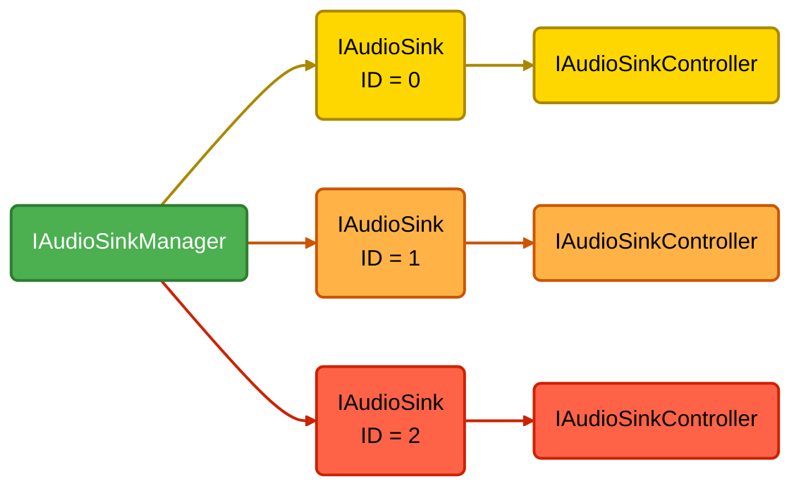
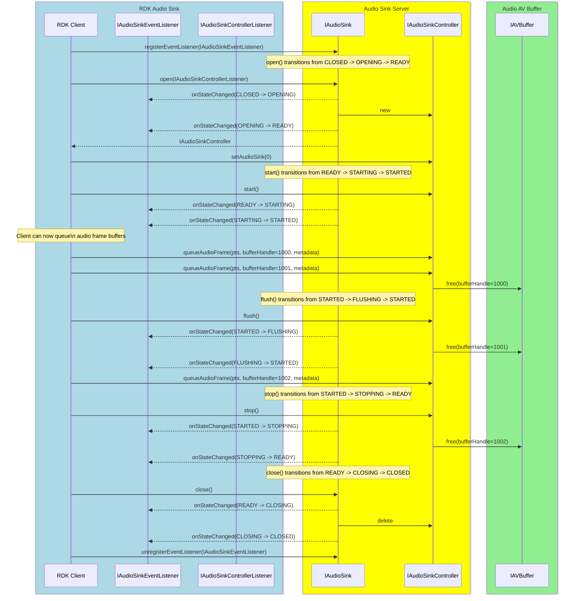

# Audio Sink

## References

!!! info References
    |||
    |-|-|
    |**Interface Defination**|[audio_sink/current](https://github.com/rdkcentral/rdk-halif-aidl/tree/main/audiosink/current)|
    | **API Documentation** | *TBD - Doxygen* |
    |**HAL Interface Type**|[AIDL and Binder](../../../introduction/aidl_and_binder.md)|
    |**Initialization - TBC** | [systemd](../../../vsi/systemd/current/intro.md) - **hal-audiosink.service** |
    |**VTS Tests**| TBC |
    |**Reference Implmentation - vComponent**|[https://github.com/rdkcentral/rdk-halif-aidl/tree/main/audiosink/current](https://github.com/rdkcentral/rdk-halif-aidl/tree/main/audiosink/current)|

## Related Pages

!!! tip Related Pages
    - [Audio Decoder](../../audio_decoder/current/audio_decoder_overview.md)
    - [AV Buffer](../../av_buffer/current/av_buffer_overview.md)
    - [AV Clock](../../av_clock/current/av_clock_overview.md)
    - [Session State Management](../../introduction/session_state_management.md)

## Implementation Requirements

| # | Requirement | Comments |
|---|---|----|
| **HAL.AUDIOSINK.1** | Starting and stopping audio streams shall never produce an audible click or pop artefact due to the audio waveform where the audio streaming was started or stopped. ||
| **HAL.AUDIOSINK.2** | If any audio decoders support secure audio path processing (SAP) then the audio sink shall be capable of processing secure input buffers to maintain SAP. ||
| **HAL.AUDIOSINK.3** | The default volume level for an audio sink session shall be 1.0 (full volume) and unmuted. ||
| **HAL.AUDIOSINK.4** | The default reference level for an audio sink session shall be -31dB. ||
| **HAL.AUDIOSINK.5** | If a client process exits, the Audio Sink server shall automatically stop and close any Audio Sink instance controlled by that client. ||

## Interface Definition

| Interface Definition File | Description |
|---|---|
| `IAudioSinkManager.aidl` | Audio Sink Manager HAL interface which provides access to the `IAudioSink` resource instances. |
| `IAudioSink.aidl` | Audio Sink interface for a single audio sink resource instance. |
| `IAudioSinkController.aidl` | Controller interface for an `IAudioSink` resource instance. |
| `IAudioSinkControllerListener.aidl` | Listener callbacks interface to clients from an `IAudioSinkController`. |
| `IAudioSinkEventListener.aidl` | Listener callbacks interface to clients from an `IAudioSink`. |
| `Capabilities.aidl` | Parcelable describing the capabilities of an `IAudioSink` resource instance. |
| `ErrorCode.aidl` | Enum list of audio sink error codes. |
| `PlatformCapabilities.aidl` | Parcelable describing the capabilities of the platform audio. |
| `Property.aidl` | Enum list of audio sink properties. |
| `Volume.aidl` | Parcelable for defining a volume and mute state. |
| `VolumeRamp.aidl` | Enum list of volume ramp types. |

## Initialization

The `systemd hal-audios_sink_manager.service` unit file is provided by the vendor layer to start the service and should include [Wants](https://www.freedesktop.org/software/systemd/man/latest/systemd.unit.html#Wants=) or [Requires](https://www.freedesktop.org/software/systemd/man/latest/systemd.unit.html#Requires=) directives to start any platform driver services it depends upon.

The Audio Sink Manager service depends on the [Service Manager](../introduction/session_state_management.md) to register itself as a service.

Upon starting, the service shall register the `IAudioSinkManager` interface with the [Service Manager](../../../vsi/service_manager/current/service_manager.md) using the string `IAudioSinkManager.serviceName` and immediately become operational.

## Product Customization

The `IAudioSinkManager.getAudioSinkIds()` should return an array of `IAudioSink.Id` parcelables to uniquely represent all of the audio sink resources supported by the vendor layer. Typically, the ID value starts at 0 for the first audio sink and increments by 1 for each additional audio sink.

The `Capabilities` parcelable returned by the `IAudioSink.getCapabilities()` function lists all capabilities supported by this audio sink instance.

An audio sink instance can only operate on one audio stream in an open session. Concurrent audio streams require multiple audio sink instances to be opened.

## System Context

The Audio Sink HAL can provide functionality to multiple clients.

Typically an RDK middleware GStreamer audio sink element will work with a single `IAudioSink` instance and pass it PCM audio in [AV Buffer](../../av_buffer/current/av_buffer_overview.md) handles for mixing.

The RDK middleware resource management system will examine the number of audio sink resources and their capabilities, so they can be allocated to streaming sessions.

## Resource Management

The `IAudioSinkManager` provides access to one or more `IAudioSink` sub-interfaces which each represent an audio sink resource instance offered by the platform.

Each `IAudioSink` resource instance is assigned a unique integer ID, which is used in the `IAudioSink.Id.value` and can be read from `RESOURCE_ID` using the `IAudioSink.getProperty()` function.

To use an `IAudioSink` resource instance it must be opened by a client, which returns an `IAudioSinkController` sub-interface to access buffer queuing and additional state controls.

Any number of clients can access the `IAudioSinkManager` service and get access to the `IAudioSink` sub-interfaces, but only 1 client can `open()` an `IAudioSink` and access its `IAudioSinkController` sub-interface.

The diagram below shows the relationship between the interfaces and resource instances.

## Audio Buffers

Audio buffers entering the Audio Sink shall be delivered as AV Buffer handles (allocated from either an [AV Buffer](../../av_buffer/current/av_buffer_overview.md) audio pool or the audio frame pool) with a presentation timestamp and metadata describing the audio frame through the `IAudioSinkController.queueAudioFrame()` function.

An AV Buffer audio pool would be used for PCM data which has come from system memory (e.g. PCM sound clip) or from a soft audio decoder. In this case the audio pool is created against `IAudioDecoder.Id.UNDEFINED`.

The audio data must be in the PCM audio format and sample rate, as reported in `PlatformCapabilities` returned from the `IAudioSinkManager.getPlatformCapabilities()` function.

Once the data in an audio frame buffer has been fully passed to or processed by the mixer, the Audio Sink shall free the handle by calling `IAVBuffer.free()`.

## Secure Audio Processing

If any audio decoder supports SAP in non-tunnelled mode then the Audio Sink HAL must also support SAP to be able to process secure AV buffers of decoded PCM data, otherwise SAP support is optional.

## Clear PCM Audio Playback

PCM stream data can originate in the RDK media pipeline from multiple sources; from an application, from the RDK middleware or from a software audio decoder. In these cases the PCM data is passed directly to the Audio Sink HAL.

Clear PCM audio is copied into a non-secure AV buffer and is routed to the `IAudioSinkController` where it is queued for mixing.

## Tunnelled Audio & Passthrough Mode

The Audio Sink HAL cannot handle audio frame buffers when tunnelled audio is exclusively in use or when audio passthrough mode is enabled.

In these cases an Audio Decoder does not return audio frame buffer handles that can be passed to the Audio Sink.

The Audio Sink HAL is still used to control the audio stream volume, mute and volume ramping.

## End of Stream Signalling

The Audio Decoder shall emit a `FrameMetadata` with `endOfStream=true` after all audio frames have been output from the decoder.

For PCM audio, a `FrameMetadata` with `endOfStream=true` shall be generated by the RDK middleware client after the last audio frame buffer has been passed to the Audio Sink.

For non-tunnelled audio, the Audio Sink shall be passed this metadata with the final audio frame buffer or after the last audio frame buffer has been queued by the RDK middleware client.

All audio frame buffers queued up in the Audio Sink are expected to continue to be fed into the audio mixer in the usual way, but the Audio Sink is not expecting any further audio buffers to be queued.

## Audio Sink States

The Audio Sink HAL follows the standard [Session State Management](../../../introduction/session_state_management.md) paradigm.

When an Audio Sink session enters a `FLUSHING` or `STOPPING` transitory state it shall free any AV buffers it is holding.

The sequence diagram below shows the behavior of the callbacks.

