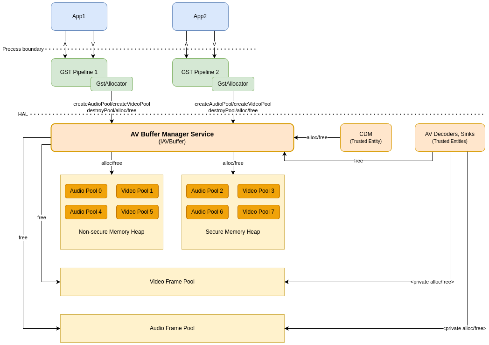

# AV Buffer

The **AV Buffer HAL** manages both secure and non-secure memory heaps and pools for the media pipeline and related A/V HAL components.

- An **AV buffer** typically stores audio or video data, which may be in either encrypted or clear form.
- **Secure memory buffers** handle decrypted data when DRM, conditional access, or other secure decryption mechanisms are used.
- **Non-secure memory** is allocated for encrypted data from a media player source until it is decrypted into a secure memory buffer.
- If a media player processes only clear (unencrypted) audio or video data, **non-secure memory buffers** can be used throughout from source to decoder.
- AV memory buffers are referenced by **handles** as they move through the media pipeline and across HAL interfaces.

## References

!!! info References
    |||
    |-|-|
    |**Interface Definition**|[av_buffer/current](https://github.com/rdkcentral/rdk-halif-aidl/tree/main/av_buffer/current)|
    | **API Documentation** | *TBD - Doxygen* |
    |**HAL Interface Type**|[AIDL and Binder](../../../introduction/aidl_and_binder.md)|
    |**Initialization - TBC** | [systemd](../../../vsi/systemd/current/intro.md) - **hal-av_buffer.service** |
    |**VTS Tests**| TBC |
    |**Reference Implementation - vComponent**|**TBD**|

## Related Pages

!!! tip Related Pages
    - [Audio Decoder](../../audio_decoder/current/audio_decoder.md)
    - [Audio Sink](../../audio_sink/current/audio_sink.md)
    - [AV Clock](../../av_clock/current/av_clock.md)
    - [Session State Management](../../key_concepts/hal/hal_session_state_management.md)
    - [Video Decoder](../../video_decoder/current/video_decoder.md)

## Implementation Requirements

|#|Requirement|Comments|
|-|-----------|--------|
|**HAL.AVBUF.1**|AV buffer handles shall be unique across all memory pools and heaps, including the vendor video frame pool and audio frame pool.|
|**HAL.AVBUF.2**|Pool handles shall be unique across all memory pools and heaps.|
|**HAL.AVBUF.3**|Buffer allocations from pools are made to fit a single video frame or audio frame.|
|**HAL.AVBUF.4**|The last buffer allocated from a pool may be trimmed to reduce its allocated size down.|
|**HAL.AVBUF.5**|Metrics on heap usage can be retrieved.|
|**HAL.AVBUF.6**|Metrics on pool usage can be retrieved.|
|**HAL.AVBUF.7**|Memory buffers allocated from a secure memory pool cannot be mapped into the address space of unprivileged processes and must meet secure video path or secure audio path requirements.| Only vendor layer trusted entities can access secure memory (e.g. TA or secure hardware peripheral).|
|**HAL.AVBUF.8**|The size of the heaps and pools shall be determined by the vendor to meet the platform and product requirements for audio and video.|
|**HAL.AVBUF.9**|A helper library shall be provided to allow middleware processes to map and unmap non-secure buffers, and copy data to secure and non-secure buffers.|

## Interface Definition

|Interface Definition File|Description|
|-------------------------|-----------|
|`IAVBuffer.aidl`|AV Buffer HAL interface which provides the central API for buffer management.|
|`IAVBufferSpaceListener.aidl`|Pool space listener callback interface.|
|`Pool.aidl`|Pool handle parcelable definition.|
|`HeapMetrics.aidl`|Heap metrics parcelable definition.|
|`PoolMetrics.aidl`|Pool metrics parcelable definition.|

## Initialization

The [systemd](../../../vsi/systemd/current/intro.md) `hal-av_buffer.service` unit file is provided by the vendor layer to start the service and should include [Wants](https://www.freedesktop.org/software/systemd/man/latest/systemd.unit.html#Wants=) or [Requires](https://www.freedesktop.org/software/systemd/man/latest/systemd.unit.html#Requires=) directives to start any platform driver services it depends upon.

The AV Buffer service depends on the [Service Manager](../../../vsi/service_manager/current/service_manager.md) to register itself as a service.

Upon starting, the service shall register the IAVBuffer interface with the Service Manager using the String `IAVBuffer.serviceName` and immediately become operational.

## Product Customization

AV Buffer provides pools of memory for audio and video decoders, for both compressed and uncompressed data in secure and non-secure forms.

The size of the memory pools allocated for the decoders is chosen by the HAL implementation where it is calculated according to the capabilities of the platform decoders, the requirements of the platform and the product requirements.

The method of providing secure memory for secure video path and secure audio path is left to the vendor layer to implement, where it can choose the technology best suited for the SoC and platform drivers.  All memory buffers are referenced by a handle and a helper library is provided by the vendor layer for the RDK middleware to perform map, unmap and copy operations on the memory buffers.

## System Context

The AV Buffer service provides functionality to multiple clients which exist both inside the RDK middleware and the vendor layer.

Applications that stream A/V utilise a GStreamer pipeline in the RDK middleware which understands how to operate the A/V HALs to perform playback.

When A/V data flows from the application it gets copied as early as possible into memory buffers allocated from AV Buffer service pools.

The video and audio frame pools are managed entirely by the vendor layer, but it is important that any handles representing frame allocations share the same handle space as pool allocations made by applications, so that a handle of any type can be passed to IAVBuffer.free() to be returned to its original pool.

Where A/V data frames are encrypted, they are decrypted by the a CDM, which will make a memory buffer allocation from a secure pool (if supported) for the output data.

## Memory Heaps

Heaps are blocks of memory managed by the vendor layer that clients can create pools from and are global in the system.

Heaps must support the creation of pools by the client which are targeted for use by a specific audio or video decoder instance.

Typically a media pipeline client shall create one or more pools from the heaps to make buffer allocations from for audio and video data frames.

The platform shall implement 2 heaps which offer secure and non-secure memory.

|Heap Type | Description|
|---------|-----------|
|**secureHeap=false**|The non-secure heap shall be used for audio and video data that is encrypted or does not need to meet secure audio path or secure video path requirements. The heap shall be large enough to handle concurrent decode of all audio and video decoders or the requirements of a given product specification.|
|**secureHeap=true**|The secure heap must be secure SOC memory and cannot be mapped into a non-secure process (i.e. not in any RDK middleware or unprivileged process) and can only be passed by handle between middleware processes.|

The heap shall be large enough to handle concurrent decode of all audio and video decoders or the requirements of a given product specification.

It is mandatory for the AV buffer manager to support both heap types in the APIs but it may report a 0 byte size if a heap is not implemented.

The `getHeapMetrics()` function allows the middleware to interrogate the heap usage data for a specified heap type and it returns a HeapMetrics parcelable with the bytes used out of the bytes total.

## Memory Pools

A memory pool is created by a client to make buffer allocations from either the secure or non-secure heap by calling `createAudioPool()` or `createVideoPool()` with the audio or video resource ID it plans to use if for.

### Pool Lifecycle

The size of the memory pool is determined by the vendor layer implementation when the client passes a video or audio resource ID in to `createVideoPool()` or `createAudioPool()`.

Once a pool is created it is referenced by an Pool handle. When the client has finished with a pool it calls destroyPool() with the Pool handle.

### Pool Handles

Pool handles are assigned by the AV buffer manager as positive integers (int8_t) and must be globally unique in the system across all heaps and all client connections.

The immediate re-use of pool handles after they have been destroyed is discouraged as this could lead to stale pool handles held in the client being used in error and cause unexpected behaviour.

The recommended vendor implementation for pool handle assignment is to start at 0 and increment by 1 for each pool allocation made across all of the clients.  When pool handle 127 has been allocated, the next handle value can wrap back around to 0 or the next unused pool handle integer value.

### Pool Implementation Recommendation

Allocations made from a memory pool for video and audio data shall typically be freed in the same order, but no guarantees are made.

It is recommended that the vendor implements a circular buffer for allocations to be made from but allow flexibility in the order of the buffer frees.

## AV Buffers

AV buffers are allocated by the client to typically hold a frame of audio or video data.  The data may be coded, decoded, encrypted or in the clear, but the AV Buffer Manager has no understanding of the data contents.

Only AV buffers that are allocated from a pool created from the non-secure heap can be directly mapped inside an RDK middleware client process for read-write access.  

### Buffer Lifecycle

A client can allocate a new AV buffer from a pool by calling the `IAVBuffer.alloc()` function with the Pool handle to allocate from and the buffer size.

On success, the buffer is returned to the client as an integer handle (int64_t) which must be globally unique in the system across all pools and all client connections.

The client can pass ownership of the AV buffer handle to a HAL component (e.g. `IAudioDecoderController.decodeBuffer()` or `IAudioSinkController.queueAudioFrame()`) where it will eventually be freed otherwise it must call `IAVBuffer.free()` itself.

If a HAL component (e.g. a decoder or sink) has finished with a buffer that it has taken ownership of then it must be freed and the buffer is returned to its original pool.  This can be achieved by calling the public HAL API `IAVBuffer.free()` or by a private internal call inside the vendor layer which has the same effect.

It is important that buffer allocations can be allocated and freed through any client session connection with the AV Buffer Manager service and not restricted to a single client session.

### Buffer Handles

Similar to pool handles, the immediate re-use of AV buffer handles after they have been freed is discouraged as this could lead to stale AV buffer handles held in the client being used in error and cause unexpected behaviour.

### Handling Out of Memory Conditions

Pools have finite memory resources to allocate from and when its limits are reached it will return an out of memory status on `IAVBuffer.alloc()` requests.

The client can request to be notified when enough space or resources become available for an allocation of a specific size from a pool by calling `notifyWhenSpaceAvailable()`.

The AV Buffer Manager shall make a callback to `onSpaceAvailable()` on the `IAVBufferSpaceListener` interface passed in the `createAudioPool()` or `createVideoPool()` call when the pool was created.

The client must guarantee that its `IAVBufferSpaceListener` interface instance remains available for the lifetime of the memory pool it was intended for and can only be destroyed after the related `destroyPool()` call has returned.

## Audio & Video Frame Pools

The audio and video frame pools are allocated from privately inside the vendor layer by the audio and video decoders.

In tunnelled mode the frame buffer allocations are automatically freed when they are no longer needed by the downstream AV pipeline vendor components.

In non-tunnelled mode the client is passed these handles back from the decoder and may still be in possession of them when an AV pipeline is being stopped or flushed. In this case the client must free the frame buffer handles by calling IAVBuffer.free().

### Media Pipeline Example

The sequence diagram below provides an example of a secure media pipeline implementation.

The AppSource is delivered encrypted audio and video frames and it creates 2 non-secure memory pools for these types of frames.

The CDM is handed the non-secure encrypted audio and video frame buffers and decrypts them into secure buffers of the same size.  It uses 2 secure memory pools for audio and video decrypted frames.

After the media pipeline has a secure buffer decoded by an audio or video decoder it can free the buffer.

Note: The diagram below does not show how multiple audio and video buffers may be allocated at once, to allow for buffering points along the media pipeline.

### Fragmentation in Memory Pools

There is no guarantee that the IAVBuffer.alloc() and IAVBuffer.free() calls for a pool are in the same order, so the vendor implementation must allow for out-of-order free() calls to be made.

The table below shows an example sequence of calls made to allocate and free 3 buffers in an order that should be supported by the AV Buffer Manager service.

|#|Buffer 1|Buffer 2|Buffer 3|
|-|--------|--------|--------|
|1|alloc()|||
|2||alloc()||
|3||free()||
|4|||alloc()|
|5|free()|||
|6|||free()|

## Buffer Trimming for Broadcast Sources

MPEG-2 transport stream broadcast sources may load frames progressively as data emerges from TS packet filters and PES filters.

For this reason an oversized buffer may be allocated for the incoming audio or video data and once the frame boundary has been determined the buffer is trimmed to its actual size.

Only the last allocated memory buffer is capable of being trimmed, which helps manage the pool memory in a circular buffer.

## Memory Mapping in Processes

The non-secure shared memory buffers must be mapped inside processes so they can be access for read/write operations.

Mapping provides a local process pointer to the memory which cannot be meaningfully shared across processes.

The `mapHandle()` and `unmapHandle()` functions are provided by a library to provide process-local mapping.

## Buffer Mapping Helper Library - libavbufferhelper.so

The libavbufferhelper.so user space library is provided by the vendor layer to perform memory mapping/unmapping and copy operations on non-secure AV buffers.

RDK middleware processes use the API to copy data into AV buffers represented by a handle.

The library `mapHandle()` function is used to map a non-secure AV buffer handle into a concrete process mapped pointer which allows for data read/write access.

The library `unmapHandle()` function is used to unmap a non-secure AV buffer handle and pointer pair.

The library `write()` function is used to write data from system memory to buffer and works for both secure or non-secure AV buffers.

The library `copyWithMap()` function is used to copy one or more ranges of byte from a source buffer to a destination buffer and works for both secure or non-secure AV buffers.

!!!hint Implementation Hint
    When mapping non-secure handles there is an possible optimisation to map the entire pool space into the process space only once on the first call and subsequent calls to `mapHandle()` simply provide an offset into the mapped memory.
