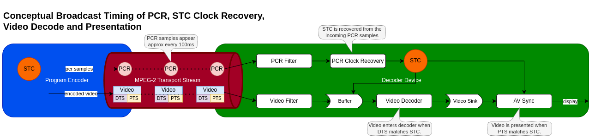

# AV Clock

The AV Clock HAL service establishes synchronization between audio and video sinks, enabling lip-sync playback by driving them from a shared clock.

In broadcast scenarios, the Program Clock Reference (PCR) is provided to the AV Clock HAL. This allows the local System Time Clock (STC) to be synchronized with the broadcast encoder's timing, crucial for preventing buffer underflow or overflow.

For IP streaming, clients can manipulate the playback rate, facilitating pause functionality and fine-grained adjustments for clock synchronization with other devices or streams.

Audio and video sinks associated with a given AV Clock instance comprise a synchronization group.  Members of a sync group share a common presentation clock.  The AV Clock HAL provides an interface for the application to define the composition of these sync groups, specifying the video sink and the associated audio sink(s).

## References

!!! info References
    |||
    |-|-|
    |**Interface Definition**|[av_clock/current](https://github.com/rdkcentral/rdk-halif-aidl/tree/main/av_clock/current)|
    | **API Documentation** | *TBD - Doxygen* |
    |**HAL Interface Type**|[AIDL and Binder](../../../introduction/aidl_and_binder.md)|
    |**Initialization - TBC** | [systemd](../../../vsi/systemd/current/systemd.md) - **hal-av_clock.service** |
    |**VTS Tests**| TBC |
    |**Reference Implementation - vComponent**|**TBD**|

## Related Pages

!!! tip Related Pages
    - [Audio Sink](../../audio_sink/current/audio_sink.md)
    - [Video Sink](../../video_sink/current/video_sink.md)
    - [Plane Control](../../plane_control/current/plane_control.md)

### Implementation Requirements

|#| Requirement | Comments |
|--|---|---|
| **HAL.AVCLOCK.1** | A single client-server session shall manage a single AV clock instance and sync group. |
| **HAL.AVCLOCK.2** | Multiple AV clocks may operate concurrently. |
| **HAL.AVCLOCK.3** | Broadcast PCR samples shall be provided by the client to drive the AV clock instance in PCR mode. |
| **HAL.AVCLOCK.4** | PCR samples are based on a 27MHz clock from the MPEG standard but delivered in nanosecond units. |
| **HAL.AVCLOCK.5** | PCR samples can start at any value, contain discontinuities and may wrap according to broadcast encoding rules. |
| **HAL.AVCLOCK.6** | An AV clock shall support audio with video, video only or audio only. |
| **HAL.AVCLOCK.7** | Supplementary audio (e.g. audio description) shall be supported in addition to a main audio. |
| **HAL.AVCLOCK.8** | For non-PCR driven playback, the playback rate shall be adjustable between 0.0 and 2.0, where 0 is paused and 1.0 is normal speed. |YouTube requirement is to play between 0.5 and 2.0 with pitch correction.|
| **HAL.AVCLOCK.9** | A client shall be able to read the current AV clock time.|For PCR mode. It should return the "invalid" value until the first PCR is received. |
| **HAL.AVCLOCK.10** | If a client process exits, the AV Clock server shall automatically stop and close any AV Clock instance controlled by that client. |

### Interface Definition

| Interface Definition File | Description |
|---|---|
| `IAVClockManager.aidl` | AV Clock Manager HAL interface which provides access to IAVClock resource instances. |
| `IAVClock.aidl` | AV Clock HAL interface for a single AV Clock resource instance. |
| `IAVClockController.aidl` | Controller interface for an IAVClock resource instance. |
| `IAVClockControllerListener.aidl` | Listener callbacks interface to clients from an IAVClockController. |
| `IAVClockEventListener.aidl` | Listener callbacks interface to clients from an IAVClock. |
| `Capabilities.aidl` | Parcelable describing the capabilities of an IAVClock resource instance. |
| `ClockMode.aidl` | Enum list of clock modes. |
| `ClockTime.aidl` | Parcelable holding a clock time. |
| `Property.aidl` | Enum list of AV Clock properties. |

### Initialization

The [systemd](../../../vsi/systemd/current/systemd.md) `hal-av_clock_manager.service` unit file is provided by the vendor layer to start the service and should include [Wants](https://www.freedesktop.org/software/systemd/man/latest/systemd.unit.html#Wants=) or [Requires](https://www.freedesktop.org/software/systemd/man/latest/systemd.unit.html#Requires=) directives to start any platform driver services it depends upon.

The AV Clock Manager service depends on the [Service Manager](../../../vsi/service_manager/current/service_manager.md) to register itself as a service.

Upon starting, the service shall register the `IAVClockManager` interface with the [Service Manager](../../../vsi/service_manager/current/service_manager.md) using the String `IAVClockManager.serviceName` and immediately become operational.

### Product Customization

The `IAVClockManager.getAVClockIds()` should return an array of `IAVClock.Id` parcelables to uniquely represent all of the AV Clock resources supported by the vendor layer. Typically, the ID value starts at 0 for the first AV Clock and increments by 1 for each additional AV Clock.

The `Capabilities` parcelable returned by the `IAVClock.getCapabilities()` function lists the capabilities of a specific AV Clock resource instance.

### System Context

The AV Clock service provides functionality to multiple clients inside the RDK middleware.

An AV Clock is used to time the delivery of video frames and audio samples from an AV pipeline as a sync group that share a common timebase and reference clock.

It can also operate in a video-only or audio-only mode.

Each AV pipeline utilises its own instance of an AV clock which operates independently of any other AV clock instance.

Clients can access their AV clock time by calling `getCurrentClockTime()` to synchronise data streams such as closed captions and subtitles.

The AV clock is always linked to the timebase source it has been configured to use (PCR, audio master or video master).

A PCR driven AV clock may wrap or jump at PCR discontinuities.


### Resource Management

The `IAVClockManager` provides access to one or more `IAVClock` sub-interfaces which each represent an AV Clock resource instance offered by the platform.

Each `IAVClock` resource instance is assigned a unique integer ID, which is used in `IAVClock.Id.value` and can be read from `RESOURCE_ID` using the `IAVClock.getProperty()` function.

To use an `IAVClock` resource instance it must be opened by a client, which returns an `IAVClockController` sub-interface to access clock modes, clock time, the PCR sample notification function and playback rate control.

!!! Important
    Any number of clients can access the `IAVClockManager` service and get access to the `IAVClock` sub-interfaces, but only 1 client can `open()` an `IAVClock` and access its `IAVClockController` sub-interface.

The diagram below shows the relationship between the interfaces and resource instances.


### AV Sources and Sync Groups

There can be at most 1 Video Sink source and at most 2 Audio Sink sources linked by an AV Clock session in a sync group.

The second Audio Sink is intended for supplementary audio where receiver side mixing is required. 

See [https://www.etsi.org/deliver/etsi_en/300400_300499/300468/01.16.01_20/en_300468v011601a.pdf](https://www.etsi.org/deliver/etsi_en/300400_300499/300468/01.16.01_20/en_300468v011601a.pdf) Annex J.

The client calls the `setAudioSink()`, `setSupplementaryAudioSink()` and `setVideoSink()` APIs to link audio and video sink instances as a sync group to the AV Clock session.

The AV Clock is required for video decoders/sinks operating in tunnelled, non-tunnelled and/or video texture modes.

Where a HDMI or composite video source is being tunnelled, no AV clock is utilised.

### Clock Modes

The enum `ClockMode` provides constants used to specify the mode for the AV clock in calls to `setClockMode()`.

Audio and video master modes are expected to be used in special low latency use cases (e.g. Apple AirPlay, Miracast).

| enum ClockMode | Description |
|---|---|
| **AUTO** | Auto will use AUDIO_MASTER if there is an audio sink linked otherwise VIDEO_MASTER. AUTO is the default clock mode. |
| **PCR** | Use PCR samples as the clock source as provided in successive calls to `notifyPCRSample()`. PCR mode can only be used on live broadcasts and calls to `setPlaybackRate()` are not allowed. The AV Clock time is phase locked to the incoming PCR sample values. |
| **AUDIO_MASTER** | Use an audio sink as the clock master. The AV Clock time is crash locked to the first audio sample PTS received for playback. The AV Clock timebase is linked to the audio subsystem clock of the platform. |
| **VIDEO_MASTER** | Use the video sink source as the clock master. The AV Clock time is crash locked to the first video frame PTS received for playback. The AV Clock timebase is driven by the vendor implementation. |

### MPEG-2 Transport Stream Broadcast Timing with PCR Clock Mode

The MPEG standard defines 4 timing references in the standard.

| Timing Reference | Description |
|---|---|
| System time clock (STC) | The STC is a common system clock that is used to time the decode and presentation of elementary audio and video streams. |
| Program clock reference (PCR) | The PCR is a sample of the STC delivered in the MPEG-2 transport stream which the decoder should use to regenerate the STC locally. |
| Decode timestamp (DTS) | The DTS specifies the time at which an audio or video segment should be passed to the decoder, ahead of presentation. |
| Presentation timestamp (PTS) | The PTS specifies the time at which a decoded audio or video segment should be presented. |

The conceptual diagram below shows how the timing information is used in a typical broadcast setup for video.



## PCR Clock Recovery

The PCR clock recovery starts in the RDK middleware by filtering the PCR from the adaptation field in the MPEG-2 transport stream and immediately creating a local timestamp using the `CLOCK_MONOTONIC_RAW` clock to record the reception time.

For details of the PCR encoding in adaptation fields see ISO/IEC13818-1 Generic coding of moving pictures and associated audio information Part 1: Systems

`CLOCK_MONOTONIC_RAW` is used because it is guaranteed to be driven by the local oscillator and not susceptible to NTP adjustments as `CLOCK_MONOTONIC` is.

For details on `CLOCK_MONOTONIC_RAW` see [https://man7.org/linux/man-pages/man2/clock_gettime.2.html](https://man7.org/linux/man-pages/man2/clock_gettime.2.html)

The PCR filtered from the adaptation field is converted to nanoseconds before being passed with the local `CLOCK_MONOTONIC_RAW` timestamp to the `notifyPCRSample()` HAL API. This extra local timestamp is made to allow the recovery algorithm to compensate for jitter in the stream and filtering processes.

The AV Clock is then responsible for using the PCR samples to drive the clock used for AV sync and presentation.

If there are no PCR samples available in the stream, it is the RDK middleware media player responsibility to change the ClockMode.

Note that the PCR is passed in nanoseconds to match the timebase units across all other RDK-E HAL components.

Broadcast stream sources are subject to behaviors unique to broadcast environments which are covered in the table below, with implementation guidelines.

| PCR Behavior | Description | Implementation Guidelines |
|---|---|---|
| **Signal loss** | Signal and data loss where multiple PCR samples may be lost and cannot be reported through `notifyPCRSample()`. | On gaps in the PCR delivery, it is expected that the vendor implementation continues to advance the STC at its latest calculated rate. |
| **Data corruption** | Data corruption where the PCR sample reported through `notifyPCRSample()` may contain a bad PCR time. | The vendor implementation is responsible for determining that a single value is corrupt and not a discontinuity. After a few samples it can be detected that is it a true discontinuity. |
| **PCR discontinuities** | Planned PCR discontinuities in the broadcast where the PCR sample value may jump unexpectedly. | Same as above. |
| **Test streams** | Broadcast test stream playout wrapping where the PCR sample value may jump unexpectedly back to an earlier value as the test stream loops. | Same as above. |
| **PCR wrap** | PCR value wrapping where the encoded bits for PCR can no longer increment the value and it needs to wrap around to 0. Wraps occur approximately every 26.5 hours if the PCR is incrementing continuously. | A wrap can be treated in the same way as a normal discontinuity. The vendor implement shall perform perfect AV presentation across the PCR wrap, without audio or video jitter or artefacts. |

!!! TODO
    - Define free-running mode when PCR and PTS are far apart.
    - What is the AV sync behaviour we need to define?

In all of these cases the AV Clock is responsible for handling these scenarios by relocking the STC clock on a new set of stable PCR clock values.

The vendor implementation should fall back to a free-running mode if the difference between the PTS and STC becomes too large to facilitate proper decoding of audio and video. This will be required in many of the cases listed above. For instance, we need smooth decoding until the PCR matches the PTS again after a stream is wrapping.

### Extracting the Broadcast STC from AV Clock

The AV Clock time is a mirror of the MPEG STC clock but in different units.

The pseudo code below shows how an application would can accurately access the STC clock time in 90kHz timebase:

```c++
ClockTime clockTime;
long long localTimeNs;
long long correctedClockTimeNs;
struct timespec monoRawTime;

// Get the AV clock time.
pAVClock->getCurrentClockTime(&clockTime);

// Get the system monotonic raw clock time 'now' in nanoseconds.
clock_gettime(CLOCK_MONOTONIC_RAW, &monoRawTime);
localTimeNs = monoRawTime.tv_sec * 1000000000LL;
localTimeNs += monoRawTime.tv_nsec;

// Correct the AV clock time to 'now' local time.
correctedClockTimeNs = clockTime.clockTime + (localTimeNs - clockTime.sampleTimestamp);

// Convert to 90kHz timebase.
STC90kHz = (correctedClockTimeNs * 90000LL) / 1000000000LL;
```

### Playback Rate

The playback rate can be set between 0.0 <= rate <= 2.0 by calling `setPlaybackRate()`, to support a range of common playback speeds used by applications.

Some applications may dynamically adjust the playback rate during playback either in response to a customer setting (e.g. YouTube playback speed x1.75) or for playback synchronisation.

A playback rate of 0.0 indicates a paused state and the last displayed video frame should be held on the video plane and audio playback should similarly be paused. While paused the AV clock holds its current time value.

Playback rates between 0.5 and 2.0 shall perform audio pitch correction to match the audio playback pitch at speed 1.0. Audio should be muted when the playback speed is < 0.5.

Live broadcasts which are driven by a PCR clock source cannot support playback rate changes and any attempt to call `setPlaybackRate()` results in an error.

## AV Clock Usage

The sequence diagram below show typical use cases for AV Clock.

### Session for AV Playback over IP


### Session for Radio Playback over IP


### Session for AV Playback over Broadcast


### Session for AV Playback with Supplementary Audio over Broadcast


### Session for AV Playback over IP with Rate Control


