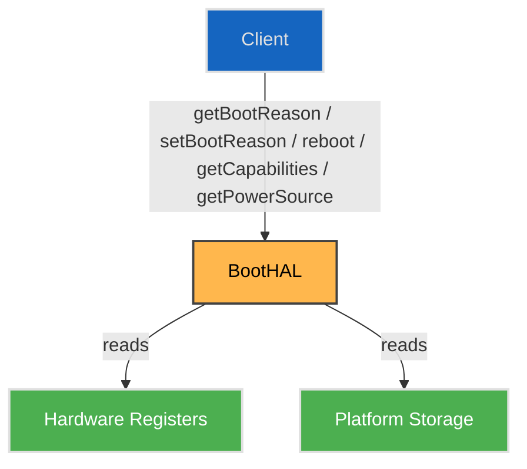

# Boot HAL

## Overview

The Boot HAL provides a platform-independent interface for managing device boot, reset, and power source state. It allows middleware and system services to query the reason for the last boot, trigger reboots with specific reset types, and determine the current power source. This abstraction enables consistent boot and reset handling across diverse hardware platforms, while remaining stateless between individual calls.

---

!!! info "References"
    |||
    |-|-|
    |**Interface Definition**|[boot/current](https://github.com/rdkcentral/rdk-halif-aidl/tree/main/boot/current)|
    |**HAL Interface Type**|[AIDL and Binder](../../../introduction/aidl_and_binder.md)|
    |**Initialization** | [systemd](../../../vsi/systemd/current/systemd.md) – **hal-boot.service** |

!!! tip "Related Pages"
    - [HAL Interface Overview](../../key_concepts/hal/hal_interfaces.md)
    - [Systemd Integration](../../../vsi/systemd/current/systemd.md)
    - [HAL Feature Profile](../../key_concepts/hal/hal_feature_profiles.md)

---

## Functional Overview

The Boot HAL is responsible for:

- Reporting the reason for the last device boot (e.g., watchdog, thermal reset, cold boot).
- Allowing the system to set a boot reason for the next reboot.
- Initiating reboots with specific reset types (e.g., full system reset, disaster recovery, software reboot).
- Reporting the current power source (e.g., PSU, USB, PoE).
- Advertising supported boot reasons and reset types via capabilities.

The interface is intentionally **stateless**: each call is independent, with no persistent session or handle lifecycle.

---

## Implementation Requirements

| #            | Requirement                                                                  | Comments                           |
|--------------|-------------------------------------------------------------------------------|------------------------------------|
| HAL.Boot.1   | The service shall expose a binder interface named `Boot`.                    | Defined via `serviceName` constant in `IBoot.aidl`. |
| HAL.Boot.2   | The service shall support the boot reasons listed in `supportedBootReasons`. | Validated via `getCapabilities()`. |
| HAL.Boot.3   | The service shall support the reset types listed in `supportedResetTypes`.   | Validated via `getCapabilities()`. |
| HAL.Boot.4   | The service shall report the current power source using `getPowerSource()`.  | Enum values from `PowerSource.aidl`. |
| HAL.Boot.5   | The service shall be stateless between calls.                                | No open/close lifecycle.           |

---

## Interface Definitions

| AIDL File           | Description                                      |
|---------------------|--------------------------------------------------|
| `IBoot.aidl`        | Main HAL interface for boot/reset control        |
| `Capabilities.aidl` | Parcelable describing supported features         |
| `BootReason.aidl`   | Enum of supported boot reasons                   |
| `ResetType.aidl`    | Enum of supported reset types                    |
| `PowerSource.aidl`  | Enum of supported power sources                  |

---

## Initialization

The Boot HAL service is registered at system boot via a systemd unit, typically named `hal-boot.service`.  

At startup:

1. The service process is launched by systemd.
2. The `IBoot` implementation registers itself with the AIDL Service Manager under the service name `Boot` (matching `serviceName`).
3. Implementation-specific initialization may occur, such as:
   - Reading hardware registers or firmware-provided values to determine the last boot reason.
   - Initializing access to SoC or platform-specific reset and power control mechanisms.

Once registered, the service is expected to remain available for the lifetime of the system.

---

## Product Customization

- Supported boot reasons and reset types are declared via the `Capabilities` parcelable:
  - `BootReason[] supportedBootReasons`
  - `ResetType[] supportedResetTypes`
- A platform may implement only a subset of the enum values depending on hardware and firmware support.
- Platform-specific policies are reflected in:
  - The `Capabilities` returned at runtime, and
  - The HAL Feature Profile (HFP) YAML for static configuration.

---

## System Context



* **Client**: RDK middleware or system service.
* **BootHAL**: AIDL `IBoot` implementation.
* **Hardware Registers / Platform Storage**: Sources of boot reason and power state (e.g., SoC registers, NVRAM, secure storage).

---

## Resource Management

- The Boot HAL is **stateless between calls**:
  - No `open()` or `close()` methods.
  - No resource handles or session IDs.
- All operations are executed directly against hardware or platform services.
- Error conditions are reported via AIDL exceptions or error status, not via handle invalidation.

---

## Operation and Data Flow

General call flow:

1. **Boot reason determination**</br>
  On boot, firmware or early platform code records the boot reason in hardware registers or storage.
2. **Capability discovery**</br>
  Clients call `getCapabilities()` to learn which:
    - `BootReason` values may be reported.
    - `ResetType` values are accepted by `reboot()`.
3. **Boot reason query**</br>
  Middleware calls `getBootReason()` to retrieve the last boot reason for:
    - Diagnostics and logging.
    - Telemetry and analytics.
4. **Setting a test boot reason**</br>
  For validation, tests can call `setBootReason(reason, reasonString)` before triggering a reboot, so that `getBootReason()` after restart reflects the test scenario.
5. **Triggering a reboot**</br>
  Middleware calls `reboot(resetTypes, reasonString)`:
    - `resetTypes` defines the reset behaviour (e.g., `FULL_SYSTEM_RESET` vs. `SOFTWARE_REBOOT`).
    - On success, the call does not return because the system is rebooting.
6. **Power source query**</br>
  `getPowerSource()` may be called at any time to query `PowerSource` (e.g., for power management policies).

---

## Platform Capabilities

The `Capabilities` parcelable exposes runtime configuration:

```aidl
parcelable Capabilities {
    BootReason[] supportedBootReasons;
    ResetType[]  supportedResetTypes;
}
```

Typical usage:

- `supportedBootReasons` lists all `BootReason` values that may be reported by `getBootReason()`.
- `supportedResetTypes` lists all `ResetType` values that are accepted by `reboot()`.

The HFP (HAL Feature Profile) should mirror these fields and may extend them with platform metadata (e.g. supported power sources, deployment mode).

### Example hfp-boot.yaml

```yaml
# Example HAL Feature Profile for Boot HAL
Boot:
  interfaceVersion: current   # Version of the IBoot interface

  # List of supported boot reasons (see BootReason.aidl)
  supportedBootReasons:
    - WATCHDOG              # Booted due to watchdog timer
    - MAINTENANCE_REBOOT    # Maintenance reboot
    - THERMAL_RESET         # Thermal reset (overheating)
    - WARM_RESET            # Warm reset (software reboot)
    - COLD_BOOT             # Cold boot (power cycle)
    - STR_AUTH_FAILURE      # Suspend to RAM authentication failure

  # List of supported reset types (see ResetType.aidl)
  supportedResetTypes:
    - FULL_SYSTEM_RESET                    # Delete all persistent data partitions and recreate them
    - INVALIDATE_CURRENT_APPLICATION_IMAGE # Invalidate current application image, select other bank if available
    - FORCE_DISASTER_RECOVERY              # Enter disaster recovery mode
    - MAINTENANCE_REBOOT                   # Maintenance reboot, caller should also set the reasonString
    - SOFTWARE_REBOOT                      # Software reboot; BootReason will be WARM_RESET unless overridden by setBootReason

  # List of supported power sources (aligned with PowerSource.aidl)
  supportedPowerSources:
    - UNKNOWN   # Power source cannot be determined
    - PSU       # External power supply unit
    - USB       # USB-driven power source
    - POE       # Power over Ethernet
```
