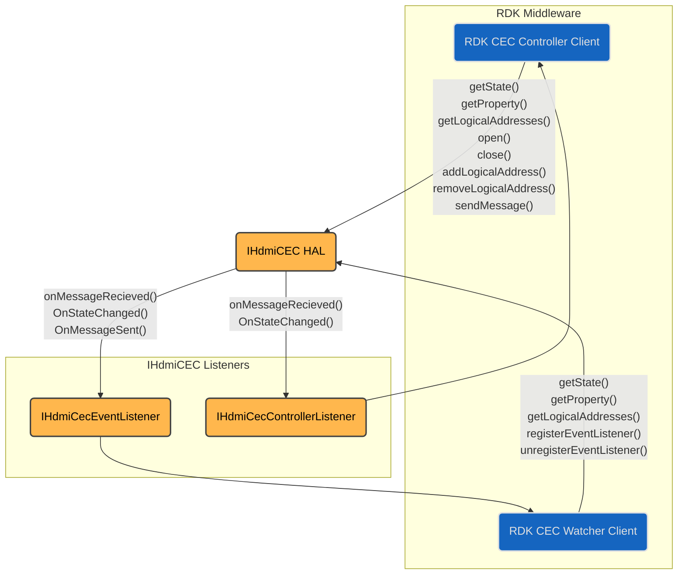
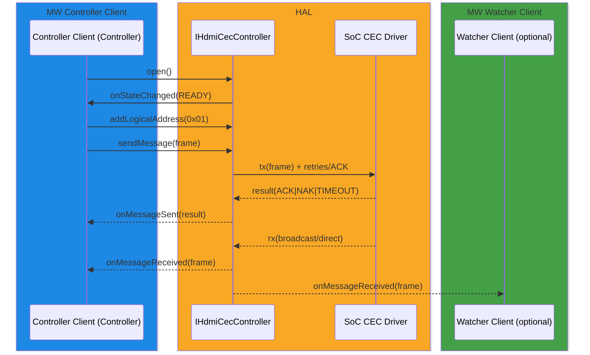

# HDMI CEC

## References

!!! info References
    |||
    |-|-|
    |**Interface Definition**|[cec/current](https://github.com/rdkcentral/rdk-halif-aidl/tree/main/cec/current)|
    |**API Documentation**| *TBD* |
    |**HAL Interface Type**|[AIDL and Binder](../../../introduction/aidl_and_binder.md)|
    |**Initialization - TBC** | [systemd](../../../vsi/systemd/current/systemd.md) - **hal-cec.service** |
    |**VTS Tests**| TBC |
    |**Reference Implementation - vComponent**|**TBD**|

## Related Pages

!!! tip "Related Pages"
    - TBC

## 🚧 Document Under Construction

This document serves as a **placeholder**.

The content is **not yet released** and is currently **under construction**.

<<<<<<< HEAD
Please check back later for updates.
=======
## Implementation Requirements

| **#**            | **Requirement**                                                                                                                                                                                                    | **Comments** |
|--------------|----------------------------------------------------------------------------------------------------------------------------------------------------------------------------------------------------------------|----------|
| **HAL.CEC.1**    | The CEC HAL and Device performs the CEC Low Level Protocol as defined by HDMI 1.4b [1].  Includes:  CEC 4 Electrical Specification,  CEC 5 Signalling and Bit Timings,  CEC 6 Frame Description,  CEC 7 Reliable Communication Mechanisms,  CEC 9 Arbitration. |          |
| **HAL.CEC.2**    | The CEC Controller Client performs the CEC High Level Protocol as defined by HDMI 1.4b [1].  Includes: CEC 3 High Level Protocol.                                                                            |          |
| **HAL.CEC.3**    | The CEC HAL and Device must transmit messages sent by the Controller Client.                                                                                                                                   |          |
| **HAL.CEC.4**    | The Controller Client must pass fully formed message frames to the CEC HAL. Each message must contain a header block and associated data blocks without start, EOM, and ACK bits.                              |          |
| **HAL.CEC.5**    | The CEC HAL and Device must report to the Controller Client the status of the ACK bit following message transmission.                                                                                          |          |
| **HAL.CEC.6**    | The CEC HAL and Device must acknowledge directed messages with destination Logical Address matching a Logical Address set by the Controller Client.                                                             |          |
| **HAL.CEC.7**    | The CEC HAL and Device must forward all acknowledged directly addressed messages to the Controller Client (and other Watcher Clients).                                                                         |          |
| **HAL.CEC.8**    | The CEC HAL and Device must forward all broadcast messages to the Controller Client (and other Watcher Clients).                                                                                              |          |
| **HAL.CEC.9**    | The Controller Client must perform the Logical Address allocation as defined by HDMI 1.4b Section 10.2 Logical Addressing.                                                                                     |          |
| **HAL.CEC.10**   | For a source HDMI device, it is the responsibility of the Controller Client to correctly handle the Device Hot Plug Detect signal generated by the HDMI device and the callbacks from the `IHdmiSource` interface. |          |
| **HAL.CEC.11**   | For a source HDMI device, on detecting the de-assertion of HPD the Controller Client must remove all logical addresses. This may be done by closing an opened `IHdmiCecController` interface, or explicitly removing all previously added logical addresses. |          |

## Interface Definitions

The latest interface can be found by following this [cec link](https://github.com/rdkcentral/rdk-halif-aidl/tree/main/cec)

| Interface                        | Description                                                                                                                            |
| --------------------------------- | -------------------------------------------------------------------------------------------------------------------------------------- |
| `IHdmiCec.aidl`                   | Root service interface, entry point for discovering and opening controllers.                                                           |
| `IHdmiCecController.aidl`         | Main control plane: `open/close`, `addLogicalAddress/removeLogicalAddress`, `sendMessage`, state queries, event listener registration. |
| `IHdmiCecControllerListener.aidl` | Callbacks for controller events: `onMessageReceived`, `onMessageSent`, `onStateChanged`.                                               |
| `IHdmiCecEventListener.aidl`      | Event notifications for watcher/diagnostic clients (read-only message and state observation).                                          |
| `Property.aidl`                   | Key/value pairs for querying device or HAL properties.                                                                                 |
| `SendMessageStatus.aidl`          | Enum defining possible results of a transmit attempt (e.g., SUCCESS, NACK, BUS_BUSY, TIMEOUT, ERROR).                                  |

---

## Initialization

The `hal-cec_manager.service` systemd unit file is provided by the vendor layer to start the CEC HAL service. It should include `Wants` or `Requires` directives to ensure that any platform driver services it depends on are started first.

The CEC HAL service depends on the Service Manager to register itself as a service.

Upon starting, the service shall register the `IHdmiCec` interface with the Service Manager using the string `IHdmiCec.serviceName` and immediately become operational.

---

## System Context

The HDMI-CEC HAL sits between RDK Middleware clients and the SoC CEC driver. Two categories of clients interact with it:

* CEC Controller Client – the mandatory client that controls the HAL session, installs logical addresses, sends CEC frames, and receives directed/broadcast traffic.
* CEC Watcher Client – an optional client used for monitoring and diagnostics. It does not send messages, but may observe received traffic and state changes.

The HAL itself exposes the IHdmiCec and IHdmiCecController interfaces, with listener callbacks delivered via IHdmiCecControllerListener and IHdmiCecEventListener.

Key points from the component diagram:

* The **Controller Client** owns the lifecycle: it calls `open()`, `addLogicalAddress()`, and `sendMessage()`.
* The **Watcher Client** registers an `IHdmiCecEventListener` for passive observation of messages and state.
* The HAL dispatches events back through listener interfaces:
* `IHdmiCecControllerListener` for session-driving feedback (`onMessageSent()`, `onMessageReceived()`, `onStateChanged()`).
* `HdmiCecEventListener` for diagnostics/monitoring (mirrors received messages and state).

### Runtime Interaction

### Flow summary

1. Middleware Controller Client opens the HAL and adds logical addresses after allocation.
2. When it transmits a frame, the HAL handles arbitration and retries at the bus level, returning a SendMessageStatus to the Controller.
3. Both directed and broadcast messages received from the SoC driver are forwarded upstream:
    * To the Controller Client (always).
    * To Watcher Clients (if registered).
4. State changes (e.g., READY, CLOSED, or error states) are reported via both listener types.

## Resource Management

* **Open/Close:** `open()` acquires the controller; `close()` removes addresses and releases hardware.
* **Logical Addressing:** Controller must call `addLogicalAddress()` after successful poll-based allocation. `removeLogicalAddress()` when device not ready (e.g., HPD down, deep sleep).
* **Concurrency:** Single controller client; HAL serialises Tx; one message in flight. Watchers are passive.
* **Crash/Exit:** HAL should auto-reclaim resources and clear any addresses if the client disconnects.

## Operation and Data Flow

* **Transmit:** Controller provides raw frame bytes (header + data). HAL performs bus access, arbitration, retry (per HDMI-CEC reliable comms) and returns final status (`ACK/NAK/TIMEOUT/BUS_BUSY`).
* **Receive:**

  * Broadcast frames always forwarded post `open()`.
  * Directed frames are ACKed and delivered only for active logical addresses.
* **Back-pressure:** Only one Tx at a time; additional sends return BUSY or are rejected until prior Tx completes. Rx is event-driven to listeners.

## Event Handling

* **`onMessageReceived(MessageFrame)`** — Delivered in receive order; includes source/destination LA, data, timestamp.
* **`onMessageSent(MessageTxResult)`** — Fires after Tx completes with `ACK/NAK/TIMEOUT/ERROR`.
* **`onStateChanged(State)`** — `CLOSED`→`READY`; `READY`→`CLOSED`; error transitions (driver reset).
* **Ordering:** Within a connection, events are ordered by occurrence; Tx result precedes subsequent Rx from that transmission window where applicable.

## State Machine / Lifecycle

States: `CLOSED` → `READY`

* `CLOSED`: Not opened; no Rx/Tx; does not ACK directed frames.
* `READY`: Opened; may ACK directed frames for installed addresses; Tx/Rx active.

Transitions:

* `open()` success: `CLOSED`→`READY` (emit `onStateChanged(READY)`).
* `close()` or fatal driver error: `READY`→`CLOSED` (emit `onStateChanged(CLOSED)`).
* `addLogicalAddress()`/`removeLogicalAddress()` do **not** change global state.

## Data Format / Protocol Support

| Format              | Use Case                             | Support  |
| ------------------- | ------------------------------------ | -------- |
| Raw CEC frame bytes | All CEC commands (per HDMI-CEC 1.4b) | Required |

!!! note
    **Command-level parsing/semantics live in MW; HAL treats frames as opaque.**
>>>>>>> b6e7ad0c (corrected #140 whitespace)
