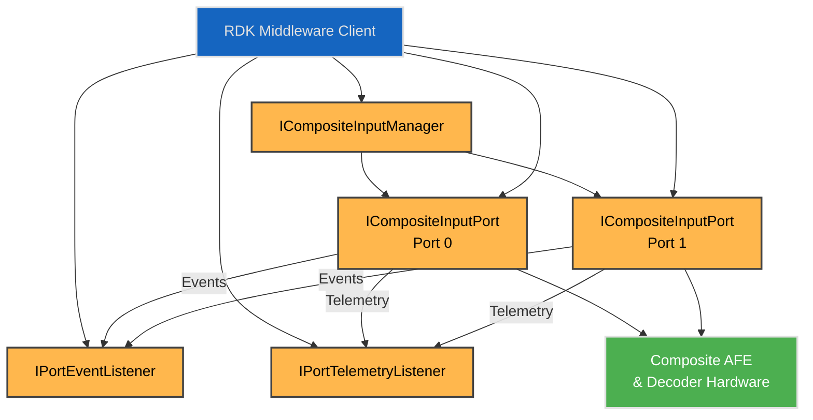
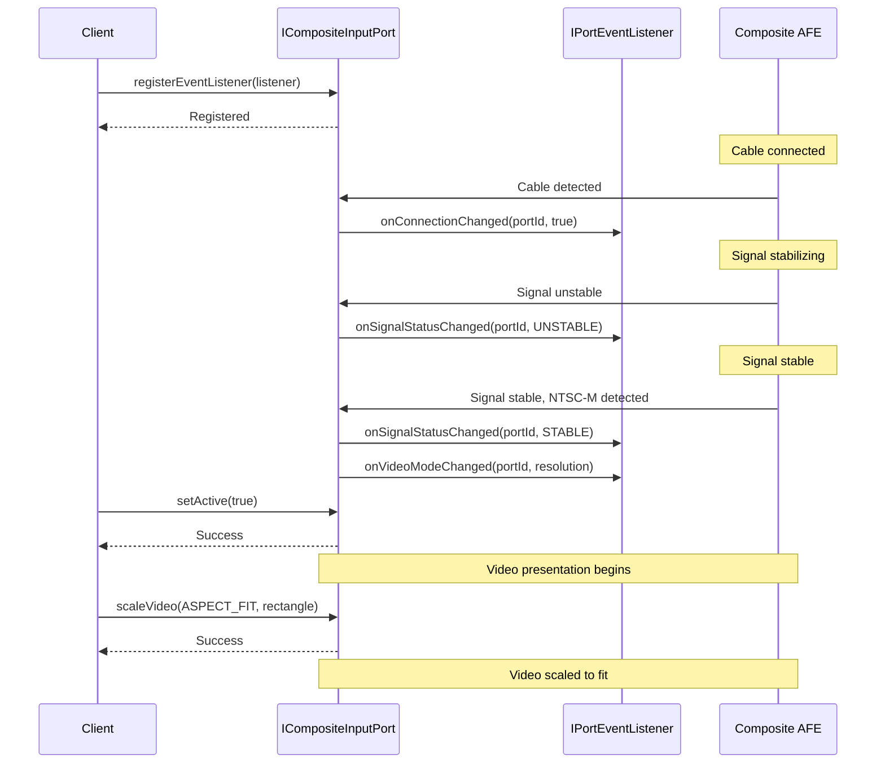
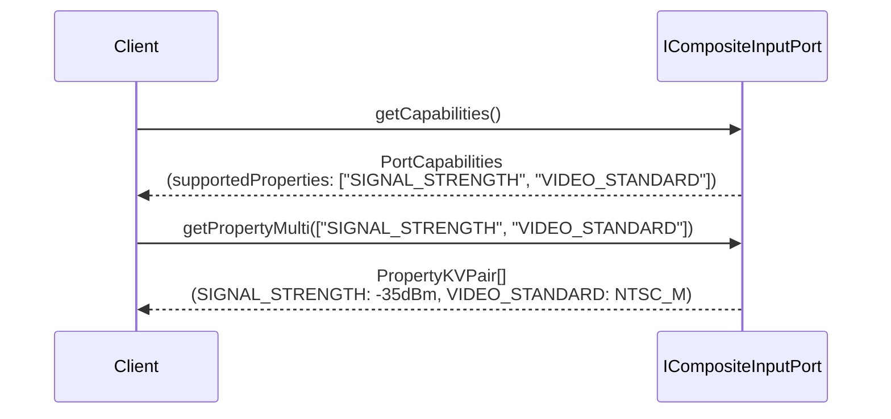
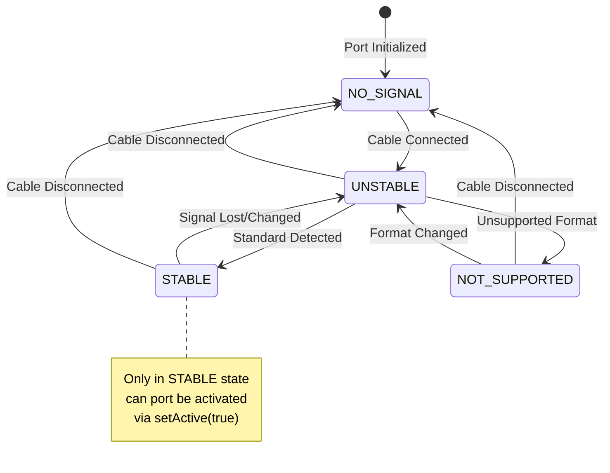

# Composite Input HAL Interface

## Overview

The `CompositeInput` HAL interface manages the configuration and control of analog composite video input ports on the platform. It provides abstraction over composite video signal detection, video standard decoding (NTSC, PAL, SECAM), and presentation control. This interface ensures consistent interaction with higher layers (such as the RDK media manager or video switch controller) while remaining agnostic to platform-specific analog frontend (AFE) and decoder implementations.

This HAL manages composite video input detection, signal status, and video mode configuration. Audio routing (if supported) is handled separately by the platform's audio subsystem.

---

!!! info "References"
    |||
    | ------------------------------------ | ------------------------------------------------------------- |
    | **Interface Definition**             | [compositeinput](https://github.com/rdkcentral/rdk-halif-aidl/tree/main/compositeinput/current/com/rdk/hal/compositeinput) |
    | **HAL Interface Type**               | [AIDL and Binder](../../../introduction/aidl_and_binder.md)   |
    | **Initialization Unit**              | [systemd service](../../../vsi/systemd/current/systemd.md) - **hal-composite_input_manager.service** |

---

!!! tip "Related Pages"
    * [HAL Feature Profile](../../key_concepts/hal/hal_feature_profiles.md)
    * [HAL Interface Overview](../../key_concepts/hal/hal_interfaces.md)
    * [HDMI Input](../../hdmi_input/current/hdmi_input.md)
    * [Video Sink](../../video_sink/current/video_sink.md)

---

## Functional Overview

The `CompositeInput` HAL provides control over:

* Composite video port enumeration and discovery
* Connection status detection (cable presence)
* Signal status monitoring (NO_SIGNAL, UNSTABLE, STABLE, NOT_SUPPORTED)
* Automatic video standard detection (NTSC-M, PAL-B/M/N, SECAM)
* Port activation and presentation control
* Video scaling and positioning (aspect ratio handling)
* Runtime property queries (signal strength, video standard, color space)
* Telemetry and metrics (signal lock time, drop counts, uptime)
* Event callbacks (connection changes, signal changes, video mode changes)

---

## Implementation Requirements

| #                           | Requirement                                                               | Comments                                          |
| --------------------------- | ------------------------------------------------------------------------- | ------------------------------------------------- |
| **HAL.CompositeInput.1**    | The service shall support enumeration of available composite input ports. | Use `ICompositeInputManager.getPortIds()`       |
| **HAL.CompositeInput.2**    | The service shall allow clients to query port-specific capabilities.      | See `ICompositeInputPort.getCapabilities()`        |
| **HAL.CompositeInput.3**    | The service shall emit events on cable connect/disconnect.                | Via `IPortEventListener.onConnectionChanged()`    |
| **HAL.CompositeInput.4**    | The service shall emit events on signal status changes.                   | Via `IPortEventListener.onSignalStatusChanged()`  |
| **HAL.CompositeInput.5**    | The implementation shall automatically detect video standards (NTSC, PAL, SECAM). | Signal must be STABLE before reliable detection |
| **HAL.CompositeInput.6**    | Only one port shall be active for video presentation at any time.         | Activating a port deactivates others             |
| **HAL.CompositeInput.7**    | Port activation shall fail if signal status is not STABLE.                | Prevents presenting unstable or unsupported signals |
| **HAL.CompositeInput.8**    | Video scaling shall only apply to active ports.                           | setActive(true) required before scaleVideo()      |
| **HAL.CompositeInput.9**    | Property keys shall be defined in the HFP YAML and discoverable via capabilities. | Enables vendor-specific properties without API changes |
| **HAL.CompositeInput.10**   | Telemetry listeners shall only be supported on ports with metricsSupported capability. | See `PortCapabilities.metricsSupported`          |

---

## Interface Definitions

| AIDL File                              | Description                                                          |
| -------------------------------------- | -------------------------------------------------------------------- |
| `ICompositeInputManager.aidl`          | Manager interface for port discovery and access                      |
| `ICompositeInputPort.aidl`             | Per-port interface for control and configuration                     |
| `IPortEventListener.aidl`              | Event listener for connection, signal, and video mode changes        |
| `IPortTelemetryListener.aidl`          | Telemetry listener for signal quality and metrics updates            |
| `PlatformCapabilities.aidl`            | Platform-wide capabilities and feature flags                         |
| `PortCapabilities.aidl`                | Port-specific capabilities (may vary per port)                       |
| `PortStatus.aidl`                      | Current port status (connection, signal, video mode)                 |
| `Port.aidl`                            | Port metadata (ID, name, description)                                |
| `SignalStatus.aidl`                    | Enum for signal status (NO_SIGNAL, UNSTABLE, STABLE, NOT_SUPPORTED)  |
| `VideoStandard.aidl`                   | Enum for video standards (NTSC_M, PAL_B, PAL_M, PAL_N, SECAM)        |
| `VideoResolution.aidl`                 | Video resolution and format information                              |
| `VideoScaling.aidl`                    | Scaling mode and rectangle parameters                                |
| `ScalingMode.aidl`                     | Enum for scaling modes (NONE, ASPECT_FIT, ASPECT_FILL, CUSTOM)       |
| `ColorSpace.aidl`                      | Color space enumeration                                              |
| `PortMetrics.aidl`                     | Telemetry metrics (lock time, drops, uptime)                         |
| `PropertyKVPair.aidl`                  | Key-value pair for batch property operations                         |
| `PropertyMetadata.aidl`                | Property type metadata for runtime discovery                         |

---

## Initialization

The HAL service should be initialized via a systemd unit and must register with the Service Manager under the name defined in `ICompositeInputManager.serviceName` ("composite_input_manager"). It must be ready before middleware components attempt to query or bind.

The systemd unit file (`hal-composite_input_manager.service`) should include [Wants](https://www.freedesktop.org/software/systemd/man/latest/systemd.unit.html#Wants=) or [Requires](https://www.freedesktop.org/software/systemd/man/latest/systemd.unit.html#Requires=) directives to start any platform driver services it depends upon.

---

## Product Customization

* Each composite input port is exposed as a resource instance via `ICompositeInputManager.getPort()`
* Port capabilities are queried via `ICompositeInputPort.getCapabilities()` and may vary per port (e.g., audio support, metrics support)
* Supported video standards per port are indicated in `PortCapabilities.supportedVideoStandards`
* Property keys are defined in the HFP YAML (`hfp-compositeinput.yaml`) and discoverable via `PortCapabilities.supportedProperties`
* Platforms can define custom property keys beyond the HFP standard keys

---

## System Context



---

## Resource Management

* Composite input ports are identified by logical IDs (typically 0 to maxPorts-1)
* Each port can be independently queried and controlled
* Port metadata (ID, name, description) is available via `ICompositeInputPort.getId()` and capabilities
* Event listeners can be registered/unregistered dynamically per port
* Telemetry listeners require `PortCapabilities.metricsSupported == true`

---

## Operation and Data Flow

### Discovery and Initialization

1. Client queries `ICompositeInputManager.getPlatformCapabilities()` for platform-wide information
2. Client retrieves port IDs via `ICompositeInputManager.getPortIds()`
3. Client obtains port interfaces via `ICompositeInputManager.getPort(portId)`
4. Client queries per-port capabilities via `ICompositeInputPort.getCapabilities()`

### Port Activation Sequence



### Property Query



---

## Modes of Operation

### Signal Status States

1. **NO_SIGNAL**: No video signal detected (cable disconnected or source off)
2. **UNSTABLE**: Signal detected but not yet stable (sync issues, unsupported format during detection)
3. **STABLE**: Signal stable and video standard identified (ready for activation)
4. **NOT_SUPPORTED**: Signal detected but video standard not supported by port

### Port States

1. **Inactive**: Port not selected for presentation (default state)
2. **Active**: Port presenting video to display (only one port active at a time)

### Video Scaling Modes

- **NONE**: No scaling, video at native resolution
- **ASPECT_FIT**: Scale to fit display while preserving aspect ratio (letterbox/pillarbox)
- **ASPECT_FILL**: Scale to fill display while preserving aspect ratio (crop edges)
- **CUSTOM**: Custom scaling rectangle specified by client

---

## Event Handling

| Event       | Callback                         | Description                                          | Trigger Condition |
| ----------- | -------------------------------- | ---------------------------------------------------- | ----------------- |
| Connection  | `onConnectionChanged()`          | Cable connected or disconnected                      | Hardware cable detection |
| Signal Status | `onSignalStatusChanged()`      | Signal status changed (NO_SIGNAL→UNSTABLE→STABLE)    | Signal lock/loss, standard detection |
| Video Mode  | `onVideoModeChanged()`           | Video resolution or standard changed                 | Source switches format, standard detected |
| Signal Quality | `onSignalQualityChanged()`    | Signal quality percentage changed significantly      | Quality degrades/improves (±5-10%) |
| Metrics     | `onMetricsUpdated()`             | Telemetry metrics snapshot                           | Periodic (1-10s) or significant changes |

---

## Video Standard Detection

The HAL shall automatically detect the video standard of the composite input signal when the signal stabilizes. Supported standards include:

| Video Standard | Lines | Field Rate | Regions |
| -------------- | ----- | ---------- | ------- |
| NTSC-M         | 525   | 60Hz       | North America, Japan, South Korea |
| PAL-B          | 625   | 50Hz       | Europe, Australia, most of Asia |
| PAL-M          | 525   | 60Hz       | Brazil |
| PAL-N          | 625   | 50Hz       | Argentina, Paraguay, Uruguay |
| SECAM          | 625   | 50Hz       | France, Eastern Europe, Russia |

Detection sequence:
1. Cable connection detected → `onConnectionChanged(true)`
2. Signal detection begins → `onSignalStatusChanged(UNSTABLE)`
3. Video standard identified → `onSignalStatusChanged(STABLE)` + `onVideoModeChanged(resolution)`
4. Port ready for activation via `setActive(true)`

---

## Data Format / Protocol Support

| Format | Use Case                   | Support Level |
| ------ | -------------------------- | ------------- |
| NTSC-M | North America, Japan       | Mandatory     |
| PAL-B  | Europe, Australia          | Mandatory     |
| PAL-M  | Brazil                     | Optional      |
| PAL-N  | Argentina, South America   | Optional      |
| SECAM  | France, Eastern Europe     | Optional      |

---

## Platform Capabilities

The HAL Feature Profile (HFP) YAML defines platform-specific capabilities and property keys. Example configuration:

```yaml
compositeinput:
  interfaceVersion: current

  ports:
    - id: 0
      name: "Front Panel Composite"
      description: "Front panel composite video input"

      # Supported signal statuses for this port
      supportedSignalStatuses:
        - NO_SIGNAL
        - UNSTABLE
        - NOT_SUPPORTED
        - STABLE

      # Supported video standards for this port
      supportedVideoStandards:
        - NTSC_M       # 525 lines, 60Hz (North America)
        - PAL_B        # 625 lines, 50Hz (Europe)
        - PAL_M        # 525 lines, 60Hz (Brazil)
        - SECAM        # 625 lines, 50Hz (France, Eastern Europe)

      # Supported scaling modes for this port
      supportedScalingModes:
        - NONE
        - ASPECT_FIT
        - ASPECT_FILL
        - CUSTOM

      # Port capabilities
      audioSupported: false
      metricsSupported: true

      # HFP-defined standard property keys (discoverable via getCapabilities())
      supportedProperties:
        - "SIGNAL_STRENGTH"        # Signal strength in dBm (PropertyValue.longValue, read-only)
        - "VIDEO_STANDARD"         # Detected video standard (PropertyValue.intValue as VideoStandard enum, read-only)
        - "COLOR_SYSTEM"           # Detected color system (PropertyValue.intValue as ColorSpace enum, read-only)
        - "AUDIO_PRESENT"          # Audio signal present (PropertyValue.booleanValue, read-only)

      # Property metadata for enhanced discovery
      propertyMetadata:
        - key: "SIGNAL_STRENGTH"
          type: LONG
          readOnly: true
          isMetric: false
          description: "Signal strength in dBm"

        - key: "VIDEO_STANDARD"
          type: INTEGER
          readOnly: true
          isMetric: false
          description: "Detected video standard (VideoStandard enum)"
```

### Discovery-First Pattern

Clients should use a discovery-first approach:

```java
// 1. Discover what this platform supports
PlatformCapabilities platformCaps = manager.getPlatformCapabilities();
ICompositeInputPort port = manager.getPort(0);
PortCapabilities portCaps = port.getCapabilities();

// 2. Check what properties are available
String[] supportedProps = portCaps.supportedProperties;

// 3. Query properties of interest
List<String> propsToQuery = new ArrayList<>();
if (Arrays.asList(supportedProps).contains("SIGNAL_STRENGTH")) {
    propsToQuery.add("SIGNAL_STRENGTH");
}
if (Arrays.asList(supportedProps).contains("VIDEO_STANDARD")) {
    propsToQuery.add("VIDEO_STANDARD");
}

// 4. Batch query for efficiency
PropertyKVPair[] results = port.getPropertyMulti(propsToQuery.toArray(new String[0]));

// 5. Use the values
for (PropertyKVPair pair : results) {
    if (pair.key.equals("SIGNAL_STRENGTH")) {
        long strength = pair.value.longValue;
    } else if (pair.key.equals("VIDEO_STANDARD")) {
        int standard = pair.value.intValue; // VideoStandard enum
    }
}
```

---

## Telemetry and Metrics

Ports with `PortCapabilities.metricsSupported == true` provide telemetry data:

| Metric | Type | Description |
| ------ | ---- | ----------- |
| Average Signal Lock Time | long (ms) | Average time to lock signal after connection |
| Signal Drops | long (count) | Total signal drops since last reset |
| Uptime | long (ms) | Total time port has been active |
| Last Reset Timestamp | long (ms) | Timestamp of last metrics reset |

Clients can:
- Query current metrics via `getMetrics()`
- Reset metrics via `resetMetrics()`
- Register for periodic updates via `registerTelemetryListener()`

---

## Error Handling

### Common Exception Scenarios

| Exception | Method | Condition |
| --------- | ------ | --------- |
| `EX_ILLEGAL_STATE` | `setActive()` | Port has no stable signal |
| `EX_ILLEGAL_STATE` | `scaleVideo()` | Port is not active |
| `EX_ILLEGAL_ARGUMENT` | `getPort()` | Port ID out of range |
| `EX_ILLEGAL_ARGUMENT` | `getProperty()` | Property key is null or empty |
| `EX_UNSUPPORTED_OPERATION` | `scaleVideo()` | Scaling mode not in supportedScalingModes |
| `EX_UNSUPPORTED_OPERATION` | `setProperty()` | Property is read-only or not supported |
| `EX_UNSUPPORTED_OPERATION` | `getMetrics()` | Port does not support metrics |
| `EX_UNSUPPORTED_OPERATION` | `registerTelemetryListener()` | Port does not support metrics |

---

## Implementation Notes

### Composite Video Legacy Support

Composite video is a legacy analog format primarily used for:
- Retro gaming consoles
- DVD players and VCRs
- Legacy camcorders and cameras
- Backward compatibility with older equipment

Modern platforms typically provide 1-2 composite input ports for legacy device support, with most inputs using HDMI.

---

## State Machine / Lifecycle



---

## Additional Considerations

### Aspect Ratio Handling

Composite video sources typically output:
- **NTSC**: 4:3 aspect ratio (640x480 equivalent)
- **PAL**: 4:3 aspect ratio (768x576 equivalent)
- **Widescreen**: 16:9 anamorphic (requires proper flag detection)

Clients should use `scaleVideo()` with appropriate `ScalingMode`:
- **ASPECT_FIT**: Preserve aspect ratio, add letterbox/pillarbox
- **ASPECT_FILL**: Preserve aspect ratio, crop to fill
- **CUSTOM**: Manual rectangle specification

### Interlaced Video Handling

All composite video standards are interlaced:
- **NTSC**: 525i59.94 (480 active lines, ~59.94Hz field rate)
- **PAL/SECAM**: 625i50 (576 active lines, 50Hz field rate)

The HAL implementation should perform deinterlacing in the vendor layer before presentation. The `VideoResolution` parcelable indicates whether the source is interlaced.
