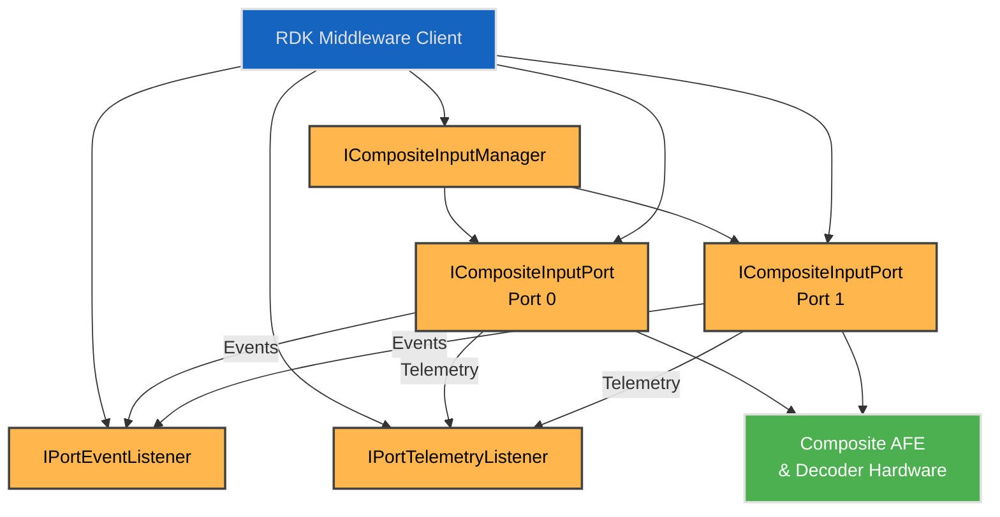
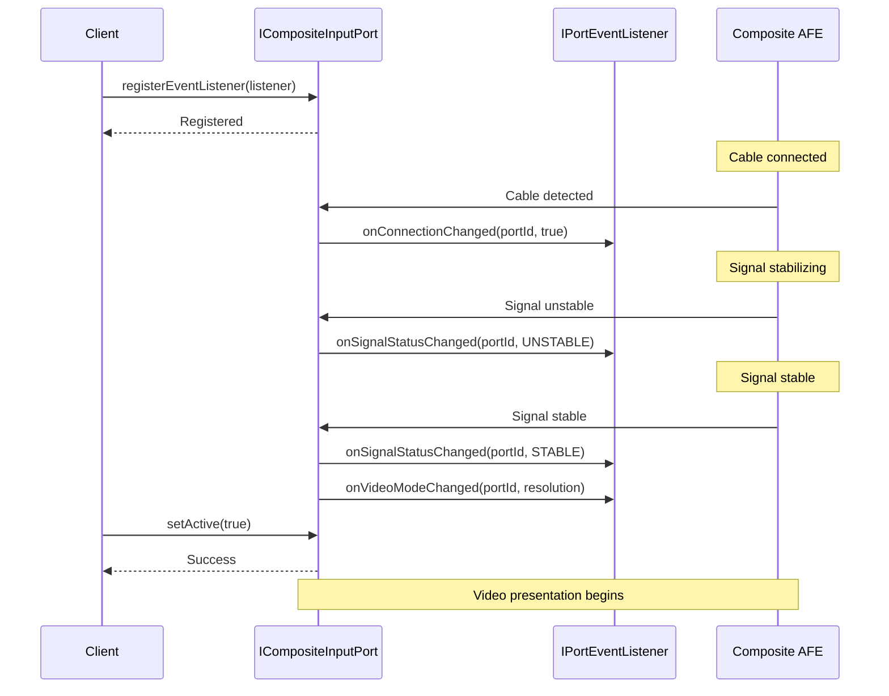
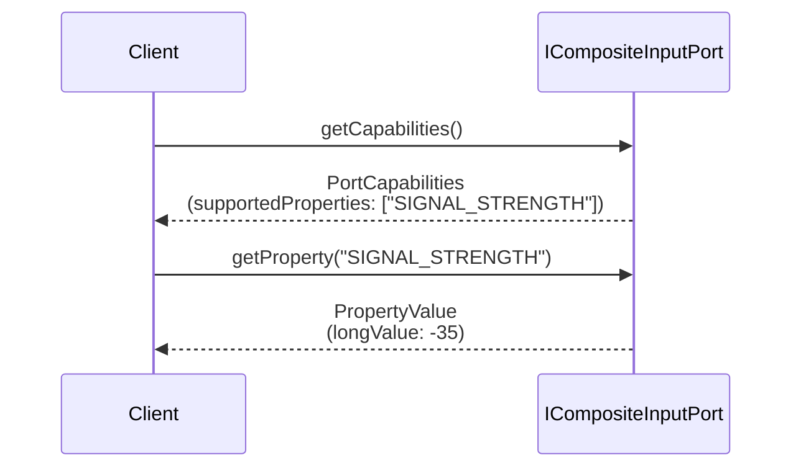
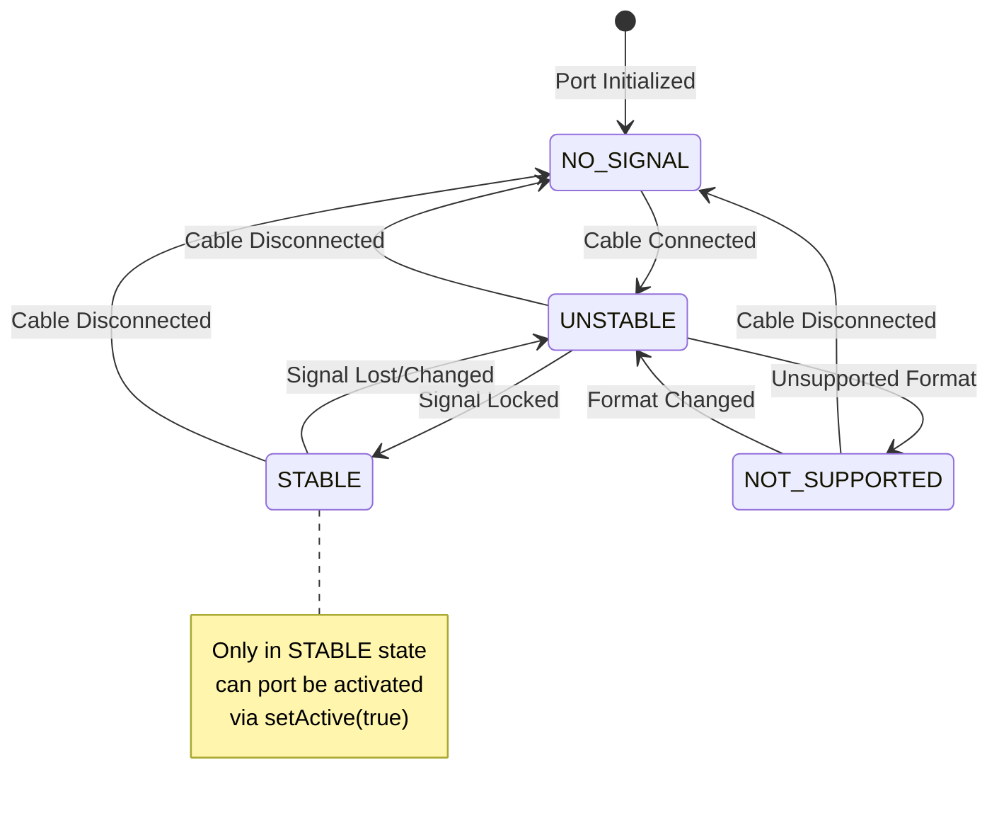

# Composite Input HAL Interface

## Overview

The `CompositeInput` HAL interface manages the configuration and control of analog composite video input ports on the platform. It provides abstraction over composite video signal detection and presentation control. This interface ensures consistent interaction with higher layers (such as the RDK media manager or video switch controller) while remaining agnostic to platform-specific analog frontend (AFE) and decoder implementations.

This HAL manages composite video input detection, signal status, and video mode configuration. Audio routing (if supported) is handled separately by the platform's audio subsystem.

---

!!! info "References"
    |||
    | ------------------------------------ | ------------------------------------------------------------- |
    | **Interface Definition**             | [compositeinput](https://github.com/rdkcentral/rdk-halif-aidl/tree/main/compositeinput/current/com/rdk/hal/compositeinput) |
    | **HAL Interface Type**               | [AIDL and Binder](../../../introduction/aidl_and_binder.md)   |
    | **Initialization Unit**              | [systemd service](../../../vsi/systemd/current/systemd.md) - **hal-composite_input_manager.service** |

---

!!! tip "Related Pages"
    * [HAL Feature Profile](../../key_concepts/hal/hal_feature_profiles.md)
    * [HAL Interface Overview](../../key_concepts/hal/hal_interfaces.md)
    * [HDMI Input](../../hdmi_input/current/hdmi_input.md)
    * [Video Sink](../../video_sink/current/video_sink.md)

---

## Functional Overview

The `CompositeInput` HAL provides control over:

* Composite video port enumeration and discovery
* Connection status detection (cable presence)
* Signal status monitoring (NO_SIGNAL, UNSTABLE, STABLE, NOT_SUPPORTED)
* Port activation and presentation control
* Runtime property queries (signal strength)
* Telemetry and metrics (signal lock time, drop counts, uptime)
* Event callbacks (connection changes, signal changes, video mode changes)

---

## Implementation Requirements

| #                           | Requirement                                                               | Comments                                          |
| --------------------------- | ------------------------------------------------------------------------- | ------------------------------------------------- |
| **HAL.CompositeInput.1**    | The service shall support enumeration of available composite input ports. | Use `ICompositeInputManager.getPortIds()`       |
| **HAL.CompositeInput.2**    | The service shall allow clients to query port-specific capabilities.      | See `ICompositeInputPort.getCapabilities()`        |
| **HAL.CompositeInput.3**    | The service shall emit events on cable connect/disconnect.                | Via `IPortEventListener.onConnectionChanged()`    |
| **HAL.CompositeInput.4**    | The service shall emit events on signal status changes.                   | Via `IPortEventListener.onSignalStatusChanged()`  |
| **HAL.CompositeInput.5**    | Only one port shall be active for video presentation at any time.         | Activating a port deactivates others             |
| **HAL.CompositeInput.6**    | Port activation shall fail if signal status is not STABLE.                | Prevents presenting unstable or unsupported signals |
| **HAL.CompositeInput.7**    | Property keys shall be defined in the HFP YAML and discoverable via capabilities. | Enables vendor-specific properties without API changes |
| **HAL.CompositeInput.8**    | Telemetry listeners shall only be supported on ports with metricsSupported capability. | See `PortCapabilities.metricsSupported`          |

---

## Interface Definitions

| AIDL File                              | Description                                                          |
| -------------------------------------- | -------------------------------------------------------------------- |
| `ICompositeInputManager.aidl`          | Manager interface for port discovery and access                      |
| `ICompositeInputPort.aidl`             | Per-port interface for control, configuration, and port metadata     |
| `IPortEventListener.aidl`              | Event listener for connection, signal, and video mode changes        |
| `IPortTelemetryListener.aidl`          | Telemetry listener for signal quality and metrics updates            |
| `PlatformCapabilities.aidl`            | Platform-wide capabilities and feature flags                         |
| `PortCapabilities.aidl`                | Port-specific capabilities (may vary per port)                       |
| `PortStatus.aidl`                      | Current port status (connection, signal, video mode)                 |
| `Port.aidl`                            | Port metadata (name, description)                                    |
| `SignalStatus.aidl`                    | Enum for signal status (NO_SIGNAL, UNSTABLE, STABLE, NOT_SUPPORTED)  |
| `VideoResolution.aidl`                 | Video resolution and format information                              |
| `PortMetrics.aidl`                     | Telemetry metrics (lock time, drops, uptime)                         |
| `PropertyKVPair.aidl`                  | Key-value pair for batch property operations                         |
| `PropertyMetadata.aidl`                | Property type metadata for runtime discovery                         |

---

## Initialization

The HAL service should be initialized via a systemd unit and must register with the Service Manager under the name defined in `ICompositeInputManager.serviceName` ("composite_input_manager"). It must be ready before middleware components attempt to query or bind.

The systemd unit file (`hal-composite_input_manager.service`) should include [Wants](https://www.freedesktop.org/software/systemd/man/latest/systemd.unit.html#Wants=) or [Requires](https://www.freedesktop.org/software/systemd/man/latest/systemd.unit.html#Requires=) directives to start any platform driver services it depends upon.

---

## Product Customization

* Each composite input port is exposed as a resource instance via `ICompositeInputManager.getPort()`
* Port capabilities are queried via `ICompositeInputPort.getCapabilities()` and may vary per port (e.g., metrics support)
* Property keys are defined in the HFP YAML (`hfp-compositeinput.yaml`) and discoverable via `PortCapabilities.supportedProperties`
* Platforms can define custom property keys beyond the HFP standard keys

---

## System Context


```mermaid
flowchart TD
    Client[RDK Middleware Client]
    Manager[ICompositeInputManager]
    Port0[ICompositeInputPort<br/>Port 0]
    Port1[ICompositeInputPort<br/>Port 1]
    EventListener[IPortEventListener]
    TelemetryListener[IPortTelemetryListener]
    Hardware[Composite AFE<br/>& Decoder Hardware]

    Client --> Manager
    Manager --> Port0
    Manager --> Port1
    Client --> Port0
    Client --> Port1
    Client --> EventListener
    Client --> TelemetryListener
    Port0 -->|Events| EventListener
    Port1 -->|Events| EventListener
    Port0 -->|Telemetry| TelemetryListener
    Port1 -->|Telemetry| TelemetryListener
    Port0 --> Hardware
    Port1 --> Hardware

    classDef blue fill:#1565C0,stroke:#E0E0E0,stroke-width:2px,color:#E0E0E0;
    classDef wheat fill:#FFB74D,stroke:#424242,stroke-width:2px,color:#000000;
    classDef green fill:#4CAF50,stroke:#E0E0E0,stroke-width:2px,color:#FFFFFF;

    class Client blue;
    class Manager,Port0,Port1,EventListener,TelemetryListener wheat;
    class Hardware green;
```

---

## Resource Management

* Composite input ports are identified by logical IDs (typically 0 to maxPorts-1)
* Each port can be independently queried and controlled
* Port metadata (name, description) is available via `ICompositeInputPort.getPortInfo()`
* Event listeners can be registered/unregistered dynamically per port
* Telemetry listeners require `PortCapabilities.metricsSupported == true`

---

## Operation and Data Flow

### Discovery and Initialization

1. Client queries `ICompositeInputManager.getPlatformCapabilities()` for platform-wide information
2. Client retrieves port IDs via `ICompositeInputManager.getPortIds()`
3. Client obtains port interfaces via `ICompositeInputManager.getPort(portId)`
4. Client queries per-port capabilities via `ICompositeInputPort.getCapabilities()`

### Port Activation Sequence


```mermaid
sequenceDiagram
    participant Client
    participant Port as ICompositeInputPort
    participant Listener as IPortEventListener
    participant Hardware as Composite AFE

    Client->>Port: registerEventListener(listener)
    Port-->>Client: Registered

    Note over Hardware: Cable connected
    Hardware->>Port: Cable detected
    Port->>Listener: onConnectionChanged(portId, true)

    Note over Hardware: Signal stabilizing
    Hardware->>Port: Signal unstable
    Port->>Listener: onSignalStatusChanged(portId, UNSTABLE)

    Note over Hardware: Signal stable
    Hardware->>Port: Signal stable
    Port->>Listener: onSignalStatusChanged(portId, STABLE)
    Port->>Listener: onVideoModeChanged(portId, resolution)

    Client->>Port: setActive(true)
    Port-->>Client: Success
    Note over Port,Hardware: Video presentation begins
```

### Property Query


```mermaid
sequenceDiagram
    participant Client
    participant Port as ICompositeInputPort

    Client->>Port: getCapabilities()
    Port-->>Client: PortCapabilities<br/>(supportedProperties: ["SIGNAL_STRENGTH"])

    Client->>Port: getProperty("SIGNAL_STRENGTH")
    Port-->>Client: PropertyValue<br/>(longValue: -35)
```

---

## Modes of Operation

### Signal Status States

1. **NO_SIGNAL**: No video signal detected (cable disconnected or source off)
2. **UNSTABLE**: Signal detected but not yet stable (sync issues, unsupported format during detection)
3. **STABLE**: Signal stable and locked (ready for activation)
4. **NOT_SUPPORTED**: Signal detected but format not supported by port

### Port States

1. **Inactive**: Port not selected for presentation (default state)
2. **Active**: Port presenting video to display (only one port active at a time)

---

## Event Handling

| Event       | Callback                         | Description                                          | Trigger Condition |
| ----------- | -------------------------------- | ---------------------------------------------------- | ----------------- |
| Connection  | `onConnectionChanged()`          | Cable connected or disconnected                      | Hardware cable detection |
| Signal Status | `onSignalStatusChanged()`      | Signal status changed (NO_SIGNAL→UNSTABLE→STABLE)    | Signal lock/loss |
| Video Mode  | `onVideoModeChanged()`           | Video resolution changed                             | Source switches format |
| Signal Quality | `onSignalQualityChanged()`    | Signal quality percentage changed significantly      | Quality degrades/improves (±5-10%) |
| Metrics     | `onMetricsUpdated()`             | Telemetry metrics snapshot                           | Periodic (1-10s) or significant changes |

---

## Signal Detection

The HAL implementation internally detects the video standard (NTSC, PAL, SECAM) and provides the digitized video resolution via the `VideoResolution` parcelable. Video standard detection is handled internally by the platform's analog frontend and is not exposed as an API-level concept.

Detection sequence:
1. Cable connection detected → `onConnectionChanged(true)`
2. Signal detection begins → `onSignalStatusChanged(UNSTABLE)`
3. Signal locked → `onSignalStatusChanged(STABLE)` + `onVideoModeChanged(resolution)`
4. Port ready for activation via `setActive(true)`

---

## Platform Capabilities

The HAL Feature Profile (HFP) YAML defines platform-specific capabilities and property keys. Example configuration:

```yaml
compositeinput:
  interfaceVersion: current

  ports:
    - id: 0
      name: "Front Panel Composite"
      description: "Front panel composite video input"

      # Supported signal statuses for this port
      supportedSignalStatuses:
        - NO_SIGNAL
        - UNSTABLE
        - NOT_SUPPORTED
        - STABLE

      # Port capabilities (matches PortCapabilities.aidl)
      metricsSupported: true

      # HFP-defined standard property keys (discoverable via getCapabilities())
      supportedProperties:
        - "SIGNAL_STRENGTH"        # Signal strength in dBm (PropertyValue.longValue, read-only)

      # Metrics properties (METRIC_ prefix for categorization)
      supportedMetrics:
        - "METRIC_SIGNAL_LOCK_TIME"   # Average signal lock time in ms (PropertyValue.longValue, read-only)
        - "METRIC_SIGNAL_DROPS"       # Total count of signal drops (PropertyValue.longValue, read-only)
        - "METRIC_UPTIME"             # Total uptime in ms (PropertyValue.longValue, read-only)

      # Property metadata for enhanced discovery (optional but recommended)
      propertyMetadata:
        - key: "SIGNAL_STRENGTH"
          type: LONG
          readOnly: true
          isMetric: false
          description: "Signal strength in dBm"

        - key: "METRIC_SIGNAL_LOCK_TIME"
          type: LONG
          readOnly: true
          isMetric: true
          description: "Average signal lock time in milliseconds"

        - key: "METRIC_SIGNAL_DROPS"
          type: LONG
          readOnly: true
          isMetric: true
          description: "Total count of signal drops since last reset"

        - key: "METRIC_UPTIME"
          type: LONG
          readOnly: true
          isMetric: true
          description: "Total uptime in milliseconds"
```

### Discovery-First Pattern

Clients should use a discovery-first approach:

```java
// 1. Discover what this platform supports
PlatformCapabilities platformCaps = manager.getPlatformCapabilities();
ICompositeInputPort port = manager.getPort(0);
PortCapabilities portCaps = port.getCapabilities();

// 2. Check what properties are available
String[] supportedProps = portCaps.supportedProperties;

// 3. Query individual property (returns null if unsupported)
if (Arrays.asList(supportedProps).contains("SIGNAL_STRENGTH")) {
    PropertyValue value = port.getProperty("SIGNAL_STRENGTH");
    if (value != null) {
        long strength = value.longValue;
    }
}

// 4. Or batch query for efficiency using getPropertyMulti()
//    Note: PropertyKVPair.value uses a PropertyValue union - use the
//    appropriate field based on the property's PropertyMetadata.type:
//      BOOLEAN  -> value.booleanValue
//      INTEGER  -> value.intValue
//      LONG     -> value.longValue
//      FLOAT    -> value.floatValue
//      DOUBLE   -> value.doubleValue
//      STRING   -> value.stringValue
PropertyKVPair[] results = port.getPropertyMulti(
    new String[] { "SIGNAL_STRENGTH" });
for (PropertyKVPair pair : results) {
    if (pair.key.equals("SIGNAL_STRENGTH")) {
        long strength = pair.value.longValue;
    }
}
```

---

## Telemetry and Metrics

Ports with `PortCapabilities.metricsSupported == true` provide telemetry data:

| Metric | Type | Description |
| ------ | ---- | ----------- |
| Average Signal Lock Time | long (ms) | Average time to lock signal after connection |
| Signal Drops | long (count) | Total signal drops since last reset |
| Uptime | long (ms) | Total time port has been active |
| Last Reset Timestamp | long (ms) | Timestamp of last metrics reset |

Clients can:

* Query current metrics via `getMetrics()`
* Reset metrics via `resetMetrics()`
* Register for periodic updates via `registerTelemetryListener()`

---

## Error Handling

### Common Exception Scenarios

| Exception | Method | Condition |
| --------- | ------ | --------- |
| `EX_ILLEGAL_STATE` | `setActive()` | Port has no stable signal |
| `EX_ILLEGAL_ARGUMENT` | `getPort()` | Port ID out of range |
| `EX_ILLEGAL_ARGUMENT` | `getProperty()` | Property key is null or empty |
| `EX_UNSUPPORTED_OPERATION` | `setProperty()` | Property is read-only or not supported |
| `EX_UNSUPPORTED_OPERATION` | `getMetrics()` | Port does not support metrics |
| `EX_UNSUPPORTED_OPERATION` | `registerTelemetryListener()` | Port does not support metrics |

---

## Implementation Notes

### Composite Video Legacy Support

Composite video is a legacy analog format primarily used for:

* Retro gaming consoles
* DVD players and VCRs
* Legacy camcorders and cameras
* Backward compatibility with older equipment

Modern platforms typically provide 1-2 composite input ports for legacy device support, with most inputs using HDMI.

---

## State Machine / Lifecycle


```mermaid
stateDiagram-v2
    [*] --> NO_SIGNAL: Port Initialized
    NO_SIGNAL --> UNSTABLE: Cable Connected
    UNSTABLE --> STABLE: Signal Locked
    UNSTABLE --> NOT_SUPPORTED: Unsupported Format
    UNSTABLE --> NO_SIGNAL: Cable Disconnected
    STABLE --> UNSTABLE: Signal Lost/Changed
    STABLE --> NO_SIGNAL: Cable Disconnected
    NOT_SUPPORTED --> NO_SIGNAL: Cable Disconnected
    NOT_SUPPORTED --> UNSTABLE: Format Changed

    note right of STABLE
        Only in STABLE state
        can port be activated
        via setActive(true)
    end note
```

---

## Additional Considerations

### Interlaced Video Handling

All composite video standards are interlaced:

* **NTSC**: 525i59.94 (480 active lines, ~59.94Hz field rate)
* **PAL/SECAM**: 625i50 (576 active lines, 50Hz field rate)

The HAL implementation should perform deinterlacing in the vendor layer before presentation. The `VideoResolution` parcelable indicates whether the source is interlaced.
