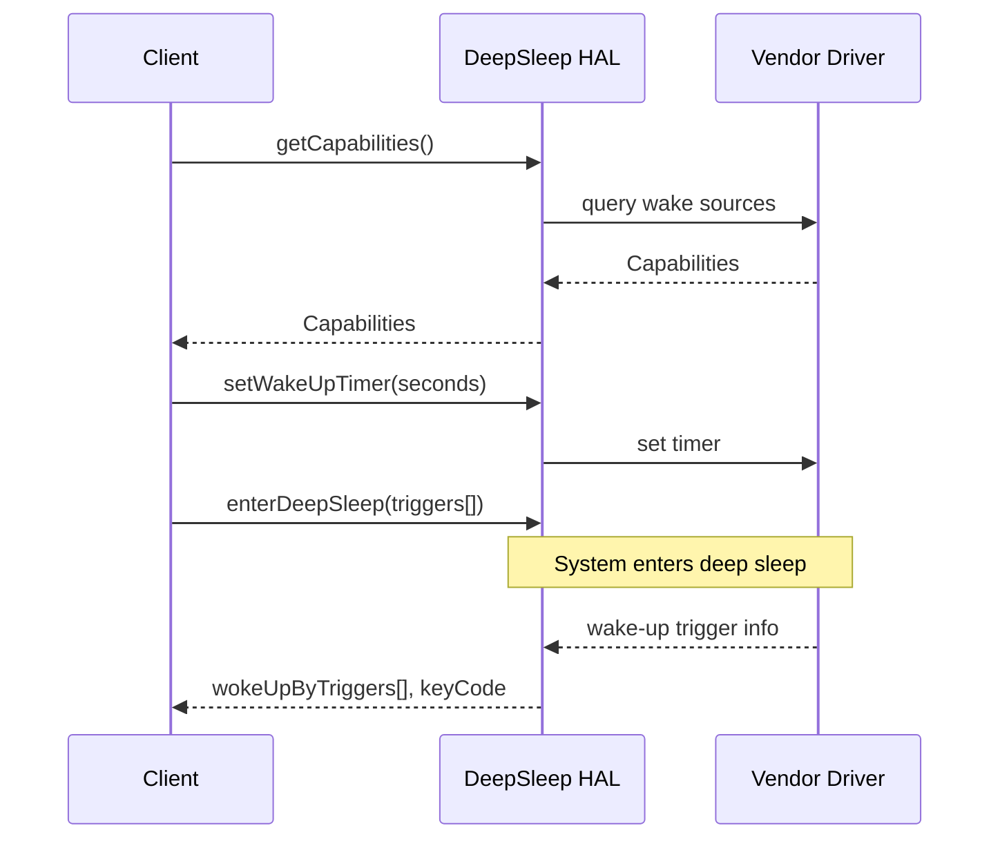
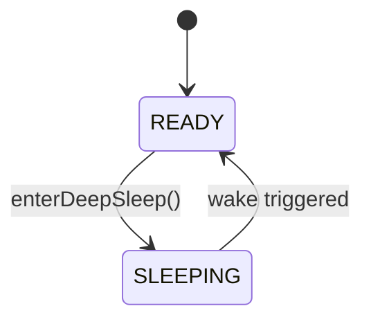

# DeepSleep HAL

## Overview

The **DeepSleep HAL** provides a platform-abstracted mechanism to transition a device into a low-power deep sleep state and return from it based on hardware-triggered wake-up events. This HAL enables features like wake-on-remote, wake-on-LAN, and timer-based resume in a consistent, vendor-independent manner.

It manages:

* Power state transitions into deep sleep
* Wake-up via supported hardware trigger types
* Tracking and reporting of wake-up cause
* Timer-based wake-up and trigger configuration

This interface **excludes** traditional suspend-to-RAM (S2R) or light sleep states and is instead optimised for extended deep idle scenarios with full system clock recovery.

---

## References

!!! info References
    |                              |                                                                                                       |
    | ---------------------------- | ----------------------------------------------------------------------------------------------------- |
    | **Interface Definition**     | [com/rdk/hal/deepsleep](https://github.com/rdkcentral/rdk-halif-aidl/tree/main/com/rdk/hal/deepsleep) |
    | **API Documentation**        | TBD                                                                                                   |
    | **HAL Interface Type**       | [AIDL and Binder](../../../introduction/aidl_and_binder.md)                                           |
    | **Initialization Unit**      | [systemd service](../../../vsi/systemd/current/systemd.md)                                            |
    | **VTS Tests**                | TBD                                                                                                   |
    | **Reference Implementation** | TBD                                                                                                   |

---

## Related Pages

!!! tip Related Pages
    * [HAL Feature Profile](../../key_concepts/hal/hal_feature_profiles.md)
    * [HAL Interface Overview](../../key_concepts/hal/hal_interfaces.md)
    * [Power Management Framework](../../power/power_management.md)

---

## Functional Overview

The `IDeepSleep` interface is responsible for:

* Reporting supported and mandatory wake-up triggers
* Entering deep sleep and blocking until triggered to resume
* Providing wake-up cause information, including keycode (if RCU based)
* Setting and retrieving timer values for wake-up via clock events

It operates at the HAL layer and is used by middleware components responsible for system power policy management or user-initiated standby.

---

## Implementation Requirements

| #               | Requirement                                                      | Comments                                   |
| --------------- | ---------------------------------------------------------------- | ------------------------------------------ |
| **HAL.DeepSleep.1** | The HAL shall expose a `getCapabilities()` method                | Returns supported and mandatory triggers   |
| **HAL.DeepSleep.2** | The HAL shall implement `enterDeepSleep()`                       | Blocks until resume; returns trigger cause |
| **HAL.DeepSleep.3** | The HAL shall support timer-based wake-up via `setWakeUpTimer()` | Requires TIMER trigger in capabilities     |
| **HAL.DeepSleep.4** | The HAL shall report keycode if the wake-up was RCU-based        | Linux input keycode                        |
| **HAL.DeepSleep.5** | The HAL shall ensure mandatory triggers are always armed         | Even if not explicitly listed by client    |

---

## Interface Definitions

| AIDL File            | Description                                               |
| -------------------- | --------------------------------------------------------- |
| `IDeepSleep.aidl`    | Main interface to enter/exit deep sleep and manage timers |
| `Capabilities.aidl`  | Parcelable reporting supported/mandatory triggers         |
| `KeyCode.aidl`       | Parcelable reporting Linux key code from wake-up trigger  |
| `WakeUpTrigger.aidl` | Enum of supported wake-up sources                         |

---

## Initialization

* HAL service is binderized and registered via `IDeepSleep::serviceName = "DeepSleep"`.
* Starts via a systemd unit in the vendor or HAL layer during system boot.
* Must register with the Android binder `ServiceManager`.

---

## Product Customization

* Supported and mandatory wake-up sources are defined via platform-specific YAML (`HAL Feature Profile`).
* Example:

  ```yaml
  supportedTriggers:
    - RCU_IR
    - RCU_BT
    - LAN
    - WLAN
    - TIMER
    - FRONT_PANEL
    - CEC
    - PRESENCE
    - VOICE
  mandatoryTriggers:
    - RCU_IR
    - RCU_BT
    - TIMER
    - FRONT_PANEL
  ```
* These control which sources are accepted in `enterDeepSleep()` and always armed.

---

## System Context



---

## Resource Management

* The HAL is single-client controlled.
* Only one call to `enterDeepSleep()` is active at a time.
* On client crash or termination, HAL must abort sleep entry and return control to the system.

---

## Operation and Data Flow

* Input:

  * `triggersToWakeUpon[]` — wake-up conditions
  * `setWakeUpTimer(seconds)` — duration
* Output:

  * `wokeUpByTriggers[]` — sources that woke the system
  * `KeyCode` — if RCU-based trigger, gives Linux key code
* All HAL operations are synchronous from client perspective.

---

## Modes of Operation

No distinct runtime modes. However, the available wake-up sources may vary by platform implementation. Use `getCapabilities()` to inspect runtime availability.

---

## Event Handling

This HAL is synchronous and does not emit events. It blocks on `enterDeepSleep()` and returns with data upon wake-up.

---

## State Machine / Lifecycle



States:

* **READY**: HAL is idle, ready for commands
* **SLEEPING**: HAL has issued platform command to enter deep sleep and is blocked

---

## Data Format / Protocol Support

| Format        | Use Case            | Support Level |
| ------------- | ------------------- | ------------- |
| Linux KeyCode | RCU wake event data | Required      |

---

## Platform Capabilities

* Supports up to 7-day timers via `WakeUpTrigger.TIMER`
* Trigger types are platform-configurable
* Mandatory triggers enforced regardless of client intent

---

## End-of-Stream and Error Handling

* `enterDeepSleep()` returns `false` if any trigger is unsupported
* If wake-up reason cannot be determined, `WakeUpTrigger.ERROR_UNKNOWN` is returned
* Timer set to invalid values returns `false`
