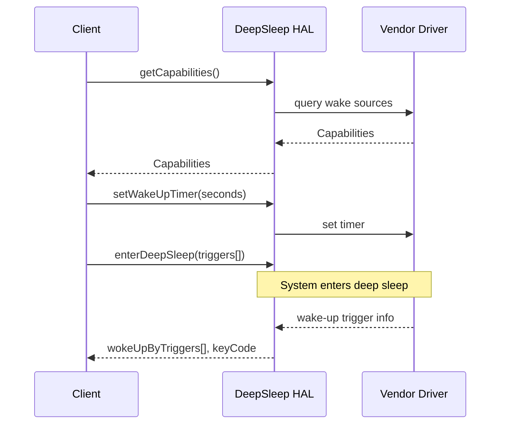

# DeepSleep HAL

## Overview

The **DeepSleep HAL** provides a platform-abstracted mechanism to transition a device into a low-power deep sleep state and return from it based on hardware-triggered wake-up events. This HAL enables features like wake-on-remote, wake-on-LAN, and timer-based resume in a consistent, vendor-independent manner.

It manages entry into **DeepSleep**:

* Wake-up via supported hardware trigger types
* Tracking and reporting of wake-up cause

---

## References

!!! info References
    |                              |                                                                                                       |
    | ---------------------------- | ----------------------------------------------------------------------------------------------------- |
    | **Interface Definition**     | [com/rdk/hal/deepsleep](https://github.com/rdkcentral/rdk-halif-aidl/tree/main/deepsleep/current/com/rdk/hal/deepsleep) |
    | **API Documentation**        | TBD                                                                                                   |
    | **HAL Interface Type**       | [AIDL and Binder](../../../introduction/aidl_and_binder.md)                                           |
    | **Initialization Unit**      | [systemd service](../../../vsi/systemd/current/systemd.md)                                            |
    | **VTS Tests**                | TBD                                                                                                   |
    | **Reference Implementation** | TBD                                                                                                   |

---

## Related Pages

!!! tip "Related Pages"
    * [HAL Feature Profile](../../key_concepts/hal/hal_feature_profiles.md)
    * [HAL Interface Overview](../../key_concepts/hal/hal_interfaces.md)

---

## Functional Overview

The `IDeepSleep` interface is responsible for:

* Reporting supported and preconfigured wake-up triggers
* Entering deep sleep and blocking until triggered to resume
* Providing wake-up cause information, including keycode (if RCU-based)
* Setting and retrieving timer values for wake-up via clock events

It operates at the HAL layer and is used by middleware components responsible for system power policy management or user-initiated standby.

---

## Implementation Requirements

| #                   | Requirement                                                       | Comments                                                              |
| ------------------- | ----------------------------------------------------------------- | --------------------------------------------------------------------- |
| **HAL.DeepSleep.1** | The HAL shall expose a `getCapabilities()` method                 | Returns `supportedTriggers[]` and `preconfiguredTriggers[]`           |
| **HAL.DeepSleep.2** | The HAL shall implement `enterDeepSleep()`                        | Blocks until resume; returns trigger cause                            |
| **HAL.DeepSleep.3** | The HAL shall support timer-based wake-up via `setWakeUpTimer()`  | Requires `TIMER` trigger in capabilities; must wake within ±5 seconds |
| **HAL.DeepSleep.4** | The HAL shall report keycode if the wake-up was RCU-based         | Linux input keycode                                                   |
| **HAL.DeepSleep.5** | The HAL shall ensure `preconfiguredTriggers[]` are always enabled | Even if not explicitly listed by client                               |

---

## Interface Definitions

| AIDL File            | Description                                               |
| -------------------- | --------------------------------------------------------- |
| `IDeepSleep.aidl`    | Main interface to enter/exit deep sleep and manage timers |
| `Capabilities.aidl`  | Parcelable reporting supported and preconfigured triggers |
| `KeyCode.aidl`       | Parcelable reporting Linux key code from wake-up trigger  |
| `WakeUpTrigger.aidl` | Enum of supported wake-up sources                         |

---

## Initialization

* HAL service is binderized and registered via `IDeepSleep::serviceName = "DeepSleep"`.
* Starts via a systemd unit in the vendor or HAL layer during system boot.
* Must register with the `ServiceManager`.

---

## Product Customization

* Supported and preconfigured wake-up sources are defined via platform-specific YAML (`HAL Feature Profile`).

  ```yaml
  deep_sleep:
  	interfaceVersion: current
  	supportedTriggers:
  		- RCU_IR
  		- RCU_BT
  		- LAN
  		- WLAN
  		- TIMER
  		- FRONT_PANEL
  		- CEC
  		- PRESENCE
  		- VOICE
  	preconfiguredTriggers:
  		- RCU_IR
  		- RCU_BT
  		- TIMER
  		- FRONT_PANEL
  ```

* `preconfiguredTriggers[]` are always armed by the platform, regardless of whether the client includes them in the `enterDeepSleep()` call.

* These reflect hardware or firmware limitations where certain wake sources are always enabled.

---

## System Context



---

## Resource Management

* The HAL is single-client controlled.
* Only one call to `enterDeepSleep()` is active at a time.
* On client crash or termination, HAL must abort sleep entry and return control to the system.

---

## Operation and Data Flow

* **Input**:

  * `triggersToWakeUpon[]` — wake-up conditions explicitly requested by the client
  * `setWakeUpTimer(seconds)` — timer duration in seconds

* **Output**:

  * `wokeUpByTriggers[]` — triggers that caused device to resume
  * `KeyCode` — if RCU-based trigger, gives Linux key code

* The platform is expected to wake the device within **±5 seconds** of the programmed timer value.

* `preconfiguredTriggers[]` are always active. If a client omits them from the `triggersToWakeUpon[]`, the HAL implicitly adds them.

---

## Modes of Operation

No distinct runtime modes. However, trigger availability may vary by platform. Clients should always inspect `getCapabilities()` at runtime.

---

## Event Handling

This HAL is synchronous and does not emit asynchronous events. It blocks on `enterDeepSleep()` and returns with trigger information when the system resumes.

---

## Platform Capabilities

* Supports timer-based wake-up for durations up to 7 days
* Wake timer accuracy must be within ±5 seconds of the programmed interval
* `preconfiguredTriggers[]` are platform-enforced and always armed
* Clients can enumerate `supportedTriggers[]` to choose their wake policy

---

## Error Handling

* `enterDeepSleep()` returns `false` if any specified trigger is unsupported
* If wake-up reason is ambiguous or unknown, `WakeUpTrigger.ERROR_UNKNOWN` is returned
* A `setWakeUpTimer()` call with invalid input returns `false`
