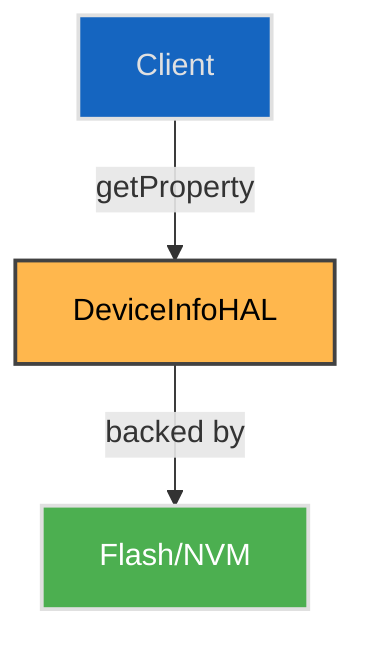

# DeviceInfo HAL

## Overview

The `DeviceInfo` HAL provides platform-independent access to key persistent provisioned identity and configuration properties of the device, such as manufacturer, model name, serial number, MAC addresses. It abstracts device-specific storage mechanisms (e.g., NVM, EEPROM, secure flash) and exposes a read interface to the caller.

The HAL is primarily used for reading the provisioning data. All returned values are exposed as strings, with strict formatting requirements back from the interface.

---

!!! info "References"
    |                              |                                                                                                  |
    | ---------------------------- | ------------------------------------------------------------------------------------------------ |
    | **Interface Definition**     | [com/rdk/hal/deviceinfo](../../../../deviceinfo/current/) |
    | **HAL Interface Type**       | [AIDL and Binder](../../../introduction/aidl_and_binder.md)                                      |
    | **Initialization Unit**      | [systemd service](../../../vsi/systemd/current/systemd.md)                                       |

---

!!! tip "Related Pages"
    * [HAL Feature Profile](../../key_concepts/hal/hal_feature_profiles.md)
    * [HAL Interface Overview](../../key_concepts/hal/hal_interfaces.md)
    * [Other HALs or Framework Components](../../key_concepts/hal/hal_interfaces.md)

---

## Functional Overview

This HAL provides an interface for reading the persistent device properties. It is typically used by:

* Boot-time services for provisioning and validation
* Configuration of the upper layers based on language, country / factory serialized data.

All property accesses are string-based, and property keys are pre-defined by the specific platform configuration. The data is read-only.

---

## Implementation Requirements

| #                | Requirement                                                              | Comments                           |
| ---------------- | ------------------------------------------------------------------------ | ---------------------------------- |
| **HAL.DeviceInfo.1** | The service shall expose a binder interface named `"DeviceInfo"`         | Defined via `serviceName` constant |
| **HAL.DeviceInfo.2** | The service shall support the properties listed in `supportedProperties` | Validated via `getCapabilities()`  |
| **HAL.DeviceInfo.3** | All properties are read-only; formatting is enforced according to PropertyType and Property definitions. | Enforced via [`PropertyType`](../../../../deviceinfo/current/com/rdk/hal/deviceinfo/PropertyType.aidl) and [`Property`](../../../../deviceinfo/current/com/rdk/hal/deviceinfo/Property.aidl) |
| **HAL.DeviceInfo.4** | ISO3166 and ISO639 codes are 2 bytes and not zero-terminated            | Enforced in `Property`            |
| **HAL.DeviceInfo.5** | The HAL shall enforce max size and zero-termination as specified         | Validation in implementation       |
| **HAL.DeviceInfo.6** | Property types are defined in the HAL as `PropertyType` enum             | See [PropertyType.aidl](../../../../deviceinfo/current/com/rdk/hal/deviceinfo/PropertyType.aidl)`              |

---

## Interface Definitions

| AIDL File                | Description                                         |
| ------------------------ | --------------------------------------------------- |
| `IDeviceInfo.aidl`       | Main HAL Binder interface for property access, including get/set methods and version reporting |
| `Capabilities.aidl`      | Defines the list of supported property keys for the platform (used by getCapabilities) |
| `Property.aidl`          | Parcelable structure describing device property metadata, including format, size, and zero-termination |
| `PropertyType.aidl`      | Enum of supported property types (e.g., STRING, MAC, NUMERIC, ISO3166, ISO639, UPPERCASEHEX, SEMANTICVERSION) |

---

## Initialization

The HAL service is registered at system boot via a systemd unit. It must register with the AIDL Service Manager under the name `"DeviceInfo"`. Initialization may involve reading from NVM, flash, or platform-specific storage.

---

## Product Customization

* Property support is declared via `Capabilities.supportedProperties`
* Platform-specific fields (e.g., Wi-Fi MAC, WPS PIN) are optional
* Additional vendor fields may be added via OEM-specific keys or future extensions of `Property.aidl`
* Default values and access modes are described in the HAL Feature Profile

---

## System Context



---

## Resource Management

No resource handles are needed. The HAL is stateless between calls. The interface does not require explicit resource acquisition or release methods. Each method call is independent.

---

## Operation and Data Flow

* `getCapabilities()`
    Returns a `Capabilities` parcelable listing all supported property keys for the platform.
* `getProperty(String propertyKey)`  
    Retrieves a persisted device property by key. Returns a `Property` parcelable with value, type, size, and validation metadata, or `null` if unsupported or not found.

---

## Modes of Operation

No distinct modes are defined. Implementations may choose to restrict write access depending on build variants (e.g., factory vs. production).

---

## Event Handling

This HAL is synchronous and does not emit events or use listeners.

---

## State Machine / Lifecycle

This HAL does not manage internal state or resource handles. Each method call is independent and stateless. The interface is always available after service registration, and there is no explicit lifecycle management required.

---

## Data Format / Protocol Support

The supported data formats correspond to the property types defined in `PropertyType.aidl`:

| PropertyType      | Format/Example         | Use Case               |
|-------------------|-----------------------|-------------------------|
| STRING            | "RDK Inc."            | Generic string values   |
| MAC               | "00:11:22:33:44:55"   | MAC address format      |
| NUMERIC           | "12345670"            | WPS PIN, numeric fields |
| ISO3166           | "US"                  | Country code            |
| ISO639            | "en"                  | Language code           |
| UPPERCASEHEX      | "A1B2C3D4"            | Hexadecimal string      |
| SEMANTICVERSION   | "1.0.0"               | HAL version             |

See `PropertyType.aidl` for the authoritative list of supported property types and their definitions.

## Platform Capabilities

Example Configuration (YAML style)

```yaml
IDeviceInfo:
  properties:
    - HAL_VERSION:
        value: "1.0.0"
        format: SEMANTICVERSION
        max_size: 32
        zero_terminated: true
    - MANUFACTURER:
        value: "RDK Inc."
        format: STRING
        max_size: 32
        zero_terminated: true
    - MANUFACTURER_OUI:
        value: "AA:BB:CC"
        format: STRING
        max_size: 8
        zero_terminated: true
    - MODELNAME:
        value: "RDK-STB-200"
        format: STRING
        max_size: 32
        zero_terminated: true
    - PRODUCTCLASS:
        value: "STB"
        format: STRING
        max_size: 16
        zero_terminated: true
    - SERIALNUMBER:
        value: "RDK123456789"
        format: STRING
        max_size: 32
        zero_terminated: true
    - WIFIMAC:
        value: "00:11:22:33:44:55"
        format: MAC
        max_size: 16
        zero_terminated: false
    - BLUETOOTHMAC:
        value: "11:22:33:44:55:66"
        format: MAC
        max_size: 16
        zero_terminated: false
    - WPSPIN:
        value: "12345670"
        format: NUMERIC
        max_size: 8
        zero_terminated: true
    - ETHERNETMAC:
        value: "AA:BB:CC:DD:EE:FF"
        format: MAC
        max_size: 16
        zero_terminated: false
    - RF4CEMAC:
        value: "22:33:44:55:66:77"
        format: MAC
        max_size: 16
        zero_terminated: false
    - COUNTRYCODE:
        value: "US"
        format: ISO3166
        max_size: 2
        zero_terminated: false
    - LANGUAGECODE:
        value: "en"
        format: ISO639
        max_size: 2
        zero_terminated: false
    - MANUFACTURERDATA:
        value: "OEM_TAG_1234"
        format: STRING
        max_size: 64
        zero_terminated: true
```

This example matches the current HAL Feature Profile YAML structure, showing all required fields for each property.

