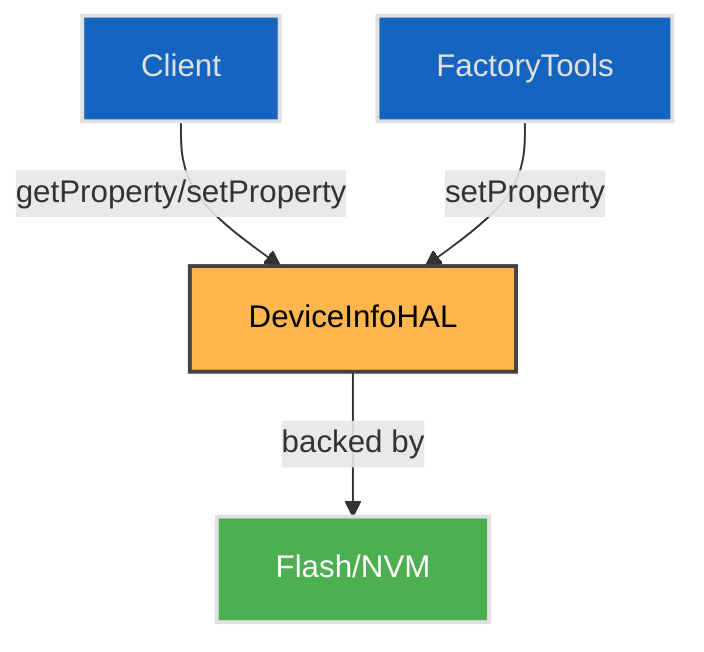

# DeviceInfo HAL

## Overview

The `DeviceInfo` HAL provides platform-independent access to key persistent identity and configuration properties of the device, such as manufacturer, model name, serial number, MAC addresses, and image metadata. It abstracts device-specific storage mechanisms (e.g., NVM, EEPROM, secure flash) and exposes a read/write interface to the middleware or management layers.

The HAL is primarily used for boot-time introspection, provisioning, and diagnostic queries. Write access is typically restricted to factory or trusted services. All values are exposed as strings, with strict formatting requirements (e.g., MAC addresses must be upper case and colon-separated).

---

## References

!!! info References
    |                              |                                                                                                  |
    | ---------------------------- | ------------------------------------------------------------------------------------------------ |
    | **Interface Definition**     | [com/rdk/hal/deviceinfo](https://github.com/rdkcentral/rdk-halif-aidl/tree/main/aidl/deviceinfo) |
    | **API Documentation**        | TBD                                                                                              |
    | **HAL Interface Type**       | [AIDL and Binder](../../../introduction/aidl_and_binder.md)                                      |
    | **Initialization Unit**      | [systemd service](../../../vsi/systemd/current/systemd.md)                                       |
    | **VTS Tests**                | TBD                                                                                              |
    | **Reference Implementation** | TBD                                                                                              |

---

## Related Pages

!!! tip Related Pages
    * [HAL Feature Profile](../../key_concepts/hal/hal_feature_profiles.md)
    * [HAL Interface Overview](../../key_concepts/hal/hal_interfaces.md)
    * [Other HALs or Framework Components](../../key_concepts/hal/hal_interfaces.md)

---

## Functional Overview

This HAL provides an interface for reading and writing persistent device properties. It is typically used by:

* Boot-time services for provisioning and validation
* Middleware for branding, platform, or locale setup
* Debugging and diagnostic interfaces
* Factory provisioning tools

All property accesses are string-based, and property keys are pre-defined in the `Property` enum. The HAL internally validates, normalises, and may persist values across reboots.

---

## Implementation Requirements

| #                | Requirement                                                              | Comments                           |
| ---------------- | ------------------------------------------------------------------------ | ---------------------------------- |
| **HAL.DeviceInfo.1** | The service shall expose a binder interface named `"DeviceInfo"`         | Defined via `serviceName` constant |
| **HAL.DeviceInfo.2** | The service shall support the properties listed in `supportedProperties` | Validated via `getCapabilities()`  |
| **HAL.DeviceInfo.3** | All MAC addresses must follow `XX:XX:XX:XX:XX:XX` format                 | Enforced in both get/set           |
| **HAL.DeviceInfo.4** | All hex strings must be uppercase                                        | Applies to OUI and similar fields  |
| **HAL.DeviceInfo.5** | The HAL shall persist writable fields across power cycles                | Method dependent on platform       |

---

## Interface Definitions

| AIDL File                | Description                                 |
| ------------------------ | ------------------------------------------- |
| `IDeviceInfo.aidl`       | Main control interface for property access  |
| `Capabilities.aidl`      | Lists supported `Property` keys             |
| `HALVersion.aidl`        | Encodes interface version (major.minor.doc) |
| `SetPropertyResult.aidl` | Return codes for `setProperty()`            |
| `Property.aidl`          | Enum of supported device information keys   |

---

## Initialization

The HAL service is registered at system boot via a systemd unit. It must register with the AIDL Service Manager under the name `"DeviceInfo"`. Initialization may involve reading from NVM, flash, or platform-specific storage.

---

## Product Customization

* Property support is declared via `Capabilities.supportedProperties`
* Platform-specific fields (e.g., Wi-Fi MAC, WPS PIN) are optional
* Additional vendor fields may be added via OEM-specific keys or future extensions of `Property.aidl`
* Default values and access modes are described in the HAL Feature Profile

---

## System Context

---

## Resource Management

No resource handles are needed. The HAL is stateless between calls. There is no `open()` or `close()` lifecycle. Errors are returned directly through `SetPropertyResult` or `null` (for reads).

---

## Operation and Data Flow

* `getProperty(Property)` returns a string or `null`
* `setProperty(Property, String)` returns a `SetPropertyResult`
* `getCapabilities()` returns the full list of supported properties
* `getHALVersion()` reports the major.minor.doc version of the interface

---

## Modes of Operation

No distinct modes are defined. Implementations may choose to restrict write access depending on build variants (e.g., factory vs. production).

---

## Event Handling

This HAL is synchronous and does not emit events or use listeners.

---

## State Machine / Lifecycle

This HAL does not manage internal state or resource handles. Each method call is independent and stateless. The interface is always available after service registration, and there is no explicit lifecycle 

---

## Data Format / Protocol Support

| Format              | Use Case           | Support Level |
| ------------------- | ------------------ | ------------- |
| ASCII String        | Property encoding  | Mandatory     |
| Colon-separated MAC | MAC address format | Mandatory     |
| Uppercase Hex       | OUI, Serial        | Mandatory     |

---

## Platform Capabilities

| Property     | Access     | Example      |
| ------------ | ---------- | ------------ |
| MANUFACTURER | read-only  | `"RDK Inc."` |
| WPSPIN       | read-write | `"12345670"` |
| COUNTRYCODE  | read-write | `"US"`       |

---

## End-of-Stream and Error Handling

* `getProperty()` returns `null` for unsupported keys
* `setProperty()` returns granular errors (e.g., `ERROR_WRITE_FLASH_FAILED`)
* CRC and flash verification errors are explicitly reported
