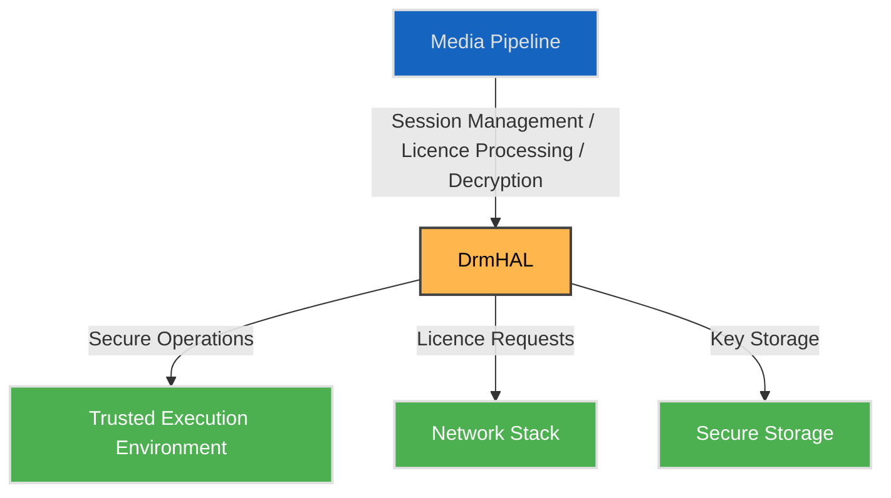

# DRM HAL

## Overview

The DRM (Digital Rights Management) HAL provides a platform-independent interface for managing content protection and secure media playback. It allows middleware and media services to interact with vendor-specific DRM implementations whilst maintaining a consistent interface across diverse hardware platforms. This abstraction enables secure content delivery, licence management, and cryptographic operations for protected media streams.

---

!!! info "References"
    |||
    |-|-|
    |**Interface Definition**|[drm/current](https://github.com/rdkcentral/rdk-halif-aidl/tree/main/drm/current)|
    |**HAL Interface Type**|[AIDL and Binder](../../../introduction/aidl_and_binder.md)|

!!! tip "Related Pages"
    - [HAL Interface Overview](../../key_concepts/hal/hal_interfaces.md)
    - [HAL Feature Profile](../../key_concepts/hal/hal_feature_profiles.md)
    - [CDM](../../cdm/current/cdm.md)

---

## Functional Overview

The DRM HAL is responsible for:

- Managing DRM sessions and secure media pipelines.
- Processing licence requests and responses.
- Providing cryptographic operations for content decryption.
- Supporting multiple DRM schemes (e.g., PlayReady, Widevine).
- Reporting DRM capabilities and security levels.
- Handling secure buffer allocation and management.

The interface design follows the established HAL patterns for lifecycle management and capability discovery.

---

## Implementation Requirements

| #            | Requirement                                                                  | Comments                           |
|--------------|-------------------------------------------------------------------------------|------------------------------------|
| HAL.DRM.1    | The service shall expose a binder interface named `drmmanager`.              | Defined via `serviceName` constant in `IDrmManager.aidl`. |
| HAL.DRM.2    | The service shall support DRM capabilities as declared in the HFP.           | Validated via `getCapabilities()`. |
| HAL.DRM.3    | The service shall maintain secure media pipelines for protected content.     | Security level enforcement.        |
| HAL.DRM.4    | The service shall support licence acquisition and renewal.                   | Licence management lifecycle.      |
| HAL.DRM.5    | The service shall provide cryptographic operations for content decryption.   | Support for multiple DRM schemes.  |

---

## Interface Definitions

| AIDL File           | Description                                      |
|---------------------|--------------------------------------------------|
| `IDrmManager.aidl`  | Manager interface for DRM resource management    |
| `IDrm.aidl`         | DRM resource interface for DRM operations        |
| `Capabilities.aidl` | Parcelable describing supported DRM features     |

---

## Initialization

The DRM HAL service is registered at system boot via a systemd unit, typically named `hal-drmmanager.service`.  

At startup:

1. The service process is launched by systemd.
2. The `IDrmManager` implementation registers itself with the AIDL Service Manager under the service name `drmmanager` (matching `serviceName`).
3. Implementation-specific initialization may occur, such as:
   - Loading DRM scheme libraries (PlayReady, Widevine, etc.).
   - Initialising secure execution environments (TEE, TrustZone).
   - Establishing communication with hardware security modules.
   - Verifying platform security credentials.

Once registered, the service is expected to remain available for the lifetime of the system.

---

## Product Customisation

- Supported DRM schemes and features are declared via the `Capabilities` parcelable.
- A platform may implement support for specific DRM systems depending on:
  - Hardware security capabilities (TEE, secure boot, hardware keys).
  - Licensing agreements with DRM vendors.
  - Security certification levels (e.g., Widevine L1/L3).
- Platform-specific policies are reflected in:
  - The `Capabilities` returned at runtime, and
  - The HAL Feature Profile (HFP) YAML for static configuration.

---

## System Context

* **Media Pipeline**: RDK media framework or streaming client.
* **DrmHAL**: AIDL `IDrmManager` and `IDrm` implementation.
* **Trusted Execution Environment**: Secure execution context for cryptographic operations.
* **Network Stack**: For licence server communication.
* **Secure Storage**: Persistent storage for keys and credentials.

---

## Resource Management

- The DRM HAL uses a manager pattern: `IDrmManager` provides access to individual `IDrm` resources.
- Each DRM resource is identified by a unique `IDrm.Id`.
- Resources include:
  - DRM sessions (cryptographic contexts).
  - Secure buffers for encrypted content.
  - Licence data and keys.
- Error conditions are reported via AIDL exceptions.

---

## Operation and Data Flow

General call flow:

1. **Resource Discovery**.  
   Clients call `IDrmManager.getDrmIds()` to enumerate available DRM resources.

2. **Capability Discovery**.  
   For each resource, clients call `IDrm.getCapabilities()` to determine:
   - Supported DRM schemes (PlayReady, Widevine, etc.).
   - Security levels available (hardware-backed, software).
   - HDCP requirements and support.

3. **Session Creation**.  
   Media pipeline creates a DRM session for secure playback.

4. **Licence Acquisition**.  
   - Generate licence request.
   - Send to licence server via client application.
   - Process licence response in DRM HAL.

5. **Content Decryption**.  
   - Encrypted media buffers passed to DRM HAL.
   - Decryption performed in secure context.
   - Decrypted content delivered to decoder pipeline.

6. **Session Termination**.  
   DRM session closed when playback completes or stops.

---

## Platform Capabilities

The `Capabilities` parcelable exposes runtime configuration:

- Supported DRM schemes.
- Security levels (L1, L3 for Widevine).
- HDCP version support.
- Maximum concurrent sessions.
- Hardware security features.

---

## Security Considerations

- **Secure Path**: DRM HAL must maintain secure data paths from encrypted input to decrypted output.
- **Key Protection**: Cryptographic keys must be protected in hardware-backed storage where available.
- **Attestation**: Platform may require security attestation for high-security content.
- **HDCP Enforcement**: Output protection must be enforced per content policy.

---

## Error Handling

- All errors are reported via AIDL exceptions.
- Common error scenarios:
  - Licence not available or expired.
  - Security level insufficient for content.
  - Hardware security failure.
  - Invalid session state.

---

## Testing

DRM HAL implementations must pass:

- **L1 Tests**: Basic DRM operations (session creation, licence processing).
- **L2 Tests**: DRM scheme-specific validation.
- **L3 Tests**: Integration with secure media pipeline.
- **L4 Tests**: End-to-end protected content playback.

---

## References

- AIDL interface definitions in `drm/current/com/rdk/hal/drm/`
- HAL Feature Profile: `drm/current/hfp-drm.yaml`
- Build configuration: `drm/current/CMakeLists.txt`
