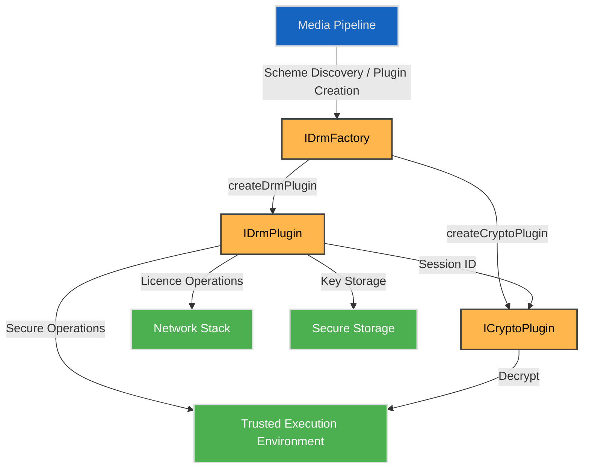

# DRM HAL

## Overview


The DRM (Digital Rights Management) HAL provides a platform-independent interface for managing content protection and secure media playback. It allows middleware and media services to interact with vendor-specific DRM implementations whilst maintaining a consistent interface across diverse hardware platforms. This abstraction enables secure content delivery, licence management, and cryptographic operations for protected media streams.

This DRM interface definition is almost identical to Android 16's DRM and Crypto Plugin interfaces. Usage of the Plugins and discovery by the RDK framework is identical.
The approach is to minimize SoC vendor (and Drm vendor) effor by using a model that is well known and understood, thus minimizing bringup and maintenance issues.
See: https://source.android.com/docs/core/media/drm#drm-plugin-details
In principle the same Android VTS approach can be applied early in SoC bring up.

The significant differences: 
- AVBuffer for the input and output buffers.
- No support for legacy "secure stop"
- No support required for "offline keys" - REQUIREMENT UNDER REVIEW 

---

!!! info "References"
    |||
    |-|-|
    |**Interface Definition**|[drm/current](https://github.com/rdkcentral/rdk-halif-aidl/tree/main/drm/current)|
    |**HAL Interface Type**|[AIDL and Binder](../../../introduction/aidl_and_binder.md)|

!!! tip "Related Pages"
    - [HAL Interface Overview](../../key_concepts/hal/hal_interfaces.md)
    - [HAL Feature Profile](../../key_concepts/hal/hal_feature_profiles.md)
    - [CDM](../../cdm/current/cdm.md)

---

## Functional Overview

The DRM HAL is responsible for:

- Managing DRM sessions and secure media pipelines.
- Processing licence requests and responses.
- Providing cryptographic operations for content decryption.
- Supporting multiple DRM schemes (e.g., PlayReady, Widevine).
- Reporting DRM capabilities, security levels, and HDCP status.
- Handling device provisioning and certificate management.

The interface design follows a factory pattern: `IDrmFactory` is the entry point, creating `IDrmPlugin` instances (for key and session management) and `ICryptoPlugin` instances (for content decryption). A session ID created by `IDrmPlugin` is passed to `ICryptoPlugin` to cryptographically link the DRM session to the decryption context.

---

## Implementation Requirements

| #            | Requirement                                                                  | Comments                           |
|--------------|-------------------------------------------------------------------------------|------------------------------------|
| HAL.DRM.1    | Each DRM scheme shall register an `IDrmFactory` instance using the format `com.rdk.hal.drm.IDrmFactory/<instance>`. | The `<instance>` is vendor-defined (e.g. `clearkey`, `widevine`, `playready`). Multiple instances may be registered simultaneously. |
| HAL.DRM.2    | The service shall support DRM capabilities as declared in the HFP.           | Validated via `IDrmFactory.getSupportedCryptoSchemes()`. |
| HAL.DRM.3    | The service shall maintain secure media pipelines for protected content.     | Security level enforcement via `SecurityLevel`. |
| HAL.DRM.4    | The service shall support licence acquisition and renewal.                   | Via `IDrmPlugin.getKeyRequest()` and `IDrmPlugin.provideKeyResponse()`. |
| HAL.DRM.5    | The service shall provide cryptographic operations for content decryption.   | Via `ICryptoPlugin.decrypt()`. Support for multiple DRM schemes via UUID. |

---

## Interface Definitions

### Interfaces

| AIDL File                  | Description                                                                 |
|----------------------------|-----------------------------------------------------------------------------|
| `IDrmFactory.aidl`         | Entry-point factory; creates `IDrmPlugin` and `ICryptoPlugin` instances     |
| `IDrmPlugin.aidl`          | DRM plugin; session lifecycle, key requests, provisioning, and properties   |
| `ICryptoPlugin.aidl`       | Crypto plugin; content decryption and secure decoder configuration          |
| `IDrmPluginListener.aidl`  | Callback interface for DRM events (key expiry, key status changes)          |

### Enumerations

| AIDL File              | Description                                           |
|------------------------|-------------------------------------------------------|
| `DrmErrors.aidl`       | DRM error codes used in implicit error reporting      |
| `EventType.aidl`       | DRM event types delivered via `IDrmPluginListener`    |
| `HdcpLevel.aidl`       | Individual HDCP level values                          |
| `KeyRequestType.aidl`  | Key request types: initial, renewal, or release       |
| `KeyStatusType.aidl`   | Key status types: usable, expired, output not allowed, etc. |
| `KeyType.aidl`         | Key types: streaming, offline, or release             |
| `Mode.aidl`            | Cipher modes: CBC or CTR                              |
| `SecurityLevel.aidl`   | DRM security levels (e.g. SW_SECURE_CRYPTO, HW_SECURE_ALL) |

### Parcelables

| AIDL File                          | Description                                                      |
|------------------------------------|------------------------------------------------------------------|
| `CryptoSchemes.aidl`               | List of supported crypto scheme UUIDs and content types          |
| `DecryptArgs.aidl`                 | Arguments bundle for `ICryptoPlugin.decrypt()`                   |
| `DrmMetric.aidl`                   | A single DRM diagnostic metric                                   |
| `DrmMetricGroup.aidl`              | A named group of DRM metrics                                     |
| `DrmMetricNamedValue.aidl`         | A named value within a DRM metric                                |
| `DrmMetricValue.aidl`              | Typed value (int, double, string) within a DRM metric            |
| `HdcpLevels.aidl`                  | Current and maximum negotiated HDCP levels                       |
| `KeyRequest.aidl`                  | Opaque key request blob returned by `getKeyRequest()`            |
| `KeySetId.aidl`                    | Identifies a set of keys for offline licence use                 |
| `KeyStatus.aidl`                   | Key identifier paired with its current `KeyStatusType`           |
| `KeyValue.aidl`                    | Key-value string pair for optional parameters                    |
| `NumberOfSessions.aidl`            | Current open session count and maximum supported sessions        |
| `Pattern.aidl`                     | Encryption pattern (skip and encrypt block counts for CBC-CTS)   |
| `ProvideProvisionResponseResult.aidl` | Result of `provideProvisionResponse()` (certificate, wrapped key) |
| `ProvisionRequest.aidl`            | Opaque provisioning request blob                                 |
| `Status.aidl`                      | DRM operation status code                                        |
| `SubSample.aidl`                   | Clear and encrypted byte counts for one subsample                |
| `SupportedContentType.aidl`        | Mime type and security level for a supported content type        |
| `Uuid.aidl`                        | 128-bit UUID identifying a DRM scheme                            |

---

## Initialization

The DRM HAL service is registered at system boot via a systemd unit, typically named `hal-drm.service`.  

At startup:

1. The service process is launched by systemd.
2. Each `IDrmFactory` implementation registers itself with the AIDL Service Manager using the format:

    ```
    com.rdk.hal.drm.IDrmFactory/<instance>
    ```

    where `<instance>` is a vendor-defined identifier for the DRM scheme, for example:

    | Instance name | DRM scheme |
    |---|---|
    | `clearkey` | ClearKey (built-in) |
    | `widevine` | Google Widevine |
    | `playready` | Microsoft PlayReady |
    | `default` | Platform default scheme |

    Multiple `IDrmFactory` instances may be registered simultaneously — one per supported DRM scheme. Clients discover available schemes by calling `getSupportedCryptoSchemes()` on each registered factory.

3. Implementation-specific initialisation may occur, such as:
   - Loading DRM scheme libraries (PlayReady, Widevine, etc.).
   - Initialising secure execution environments (TEE, TrustZone).
   - Establishing communication with hardware security modules.
   - Verifying platform security credentials.

Once registered, the service is expected to remain available for the lifetime of the system.

---

## Product Customisation

- Supported DRM schemes are declared via `IDrmFactory.getSupportedCryptoSchemes()`, which returns a `CryptoSchemes` parcelable containing supported UUIDs and content types.
- A platform may implement support for specific DRM systems depending on:
  - Hardware security capabilities (TEE, secure boot, hardware keys).
  - Licensing agreements with DRM vendors.
  - Security certification levels (e.g., Widevine L1/L3).
- Platform-specific policies are reflected in:
  - The `SecurityLevel` returned by `IDrmPlugin.getSecurityLevel()`, and
  - The HAL Feature Profile (HFP) YAML for static configuration.

---

## System Context



* **Media Pipeline**: RDK media framework or streaming client.
* **IDrmFactory**: Entry-point binder service; instantiates DRM and crypto plugins.
* **IDrmPlugin**: Manages DRM sessions, key requests, provisioning, and properties.
* **ICryptoPlugin**: Performs content decryption within the secure execution environment.
* **Trusted Execution Environment**: Secure execution context for cryptographic operations.
* **Network Stack**: For licence server communication.
* **Secure Storage**: Persistent storage for keys and credentials.

---

## Resource Management

- Multiple `IDrmFactory` instances are registered — one per supported DRM scheme — each under `com.rdk.hal.drm.IDrmFactory/<instance>`. They create per-scheme plugin instances on demand.
- `IDrmFactory.createDrmPlugin(uuid, appPackageName)` returns an `IDrmPlugin` for the specified DRM scheme.
- `IDrmFactory.createCryptoPlugin(uuid, initData)` returns an `ICryptoPlugin` for content decryption.
- `IDrmPlugin` manages one or more sessions identified by opaque `byte[] sessionId` values.
- `ICryptoPlugin` is linked to a DRM session via `setMediaDrmSession(sessionId)`, establishing the secure binding between key management and decryption.
- Error conditions are reported via AIDL exceptions using codes from `DrmErrors`.

---

## Operation and Data Flow

General call flow for protected content playback:

1. **Scheme Discovery**  
   Client calls `IDrmFactory.getSupportedCryptoSchemes()` to enumerate supported DRM scheme UUIDs and content types.

2. **Plugin Creation**  
   Client calls `IDrmFactory.createDrmPlugin(uuid, appPackageName)` to obtain an `IDrmPlugin` for the selected scheme. Optionally calls `IDrmFactory.createCryptoPlugin(uuid, initData)` to obtain an `ICryptoPlugin`.

3. **Session Creation**  
   Client calls `IDrmPlugin.openSession(securityLevel)` to obtain a `byte[] sessionId`. Security level may be set to the native device level or overridden for lower levels when frame manipulation is required.

4. **Bind Crypto to Session**  
   Client calls `ICryptoPlugin.setMediaDrmSession(sessionId)` to cryptographically link the crypto plugin to the DRM session, enabling secure key use during decryption.

5. **Provisioning** *(if required)*  
   - `IDrmPlugin.getProvisionRequest(certificateType, certificateAuthority)` obtains an opaque request blob.
   - Client sends the blob to the provisioning server.
   - `IDrmPlugin.provideProvisionResponse(response)` delivers the response and returns a `ProvideProvisionResponseResult` containing the certificate and wrapped key.

6. **Licence Acquisition**  
   - `IDrmPlugin.getKeyRequest(scope, initData, mimeType, keyType, optionalParameters)` generates an opaque licence request.
   - Client sends the request to the licence server.
   - `IDrmPlugin.provideKeyResponse(scope, response)` delivers the licence response and loads keys.

7. **Content Decryption**  
   Encrypted media buffers are passed to `ICryptoPlugin.decrypt(DecryptArgs)`, which performs decryption within the secure context using the loaded keys.

8. **Session Termination**  
   `IDrmPlugin.closeSession(sessionId)` releases session resources when playback completes or stops.

---

## Platform Capabilities

Runtime capability information is obtained via:

- `IDrmFactory.getSupportedCryptoSchemes()` — supported scheme UUIDs and associated content types (`SupportedContentType`).
- `IDrmPlugin.getSecurityLevel(sessionId)` — current security level for a session (`SecurityLevel`).
- `IDrmPlugin.getHdcpLevels()` — current and maximum negotiated HDCP levels (`HdcpLevels`).
- `IDrmPlugin.getNumberOfSessions()` — current open session count and platform maximum (`NumberOfSessions`).
- `IDrmPlugin.getPropertyString("vendor")` / `"version"` / `"description"` — scheme metadata.

---

## Decryption Buffer Life Cycle

There is a departure from the RDK AIDL model where the consuming component releases `AVBuffers` back to the `Pool`. The `ICryptoPlugin::decrypt` function is blocking for the decryption. On return, the input `AVBuffer` must  be released/recycled by the calling component. Similarly the output `AVBuffer` is passed to the decoder for the decoding. 

- **Non-secure Input and Output**: No restrictrions apply (under review). 

- **Secure Output**: For secure `AVBuffers` the pool must be created after the consuming secure Decoder has been initialized.

## Security Considerations

- **Secure Path**: DRM HAL must maintain secure data paths from encrypted input to decrypted output.
- **Key Protection**: Cryptographic keys must be protected in hardware-backed storage where available.
- **Attestation**: Platform may require security attestation for high-security content; use `IDrmPlugin.getPropertyByteArray("deviceUniqueId")` for device identity.
- **HDCP Enforcement**: Output protection must be enforced per content policy; use `IDrmPlugin.getHdcpLevels()` for informational queries only — trusted enforcement is the responsibility of the DRM system.

---

## Error Handling

- All errors are reported via AIDL exceptions with codes defined in `DrmErrors`.
- Common error codes:

| Code | Meaning |
|------|---------|
| `ERROR_DRM_NO_LICENSE` | No licence keys loaded |
| `ERROR_DRM_LICENSE_EXPIRED` | Licence keys have expired |
| `ERROR_DRM_SESSION_NOT_OPENED` | Session ID is invalid or closed |
| `ERROR_DRM_NOT_PROVISIONED` | Device requires provisioning before key request |
| `ERROR_DRM_INSUFFICIENT_SECURITY` | Device security level insufficient for content policy |
| `ERROR_DRM_INSUFFICIENT_OUTPUT_PROTECTION` | HDCP or other output protections not active |
| `ERROR_DRM_RESOURCE_BUSY` | Decryption resources temporarily unavailable |
| `ERROR_DRM_RESOURCE_CONTENTION` | Crypto resource contention; retry likely to succeed |
| `ERROR_DRM_INVALID_STATE` | HAL in an invalid state for the requested operation |
| `ERROR_DRM_VENDOR_MIN` – `ERROR_DRM_VENDOR_MAX` | Vendor-defined error range |

---

## Testing

DRM HAL implementations must pass:

- **L1 Tests**: Basic DRM operations (session creation, licence processing).
- **L2 Tests**: DRM scheme-specific validation.
- **L3 Tests**: Integration with secure media pipeline.
- **L4 Tests**: End-to-end protected content playback and throughput performance

---

## References

- AIDL interface definitions in `drm/current/com/rdk/hal/drm/`
- HAL Feature Profile: `drm/current/hfp-drm.yaml`
- Build configuration: `drm/current/CMakeLists.txt`
