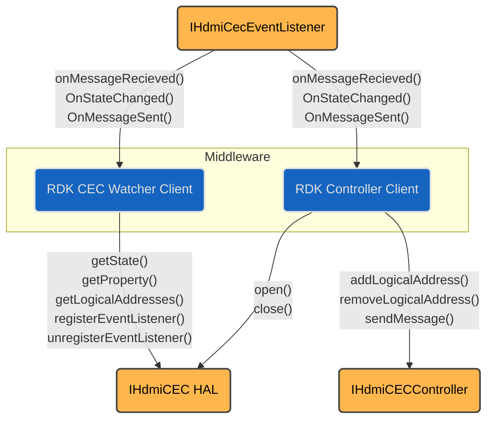
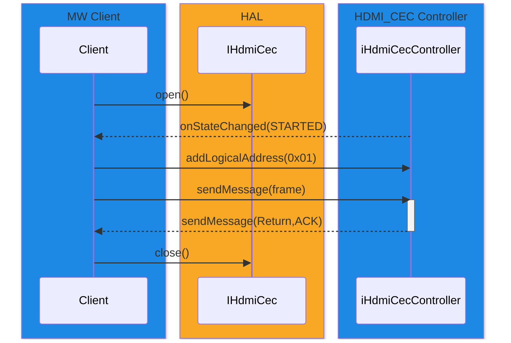
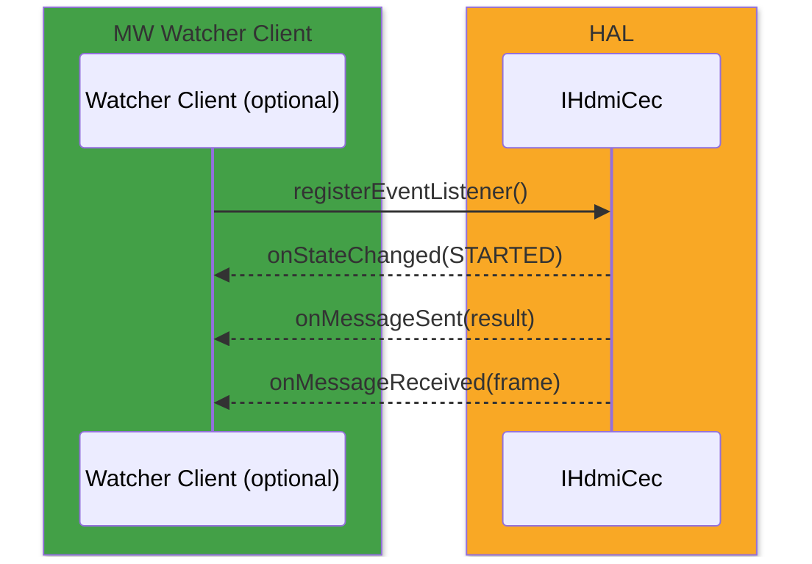

# HDMI CEC

## References

The HDMI-CEC HAL provides low-level bus access for Consumer Electronics Control (CEC) as defined by HDMI 1.4b. It exposes primitives to open/close the controller, add/remove logical addresses, transmit fully-formed frames, and receive both directed and broadcast frames. The HAL performs the *low-level protocol* only (electrical timing, arbitration, retries, ACK sampling). High-level protocol (device discovery, logical address allocation, message semantics) remains in middleware (RDK-E MW).

---

!!! info "References"
    |Reference|Link|
    |-|-|
    |**Interface Definition**|[hdmicec/current](https://github.com/rdkcentral/rdk-halif-aidl/tree/main/hdmicec/current)|
    |**HAL Interface Type**|[AIDL and Binder](../../../introduction/aidl_and_binder.md)|
    |**[1] High Definition Multimedia Specification 1.4b**|[Available from hdmi.org](https://www.hdmi.org/spec/hdmi1_4b)|
    |**[2] High Definition Multimedia Interface Specification 2.1**|[Available from hdmi.org](https://www.hdmi.org/spec/index)|

!!! info "Abbreviations"
    | Abbreviation | Description                                                                                               |
    | ------------ | --------------------------------------------------------------------------------------------------------- |
    | **CEC**      | Consumer Electronics Control — HDMI sideband protocol for device control.                                 |
    | **HDMI**     | High-Definition Multimedia Interface.                                                                     |
    | **HAL**      | Hardware Abstraction Layer — provides a uniform interface to platform drivers.                            |
    | **MW**       | Middleware — RDK-E layer implementing high-level protocol and system logic.                               |
    | **HPD**      | Hot Plug Detect — HDMI signal indicating connection/EDID availability.                                    |
    | **EDID**     | Extended Display Identification Data — sink-provided data describing display capabilities.                |
    | **ACK**      | Acknowledge — CEC bus bit set by addressed follower to confirm reception.                                 |
    | **NACK**     | Negative Acknowledge — absence of ACK for a direct message, or explicit rejection of a broadcast message. |
    | **Tx**       | Transmit — sending a CEC message on the bus.                                                              |
    | **Rx**       | Receive — receiving a CEC message from the bus.                                                           |
    | **VTS**      | Vendor Test Suite — conformance test suite for HAL validation.                                            |

This document serves as a **placeholder**.

- **Scope:** CEC *link layer* and *frame I/O* per HDMI-CEC 1.4b (electricals, timings, ACK/NAK, arbitration, retries). MW owns CEC high-level protocol.
- **Tx model:** Synchronous `sendMessage()`; HAL blocks until ACK sampled or timeout after HAL-internal retry policy; returns final status. Queueing is **not** provided by HAL (MW queues).
- **Rx model:**
    - Broadcast frames are delivered after `open()` (no logical address required).
    - Directed frames are delivered only for logical addresses currently added via `addLogicalAddress()`; HAL must ACK such frames at the wire level and forward them up.
- **HPD/EDID/Physical Address:** Out of scope for HAL; MW acquires physical address (EDID for Source, `0.0.0.0` for Sink) and manages HPD via `HDMI Input` (For Sink) / `HDMI Output` (For Source) HALs.
- **Controller client:** (mandatory) + optional *Watcher* clients (read-only diagnostics).

## Implementation Requirements

| **#**            | **Requirement**                                                                                                                                                                                                    | **Comments** |
|--------------|----------------------------------------------------------------------------------------------------------------------------------------------------------------------------------------------------------------|----------|
| **HAL.CEC.1**    | The CEC HAL and Device performs the CEC Low Level Protocol as defined by HDMI 1.4b [1].  Includes:  CEC 4 Electrical Specification,  CEC 5 Signalling and Bit Timings,  CEC 6 Frame Description,  CEC 7 Reliable Communication Mechanisms,  CEC 9 Arbitration. |          |
| **HAL.CEC.2**    | The CEC Controller Client performs the CEC High Level Protocol as defined by HDMI 1.4b [1].  Includes: CEC 3 High Level Protocol.                                                                            |          |
| **HAL.CEC.3**    | The CEC HAL and Device must transmit messages sent by the Controller Client.                                                                                                                                   |          |
| **HAL.CEC.4**    | The Controller Client must pass fully formed message frames to the CEC HAL. Each message must contain a header block and associated data blocks without start, EOM, and ACK bits.                              |          |
| **HAL.CEC.5**    | The CEC HAL and Device must report to the Controller Client the status of the ACK bit following message transmission.                                                                                          |          |
| **HAL.CEC.6**    | The CEC HAL and Device must acknowledge directed messages with destination Logical Address matching a Logical Address set by the Controller Client.                                                             |          |
| **HAL.CEC.7**    | The CEC HAL and Device must forward all acknowledged directly addressed messages to the Controller Client (and other Watcher Clients).                                                                         |          |
| **HAL.CEC.8**    | The CEC HAL and Device must forward all broadcast messages to the Controller Client (and other Watcher Clients).                                                                                              |          |
| **HAL.CEC.9**    | The Controller Client must perform the Logical Address allocation as defined by HDMI 1.4b Section 10.2 Logical Addressing.                                                                                     |          |
| **HAL.CEC.10**   | For a source HDMI device, it is the responsibility of the Controller Client to correctly handle the Device Hot Plug Detect signal generated by the HDMI device and the callbacks from the `IHdmiSource` interface. |          |
| **HAL.CEC.11**   | For a source HDMI device, on detecting the de-assertion of HPD the Controller Client must remove all logical addresses. This may be done by closing an opened `IHdmiCecController` interface, or explicitly removing all previously added logical addresses. |          |

## Interface Definitions

The latest interface can be found by following this [hdmi cec link](https://github.com/rdkcentral/rdk-halif-aidl/tree/main/hdmi_cec)

| Interface                        | Description                                                                                                                             |
| --------------------------------- | -------------------------------------------------------------------------------------------------------------------------------------- |
| `IHdmiCec.aidl`                   | HAL service interface, will be initialised by `systemd` vendor layer initialisation.                                                    |
| `IHdmiCecController.aidl`         | Main control plane: `open/close`, `addLogicalAddress/removeLogicalAddress`, `sendMessage`, state queries, event listener registration. |
| `IHdmiCecEventListener.aidl`      | Event notifications for watcher/diagnostic clients (read-only message and state observation).                                          |
| `Property.aidl`                   | Key/value pairs for querying device or HAL properties.                                                                                 |
| `SendMessageStatus.aidl`          | Enum defining possible results of a transmit attempt (e.g., SUCCESS, NACK, BUS_BUSY, TIMEOUT, ERROR).                                  |
| `State.aidl`                      | Enum defining possible interface states (e.g. CLOSED, STARTED)                                                                         |

---

## Initialization

As part of the vendor layer initialisation the `hdmicec` interface will be started. It should include `Wants` or `Requires` directives to ensure that any platform driver services it depends on are started first.

The CEC HAL service depends on the Service Manager to register itself as a service.

Upon starting, the service shall register the `IHdmiCec` interface with the Service Manager using the string `IHdmiCec.serviceName` and immediately becomes operational. It will be in the `CLOSED` state.

---

## System Context

The HDMI-CEC HAL sits between RDK Middleware clients and the SoC CEC driver. Two categories of clients interact with it:

- **CEC Controller Client** – the mandatory client that controls the HAL session, installs logical addresses, sends CEC frames, and receives directed/broadcast traffic.
- **CEC Watcher Client** – an optional client used for monitoring and diagnostics. It does not send messages, but may observe received traffic and state changes.

The HAL itself exposes the `IHdmiCec` and `IHdmiCecController` interfaces, with listener callbacks delivered via `IHdmiCecEventListener`.

Key points from the component diagram:

- The **Controller Client** owns the lifecycle: it calls `open()`, `addLogicalAddress()`, and `sendMessage()`.
- The **Watcher Client** registers an `IHdmiCecEventListener` for passive observation of messages and state.
- The HAL dispatches events back through listener interfaces:
- `HdmiCecEventListener` for session-driving feedback and for diagnostics/monitoring (`onMessageSent()`, `onMessageReceived()`, `onStateChanged()`).

### Runtime Interaction

#### Client Controller

### Flow summary Client Controller

1. Middleware Controller Client opens the HAL and adds logical addresses after allocation.
2. When it transmits a frame, the HAL handles arbitration and retries at the bus level, returning a `SendMessageStatus` to the Controller.
3. Both directed and broadcast messages received are forwarded to registered Controller Client.
4. State changes (e.g., STARTED, CLOSED, or error states) are reported to the listener.

#### Watcher Client

### Flow summary Event Watcher

1. Middleware Event Watcher registers for events using `registerEventListener()`.
2. Both directed and broadcast messages received are forwarded to registered Watcher Clients.
3. State changes (e.g., STARTED, CLOSED, or error states) are reported to the listener.

## Resource Management

- **Open/Close:** `open()` acquires the controller; `close()` removes addresses and releases hardware.
- **Logical Addressing:** Controller must call `addLogicalAddress()` after successful poll-based allocation. `removeLogicalAddress()` when device not ready (e.g., HPD down, deep sleep).
- **Concurrency:** Single controller client; HAL serialises Tx; one message in flight. Watchers are passive.
- **Crash/Exit:** HAL should auto-reclaim resources and clear any addresses if the client disconnects.

## Operation and Data Flow

- **Transmit:** Controller provides raw frame bytes (header + data). HAL performs bus access, arbitration, retry (per HDMI-CEC reliable comms) and returns `ACK_STATE/BUSY` status.
- **Receive:**
    - Broadcast frames always forwarded post `open()`.
    - Directed frames are ACKed and delivered only for active logical addresses.
- **Back-pressure:** Only one Tx at a time; additional sends return BUSY or are rejected until prior Tx completes. Rx is event-driven to listeners.

## Event Handling

- **`onMessageReceived(MessageFrame)`** — Delivered in receive order; includes source/destination Logical Address, data.
- **`onMessageSent(MessageTxResult)`** — Fires after Tx completes with `ACK_STATE/BUSY`.
- **`onStateChanged(State)`** — `CLOSED`→`STARTED`; `STARTED`→`CLOSED`
- **Ordering:** Within a connection, events are ordered by occurrence; Tx result precedes subsequent Rx from that transmission window where applicable.

## State Machine / Lifecycle

States: `CLOSED` → `STARTED`

- `CLOSED`: Not opened; no Rx/Tx; does not ACK directed frames.
- `STARTED`: Opened; may ACK directed frames for installed addresses; Tx/Rx active.

Transitions:

- `open()` success: `CLOSED`→`STARTED` (emit `onStateChanged(STARTED)`).
- `close()` success: `STARTED`→`CLOSED` (emit `onStateChanged(CLOSED)`).
- `addLogicalAddress()`/`removeLogicalAddress()` do **not** change global state.

## Data Format / Protocol Support

| Format              | Use Case                             | Support  |
| ------------------- | ------------------------------------ | -------- |
| Raw CEC frame bytes | All CEC commands (per HDMI-CEC 1.4b) | Required |

!!! note "Note"
    **Command-level parsing/semantics live in MW; HAL treats frames as opaque.**
