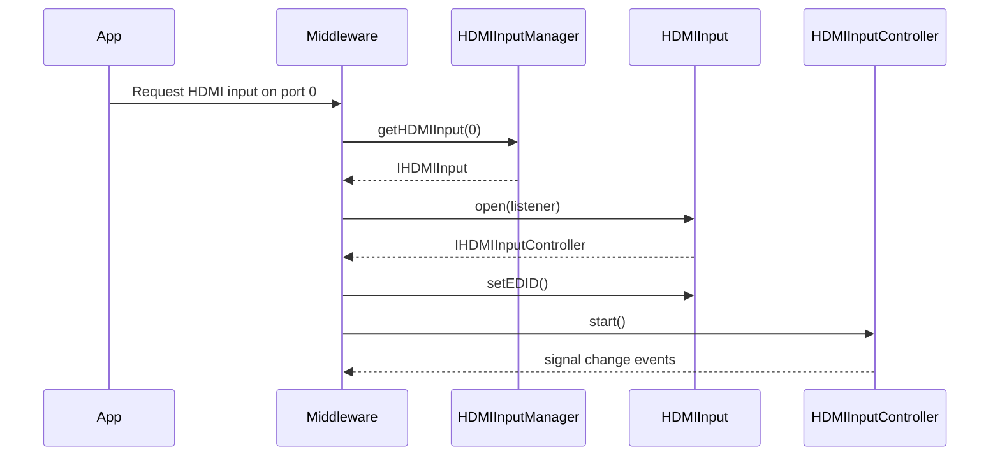
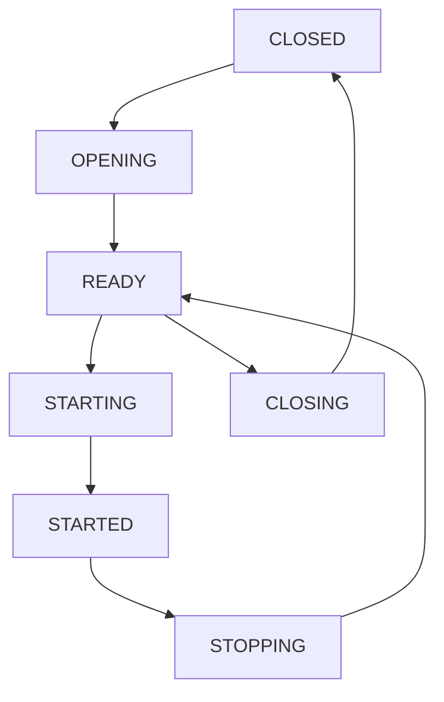

# HDMI Input HAL Interface

## Overview

The HDMI Input HAL provides control and monitoring of HDMI input ports on the platform. It abstracts hardware-specific HDMI behaviours, such as EDID delivery, HDCP authentication, signal detection, and InfoFrame processing, into a uniform interface for use by middleware or applications.

This interface is intended to be used by the HDMI input management components in the RDK platform. It supports multiple HDMI ports, each with its own capabilities, state machine, and controller interface.

This HAL excludes HDMI_CEC and video plane attachment logic, which are managed by [plane_control](../../plane_control/current/plane_control.md) and [HDMI_CEC](../../cec/current/cec.md).

---

!!! info "References"
    |||
    |-|-|
    | **Interface Definition**     | [hdmiinput](https://github.com/rdkcentral/rdk-halif-aidl/tree/main/hdmiinput/current/com/rdk/hal/hdmiinput)                                     |
    | **API Documentation**        | TBD                                                         |
    | **HAL Interface Type**       | [AIDL and Binder](../../../introduction/aidl_and_binder.md) |
    | **Initialization Unit**      | [systemd service](../../../vsi/systemd/current/systemd.md)  |
    | **VTS Tests**                | TBD                                                         |
    | **vDevice Reference Implementation** | [GitHub/Repo link - TBD]                                         |

---

!!! tip "Related Pages"
    - [HAL Feature Profile](../../key_concepts/hal/hal_feature_profiles.md)
    - [HAL Interface Overview](../../key_concepts/hal/hal_interfaces.md)
    - [HAL HDMI Output](../../hdmi_output/current/hdmi_output.md)

## Functional Overview

Each HDMI input port is exposed as an `IHDMIInput` interface. Clients can:

* Query static `Capabilities`
* Open the port to acquire an `IHDMIInputController`
* Start or stop the HDMI Input signal
* Set or retrieve the EDID
* Receive notifications about InfoFrames, signal format changes, and HDCP status via callbacks

The `IHDMIInputManager` provides discovery of port IDs and exposes global `PlatformCapabilities`.

---

## Implementation Requirements

| #                   | Requirement                                               | Comments                              |
| ------------------- | --------------------------------------------------------- | ------------------------------------- |
| **HAL.HDMIINPUT.1** | AVMUTE shall be handled internally to blank AV            | Mandatory for HDCP silence periods    |
| **HAL.HDMIINPUT.2** | No HDCP re-auth should occur on VIC or colour mode change | For seamless format switching         |
| **HAL.HDMIINPUT.3** | Must enforce SVP when HDCP 2.2 is engaged                 | Secure Video Path required            |
| **HAL.HDMIINPUT.4** | CEC remains active even in CLOSED state                   | Required for hotplug detection        |
| **HAL.HDMIINPUT.5** | HPD is unasserted until `STARTED` state                   | Avoid false negotiation before config |

---

## Interface Definitions

| AIDL File                                                                                      | Description                                      |
| ---------------------------------------------------------------------------------------------- | ------------------------------------------------ |
| `IHDMIInput.aidl`                                                                              | Main HDMI input interface per port               |
| `IHDMIInputManager.aidl`                                                                       | Discovery and global capabilities interface      |
| `IHDMIInputController.aidl`                                                                    | Per-port controller methods (start/stop/etc.)    |
| `IHDMIInputControllerListener.aidl`                                                            | Controller-side event listener                   |
| `IHDMIInputEventListener.aidl`                                                                 | Lifecycle state changes                          |
| `Capabilities.aidl`                                                                            | Static per-port capabilities                     |
| `PlatformCapabilities.aidl`                                                                    | Platform-wide constraints                        |
| `Property.aidl`                                                                                | Supported key/value property enum                |
| `PropertyKVPair.aidl`                                                                          | Key/value property parcelable (to be deprecated) |
| `HDMIVersion.aidl`, `VIC.aidl`, `HDCPProtocolVersion.aidl`, `HDCPStatus.aidl`, `FreeSync.aidl` | Enums and constants used throughout              |
| `State.aidl`                                                                                   | State machine for HDMI input lifecycle           |
| `SignalState.aidl`                                                                             | HDMI signal state enum                           |

---

## Initialization

* On startup, the HAL registers the HDMI Input Manager service with the service manager (`IHDMIInputManager`).
* Middleware discovers available HDMI input ports using `getHDMIInputIds()`.
* For each port (if the default EDID is not suitable):
  * Get default EDID for version from `getDefaultEDID()`
  * Open the port via `open()`, receiving an `IHDMIInputController`
  * Modify and apply via `setEDID()`
* Attach video to a plane when needed, then call `start()`
* To stop, call `stop()` then detach video source

---

## Product Customization

Each HDMI input resource:

* Is uniquely identified via `IHDMIInput.Id`
* Declares capabilities like `supportedVICs`, `supportedHDCPProtocolVersions`, and feature flags (e.g., `supportsVRR`, `supportsQFT`)
* May be limited by platform-wide rules, e.g. `maximumConcurrentStartedPorts`

---

## System Context



---

## Resource Management

* A port must be opened via `open()` before use.
* If a custom EDID is not set before opening, the default EDID will be used.
    * To change the EDID, the interface must be in the READY state (i.e., stopped).
* Only one client can hold the controller.
* `close()` is required to release the resource.

---

## Operation and Data Flow

* AV data flows from the HDMI input source once `start()` is called
* InfoFrames and format events are reported via `IHDMIInputControllerListener`
* EDID determines advertised modes
* HDCP status and authentication is actively reported

---

## Modes of Operation

* Modes like VRR, QMS, ALLM, QFT are declared in capabilities
* FreeSync level is reported per platform (`PlatformCapabilities.freeSync`) and per port (`Capabilities.supportsFreeSync`)
* Format switching via VIC triggers `onVideoFormatChanged()`

---

## Controller Event Listener (IHDMIInputControllerListener)

| Event                              | Description                                                        |
| ---------------------------------- | ------------------------------------------------------------------ |
| `onConnectionStateChanged(state)`  | HDMI device connection state change (hotplug, opening)             |
| `onSignalStateChanged(state)`      | HDMI signal state change (e.g., during STARTING/STOPPING)          |
| `onVideoFormatChanged(vic)`        | Video format (VIC) change from source                              |
| `onVRRChanged(...)`                | Variable Refresh Rate/Frame rate/VTEM event                        |
| `onAVIInfoFrame(data)`             | HDMI Auxiliary Video InfoFrame received                            |
| `onAudioInfoFrame(data)`           | HDMI Audio InfoFrame received                                      |
| `onSPDInfoFrame(data)`             | HDMI Source Product Description InfoFrame received                 |
| `onDRMInfoFrame(data)`             | HDMI Dynamic Range and Mastering InfoFrame received                |
| `onVendorSpecificInfoFrame(data)`  | HDMI Vendor Specific InfoFrame (VSIF) received                     |
| `onHDCPStatusChanged(status,ver)`  | HDCP status and protocol version change                            |
| `onEDIDChange(edid)`               | EDID changed via setEDID()                                         |

## Input Event Listener (IHDMIInputEventListener)

| Event                              | Description                                                        |
| ---------------------------------- | ------------------------------------------------------------------ |
| `onStateChanged(old, new)`         | HDMI input state transition                                        |
| `onEDIDChange(edid)`               | EDID changed via setEDID()                                         |

---

## State Machine / Lifecycle



---

## Platform Capabilities

The HAL Feature Profile (HFP) YAML file defines the overall set of capabilities, constraints, and configurations that a specific platform exposes to the RDK stack. It serves as a machine-readable declaration of both per-resource and platform-level support for each HAL interface.

For HDMI Input, the HFP defines:

* The list of HDMI input ports (`id`s) and their supported features (`Capabilities`)
* Supported HDMI versions, HDCP versions, and VICs per port
* Feature flags (e.g., `supportsVRR`, `supportsALLM`, `supportsQFT`, etc.)
* Platform-wide constraints under `platformCapabilities`, such as how many ports can be active at once or the maximum FreeSync level

This information is critical for:

* Middleware to make runtime decisions based on what is supported
* QA to validate expected behaviours against declared features
* Test infrastructure to scope the coverage of automated validation
* Certification to ensure the platform adheres to a consistent capability contract

Each platform variant must define its own HFP file, updated to reflect the actual feature set and hardware capabilities of the deployment.

---

## Example HAL Feature Profile (HFP) YAML

Below is an example of a HAL Feature Profile (HFP) YAML file for HDMI Input. This file defines the HDMI input ports, their capabilities, supported HDMI and HDCP versions, and platform-wide constraints. Each field is annotated to show its corresponding AIDL API field. Each platform should provide its own HFP file reflecting the actual hardware and feature set.

```yaml
# HDMI Input HAL Feature Profile (HFP)
#
# This file describes platform support for the HDMI Input HAL only.
# All field and enum names match the AIDL API exactly.

hdmiinput:
  interfaceVersion: current  # (optional) Version of the interface definition

  ports:
    - id: 0  # IHDMIInput.Id
      supportedVersions:     # Capabilities.supportedVersions[]
        - HDMI_1_3
        - HDMI_1_4
        - HDMI_2_0
        - HDMI_2_1
      supportedVICs:        # Capabilities.supportedVICs[]
        - VIC1_640_480_P_60_4_3
        - VIC16_1920_1080_P_60_16_9
        - VIC97_3840_2160_P_60_16_9
        - VIC118_3840_2160_P_120_16_9
      supportedHDCPProtocolVersions:  # Capabilities.supportedHDCPProtocolVersions[]
        - VERSION_1_X
        - VERSION_2_X
      supports3D: true      # Capabilities.supports3D
      supportsFRL: true     # Capabilities.supportsFRL
      supportsVRR: true     # Capabilities.supportsVRR
      supportsFreeSync: true # Capabilities.supportsFreeSync (only meaningful if supportsVRR is true)
      supportsQMS: true     # Capabilities.supportsQMS (requires supportsVRR to be true)
      supportsALLM: true    # Capabilities.supportsALLM
      supportsQFT: true     # Capabilities.supportsQFT
      supportsARC: true     # Capabilities.supportsARC
      supportsEARC: true    # Capabilities.supportsEARC

    - id: 1  # IHDMIInput.Id
      supportedVersions:
        - HDMI_1_4
        - HDMI_2_0
      supportedVICs:
        - VIC4_1280_720_P_60_16_9
        - VIC16_1920_1080_P_60_16_9
      supportedHDCPProtocolVersions:
        - VERSION_1_X
      supports3D: false
      supportsFRL: false
      supportsVRR: false
      supportsFreeSync: false
      supportsQMS: false
      supportsALLM: false
      supportsQFT: false
      supportsARC: true
      supportsEARC: false

  platformCapabilities:
    maximumConcurrentStartedPorts: 2  # PlatformCapabilities.maximumConcurrentStartedPorts
    freeSync: FREESYNC_PREMIUM_PRO    # PlatformCapabilities.freeSync

# Notes:
# - Only declare fields that are actually supported; omit or set to false otherwise.
# - supportedVICs must reflect actual hardware support, not full HDMI spec range.
# - Enum values must match those declared in the AIDL exactly (e.g., HDMI_2_1, VERSION_2_X).
```

This example declares two HDMI input ports, each with their own supported video formats (VICs), HDCP protocol versions, HDMI versions, and feature flags. The `platformCapabilities` section sets global constraints, such as the maximum number of concurrently started ports and FreeSync support level. Comments in the YAML show the mapping to the AIDL API.

For more details, see the Capabilities and PlatformCapabilities AIDL definitions and the YAML schema documentation.

