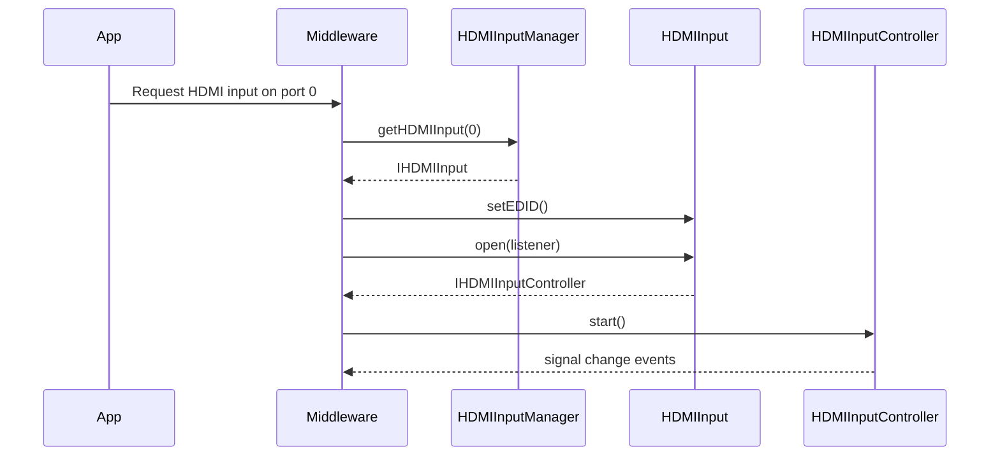
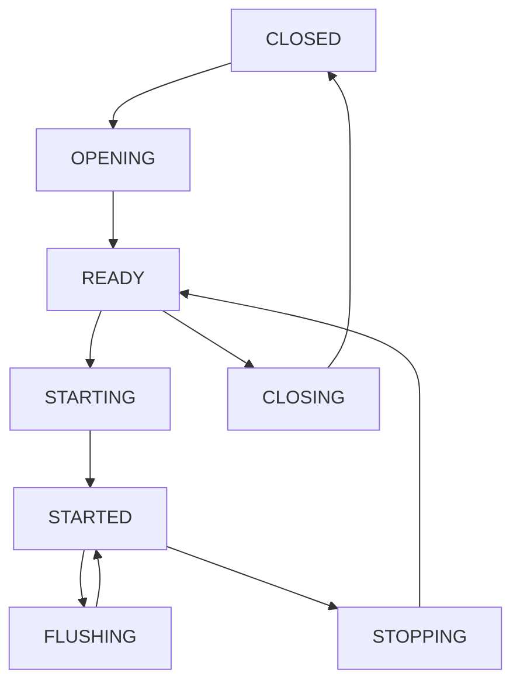

# HDMI Input HAL Interface

## Overview

The HDMI Input HAL provides control and monitoring of HDMI input ports on the platform. It abstracts hardware-specific HDMI behaviours, such as EDID negotiation, HDCP authentication, signal detection, and InfoFrame processing, into a uniform interface for use by middleware or applications.

This interface is intended to be used by the HDMI input management components in the RDK platform. It supports multiple HDMI ports, each with its own capabilities, state machine, and controller interface.

This HAL excludes HDMI-CEC and video plane attachment logic, which are managed elsewhere.

---

### References

!!! info References
    |||
    |-|-|
    | **Interface Definition**     | [hdmiinput](https://github.com/rdkcentral/rdk-halif-aidl/tree/main/hdmiinput/current/com/rdk/hal/hdmiinput)                                     |
    | **API Documentation**        | TBD                                                         |
    | **HAL Interface Type**       | [AIDL and Binder](../../../introduction/aidl_and_binder.md) |
    | **Initialization Unit**      | [systemd service](../../../vsi/systemd/current/systemd.md)  |
    | **VTS Tests**                | TBD                                                         |
    | **vDevice Reference Implementation** | [GitHub/Repo link - TBD]                                         |

---

### Related Pages

!!! tip Related Pages
    - [HAL Feature Profile](../../key_concepts/hal/hal_feature_profiles.md)
    - [HAL Interface Overview](../../key_concepts/hal/hal_interfaces.md)
    - [HAL HDMI Output](../../hdmi_output/current/hdmi_output.md)

## Functional Overview

Each HDMI input port is exposed as an `IHDMIInput` interface. Clients can:

* Query static `Capabilities`
* Open the port to acquire an `IHDMIInputController`
* Start or stop the signal
* Set or retrieve the EDID
* Receive notifications about InfoFrames, signal format changes, and HDCP status via callbacks

The `IHDMIInputManager` provides discovery of port IDs and exposes global `PlatformCapabilities`.

---

## Implementation Requirements

| #                   | Requirement                                               | Comments                              |
| ------------------- | --------------------------------------------------------- | ------------------------------------- |
| **HAL.HDMIINPUT.1** | AVMUTE shall be handled internally to blank AV            | Mandatory for HDCP silence periods    |
| **HAL.HDMIINPUT.2** | No HDCP re-auth should occur on VIC or colour mode change | For seamless format switching         |
| **HAL.HDMIINPUT.3** | Must enforce SVP when HDCP is engaged                     | Secure Video Path required            |
| **HAL.HDMIINPUT.4** | CEC remains active even in CLOSED state                   | Required for hotplug detection        |
| **HAL.HDMIINPUT.5** | HPD must be unasserted until EDID is set                  | Avoid false negotiation before config |

---

## Interface Definitions

| AIDL File                                                                                      | Description                                      |
| ---------------------------------------------------------------------------------------------- | ------------------------------------------------ |
| `IHDMIInput.aidl`                                                                              | Main HDMI input interface per port               |
| `IHDMIInputManager.aidl`                                                                       | Discovery and global capabilities interface      |
| `IHDMIInputController.aidl`                                                                    | Per-port controller methods (start/stop/etc.)    |
| `IHDMIInputControllerListener.aidl`                                                            | Controller-side event listener                   |
| `IHDMIInputEventListener.aidl`                                                                 | Lifecycle state changes                          |
| `Capabilities.aidl`                                                                            | Static per-port capabilities                     |
| `PlatformCapabilities.aidl`                                                                    | Platform-wide constraints                        |
| `Property.aidl`                                                                                | Supported key/value property enum                |
| `PropertyKVPair.aidl`                                                                          | Key/value property parcelable (to be deprecated) |
| `HDMIVersion.aidl`, `VIC.aidl`, `HDCPProtocolVersion.aidl`, `HDCPStatus.aidl`, `FreeSync.aidl` | Enums and constants used throughout              |

---

## Initialization

* On startup, the HAL registers the HDMI Input Manager service with the service manager (`IHDMIInputManager`).
* Middleware discovers available HDMI input ports using `getHDMIInputIds()`.
* For each port:
  * Get default EDID for version from `getDefaultEDID()`
  * Modify and apply via `setEDID()`
  * Open the port via `open()`, receiving an `IHDMIInputController`
* Attach video to a plane when needed, then call `start()`
* To stop, call `stop()` then detach video source

---

## Product Customization

Each HDMI input resource:

* Is uniquely identified via `IHDMIInput.Id`
* Declares capabilities like `supportedVICs`, `supportedHDCPProtocolVersions`, and feature flags (e.g., `supportsVRR`, `supportsQFT`)
* May be limited by platform-wide rules, e.g. `maximumConcurrentStartedPorts`

---

## System Context

---

## Resource Management

* A port must be opened via `open()` before use.
* A valid EDID must be set before open.
* Only one client can hold the controller.
* `close()` is required to release the resource.
* Crashed clients are automatically cleaned up.

---

## Operation and Data Flow

* AV data flows from the HDMI input source once `start()` is called
* InfoFrames and format events are reported via `IHDMIInputControllerListener`
* EDID determines advertised modes
* HDCP status and authentication is actively reported

---

## Modes of Operation

* Modes like VRR, QMS, ALLM, QFT are declared in capabilities
* FreeSync level is reported per platform (`PlatformCapabilities.freeSync`) and per port (`Capabilities.supportsFreeSync`)
* Format switching via VIC triggers `onVideoFormatChanged()`

---

## Event Handling

| Event                                          | Description                                  |
| ---------------------------------------------- | -------------------------------------------- |
| `onStateChanged(old, new)`                     | Lifecycle transition of the HDMI input state |
| `onConnectionStateChanged()`                   | Fired during OPENING or hotplug              |
| `onSignalStateChanged()`                       | Fired during STARTING to indicate AV signal  |
| `onVideoFormatChanged(vic)`                    | When source changes VIC format               |
| `onVRRChanged(...)`                            | VRR metadata events                          |
| `onHDCPStatusChanged()`                        | Status changes in authentication             |
| `onAVIInfoFrame()`, `onAudioInfoFrame()`, etc. | HDMI InfoFrame reception                     |

---

## State Machine / Lifecycle

---

## Platform Capabilities

The HAL Feature Profile (HFP) YAML file defines the overall set of capabilities, constraints, and configurations that a specific platform exposes to the RDK stack. It serves as a machine-readable declaration of both per-resource and platform-level support for each HAL interface.

For HDMI Input, the HFP defines:

* The list of HDMI input ports (`id`s) and their supported features (`Capabilities`)
* Supported HDMI versions, HDCP versions, and VICs per port
* Feature flags (e.g., `supportsVRR`, `supportsALLM`, `supportsQFT`, etc.)
* Platform-wide constraints under `platformCapabilities`, such as how many ports can be active at once or the maximum FreeSync level

This information is critical for:

* Middleware to make runtime decisions based on what is supported
* QA to validate expected behaviours against declared features
* Test infrastructure to scope the coverage of automated validation
* Certification to ensure the platform adheres to a consistent capability contract

Each platform variant must define its own HFP file, updated to reflect the actual feature set and hardware capabilities of the deployment.

---
