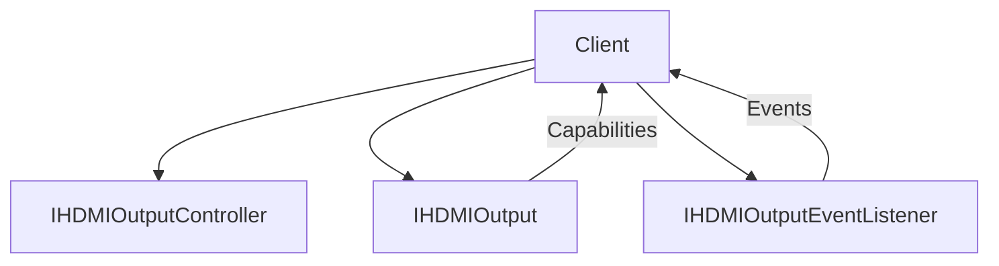

# HDMIOutput HAL Interface

## Overview

The `HDMIOutput` HAL interface manages the configuration and control of HDMI output ports on the platform. It provides abstraction over HDMI-specific signalling, capabilities negotiation (such as EDID, VICs, and HDCP), and output control modes. This interface ensures consistent interaction with higher layers (such as the RDK display manager or AV controller) while remaining agnostic to platform-specific HDMI PHY and driver implementations.

This HAL does not manage audio routing (delegated to `AudioSink`) or video plane composition (delegated to `PlaneControl`).

---

## References

!!! info References
    |||
    |-|-|
    |                                      |                                                               |
    | ------------------------------------ | ------------------------------------------------------------- |
    | **Interface Definition**             | [hdmioutput](https://github.com/rdkcentral/rdk-halif-aidl/tree/main/hdmioutput/current/com/rdk/hal/hdmioutput) |
    | **API Documentation**                | TBD                                                           |
    | **HAL Interface Type**               | [AIDL and Binder](../../../introduction/aidl_and_binder.md)   |
    | **Initialization Unit**              | [systemd service](../../../vsi/systemd/current/systemd.md)    |
    | **VTS Tests**                        | TBD                                                           |
    | **vDevice Reference Implementation** | TBD                                                           |

---

## Related Pages

!!! tip Related Pages
    * [HAL Feature Profile](../../key_concepts/hal/hal_feature_profiles.md)
    * [HAL Interface Overview](../../key_concepts/hal/hal_interfaces.md)
    * [Display Pipeline Overview](../../display/architecture.md)

---

## Functional Overview

The `HDMIOutput` HAL provides control over:

* HDMI video output formats (VIC selection)
* Colorimetry and pixel formats
* HDCP capability negotiation and status reporting
* Output connection events (e.g., hotplug detection)
* SPD InfoFrame and AFD metadata
* Output modes, such as SDR/HDR

---

## Implementation Requirements

| #                    | Requirement                                                               | Comments                                          |
| -------------------- | ------------------------------------------------------------------------- | ------------------------------------------------- |
| **HAL.HDMIOutput.1** | The service shall support enumeration of connected HDMI outputs.          | Use `IHDMIOutputManager.listHdmiOutputs()`        |
| **HAL.HDMIOutput.2** | The service shall allow clients to set the VIC for an HDMI output.        | See `IHDMIOutputController.setVideoMode()`        |
| **HAL.HDMIOutput.3** | The service shall emit events on hotplug connect/disconnect.              | Via `IHDMIOutputEventListener.onHotplugChanged()` |
| **HAL.HDMIOutput.4** | The implementation shall expose EDID capabilities through `Capabilities`. | See `getCapabilities()`                           |

---

## Interface Definitions

| AIDL File                              | Description                                                          |
| -------------------------------------- | -------------------------------------------------------------------- |
| `IHDMIOutput.aidl`                     | Main interface for querying output state and capabilities            |
| `IHDMIOutputController.aidl`           | Allows clients to control and configure HDMI output formats          |
| `IHDMIOutputManager.aidl`              | Resource discovery for multi-output devices                          |
| `IHDMIOutputEventListener.aidl`        | Event listener interface for HDMI-related events                     |
| `Capabilities.aidl`                    | Describes supported video formats, pixel formats, color spaces, etc. |
| `HDCPStatus.aidl`                      | Enum for HDCP authentication states                                  |
| `HDROutputMode.aidl`                   | HDR mode declaration                                                 |
| `SPDSource.aidl`                       | Enum for identifying SPD signal types                                |
| `VIC.aidl`                             | Enum for HDMI Video ID Codes                                         |
| `Property.aidl`, `PropertyKVPair.aidl` | General key-value properties and HDMI metadata support               |

---

## Initialization

The HAL service should be initialized via a systemd unit and must register with the Service Manager under a stable name (e.g., `android.hardware.hdmioutput.IHDMIOutput/default`). It must be ready before middleware components attempt to query or bind.

---

## Product Customization

* Each HDMI port is exposed as a resource instance via `IHDMIOutputManager`
* Capabilities per resource are exposed via `Capabilities` and may vary per port (e.g., 4K vs 1080p support)
* SPD and AFD support are optional; presence is indicated in `Capabilities`

---

## System Context

---

## Resource Management

* HDMI outputs are identified by logical IDs.
* Each output may have an independent controller and state.
* Event listeners can be registered/unregistered dynamically.

---

## Operation and Data Flow

* Clients query supported modes via `getCapabilities()`
* Desired mode is set using `IHDMIOutputController.setVideoMode()`
* EDID and HDCP status are read-only and polled or event-driven
* SPD InfoFrames and AFD metadata are queried or emitted if supported

---

## Modes of Operation

* SDR (Standard Dynamic Range)
* HDR10
* HLG (Hybrid Log-Gamma)
* Modes are applied per port and negotiated based on sink capabilities

---

## Event Handling

| Event       | Callback               | Description                                          |
| ----------- | ---------------------- | ---------------------------------------------------- |
| Hotplug     | `onHotplugChanged()`   | Notifies client when a cable is connected or removed |
| Mode change | `onVideoModeChanged()` | Indicates that HDMI video output mode has changed    |
| HDCP        | `onHdcpStateChanged()` | HDCP authentication state updates                    |

---

## State Machine / Lifecycle

1. **UNAVAILABLE**: No HDMI sink detected
2. **AVAILABLE**: Sink detected, capabilities read
3. **CONFIGURED**: VIC set and HDMI signal configured
4. **ERROR**: Error state due to HDCP failure or signal loss

---

## Data Format / Protocol Support

| Format | Use Case                   | Support Level |
| ------ | -------------------------- | ------------- |
| VIC    | HDMI video mode definition | Mandatory     |
| SPD    | Source Product InfoFrame   | Optional      |
| AFD    | Active Format Description  | Optional      |

---

## Platform Capabilities

* Maximum resolution: 3840x2160
* Maximum frame rate: 60Hz
* Supports HDR10 and HLG
* HDCP 1.4 and 2.2 supported
* Hotplug event delivery enabled

