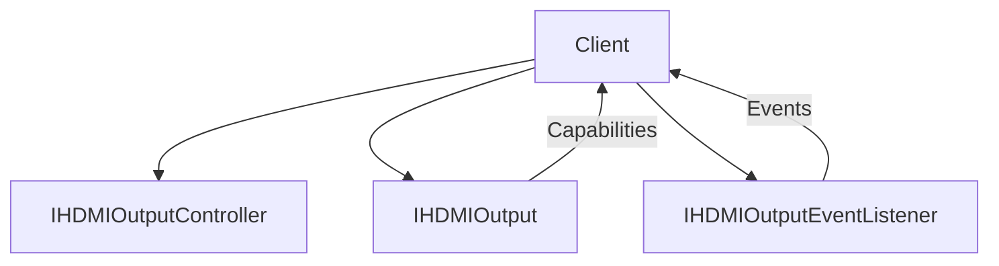
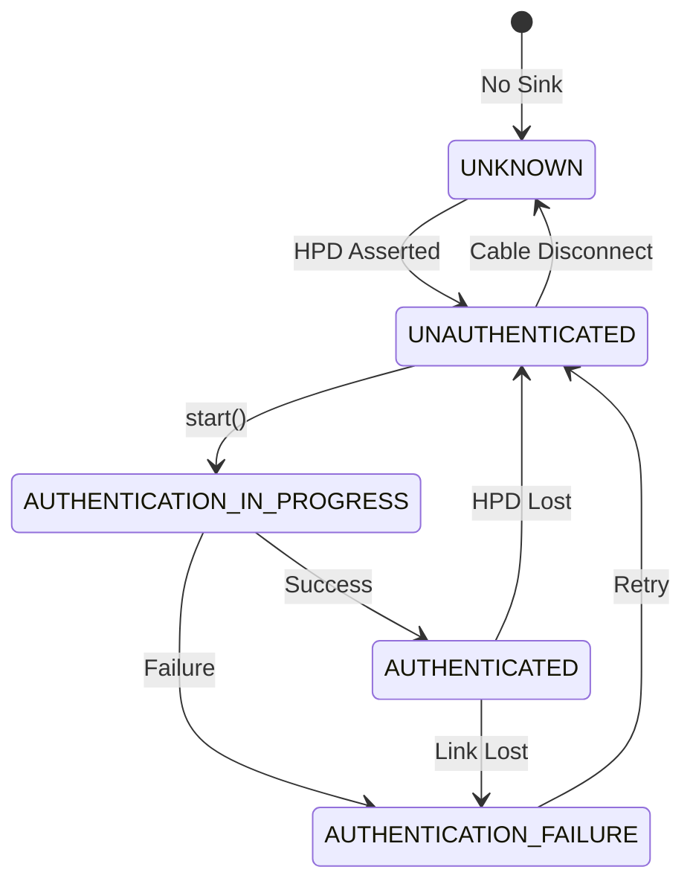
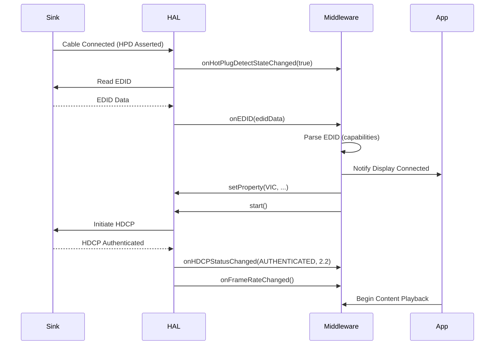
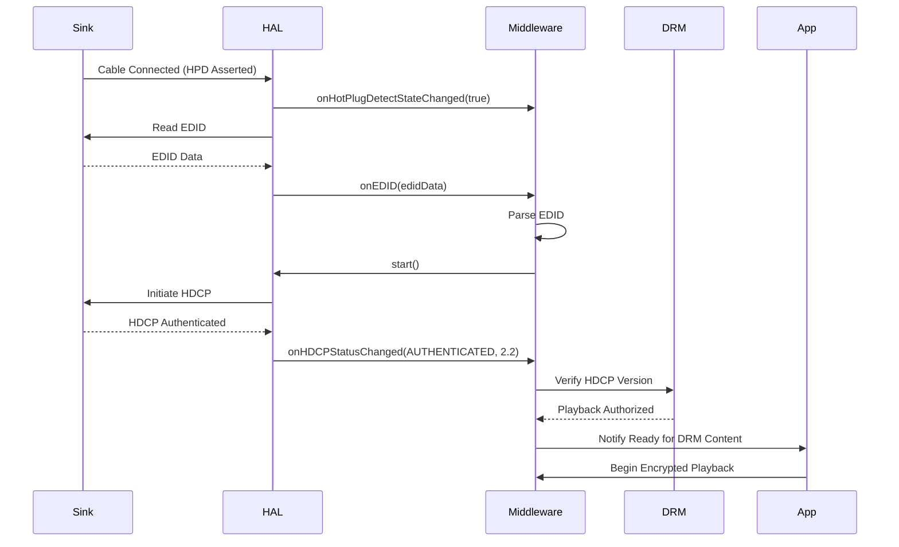
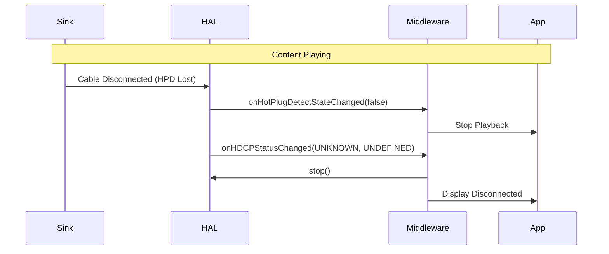
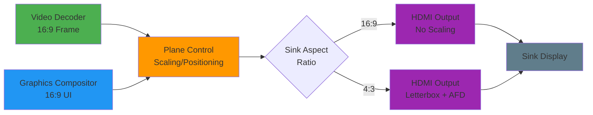

# HDMIOutput HAL Interface

## Overview

The `HDMIOutput` HAL interface manages the configuration and control of HDMI output ports on the platform. It provides abstraction over HDMI-specific signalling, capabilities negotiation (such as EDID, VICs, and HDCP), and output control modes. This interface ensures consistent interaction with higher layers (such as the RDK display manager or AV controller) while remaining agnostic to platform-specific HDMI PHY and driver implementations.

This HAL does not manage audio routing (delegated to `AudioSink`) or video plane composition (delegated to `PlaneControl`).

---

## References

!!! info References
    |||
    |-|-|
    |                                      |                                                               |
    | ------------------------------------ | ------------------------------------------------------------- |
    | **Interface Definition**             | [hdmioutput](https://github.com/rdkcentral/rdk-halif-aidl/tree/main/hdmioutput/current/com/rdk/hal/hdmioutput) |
    | **API Documentation**                | TBD                                                           |
    | **HAL Interface Type**               | [AIDL and Binder](../../../introduction/aidl_and_binder.md)   |
    | **Initialization Unit**              | [systemd service](../../../vsi/systemd/current/systemd.md)    |
    | **VTS Tests**                        | TBD                                                           |
    | **vDevice Reference Implementation** | TBD                                                           |

---

## Related Pages

!!! tip Related Pages
    * [HAL Feature Profile](../../key_concepts/hal/hal_feature_profiles.md)
    * [HAL Interface Overview](../../key_concepts/hal/hal_interfaces.md)
    * [Display Pipeline Overview](../../display/architecture.md)

---

## Functional Overview

The `HDMIOutput` HAL provides control over:

* HDMI video output formats (VIC selection)
* Colorimetry and pixel formats
* HDCP capability negotiation and status reporting
* Output connection events (e.g., hotplug detection)
* SPD InfoFrame and AFD metadata
* Output modes, such as SDR/HDR

---

## Implementation Requirements

| #                    | Requirement                                                               | Comments                                          |
| -------------------- | ------------------------------------------------------------------------- | ------------------------------------------------- |
| **HAL.HDMIOutput.1** | The service shall support enumeration of connected HDMI outputs.          | Use `IHDMIOutputManager.getHDMIOutputIds()`       |
| **HAL.HDMIOutput.2** | The service shall allow clients to configure HDMI output via property-based API. | See `IHDMIOutputController.setProperty()`        |
| **HAL.HDMIOutput.3** | The service shall emit events on hotplug connect/disconnect.              | Via `IHDMIOutputControllerListener.onHotPlugDetectStateChanged()` |
| **HAL.HDMIOutput.4** | The implementation shall expose EDID capabilities through `Capabilities`. | See `getCapabilities()`                           |
| **HAL.HDMIOutput.5** | No HDCP re-authentication shall be triggered on VIC or colour mode switch. | HDCP state must persist across mode changes      |
| **HAL.HDMIOutput.6** | AVMUTE shall be asserted by HAL implementation according to HDMI and HDCP specifications. | Vendor layer responsibility                       |
| **HAL.HDMIOutput.7** | When outputting to a 4:3 aspect ratio sink display, 16:9 composited graphics and video shall be letterboxed inside the 4:3 output frame with appropriate AFD signalling. | AFD shall indicate 16:9 content in 4:3 frame      |
| **HAL.HDMIOutput.8** | HDCP authentication shall initiate automatically immediately after device connection following `open()`. | Negotiate highest supported version (2.x over 1.x) |
| **HAL.HDMIOutput.9** | HDCP Key Revocation List (KRL) management is the vendor layer responsibility, updated only via firmware update. | |
| **HAL.HDMIOutput.10** | The HAL shall provide EDID data to RDK Middleware for parsing.           | Includes aspect ratio, dimensions, HDR support, pixel formats, HDMI version |

---

## Interface Definitions

| AIDL File                              | Description                                                          |
| -------------------------------------- | -------------------------------------------------------------------- |
| `IHDMIOutput.aidl`                     | Main interface for querying output state and capabilities            |
| `IHDMIOutputController.aidl`           | Allows clients to control and configure HDMI output formats          |
| `IHDMIOutputManager.aidl`              | Resource discovery for multi-output devices                          |
| `IHDMIOutputEventListener.aidl`        | Event listener interface for HDMI-related events                     |
| `Capabilities.aidl`                    | Describes supported video formats, pixel formats, color spaces, etc. |
| `HDCPStatus.aidl`                      | Enum for HDCP authentication states                                  |
| `HDROutputMode.aidl`                   | HDR mode declaration                                                 |
| `SPDSource.aidl`                       | Enum for identifying SPD signal types                                |
| `VIC.aidl`                             | Enum for HDMI Video ID Codes                                         |
| `Property.aidl`, `PropertyKVPair.aidl` | General key-value properties and HDMI metadata support               |

---

## Initialization

The HAL service should be initialized via a systemd unit and must register with the Service Manager under the name defined in `IHDMIOutputManager.serviceName` ("hdmioutput"). It must be ready before middleware components attempt to query or bind.

---

## Product Customization

* Each HDMI port is exposed as a resource instance via `IHDMIOutputManager`
* Capabilities per resource are exposed via `Capabilities` and may vary per port (e.g., 4K vs 1080p support)
* SPD and AFD support are optional; presence is indicated in `Capabilities`

---

## System Context



---

## Resource Management

* HDMI outputs are identified by logical IDs.
* Each output may have an independent controller and state.
* Event listeners can be registered/unregistered dynamically.

---

## Operation and Data Flow

* Clients query supported modes via `getCapabilities()`
* Desired mode is set using `IHDMIOutputController.setProperty()` with appropriate VIC and format properties
* EDID and HDCP status are read-only and polled or event-driven
* SPD InfoFrames and AFD metadata are queried or emitted if supported

---

## Modes of Operation

* SDR (Standard Dynamic Range)
* HDR10
* HLG (Hybrid Log-Gamma)
* Modes are applied per port and negotiated based on sink capabilities

---

## Event Handling

| Event       | Callback                         | Description                                          |
| ----------- | -------------------------------- | ---------------------------------------------------- |
| Hotplug     | `onHotPlugDetectStateChanged()`  | Notifies client when a cable is connected or removed |
| EDID Change | `onEDID()`                       | Indicates that sink EDID has changed                 |
| HDCP        | `onHDCPStatusChanged()`          | HDCP authentication state updates                    |

---

## State Machine / Lifecycle

1. **UNAVAILABLE**: No HDMI sink detected
2. **AVAILABLE**: Sink detected, capabilities read
3. **CONFIGURED**: VIC set and HDMI signal configured
4. **ERROR**: Error state due to HDCP failure or signal loss

---

## Data Format / Protocol Support

| Format | Use Case                   | Support Level |
| ------ | -------------------------- | ------------- |
| VIC    | HDMI video mode definition | Mandatory     |
| SPD    | Source Product InfoFrame   | Optional      |
| AFD    | Active Format Description  | Optional      |

---

## HDCP Authentication and Recovery

### HDCP State Machine



### HDCP Protocol Version Negotiation

- The HAL shall always attempt to negotiate the highest HDCP version supported by both source and sink
- Negotiation order: HDCP 2.3 → HDCP 2.2 → HDCP 1.4 → HDCP 1.0
- Version downgrade is automatic if higher versions fail authentication
- Current and receiver versions are exposed via `getHDCPCurrentVersion()` and `getHDCPReceiverVersion()`

### Authentication Failure Recovery

**Automatic Retry Strategy:**

1. On authentication failure, the HAL shall automatically retry up to 3 times with exponential backoff
2. Retry intervals: 100ms, 500ms, 1000ms
3. If all retries fail, the HAL transitions to `AUTHENTICATION_FAILURE` state
4. The middleware is notified via `onHDCPStatusChanged(AUTHENTICATION_FAILURE, version)`

**Middleware Recovery Options:**

- **Standby Cycle**: Middleware may trigger standby/wake cycle to force re-initialization
- **Close/Reopen**: Middleware may close and reopen the HDMI output via `IHDMIOutput.close()` and `open()`
- **Content Handling**: DRM-protected content playback must be suspended during authentication failure

### No-Sink Behaviour

**When no HDMI sink is attached:**

- The output remains in `READY` state after `open()` completes
- Hot Plug Detect (HPD) state is reported as `false` via `onHotPlugDetectStateChanged(false)`
- HDCP status remains `UNKNOWN`
- Graphics and video refresh rates default to platform-defined fallback (typically 60Hz)
- No HDMI signal is transmitted on the physical output
- Upon sink connection, `onHotPlugDetectStateChanged(true)` is fired, followed by `onEDID()`

---

## Hot Plug Scenarios

### Connect Sequence (No DRM Content)



### Connect Sequence (DRM Content)



### Disconnect Sequence



---

## Compositor Integration

### Aspect Ratio and Scaling Pipeline



**Scaling Responsibility:**

- **Plane Control HAL**: Handles video plane scaling and positioning within the compositor frame buffer
- **HDMI Output HAL**: Applies letterboxing when sink aspect ratio differs from compositor output
- **Middleware**: Configures appropriate VIC based on EDID and applies AFD metadata

**4:3 Display Handling:**

- Compositor produces 16:9 frame (e.g., 1920×1080)
- HDMI Output HAL selects 4:3 VIC (e.g., VIC 4: 720×480)
- Content is letterboxed with black bars top/bottom
- AFD InfoFrame indicates "16:9 content in 4:3 frame" for sink-side processing

---

## Platform Capabilities

Platform capabilities are defined in the HAL Feature Profile (HFP) and exposed at runtime via `IHDMIOutputManager.getCapabilities()` and per-resource `IHDMIOutput.getCapabilities()`.

### HAL Feature Profile Example

The HFP defines the maximum capabilities of the platform's HDMI output implementation. This is the reference for what the HAL API can deliver, though actual runtime capabilities may be constrained by hardware or sink limitations.

```yaml
hdmioutput:
  interfaceVersion: current

  resources:
    # Logical HDMI output port 0
    - id: 0

      # Supported Video ID Codes (VICs) - HDMI standardised video modes
      supportedVICs:
        - VIC4_1280_720_P_60_16_9         # 720p @ 60Hz
        - VIC16_1920_1080_P_60_16_9       # 1080p @ 60Hz
        - VIC97_3840_2160_P_60_16_9       # 4K UHD @ 60Hz

      # Colorimetry standards for colour space definition
      supportedColorimetry:
        - BT601      # Standard Definition
        - BT709      # High Definition
        - BT2020     # Ultra High Definition / Wide Colour Gamut

      # Pixel encoding formats
      supportedPixelFormats:
        - RGB        # Full RGB 4:4:4
        - YCBCR420   # Chroma subsampled 4:2:0
        - YCBCR422   # Chroma subsampled 4:2:2
        - YCBCR444   # Full chroma 4:4:4

      # HDCP protocol versions for content protection
      supportedHDCPVersions:
        - HDCP_1_4   # HDCP 1.4 (up to 1080p)
        - HDCP_2_2   # HDCP 2.2 (4K and HDR)

      # High Dynamic Range output modes
      supportedHDRModes:
        - HDR10      # HDR10 static metadata
        - HLG        # Hybrid Log-Gamma (broadcast HDR)

      # Content type signalling for AV routing
      supportedContentTypes:
        - SDR        # Standard Dynamic Range
        - HDR        # High Dynamic Range

      # Configurable properties via setProperty() API
      supportedProperties:
        - EOTF                       # Electro-Optical Transfer Function
        - MaxLuminance               # Peak display luminance (nits)
        - MinLuminance               # Minimum display luminance
        - MaxContentLightLevel       # Maximum content light level (HDR)
        - MaxFrameAverageLightLevel  # Maximum frame average light level (HDR)

      # Source Product Description (SPD) InfoFrame source types
      spdSources:
        - DTV        # Digital Television
        - DVD        # DVD Player
        - STB        # Set-Top Box

      # Event listener registration support
      supportsEventListener: true

  # Platform-wide static capabilities
  platformCapabilities:
    maxSupportedResolution: "3840x2160"   # 4K UHD maximum
    maxFramerate: 60                       # Hz
    supportsHotplugEvents: true            # HPD event delivery
    supportsAFD: true                      # Active Format Description signalling
    supportsSPDInfoFrame: true             # Source Product Description InfoFrame
```

### Capability Categories

**Video Mode Capabilities:**

* **VICs**: Standardised HDMI video modes (resolution, frame rate, aspect ratio)
* **Colorimetry**: Colour space standards (BT.601, BT.709, BT.2020)
* **Pixel Formats**: Encoding formats (RGB, YCbCr 4:2:0/4:2:2/4:4:4)

**Content Protection:**

* **HDCP Versions**: Supported HDCP protocol versions (1.4, 2.2, 2.3)
* **KRL Management**: Key Revocation List handling (vendor layer responsibility)

**HDR Support:**

* **HDR Modes**: HDR10, HLG, Dolby Vision (if supported)
* **Metadata**: EOTF, luminance ranges, content light levels

**InfoFrame Support:**

* **SPD**: Source Product Description for device identification
* **AFD**: Active Format Description for aspect ratio signalling
* **Vendor-Specific**: Platform-specific InfoFrame extensions

### Runtime Capability Discovery

**Platform-Level Query:**

```aidl
IHDMIOutputManager manager = /* get service */;
PlatformCapabilities platformCaps = manager.getCapabilities();
```

**Resource-Level Query:**

```aidl
IHDMIOutput.Id[] ids = manager.getHDMIOutputIds();
IHDMIOutput output = manager.getHDMIOutput(ids[0]);
Capabilities caps = output.getCapabilities();
```

**Example Platform Capabilities (Reference):**

* Maximum resolution: 3840×2160 (4K UHD)
* Maximum frame rate: 60Hz
* HDR support: HDR10, HLG
* HDCP versions: 1.4, 2.2
* Hotplug events: Supported
* AFD signalling: Supported
* SPD InfoFrame: Supported

---
