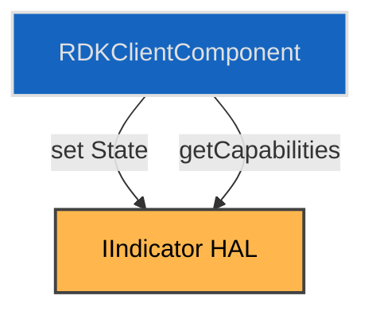

# Indicator HAL 

## Overview

The Indicator interface abstracts the control of physical device indicator states such as LEDs or light panels. It enables consistent interaction with platform-specific indicator hardware by exposing a set of standardised states and control methods. This abstraction allows upper layers of the stack, such as RDK services or UI components, to interact with indicators without requiring platform-specific logic.

The interface supports querying supported indicator states and managing the current state using a simple get/set API. Only one active state is permitted at a time, simplifying logic and promoting readability.

This HAL excludes support for complex LED animation patterns or simultaneous state composition, focusing instead on discrete system states (e.g., boot, WPS, error).

---

!!! info References

|                              |                                                                                                                   |
| ---------------------------- | ----------------------------------------------------------------------------------------------------------------- |
| **Interface Definition**     | [indicator/current](https://github.com/rdkcentral/rdk-halif-aidl/tree/main/indicator/current)                     |
| **API Documentation**        | TBD                                                                                                               |
| **HAL Interface Type**       | [AIDL and Binder](../../../introduction/aidl_and_binder.md)                           |
| **Initialization Unit**      | [systemd service](../../../vsi/systemd/current/systemd.md)                                                                                |
| **VTS Tests**                | TBD                                                                                                               |
| **Reference Implementation** | TBD                                                                                                               |
| **HAL Feature Profile**      | [hfp-indicator.yaml](https://github.com/rdkcentral/rdk-halif-aidl/tree/main/indicator/current/hfp-indicator.yaml) |

---

!!! tip Related Pages

* [HAL Feature Profile](../../key_concepts/hal/hal_feature_profiles.md)
* [HAL Interface Overview](../../key_concepts/hal/hal_interfaces.md)

---

## Functional Overview

Indicator provides platform abstraction for controlling system indicator elements (typically LEDs). It offers a limited, discrete set of states representing common system conditions such as power states, connectivity status (e.g., WPS), and error conditions. Clients can use this interface to reflect the current system state to the user through indicator hardware.

---

## Implementation Requirements

| #               | Requirement                                                       | Comments                                   |
| --------------- | ----------------------------------------------------------------- | ------------------------------------------ |
| HAL.INDICATOR.1 | The service shall expose a single active state using `set(State)` | Only one state is active at a time         |
| HAL.INDICATOR.2 | The service shall return the current state via `get()`            | Must reflect latest successfully set value |
| HAL.INDICATOR.3 | The platform shall advertise supported states via `Capabilities`  | Validated against `hfp-indicator.yaml`     |
| HAL.INDICATOR.4 | States not listed in `Capabilities` shall not be settable         | Invalid `set()` calls must fail gracefully |
| HAL.INDICATOR.5 | `ERROR_UNKNOWN` and `BOOT` must be read-only states               | Cannot be explicitly set by clients        |

---

## Interface Definitions

| AIDL File         | Description                                      |
| ----------------- | ------------------------------------------------ |
| [IIndicator.aidl](../../../../indicator/current/com/rdk/hal/indicator/IIndicator.aidl)   | Main resource control interface                  |
| [Capabilities.aidl](../../../../indicator/current/com/rdk/hal/indicator/Capabilities.aidl)   | Parcelable describing supported indicator states |
| [State.aidl](../../../../indicator/current/com/rdk/hal/indicator/State.aidl)         | Enum of all defined indicator states             |

---

## Initialization

On system startup, the HAL.INDICATOR service is instantiated by its systemd unit and registers with the Service Manager under the name `Indicator.service`. The default state is typically `BOOT`, which is not settable and may be initiated by the bootloader. The HAL must be ready before client attempts to query or change states.

---

## Product Customization

* Supported states are defined per platform in `hfp-indicator.yaml`.
* Clients may use `getCapabilities()` to query runtime support.
* Platforms may omit states not relevant to their hardware (e.g., `WIFI_ERROR` on wired-only devices).

---

## System Context

---

## Resource Management

This HAL does not allocate or manage complex resources. It tracks the currently active indicator state. Clients set or query this state, and the HAL is responsible for translating it into the appropriate hardware control logic.

---

## Operation and Data Flow

1. Client queries `getCapabilities()` → receives list of supported states.
2. Client calls `set(State)` → HAL validates state and sets indicator.
3. Client calls `get()` → HAL returns last set state.
4. Any unsupported states will result in a rejected operation.

---

## Modes of Operation

There are no runtime operational modes. The interface is stateless apart from the current active indicator state. Platform behaviour may differ for each state, but the API contract remains uniform.

---

## Event Handling

This HAL is synchronous and does not emit events or notifications. Client polling or state management must be implemented outside the HAL if needed.

---

## State Machine / Lifecycle

The indicator maintains a single state at any time:

---

## Data Format / Protocol Support

Not applicable.

---

## Platform Capabilities

Supported states are be declared in the [hfp-indicator.yaml](https://github.com/rdkcentral/rdk-halif-aidl/tree/main/indicator/current/hfp-indicator.yaml) file per platform. 

A typical platform might support the following subset of indicator states:

| State            | Description                                                                |
| ---------------- | -------------------------------------------------------------------------- |
| `BOOT`           | The system is in an initial state during startup, prior to full readiness. |
| `ACTIVE`         | The device is in normal operational mode.                                  |
| `STANDBY`        | The device is powered but in a low-activity or user-idle state.            |
| `OFF`            | All indicators are off; this is typically used in deep standby or screen-off modes.  |
| `WPS_CONNECTING` | Wi-Fi Protected Setup (WPS) is actively negotiating a connection.          |
| `WPS_CONNECTED`  | WPS successfully completed; device is now associated with the network.     |
| `WPS_ERROR`      | WPS negotiation failed (e.g., timeout or invalid PIN).                     |

### Role in HFP Files

Each platform is expected to **define and maintain its own HAL Feature Profile (HFP) YAML file** for the `indicator` component, tailored to its specific hardware and software configuration. The HFP plays a critical role in three areas:

1. **Test Configuration Input:**
   It informs the HAL compliance and validation framework about which features and states are supported. Test suites dynamically adjust coverage based on the declared capabilities, ensuring accurate and meaningful validation.

2. **Interface Capability Declaration:**
   The HFP acts as a machine-readable contract between the platform vendor and RDK middleware. It indicates which parts of the AIDL interface are implemented, and allows middleware to query feature support during runtime or setup.

3. **Operational Semantics and Return Values:**
   For interfaces like `getCapabilities()` that return a list of platform-supported features, the HFP provides the authoritative source of truth. It defines what capabilities are expected to appear in the returned list—even when they are not explicitly defined in the AIDL schema. Developers and testers use the HFP to understand expected return values, implementation constraints, and platform-specific extensions.

Maintaining the HFP in sync with the actual implementation and runtime behaviour is essential for consistent integration, accurate testing, and correct feature negotiation between system components.

---

## Error Handling

* Invalid `set(State)` calls must return `false` and not affect hardware state.
* `get()` must always return a valid state, defaulting to `ERROR_UNKNOWN` if not previously set.
* The HAL must prevent transitions to non-supported states.
