# HAL Interface Overview

Interfaces / Testing Suites / Component code must progress through multiple stages before a stable interface version can be realised. The first interface version will only be finalized at Phase 6, ensuring that it has been thoroughly tested and refined. Until the interface reaches this phase the interface is subject to change and cannot be considered stable.

!!! tip
    - Each phase requires an engineering & architecture sign-off and review before proceeding to the next stage.

## Interface Phases

| **Development Phase** | **Goal** | **Description** |
| --- | --- | --- |
| **Phase 1**  🟡⚪⚪⚪⚪⚪ (1/6) **Qx/25** | Define High-Level Requirements | The Interface Working Group collaborates with stakeholders to identify and document high-level requirements, including functionality, performance, and security considerations. This phase concludes with a formal review and approval of the finalized requirements. |
| **Phase 2**  🟡🟡⚪⚪⚪⚪ (2/6)| Define HAL AIDL Interface | Develop the Hardware Abstraction Layer (HAL) AIDL interface, incorporating comprehensive Doxygen comments to clearly describe each API element. This phase includes an in-depth review process, culminating in the approval of the initial release of the interface. |
| **Phase 3**  🟠🟠🟠⚪⚪⚪ (3/6)| Develop Detailed Module Specification | Create a detailed specification document outlining the module’s operation, behavior, and interface beyond the API definition and Doxygen documentation. This serves as a key reference for implementors, ensuring consistency and adherence to design principles. |
| **Phase 4**  🟢🟢🟢🟢⚪⚪ (4/6)| Feedback & Refinement | Update the interface based on feedback from testing suites or insights gained from vDevice Phase 1. This may include documentation improvements, interface extensions, or necessary rework to enhance clarity and usability. |
| **Phase 5**  🟢🟢🟢🟢🟢⚪ (5/6)| Hardware & Architecture Validation | Validation of interface functionality and architecture design on both the vDevice and lead hardware platform using testing suites. |
| **Phase 6**  🟢🟢🟢🟢🟢🟢 (6/6)| Interface Freeze & Versioning | Finalize and freeze the component interface, officially releasing version 1 of the stable AIDL. At this stage, no breaking changes are permitted; only backward-compatible updates can be introduced. |

---

## Testing Suites

### Levels of Test

| **Level** | **Testing Type** | **Purpose** |
|:-----------:|-----------------|-------------|
| **Level 1 (L1)** | Component Function Testing | API function testing of individual components + requirements documentation |
| **Level 2 (L2)** | Component Unit Testing | Focused testing of individual modules in a component, aligned with requirements documentation |
| **Level 3 (L3)** | Component Stimulus Testing | Pre-commit testing using external stimuli to validate component responses and adherence to requirements |
| **Level 4 (L4)** | System Interface Testing (VSI) | Validate interactions with external interfaces and devices, including Bluetooth, WiFi, graphics, and kernel interfaces |

!!! note
    - Not all components will undergo every testing phase, as some require interaction with other component groups to operate effectively.

For More detailed information see [Testing Suite Levels](../../../external_content/ut-core-wiki/3.-Standards:-Levels-of-Test-for-Vendor-Layer.md)

### Testing Suite Phases

| **Development Phase** | **Goal** | **Description** |
| --- | --- | --- |
| **Phase 1** 🟡⚪⚪⚪⚪ (1/5) | Define Testing Specification | Develop a comprehensive testing specification outlining the testing strategy, test cases, and acceptance criteria for the module. This phase also incorporates feedback from testing efforts to refine Doxygen comments and improve the module specification. |
| **Phase 2** 🟡🟡⚪⚪⚪ (2/5) | Generate Testing Suite | Implement a phased testing suite based on the defined specification to validate the module’s functionality, performance, and compliance with requirements. |
| **Phase 3** 🟠🟠🟠⚪⚪ (3/5) | Validate Testing Suite | Use the virtual component (vComponent) environment to verify the accuracy, effectiveness, and reliability of the testing suite before deploying it for broader system-level testing. |
| **Phase 4** 🟢🟢🟢🟢⚪ (4/5) | Hardware & Architecture Validation | Validation of interface functionality and architecture design on both the vDevice and lead hardware platform using testing suites. |
| **Phase 5** 🟢🟢🟢🟢🟢 (5/5)| Integrate and Test | Integrate the module into the broader system and conduct rigorous testing using the developed testing suites. This phase ensures correct module functionality within the overall system architecture and verifies that it meets defined requirements. |

!!! warning
    Testing suites must prioritize MVP bring-up and ensure the first-phase delivery of core features.

---

## vComponent Phases

| **Glossary** | **Meaning** |
| --- | --- |
| **vDevice** | Virtual Vendor Layer |
| **vComponent** | Independent Virtual component part of the vDevice |

For more information on the Virtual device please see [vDevice Overview](../../../external_content/ut-core-wiki/5.0:-Standards:-vDevice-Overview.md)

| **Development Phase** | **Goal** | **Description** |
| --- | --- | --- |
| **Phase 1** 🟡⚪⚪⚪⚪ (1/5)  | Interface Foundation Confidence | Develop a proof of concept (**PoC**) for the interface implementation to validate its design and correctness. Findings from this phase provide direct feedback into **Phase 4** of the Interface Specification process. |
| **Phase 2** 🟡🟡⚪⚪⚪ (2/5) | Define vComponent Requirements | Establish a detailed specification for implementing a **vComponent** on **x86 architecture**, including explicit requirements for execution under **Linux**. This phase incorporates iterative feedback to refine Doxygen comments and update the module specification. |
| **Phase 3** 🟠🟠🟠⚪⚪ (3/5) | Control Plane Requirements Definition | Define the **control plane** requirements for managing the **vComponent state machine** using a **REST API**. This phase formalizes the **YAML-based message structure** used for communication and state transitions within the vComponent. Additionally, it defines **platform-specific startup requirements**, ensuring that platform-specific configurations are correctly passed and applied. |
| **Phase 4**  🟢🟢🟢🟢⚪ (4/5)| Develop vComponent Implementation | Implement a **phased delivery** of the **vComponent module** based on the vComponent specification. This module integrates with the **vDevice vendor layer**, enabling validation against the **testing suite** and ensuring conformance to interface specifications. (Can work with 3rd Parties on implementation) |
| **Phase 5** 🟢🟢🟢🟢🟢 (5/5)| Integration & Testing | Integrate the **vComponent** into the broader **vDevice** system and perform rigorous testing against the defined **testing suites**. Incorporate feedback to refine the implementation, update test cases as needed, and verify compliance with all specified requirements. |

## Phase Relationships

The flowchart below shows the relationships and flows between the phases.

!!! info note
    Once the interface reaches "Phase 4: Feedback & Refinement" 🟢🟢🟢🟢, then "Testing Suite: Phase 1" & "vComponent: Phase 1" can commence.

```mermaid
flowchart TD
    %% Dummy node to enforce left alignment
    X[ Start ] -.-> Interface_Phases

    subgraph vComponent_Phases
        V1[P1: Interface Foundation Confidence<br>🟡] --> V2[P2: Define vComponent Requirements🟡🟡]
        V2 --> V3[P3: Control Plane Requirements Definition<br>🟠🟠🟠]
        V3 --> V4[P4: Develop vComponent Implementation<br>🟢🟢🟢🟢]
        V4 --> V5[P5: Integration & Testing<br>🟢🟢🟢🟢🟢]
    end

    subgraph Testing_Suite_Phases
        T1[P1: Define Testing Specification <br>🟡] --> T2[P2: Generate Testing Suite <br>🟡🟡]
        T2 --> T3[P3: Validate Testing Suite<br>🟠🟠🟠]
        T3 --> T4[P4: Hardware & Architecture Validation<br>🟢🟢🟢🟢]
        T4 --> T5[P5: Integrate and Test<br>🟢🟢🟢🟢🟢]
    end

    subgraph Interface_Phases
        P1[P1: Define High-Level Requirements <br>🟡] --> P2[P2: Define HAL AIDL Interface<br>🟡🟡]
        P2 --> P3[P3: Develop Detailed Module Specification<br>🟠🟠🟠]
        P3 --> P4[P4: Feedback & Refinement<br>🟢🟢🟢🟢]
        P4 <--> |Feedback/Refine | P5[P5: Hardware & Architecture Validation<br>🟢🟢🟢🟢🟢]
        P5 --> P6[P6: Interface Freeze & Versioning<br>🟢🟢🟢🟢🟢🟢]
    end

    P4 --> |Feedback loop | P2
    P4 <--> |Foundation/Feedback| V1
    P4 --> |Testing/Feedback| T1
    T4 <--> |Testing loop| V4
    T2 <--> |Feedback loop| T3
    T4 <--> | Feedback loop | P5
    V5 <--> | Feedback loop | P5
    T5 <--> | Feedback loop | P5

```

## Interface / Testing / vComponent Status

### AV Components

This list provides an overview of various HAL components, their device profiles, and functionality within the system.

| HAL Component                                                     |    Interface                   | L1                           | L2                          | L3                           | vComponent |
| -------------------                                               |--------------------            |                            --|                            -|                             -|----------|
| [**Audio Decoder**](../../audio_decoder/current/audio_decoder.md) | 🟢🟢🟢🟢⚪⚪ (4/6)  | 🟠🟠🟠⚪⚪ (3/5)  | 🟠🟠🟠⚪⚪ (3/5)  | 🟠🟠🟠⚪⚪ (3/5)  | 🟡⚪⚪⚪⚪ (1/5) |
| [**Audio Sink**](../../audio_sink/current/audio_sink.md)          | 🟢🟢🟢🟢⚪⚪ (4/6)  | 🟠🟠🟠⚪⚪ (3/5)  | 🟠🟠🟠⚪⚪ (3/5)  | 🟠🟠🟠⚪⚪ (3/5)  | 🟡⚪⚪⚪⚪ (1/5) |
| [**Audio Mixer**](../../audio_mixer/current/audio_mixer.md)       | 🟡⚪⚪⚪⚪⚪ (2/6)  | ⚪⚪⚪⚪⚪ (x/5)  | ⚪⚪⚪⚪⚪ (x/5)  | ⚪⚪⚪⚪⚪ (x/5)  | ⚪⚪⚪⚪⚪ (x/5) |
| [**AV Buffer**](../../av_buffer/current/av_buffer.md)             | 🟢🟢🟢🟢⚪⚪ (4/6)  | 🟠🟠🟠⚪⚪ (3/5)  | N/A               | 🟠🟠🟠⚪⚪ (1/5)  | 🟡⚪⚪⚪⚪ (1/5) |
| [**AV Clock**](../../av_clock/current/av_clock.md)                | 🟢🟢🟢🟢⚪⚪ (4/6)  | 🟡🟡⚪⚪⚪ (3/5)  | 🟡🟡⚪⚪⚪ (2/5)  | ⚪⚪⚪⚪⚪ (x/5)  | ⚪⚪⚪⚪⚪ (x/5) |
| [**Video Decoder**](../../video_decoder/current/video_decoder.md) | 🟢🟢🟢🟢⚪⚪ (4/6)  | 🟠🟠🟠⚪⚪ (3/5)  | 🟠🟠🟠⚪⚪ (3/5)  | 🟠🟠🟠⚪⚪ (3/5)  | 🟡⚪⚪⚪⚪ (1/5) |
| [**Video Sink**](../../video_sink/current/video_sink.md)          | 🟢🟢🟢🟢⚪⚪ (4/6)  | 🟠🟠🟠⚪⚪ (3/5)  | 🟠🟠🟠⚪⚪ (3/5)  | 🟠🟠🟠⚪⚪ (3/5)  | 🟡⚪⚪⚪⚪ (1/5) |

| A/V Tests          |L4 | vDevice |
| ------------------ |---|------------|
| **Generic A/V Tests**      | 🟡⚪⚪⚪⚪ (1/5)  | 🟡⚪⚪⚪⚪ (1/5)  |

### Non AV Components

This list provides an overview of various HAL components, their device profiles, and functionality within the system.

| HAL Component                                                                  | Interface                      | L1                           | L2                           | L3                          | vComponent | 
| -------------------                                                            |-------------------             |                            --|--                            |--                           |------------|
| [**Plane Control**](../../plane_control/current/plane_control.md)              | 🟢🟢🟢🟢⚪⚪ (4/6)  | 🟡🟡⚪⚪⚪ (2/5)  | 🟡🟡⚪⚪⚪ (2/5)  | ⚪⚪⚪⚪⚪ (x/5)  | 🟡⚪⚪⚪⚪ (1/5)  |
| [**Composite Input**](../../composite_input/current/composite_input.md)        | 🟡⚪⚪⚪⚪⚪ (1/6)  | ⚪⚪⚪⚪⚪ (x/5)  | ⚪⚪⚪⚪⚪ (x/5)  | ⚪⚪⚪⚪⚪ (x/5)  | ⚪⚪⚪⚪⚪ (x/5)  |
| [**HDMI CEC**](../../cec/current/cec.md)                                       | 🟢🟢🟢🟢⚪⚪ (4/6)  | 🟠🟠🟠⚪⚪ (3/5)  | 🟠🟠🟠⚪⚪ (3/5)  | 🟠🟠🟠⚪⚪ (3/5)  | 🟠🟠🟠⚪⚪ (3/5)  |
| [**HDMI Input**](../../hdmi_input/current/hdmi_input.md)                       | [🟡🟠⚪⚪⚪⚪](https://github.com/rdkcentral/rdk-halif-aidl/issues/43) (1/6)  | ⚪⚪⚪⚪⚪ (x/5)  | ⚪⚪⚪⚪⚪ (x/5)  | ⚪⚪⚪⚪⚪ (x/5)  | ⚪⚪⚪⚪⚪ (x/5)  |
| [**HDMI Output**](../../hdmi_output/current/hdmi_output.md)                    | [🟡🟠⚪⚪⚪⚪](https://github.com/rdkcentral/rdk-halif-aidl/issues/43) (1/6)  | ⚪⚪⚪⚪⚪ (x/5)  | ⚪⚪⚪⚪⚪ (x/5)  | ⚪⚪⚪⚪⚪ (x/5)  | ⚪⚪⚪⚪⚪ (x/5)  |
| [**Service Manager**](../../../vsi/service_manager/current/service_manager.md) | 🟢🟢🟢🟢🟢🟢 (6/6)  | N/A               | N/A               | N/A               | 🟢🟢🟢🟢🟢 (5/5)   |
| [**Boot**](../../boot/current/boot.md)                                         | 🟡⚪⚪⚪⚪⚪ (1/6)  | ⚪⚪⚪⚪⚪ (x/5)  | ⚪⚪⚪⚪⚪ (x/5)  | ⚪⚪⚪⚪⚪ (x/5)  | ⚪⚪⚪⚪⚪ (x/5)  |
| [**Broadcast**](../../broadcast/current/broadcast.md)                          | 🟡🟡⚪⚪⚪⚪ (2/6)  | ⚪⚪⚪⚪⚪ (x/5)  | ⚪⚪⚪⚪⚪ (x/5)  | ⚪⚪⚪⚪⚪ (x/5)  | ⚪⚪⚪⚪⚪ (x/5)  |
| [**Deep Sleep**](../../deep_sleep/current/deep_sleep.md)                       | 🟢🟢🟢🟢⚪⚪ (3/6)  | ⚪⚪⚪⚪⚪ (x/5)  | ⚪⚪⚪⚪⚪ (x/5)  | ⚪⚪⚪⚪⚪ (x/5)  | ⚪⚪⚪⚪⚪ (x/5)  |
| [**Device Info**](../../device_info/current/device_info.md)                    | 🟠🟠🟠⚪⚪⚪ (3/6)  | ⚪⚪⚪⚪⚪ (x/5)  | ⚪⚪⚪⚪⚪ (x/5)  | ⚪⚪⚪⚪⚪ (x/5)  | ⚪⚪⚪⚪⚪ (x/5)  |
| [**Indicator**](../../indicator/current/indicator.md)                          | 🟢🟢🟢🟢⚪⚪ (3/6)  | ⚪⚪⚪⚪⚪ (x/5)  | ⚪⚪⚪⚪⚪ (x/5)  | ⚪⚪⚪⚪⚪ (x/5)  | ⚪⚪⚪⚪⚪ (x/5)  |
| [**Panel**](../../panel/current/panel.md)                                      | 🟠🟠🟠⚪⚪⚪ (3/6)  | ⚪⚪⚪⚪⚪ (x/5)  | ⚪⚪⚪⚪⚪ (x/5)  | ⚪⚪⚪⚪⚪ (x/5)  | ⚪⚪⚪⚪⚪ (x/5)  |
| [**Sensor**](../../sensor/current/sensor.md)                                   | 🟡⚪⚪⚪⚪⚪ (1/6)  | ⚪⚪⚪⚪⚪ (x/5)  | ⚪⚪⚪⚪⚪ (x/5)  | ⚪⚪⚪⚪⚪ (x/5)  | ⚪⚪⚪⚪⚪ (x/5)  |
| [**FFV**](../../ffv/current/ffv.md)                                            | ⚪⚪⚪⚪⚪⚪ (x/6)  | ⚪⚪⚪⚪⚪ (x/5)  | ⚪⚪⚪⚪⚪ (x/5)  | ⚪⚪⚪⚪⚪ (x/5)  | ⚪⚪⚪⚪⚪ (x/5)  | 

### Non AV Components TBD

| HAL Component                                                                  | Interface                      | L1                | L2                | L3               | vComponent | Comments|
| -------------------                                                            |-------------------             |                 --|--                 |--                |------------| --- |
| [**CDM**](../../cdm/current/cdm.md)                                            | ⚪⚪⚪⚪⚪⚪ (X/6)  | ⚪⚪⚪⚪⚪ (x/5)  | ⚪⚪⚪⚪⚪ (x/5)  | ⚪⚪⚪⚪⚪ (x/5)  | ⚪⚪⚪⚪⚪ (x/5)  | Needs to reviewed in light of non-standard integration for vendors|
|  **Secapi**                                                                    | ⚪⚪⚪⚪⚪⚪ (X/6)  | ⚪⚪⚪⚪⚪ (x/5)  | ⚪⚪⚪⚪⚪ (x/5)  | ⚪⚪⚪⚪⚪ (x/5)  | ⚪⚪⚪⚪⚪ (x/5)  | Used for crypto, needs rationalisation  with TEE |

### Vendor System Interfaces (VSI)

The following smaller subset of HALs function as in-process libraries, collectively referred to as the Vendor System Interface (VSI). They are dynamically linked to the RDK Middleware, commonly used for:

| HAL Component                                                                 | Interface                    | L4                         | vDevice           | Comment |
| -------------------                                                           | ----------                   |----                        |-----------        | ------ |
| [**Bluetooth**](../../../vsi/bluetooth/current/bluetooth.md)                  | 🟠🟠🟠⚪⚪⚪ (3/6)  | 🟠🟠🟠⚪⚪ (3/5)  | ⚪⚪⚪⚪⚪ (x/5) | |
| [**Graphics (OpenGLES, EGL)**](../../../vsi/graphics/current/graphics.md)     | 🟠🟠🟠⚪⚪⚪ (3/6)  | 🟢🟢🟢🟢⚪ (4/5)  | ⚪⚪⚪⚪⚪ (x/5) | |
| [**Wi-Fi**](../../../vsi/wifi/current/wifi.md)                                | 🟠🟠🟠⚪⚪⚪ (3/6)  | 🟢🟢🟢🟢⚪ (4/5)  | ⚪⚪⚪⚪⚪ (x/5) | |
| [**Kernel**](../../../vsi/kernel/current/kernel.md)                           | 🟠🟠🟠⚪⚪⚪ (3/6)  | 🟢🟢🟢🟢⚪ (4/5)  | ⚪⚪⚪⚪⚪ (x/5) | |
| [**Filesystem**](../../../vsi/filesystem/current/file_system.md)              | 🟠⚪⚪⚪⚪⚪ (1/6)  | ⚪⚪⚪⚪⚪ (x/5)  | ⚪⚪⚪⚪⚪ (x/5) | TBD: /opt. eCryptFS, /sysfs. /procfs, (resilience) abstracted filing system|
| [**Linux Input Device**](../../../vsi/linux_input/current/linux_input.md)     | 🟡⚪⚪⚪⚪⚪ (1/6)  | ⚪⚪⚪⚪⚪ (x/5)  | ⚪⚪⚪⚪⚪ (x/5)  | ⚪⚪⚪⚪⚪ (x/5)  | ⚪⚪⚪⚪⚪ (x/5)  |

#### Vendor System Interfaces (VSI) TBD

| HAL Component                                                                 | L4               | Comments |
| -------------------                                                           |----              | ----- |
| [**Graphics Display**](../../../vsi/graphics/current/graphics.md)             | ⚪⚪⚪⚪⚪ (x/5)  | Integrated with the display, EGL & Plane Control (Benchmarks) (Wayland), Composition |
