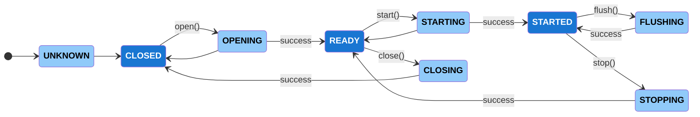
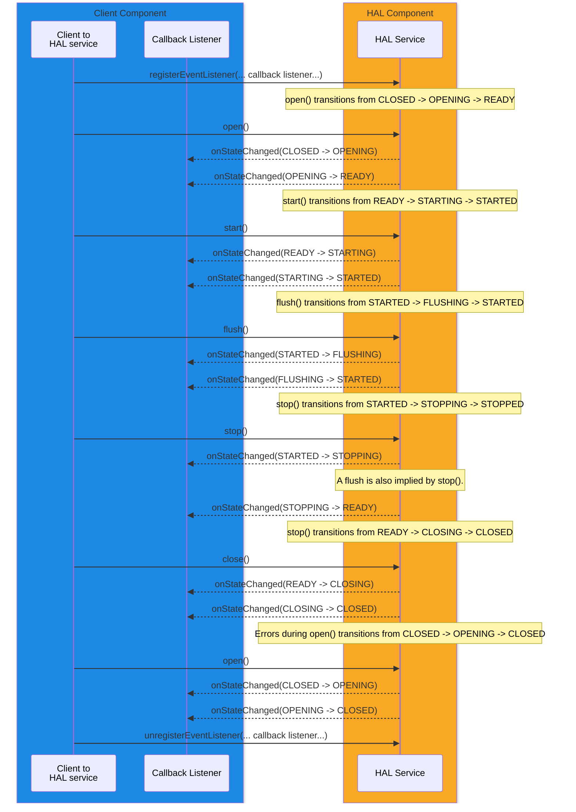

# Session State Management

Several of the HAL services follow the same session state management paradigm and share a common pattern for state transitions and notifications.

Any HAL service that handles AV data buffers will follow the session state management described in this section.

Where resource instances managed by a HAL service, often a sub-interface is offered to manage that specific resource (e.g. `IAudioDecoderManager` provides `IAudioDecoder` resource instance sub-interfaces).  In this case each of the resource instances operates its own session state machine.

Not all states may be applicable to all HAL services, so check the relevant HAL service documentation.

## HAL AIDL Definitions

See `State.aidl` in [Common](/rdkcentral/rdk-halif-aidl/common/current/com/rdk/hal/State.aidl).

## Implementation Requirements

| Requirement | Comments |
|---|---|
| HAL.STATE.1 | When a function is called which changes state, an initial `onStateChanged()` callback shall occur indicating the new transitory state within 10ms. |
| HAL.STATE.2 | When a function is called which changes state, the final `onStateChanged()` callback shall occur indicating the new target state within 500ms. |

## HAL Service Component States

When a service instance has finished initialising, its initial state is `CLOSED`.

A HAL service notifies the client of state changes through the `<Listener>.onStateChanged()` callback which is usually registered with the `registerEventListener()` function.

The functions which cause a state transition; `open()`, `close()`, `start()`, `stop()` and `flush()` cause the component to enter a transitory state for a period of time until it enters it target state.  Both the transitory state change and target state change are both notified to the client through the `onStateChanged()` callback.

If an internal error occurs during the `OPENING` or `STARTING` transitory states, then it cannot transition to the new target state, but instead returns to the previous state which is notified to the client through the `onStateChanged()` callback.

| enum State | State Type | Description |
|---|---|---|
| UNKNOWN | Transitory | The initial HAL service session state while initialising, before transitioning to the `CLOSED` state. |
| CLOSED | **Non-transitory** | Initial state entered after initialisation. |
| OPENING | Transitory | The HAL service session is transitioning from CLOSED to the `READY` state. |
| READY | **Non-transitory**  | The HAL service session is open and ready to start, but in a stopped state. |
| STARTING | Transitory | The HAL service session is transitioning from READY to the `STARTED` state. |
| STARTED | **Non-transitory**  | The opened HAL service session has been started. |
| FLUSHING | Transitory | The started HAL service session is flushing internal state/buffers.  Once flushed, the HAL service session returns to the `STARTED` state. |
| STOPPING | Transitory | The started HAL service session is stopping and flushing its internal state/buffers.  Once flushed, the HAL service session enters the `READY` state. |
| CLOSING | Transitory | The HAL service session is transitioning from READY to the `CLOSED` state. |

## State Diagram

The state diagram below includes the typical function names which trigger state transitions.

Transitory states are only held while the HAL service performs internal processing to achieve the next target state.

## State Change Callbacks Sequence

The sequence diagram below shows the typical behaviour of the state machine and the expected callbacks.

Many HAL services allow for multiple callback listeners to be registered and each registered listener would be notified of the state changes.

