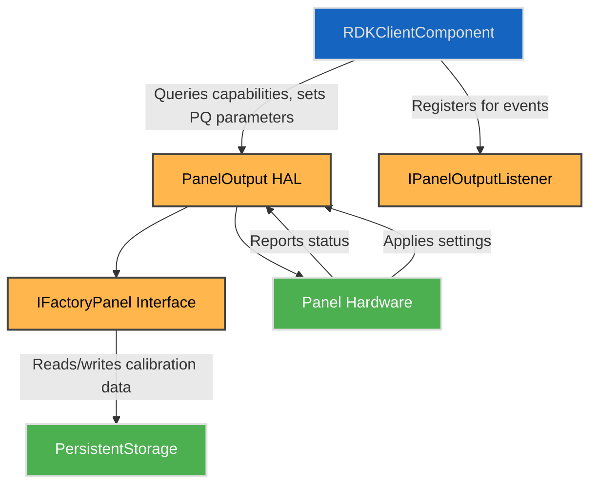

# Panel HAL Interface

## Overview

The Panel HAL provides a standardized interface to control and configure the display panel hardware on RDK platforms. It abstracts platform-specific display functions including resolution, panel type, picture quality parameters, white balance calibration, local dimming, factory configurations, and dynamic runtime controls such as picture modes and refresh rate management.

This HAL enables higher-level components to dynamically adjust video output parameters and factory tools to calibrate and validate panel hardware during manufacturing or service.

To declare the static feature set and ensure alignment between implementation and testing, each platform must provide a **HAL Feature Profile (HFP)** YAML file. This machine-readable profile specifies the supported capabilities of the Panel HAL implementation, including available picture modes, PQ parameters, dynamic range formats, and supported AV sources. It is essential for test suites, middleware negotiation, and runtime validation.

---

## References

!!! info References

|                              |                                                                                                                                                                |
| ---------------------------- | -------------------------------------------------------------------------------------------------------------------------------------------------------------- |
| **Interface Definition**     | [panel/current/com/rdk/hal/panel/](../../../src_link/panel |
| **HAL Feature Profile**      | [`hfp-panel.yaml`](../../../src_link/panel/current/hfp-panel.yaml) – [Learn more](../../key_concepts/hal/hal_feature_profiles.md) |
| **API Documentation**        | TBD                                                                                                                                                            |
| **HAL Interface Type**       | [AIDL and Binder](../../../introduction/aidl_and_binder.md)                                                                                                    |
| **Initialization Unit**      | [systemd](../../../vsi/systemd/current/systemd.md) – **hal-panel.service**                                                                                     |
| **VTS Tests**                | TBD                                                                                                                                                            |
| **Reference Implementation** | TBD                                                                                                                                                            |

---

## Related Pages

!!! tip Related Pages

* [HAL Feature Profile](../../key_concepts/hal/hal_feature_profiles.md)
* [HAL Interface Overview](../../key_concepts/hal/hal_interfaces.md)

---

## Functional Overview

The Panel HAL manages both static capabilities and dynamic runtime control of the display panel. It exposes:

* Panel hardware capabilities including resolution, physical size, panel type (LCD, OLED, QLED, Mini-LED), supported picture quality (PQ) parameters, refresh rates, and picture modes.
* Picture quality configuration, including brightness, contrast, saturation, hue, gamma, local dimming, and noise reduction.
* White balance calibration interfaces for 2-point and multi-point adjustments.
* Factory-level persistent storage of calibration data and test modes via `IFactoryPanel`.
* Dynamic control over panel enable/disable, picture modes, frame rate matching, and display fading.
* Event callbacks for real-time updates on video source, dynamic range, resolution, and refresh rate changes.

The corresponding [`hfp-panel.yaml`](https://github.com/rdkcentral/rdk-halif-aidl/tree/develop/panel/current/hfp-panel.yaml) file includes structured declarations for:

* `panelType`, `pixelWidth`, `heightCm`, etc. (from `IPanelOutput.aidl`)
* `supportedPQParameters` (from `PQParameter.aidl`)
* `pqParameterCapabilities` (from `PQParameterCapabilities.aidl`)
* `pictureModeCapabilities` (from `Capabilities.aidl`)

---

## Implementation Requirements

| #               | Requirement                                                                                                                                    | Comments                                      |
| --------------- | ---------------------------------------------------------------------------------------------------------------------------------------------- | --------------------------------------------- |
| **HAL.PANEL.1** | The service shall expose accurate static capabilities including panel resolution, physical dimensions, and supported PQ parameters.            | Enables adaptive client configurations        |
| **HAL.PANEL.2** | The service shall support setting and querying of picture quality parameters per picture mode, AV source, and dynamic range format.            | Supports granular PQ control                  |
| **HAL.PANEL.3** | The service shall allow enabling/disabling panel output and backlight with no side effects.                                                    |                                               |
| **HAL.PANEL.4** | The service shall provide asynchronous event callbacks for video source, picture mode, and refresh rate changes.                               | Ensures responsive UI/middleware updates      |
| **HAL.PANEL.5** | The factory interface shall provide persistent storage of panel calibration including white balance, gamma tables, and local dimming settings. | Supports factory calibration and service      |
| **HAL.PANEL.6** | The service shall support frame rate matching with panel refresh rate adjustments.                                                             | Enables smooth video playback synchronization |
| **HAL.PANEL.7** | The service shall support local dimming zone control and test modes with timed duration.                                                       | Enables factory and diagnostic tests          |

---

## Interface Definitions

| AIDL File                           | Description                                                  |
| ----------------------------------- | ------------------------------------------------------------ |
| `Capabilities.aidl`                   | Defines panel capabilities and supported picture modes       |
| `IFactoryPanel.aidl`                  | Factory interface for persistent configuration and tests     |
| `IPanelOutput.aidl`                   | Runtime panel output control interface                       |
| `IPanelOutputListener.aidl`           | Event listener callbacks for panel state changes             |
| `PQParameter.aidl`                    | Enumeration of supported picture quality parameters          |
| `PQParameterCapabilities.aidl`        | Capabilities per PQ parameter by picture mode and format     |
| `PQParameterConfiguration.aidl`       | Configuration value of PQ parameter for a mode/source/format |
| `PanelType.aidl`                      | Enumeration of panel types (LCD, OLED, etc.)                 |
| `PictureModeConfiguration.aidl`       | Picture mode, video format, and AV source config             |
| `WhiteBalance2PointSettings.aidl`     | 2-point white balance calibration settings                   |
| `WhiteBalanceMultiPointSettings.aidl` | Multi-point white balance calibration arrays                 |

---

## Initialization

The Panel HAL service is initialized early in the device boot process, registering itself with the system service manager under the name `"PanelOutput"`. Upon initialization, it exposes static capabilities, factory interface, and supports client connections for runtime control. The event listener interface allows clients to subscribe for asynchronous updates.

Factory tools access `IFactoryPanel` for calibration data storage and test mode activation.

---

## Product Customization

* Panels are uniquely identified via `panelId` stored persistently via factory interface.
* `Capabilities` parcelable exposes physical dimensions, panel type, supported PQ parameters, refresh rates, and supported picture modes.
* Supports multiple picture modes, dynamic ranges, and AV sources, allowing flexible client-specific configurations.
* Platforms may expose multiple simultaneous picture modes or limit to a single active mode depending on hardware capability.

---

## System Context

---

## Resource Management

* Clients acquire handles via binder connection to `PanelOutput` service.
* Single or multiple clients can set PQ parameters scoped by picture mode/source/format.
* Factory calibration is accessed exclusively via the factory interface.
* Cleanup occurs on client disconnect, with persistent factory data unaffected.

---

## Operation and Data Flow

* Client query `Capabilities` for supported picture modes and PQ parameters.
* Picture mode configurations and PQ parameters are set via `setPictureModes()` and `setPQParameters()`.
* The panel output enable state controls display and backlight.
* Frame rate matching adjusts panel refresh rate dynamically to match video content.
* White balance and gamma settings are adjusted either dynamically or via factory calibration data.
* Local dimming zones can be controlled and tested for factory diagnostics.

---

## Modes of Operation

* Runtime picture modes configurable by client with dynamic range and AV source scoping.
* Factory calibration mode accessed exclusively through factory interface.
* Frame rate matching mode enabled/disabled by client.

---

## Event Handling

* Event callbacks include:

  * `onPictureModeChanged`
  * `onVideoSourceChanged`
  * `onVideoFormatChanged`
  * `onVideoFrameRateChanged`
  * `onVideoResolutionChanged`
  * `onRefreshRateChanged`
* Clients register listener interface to receive asynchronous events.

---

## State Machine / Lifecycle

* Typical states: `ENABLED`, `DISABLED`
* Transitions triggered via `setEnabled()`
* Picture modes and PQ parameters are set during `ENABLED` state
* Factory interface operates independently of runtime state

---

## Data Format / Protocol Support

| Format        | Use Case                | Support Level |
| ------------- | ----------------------- | ------------- |
| Picture Modes | Video display presets   | Mandatory     |
| PQ Parameters | Picture quality control | Mandatory     |
| White Balance | Color calibration       | Mandatory     |

---

## Platform Capabilities

* Supports a range of panel types: LCD, OLED, QLED, Mini LED.
* Supports multiple refresh rates and frame rate matching.
* Supports local dimming with zone control and test modes.
* Supports advanced PQ parameters including AI PQ engine and noise reduction.

---

## HAL Feature Profile Integration

Each platform must include a [hfp-panel.yaml](https://github.com/rdkcentral/rdk-halif-aidl/tree/develop/panel/current/hfp-panel.yaml) to define the platform-specific implementation of this HAL. It includes:

* Static capabilities such as panel dimensions, panel type, and refresh rates.
* Lists of supported PQ parameters and picture modes.
* Capabilities of each PQ parameter per picture mode, AV source, and dynamic range.
* Declared as includes or structured sections aligned with the AIDL interfaces.

These files are machine-readable and used for:

* Platform validation via test automation.
* Runtime feature gating in middleware.
* Reference values for functions like `getCapabilities()`.

> See the [HAL Feature Profile documentation](../../key_concepts/hal/hal_feature_profiles.md) for full details and schema format.

