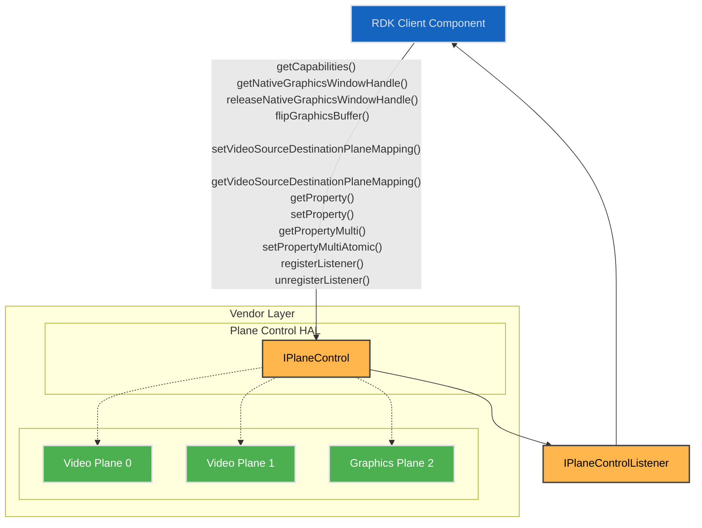
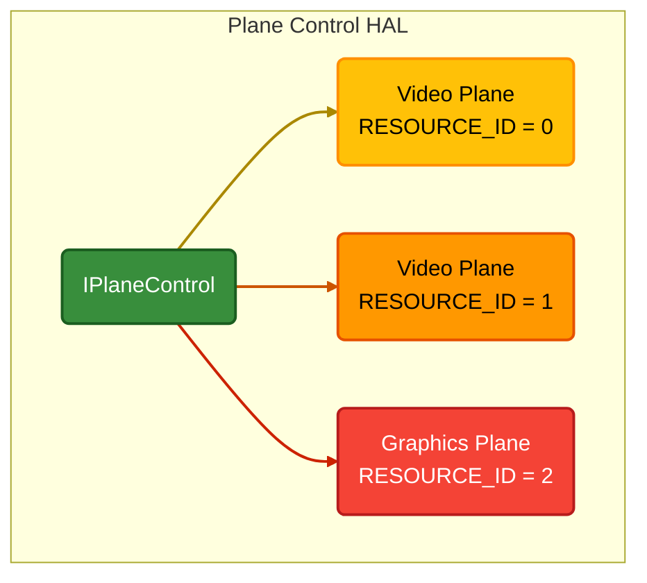

# Plane Control

The Plane Control HAL manages the platform’s video and graphics plane resources, exposing each plane as a resource with readable capabilities.  

It enables linking video sources—such as video sinks, HDMI input, and composite input—to a video plane. Additionally, it provides the RDK middleware with a native window graphics plane handle for EGL-based graphics display.  

Each plane is configurable through a set of properties that clients can read or modify, either individually or in batches.

## References

!!! info References
    |||
    |-|-|
    |**Interface Definition**|[planecontrol/current](https://github.com/rdkcentral/rdk-halif-aidl/tree/main/planecontrol/current)|
    | **API Documentation** | *TBD - Doxygen* |
    |**HAL Interface Type**|[AIDL and Binder](../../../introduction/aidl_and_binder.md)|
    |**Initialization - TBC** | [systemd](../../../vsi/systemd/current/systemd.md) - **hal-plane_control.service** |
    |**VTS Tests**| [https://github.com/rdkcentral/rdk-halif-binder-test-planecontrol](https://github.com/rdkcentral/rdk-halif-binder-test-planecontrol) |
    |**Reference Implementation - vComponent**|**TBC**|

## Related Pages

!!! tip "Related Pages"
    - [Video Sink](../../video_sink/current/video_sink.md)

## Implementation Requirements

|#|Requirement | Comments|
|-|------------|---------|
| **HAL.PLANECONTROL.1** | Shall provide APIs to manage the geometry, z-order, visibility and other properties of graphics and video planes for tunnelled and non-tunnelled operational modes of the video pipeline.|
|**HAL.PLANECONTROL.2** |Shall allow tunnelled video sources from a video decoder/sink, a HDMI input or a composite input to be linked to a video plane for display.|
|**HAL.PLANECONTROL.3** | Shall provide an API to expose the plane resources and their capabilities for a client to discover.|
| **HAL.PLANECONTROL.4** | Shall provide an API to atomically set multiple properties of a plane which take effect at the next available vsync.|
| **HAL.PLANECONTROL.5** | Shall allow only 1 source to be mapped to any given video plane.|
| **HAL.PLANECONTROL.6** | Shall provide an API to atomically update multiple video source to video plane mappings.|

## Interface Definition

|Interface Definition File | Description|
|--------------------------|------------|
|`IPlaneControl.aidl` | Plane Control HAL interface which provides the central API video and graphics plane management.|
| `IPlaneControlListener.aidl` | Plane Control listener for callbacks.|
| `AspectRatio.aidl` | Enum list of aspect ratios.|
| `Capabilities.aidl` | Parcelable describing a single plane resource capabilities.|
| `PlaneType.aidl` | Enum list of plane types.|
| `Property.aidl` | Enum list of plane properties.|
| `PropertyKVPair.aidl` | Parcelable of a single property key and value pair.|
| `SourcePlaneMapping.aidl` | Parcelable of a single source to plane mapping.|
| `SourceType.aidl` | Enum list of source types used in source plane mapping.|

## Initialization

The [systemd](../../../vsi/systemd/current/systemd.md) `hal-plane_control.service` unit file is provided by the vendor layer to start the service and should include [Wants](https://www.freedesktop.org/software/systemd/man/latest/systemd.unit.html#Wants=) or [Requires](https://www.freedesktop.org/software/systemd/man/latest/systemd.unit.html#Requires=)  directives to start any platform driver services it depends upon.

The Plane Control service depends on the Service Manager to register itself as a service.

Upon starting, the service shall register the `IPlaneControl` interface with the Service Manager using the String `IPlaneControl.serviceName` and immediately become operational.

## Product Customization

The `IPlaneControl.getCapabilities()` returns an array of `Capabilities` parcelables to uniquely represent all of the plane resources supported by the vendor layer.

Typically, the plane index (resource ID) value starts at 0 for the first video plane and increments by 1 for each additional video plane, followed by the graphic plane(s).

The `Capabilities` parcelable returned by the `IPlaneControl.getCapabilities()` function lists all capabilities supported by a plane resource.
- Concurrent control of plane resources is allowed by multiple clients. The RDK middleware is responsible for ensuring only 1 controlling client is active at any given time.

## System Context

The Plane Control service provides functionality to multiple clients which exist inside the RDK middleware.

Typically, video planes are linked to video sources when a GStreamer pipeline is created in the RDK middleware. The geometry of the video planes can be manipulated by the Window Manager through a separate client connection.

Native graphics plane windows are taken by the RDK middleware compositor to link graphics display updates from EGL to the hardware.



## Resource Management

The `IPlaneControl` interface provides access to all of the plane resource instances offered by the platform.

Each plane resource instance is assigned a unique integer resource ID or index, which is used in the `IPlaneControl` function calls to indicate which plane is being accessed.

Any number of clients can access the `IPlaneControl` service and access plane settings.

The diagram below shows the relationship between the interface and resource instances.



## Plane Types and Fixed Configuration

For the 2 types of planes (video and graphics) there are fixed configurations which they are expected to hold.

|Plane Type | Fixed Configuration|
|-----------|--------------------|
| **Video** |If there is no video to display on a visible plane, then it shall render transparent black. <br>The z-order is dynamic only for video planes.<br> Primary video plane shall always be listed at resource index 0.|
| **Graphics** |Calls to `getNativeGraphicsWindowHandle()` will return a handle that can be used to connect with EGL display implementations.|

## Video Planes

Video sources (video sinks, HDMI inputs, and composite inputs) can be mapped to destination video planes for presentation.

A video plane can only be mapped to one video source at a time, and any attempt to set additional video sources shall fail.

A call to the `setVideoSourceDestinationPlaneMapping()` allows for multiple sources and planes to be mapped and can perform complex operations such as plane swapping between main and PIP video.

The sequence of calls below shows how man video and PIP video can be mapped separately and then swapped.

### Main Video on Plane 0

- The main video using video sink 0 is displayed on video plane 0. 
- AV playback is started.

```c++
SourcePlaneMapping[] =
{
    sourceType = "SOURCE_VIDEO_SINK",
    sourceIndex = 0,
    destinationPlaneIndex = 0
}
```

### 2. PIP Video on Plane 1

- The PIP video using video sink 1 is displayed on video plane 1.
- AV playback is started.

```c++
SourcePlaneMapping[] =
{
    sourceType = "SOURCE_VIDEO_SINK",
    sourceIndex = 1,
    destinationPlaneIndex = 1
}
```

### 3a. Swapping Main and PIP Planes

- First variant: The destination plane indices for main and PIP are swapped in a single call.

```c++
SourcePlaneMapping[] =
{
  sourceType = "SOURCE_VIDEO_SINK",
  sourceIndex = 0,
  destinationPlaneIndex = 1
},
{
  sourceType = "SOURCE_VIDEO_SINK",
  sourceIndex = 1,
  destinationPlaneIndex = 0
}
```

### 3b. Unmapping Main and Moving PIP

- Second variant: The destination plane index for PIP is moved to plane 0 and main is unmapped.

```c++
SourcePlaneMapping[] =
{
    sourceType = "SOURCE_VIDEO_SINK",
    sourceIndex = 0,
    destinationPlaneIndex = -1 // -1 indicates unmapping
},
{
    sourceType = "SOURCE_VIDEO_SINK",
    sourceIndex = 1,
    destinationPlaneIndex = 0
}
```

## Stopping Video Display

When video is being stopped, the video source must also be unmapped from the plane.

The plane unmapping can technically be performed before or after the video source is stopped.

The `setVideoSourceDestinationPlaneMapping()` function can be used to unmap one or more video sources from planes.

- Video sink 0 is unmapped from plane 0.

```c++
SourcePlaneMapping[]=
{
    sourceType = SOURCE_VIDEO_SINK, 
    sourceIndex = 0, 
    destinationPlaneIndex = -1
}
```

## Z-Order

The default z-order for planes is linked to their resource ID (index).

The z-order can be changed by setting the `ZORDER` property on a plane.

Higher z-order planes display over the top of lower z-order planes.

A virtual background plane of opaque black or ultra-black (RGB=0,0,0 or YUV=0,0,0) shall be used to display when no plane pixel is visible above it.

The diagram below shows a typical default plane resource configuration for 2 video planes and a single graphics plane.


## Compositor

The compositor is a platform component responsible for blending the raster in the visible planes using z-order and alpha settings to produce a single output display image.

For STB devices the display image is scaled and output over HDMI and for TV devices it is scaled and displayed on the panel.

There is explicit HAL API exposed for the compositor as it is expected to be configured and managed privately by the vendor layer implementation based on the plane properties.

## Plane Dimensions & Geometry Control

When properties affecting the plane geometry are changed by the client, they shall take immediate effect on the next available vsync.

For video planes, if there is already a video frame displayed on a plane that remains visible, then it shall be updated to reflect the new geometry settings.

The frameWidth and frameHeight in the Capabilities specify the pixel coordinate system of the plane reference frame, when used for positioning and scaling the plane.  The plane properties X, Y, WIDTH and HEIGHT are all defined in terms of the reference frame geometry.

The maxWidth and maxHeight specify the maximum size the plane can be scaled to within the reference frame.

While a primary video plane commonly supports full screen display (maxWidth=frameWidth and maxHeight=frameHeight), it may not always be the case for other video planes.

If a plane has a size limitation (e.g. 1/4 screen) then the maxWidth and maxHeight must reflect this limitation. 

There is no limitation on the positioning of a plane within its reference frame.


## Alpha Blending

Where a plane is configured to use a translucent alpha setting (`Property::ALPHA = 1..254`), the porter-duff operation shall be `OVER` using pre-multiplied alpha.

## Plane Display Latency

The `vsyncDisplayLatency` in `Capabilities` indicates the delay of video or graphics presentation changes before final output.

For example, video planes may have latency incurred by vendor specific PQ pipelines or MEMC processing and graphics planes may have latency incurred by vendor specific double buffering or composition.

Understanding the latencies for each plane is important when performing display synchronisation between different planes.

For example, when subtitles on the graphics plane need to be displayed with a particular video frame the application rendering the subtitles needs to understand any latency difference between a video plane and the graphics plane to compensate for any differences.