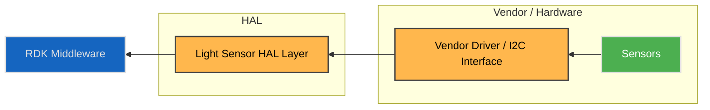
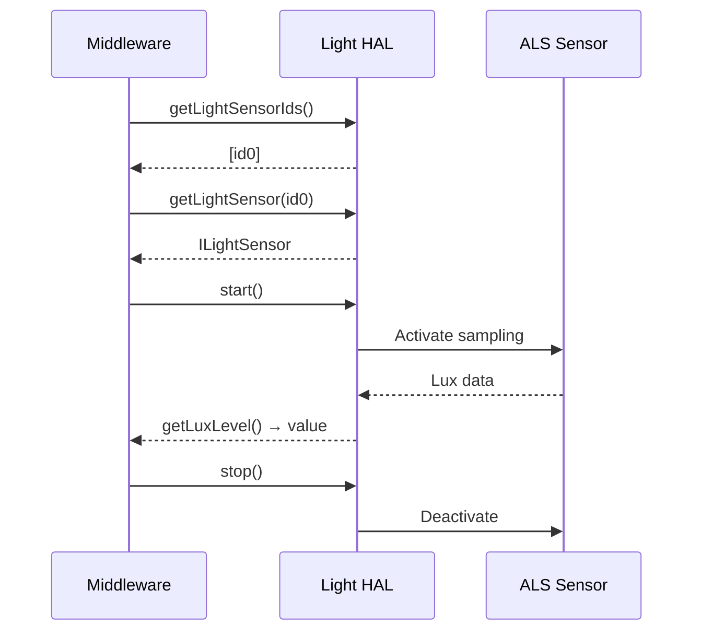

# Light Sensor HAL

The **Light Sensor HAL** provides a standard interface for accessing ambient light sensors (ALS) on RDK-E devices.  
It abstracts platform-specific drivers and exposes a consistent API for discovering sensors, starting/stopping sampling, and reading lux or raw values.

The HAL supports multiple ALS instances (e.g., front and rear sensors) and delivers immutable capabilities per sensor.  
Its lifecycle model ensures reliable acquisition and consistent behaviour across diverse hardware implementations.

---

!!! info "References"
    |||
    |-|-|
    |**Interface Definition**|[light/current](https://github.com/rdkcentral/rdk-halif-aidl/tree/main/light/current)|
    |**API Documentation**| *TBD* |
    |**HAL Interface Type**|[AIDL and Binder](../../../introduction/aidl_and_binder.md)|
    |**Initialization**| [systemd](../../../vsi/systemd/current/systemd.md) – **hal-sensor-light.service** |
    |**VTS Tests**| TBC |
    |**Reference Implementation – vComponent**| TBD |

---

!!! tip "Related Pages"
    - [Sensor Motion HAL](../motion/motion_sensor.md)
    - [Sensor Thermal HAL](../thermal/thermal_sensor.md)

---

## Overview

The Light HAL allows RDK Middleware to query and monitor **ambient light levels** for adaptive user experiences such as:

- Automatic brightness or backlight control  
- Dolby Vision IQ and EntOS ALS adaptive responses  
- Telemetry and diagnostics of optical sensors

Each light sensor exposes static **capabilities** and a controlled acquisition state machine, ensuring safe operation and clear separation between configuration and runtime data.

---

## Implementation Requirements

| # | Requirement | Comments |
|---|--------------|----------|
| **HAL.LIGHT.1** | Shall expose per-sensor capabilities via `getCapabilities()`; these values shall remain immutable during runtime. | |
| **HAL.LIGHT.2** | Shall provide start/stop APIs to control sensor acquisition. | |
| **HAL.LIGHT.3** | Shall support querying current state at any time via `getState()`. | |
| **HAL.LIGHT.4** | Shall provide at least one active sensor when available. | |
| **HAL.LIGHT.5** | Shall throw `binder::Status EX_ILLEGAL_STATE` if `getLuxLevel()` or `getRawLevel()` is called when the state ≠ `STARTED`. | |
| **HAL.LIGHT.6** | Shall achieve a minimum effective sample rate of **6 Hz** during active acquisition to support Dolby Vision IQ use cases. | |
| **HAL.LIGHT.7** | Shall register the service under the name `"LightSensorManager"` and immediately become operational on startup. | |

---

## Interface Definition

| Interface Definition File | Description |
|----------------------------|-------------|
| `com/rdk/hal/sensor/light/ILightSensorManager.aidl` | Manager interface used to enumerate and retrieve individual sensors. |
| `com/rdk/hal/sensor/light/ILightSensor.aidl` | Interface representing one physical or logical ALS device. |
| `com/rdk/hal/sensor/light/Capabilities.aidl` | Immutable static capabilities for a sensor (lux range, raw range, location). |
| `com/rdk/hal/sensor/light/Location.aidl` | Enumeration of sensor physical placement (`FRONT`, `BACK`). |
| `com/rdk/hal/sensor/light/State.aidl` | Lifecycle state machine enumeration (`STOPPED`, `STARTING`, `STARTED`, `STOPPING`, `ERROR`). |

---

## Initialization

Vendors shall provide a `hal-sensor-light.service` systemd unit to launch the Light HAL.  
The service shall register `ILightSensorManager` with the Service Manager using the constant `serviceName = "LightSensorManager"`.

Any required kernel or vendor drivers shall be initialized prior to HAL startup using systemd dependencies (`Requires=` or `Wants=`).

---

## System Context



The Light HAL abstracts sensor diversity (different vendors, buses, or sampling rates) and exposes a consistent logical model to the Middleware.

---

## Lifecycle and State Machine

```text
STOPPED → STARTING → STARTED → STOPPING → STOPPED
                 ↘
                 ERROR
```

| State        | Description                                           |
| ------------ | ----------------------------------------------------- |
| **STOPPED**  | Sensor inactive; no sampling.                         |
| **STARTING** | Initialization in progress (power-up, configuration). |
| **STARTED**  | Sensor actively acquiring data.                       |
| **STOPPING** | Graceful shutdown of acquisition.                     |
| **ERROR**    | Failure occurred; requires recovery or re-init.       |

---

## Capabilities Structure

```aidl
parcelable Capabilities {
    String sensorName;
    Location location;
    int minLux;
    int maxLux;
    int minRaw;
    int maxRaw;
}
```

**Rules**

* Capabilities must be constant across lifetime.
* `minLux < maxLux` and `minRaw < maxRaw`.
* Multiple sensors (front/back) may share overlapping ranges.

---

## Performance Requirements

* Minimum effective sampling rate ≥ **6 Hz**.
* Values returned by `getLuxLevel()` must reflect a stable average over sensor latency.
* Raw readings shall map linearly to lux when possible.

---

## Interaction Flow

### Normal Usage



---

## Hardware Configuration Example

```yaml
sensor-light:
  - id: 0
    name: "ALS-Front-1"
    location: FRONT
    lux_range:
      min: 1
      max: 20000
    raw_range:
      min: 0
      max: 4095
    requirements:
      min_effective_rate_hz: 6
    notes:
      - "Front-facing ALS suitable for EntOS ALS / IQ."
```

---

## Validation Checklist

| Test                   | Expected Behaviour                                           |
| ---------------------- | ------------------------------------------------------------ |
| Start/Stop Sequence    | Transitions follow defined state machine.                    |
| Capabilities Stability | Values constant across calls.                                |
| Illegal State Access   | Calling `getLuxLevel()` when not `STARTED` throws exception. |
| Sample Rate            | Measured ≥ 6 Hz.                                             |
| Multiple Sensors       | Independent operation of each sensor verified.               |

