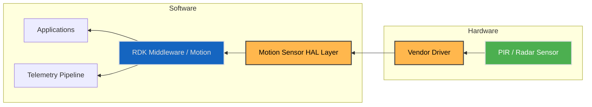
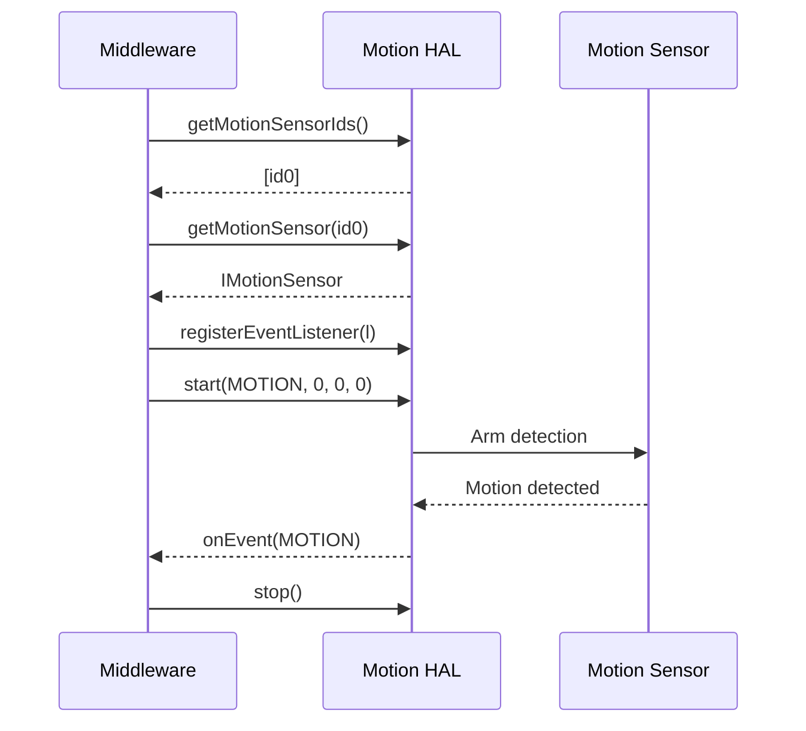
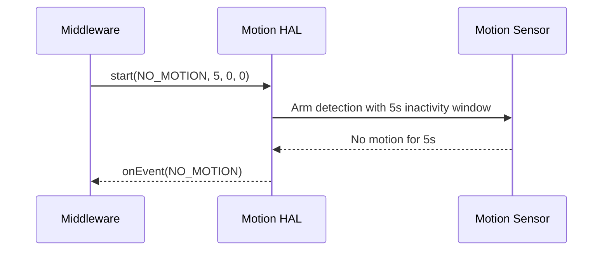

# Motion Sensor HAL

The **Motion Sensor HAL** provides a standard interface for motion detection on RDK-E devices (e.g., PIR, radar).  
It abstracts platform drivers and exposes a consistent API to discover sensors, configure detection modes, handle timing windows, and receive motion/no-motion events.

The HAL supports multiple motion sensors and delivers immutable capabilities per sensor.  
A clear lifecycle state machine ensures dependable operation and predictable event delivery.

---

## References

!!! info "References"
    |||
    |-|-|
    |**Interface Definition**|[motion/current](https://github.com/rdkcentral/rdk-halif-aidl/tree/main/motion/current)|
    |**API Documentation**| *TBD* |
    |**HAL Interface Type**|[AIDL and Binder](../../../introduction/aidl_and_binder.md)|
    |**Initialization**| [systemd](../../../vsi/systemd/current/systemd.md) – **hal-sensor-motion.service** |
    |**VTS Tests**| TBC |
    |**Reference Implementation – vComponent**| TBD |

---

## Related Pages

!!! tip "Related Pages"
    - [Sensor Light HAL](../light/light_sensor.md)
    - [Sensor Thermal HAL](../thermal/thermal_sensor.md)

---

## Overview

The Motion HAL enables RDK Middleware to configure and receive **event-driven motion status** from platform sensors.

Typical uses:
- Wake UX or adapt behaviour on **MOTION** events
- Power savings or security flows on **NO_MOTION** events after a holdoff
- Optional **deep-sleep autonomy**: allow sensor to operate during low-power states

Each sensor exposes static **capabilities**, an event listener, and a lifecycle state machine.

---

## Implementation Requirements

| # | Requirement | Comments |
|---|--------------|----------|
| **HAL.MOTION.1** | Shall expose per-sensor capabilities via `getCapabilities()`; values remain immutable during runtime. | |
| **HAL.MOTION.2** | Shall provide start/stop APIs to control detection. | |
| **HAL.MOTION.3** | Shall support querying current state via `getState()`. | |
| **HAL.MOTION.4** | Shall deliver events via `IMotionSensorEventListener.onEvent(mode)` according to configured operational mode and timing parameters. | |
| **HAL.MOTION.5** | If sensitivity is supported (`minSensitivity`/`maxSensitivity` > 0), `setSensitivity()` shall enforce range and require `State==STOPPED`. | Returns `false` for out-of-range; throws `EX_ILLEGAL_STATE` if not stopped. |
| **HAL.MOTION.6** | Listener registration shall be idempotent; duplicate registrations return `false`, as do unregisters of unknown listeners. | |
| **HAL.MOTION.7** | If deep-sleep autonomy is supported, `setAutonomousDuringDeepSleep()` shall require `State==STOPPED`; when unsupported it shall return `false`. | |
| **HAL.MOTION.8** | Shall register the service under the name `"MotionSensorManager"` and become operational at startup. | |

---

## Interface Definition

| Interface Definition File | Description |
|----------------------------|-------------|
| `com/rdk/hal/sensor/motion/IMotionSensorManager.aidl` | Manager interface to enumerate and acquire motion sensors. |
| `com/rdk/hal/sensor/motion/IMotionSensor.aidl` | Interface representing one motion sensor instance. |
| `com/rdk/hal/sensor/motion/IMotionSensorEventListener.aidl` | One-way callback delivering motion or no-motion events. |
| `com/rdk/hal/sensor/motion/Capabilities.aidl` | Immutable capabilities (`sensorName`, sensitivity range, autonomy support). |
| `com/rdk/hal/sensor/motion/OperationalMode.aidl` | Mode enum: `MOTION`, `NO_MOTION`. |
| `com/rdk/hal/sensor/motion/State.aidl` | Lifecycle states: `STOPPED`, `STARTING`, `STARTED`, `STOPPING`, `ERROR`. |

---

## Initialization

Vendors shall provide a `hal-sensor-motion.service` systemd unit to launch the Motion HAL.  
The service shall register `IMotionSensorManager` with the Service Manager using `serviceName = "MotionSensorManager"`.

Dependencies on drivers or low-level services must be expressed using systemd `Requires=` or `Wants=`.

---

## System Context



---

## Lifecycle and State Machine

```text
STOPPED → STARTING → STARTED → STOPPING → STOPPED
                 ↘
                 ERROR
```

| State        | Description                                         |
| ------------ | --------------------------------------------------- |
| **STOPPED**  | Detection inactive; configuration changes allowed.  |
| **STARTING** | Arming detection (stabilization windows may apply). |
| **STARTED**  | Detection active; events may be delivered.          |
| **STOPPING** | Disarming detection.                                |
| **ERROR**    | Failure occurred; requires recovery or re-init.     |

---

## Capabilities Structure

```aidl
parcelable Capabilities {
    String sensorName;
    int minSensitivity;      // 0 if unsupported
    int maxSensitivity;      // 0 if unsupported
    boolean supportsDeepSleepAutonomy;
}
```

**Rules**

- Capabilities are immutable for the process lifetime.
- Sensitivity is unsupported when **both** min/max are `0`.

---

## Operational Modes & Timing

`IMotionSensor.start(mode, noMotionSeconds, activeStartSeconds, activeStopSeconds)`

* **mode**:

  * `MOTION`: fire event when motion is detected after activation window.
  * `NO_MOTION`: fire event after **contiguous** `noMotionSeconds` of inactivity.
* **noMotionSeconds**: inactivity window (only for `NO_MOTION`); `0` disables it.
* **activeStartSeconds**: delay after `start()` before the sensor becomes active (`0` = immediate).
* **activeStopSeconds**: automatic stop after duration (`0` = continuous until `stop()`).

---

## Performance & Behaviour

- Event latency should be **≤ 500 ms** from physical motion to callback under typical conditions (non-normative but recommended).
- Timing windows (`noMotionSeconds`, `activeStartSeconds`, `activeStopSeconds`) must be honoured precisely.
- When deep-sleep autonomy is enabled and supported, the sensor should continue operating per vendor constraints during low-power states.

---

## Interaction Flow

### Motion Trigger (MOTION mode)



### No-Motion Window (NO_MOTION mode)



---

## Hardware Configuration Example

```yaml
sensor-motion:
  - id: 0
    name: "PIR-Front-1"
    sensitivity_range:
      min: 1
      max: 10
    supports_deep_sleep_autonomy: true
    operational_modes: [MOTION, NO_MOTION]
    default_mode: MOTION
    timing:
      no_motion_seconds: 5
      active_start_seconds: 0
      active_stop_seconds: 0
    requirements:
      min_reaction_time_ms: 500
    notes:
      - "Front-facing PIR motion detector."
      - "Supports autonomous operation during deep sleep."
```

---

## Validation Checklist

| Test                   | Expected Behaviour                                                           |
| ---------------------- | ---------------------------------------------------------------------------- |
| Capabilities Stability | Values constant across calls.                                                |
| Start/Stop Sequence    | State transitions follow the model; timing windows honoured.                 |
| Sensitivity Control    | Enforced only in `STOPPED`; range-checked or returns `false` if unsupported. |
| Listener Semantics     | Idempotent register/unregister; single delivery per event condition.         |
| NO_MOTION Window       | Event fires only after contiguous inactivity equals `noMotionSeconds`.       |
| Deep-Sleep Autonomy    | `setAutonomousDuringDeepSleep()` behaviour matches capability flag.          |
