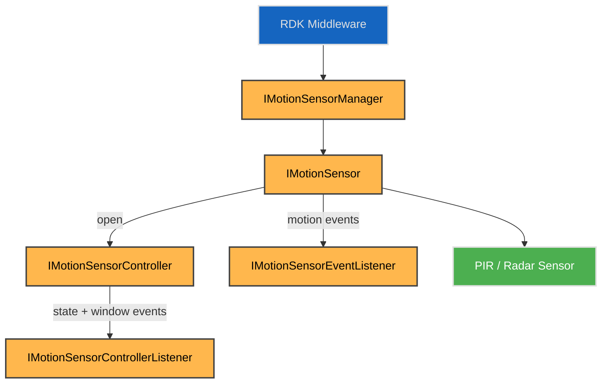
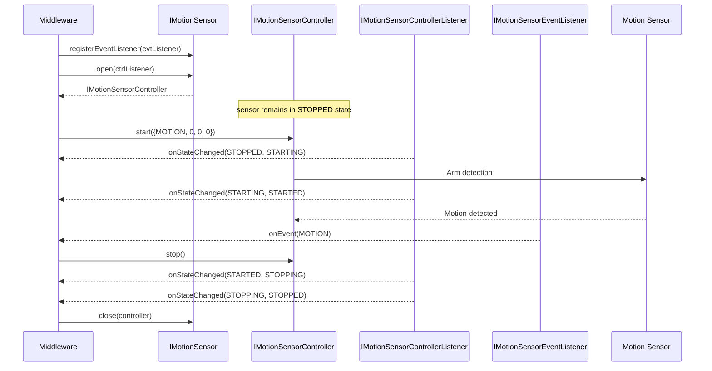
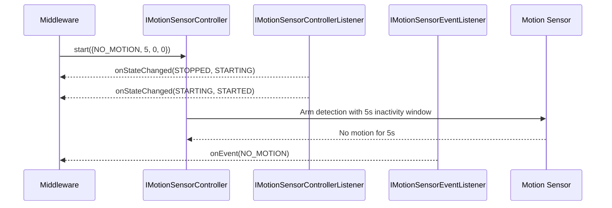

# Motion Sensor HAL

The **Motion Sensor HAL** provides a standard interface for motion detection on RDK-E devices (e.g., PIR, radar).  
It abstracts platform drivers and exposes a consistent API to discover sensors, configure detection modes, handle timing windows, and receive motion/no-motion events.

The HAL supports multiple motion sensors and delivers immutable capabilities per sensor.  
A clear lifecycle state machine ensures dependable operation and predictable event delivery.

---

!!! info "References"
    |||
    |-|-|
    |**Interface Definition**|[`sensor/current/com/rdk/hal/sensor/motion`](https://github.com/rdkcentral/rdk-halif-aidl/tree/main/sensor/current/com/rdk/hal/sensor/motion)|
    |**HAL Interface Type**|[AIDL and Binder](../../../introduction/aidl_and_binder.md)|
    |**Initialization**| [systemd](../../../vsi/systemd/current/systemd.md) – **hal-sensor-motion.service** |

!!! tip "Related Pages"
    - [Sensor Thermal HAL](../thermal/thermal_sensor.md)

---

## Overview

The Motion HAL enables RDK Middleware to configure and receive **event-driven motion status** from platform sensors.

### Sensor Types

The HAL supports various motion/presence detection technologies:

- **PIR (Passive Infrared)**: Detects heat signatures and movement
- **Microwave/Radar**: Active sensors measuring reflected waves
- **Hybrid**: Combination of multiple sensor types for improved accuracy

Each sensor type has different characteristics (range, field-of-view, sensitivity) exposed via `Capabilities`.

### Use Cases

- **Wake on Motion**: Resume from standby when user approaches device
- **Power Savings**: Enter low-power mode after period of no activity
- **Presence Detection**: Adapt UI/behaviour based on user presence
- **Security Flows**: Detect unauthorized movement
- **Energy Management**: Automated standby during scheduled inactive periods

### Key Features

- **Controller pattern**: Exclusive ownership via `open()`/`close()` with binder death cleanup
- **Event-driven architecture**: Async callbacks eliminate polling overhead
- **Configurable timing**: Control activation delays, inactivity windows, and scheduled active periods via `StartConfig`
- **Optional deep-sleep autonomy**: Sensor can operate and wake system from low-power states
- **Per-sensor capabilities**: Static properties describe hardware limits and features
- **Diagnostics**: `getStartConfig()` and `getLastEventInfo()` for runtime inspection

---

## Implementation Requirements

| # | Requirement | Comments |
|---|--------------|----------|
| **HAL.MOTION.1** | Shall expose per-sensor capabilities via `getCapabilities()`; values remain immutable during runtime. | |
| **HAL.MOTION.2** | Shall provide start/stop APIs on `IMotionSensorController` to control detection. | |
| **HAL.MOTION.3** | Shall support querying current state via `IMotionSensor.getState()` and current config via `IMotionSensorController.getStartConfig()`. | |
| **HAL.MOTION.4** | Shall deliver motion/no-motion events via `IMotionSensorEventListener.onEvent(mode)` according to the `StartConfig`. | |
| **HAL.MOTION.5** | If sensitivity is supported (`minSensitivity`/`maxSensitivity` > 0), `setSensitivity()` shall enforce range and require `State==STOPPED`. | Returns `false` for out-of-range; throws `EX_ILLEGAL_STATE` if not stopped. |
| **HAL.MOTION.6** | Event listener registration shall be idempotent; duplicate registrations return `false`, as do unregisters of unknown listeners. | |
| **HAL.MOTION.7** | If deep-sleep autonomy is supported, `setAutonomousDuringDeepSleep()` shall require `State==STOPPED`; when unsupported it shall return `false`. | |
| **HAL.MOTION.8** | Active time windows shall only suppress events outside configured periods; motion detection continues but notifications are deferred or cancelled. | See `IMotionSensorController.setActiveWindows()`. |
| **HAL.MOTION.9** | When active windows are configured, events shall only fire during the union of all configured windows. Empty array or windows with both times = 0 enables 24-hour monitoring. | |
| **HAL.MOTION.10** | Shall register the service under the name `"sensor.motion"` and become operational at startup. | Matches `IMotionSensorManager.serviceName`. |
| **HAL.MOTION.11** | `IMotionSensorControllerListener.onStateChanged()` shall fire for every lifecycle state transition. | Matches the pattern used by all other HAL modules. |
| **HAL.MOTION.12** | If the controller-owning client crashes, the HAL shall implicitly call `stop()` and `close()` to release the sensor. | Binder death cleanup. |

---

## Interface Definition

| Interface Definition File | Description |
|----------------------------|-------------|
| `IMotionSensorManager.aidl` | Manager interface to enumerate and acquire motion sensors. |
| `IMotionSensor.aidl` | Per-sensor interface: capabilities, state, open/close, event listener registration. |
| `IMotionSensorController.aidl` | Exclusive controller: start/stop, config, sensitivity, deep sleep, active windows, diagnostics. |
| `IMotionSensorControllerListener.aidl` | Controller callbacks: `onStateChanged`, `onActiveWindowEntered`, `onActiveWindowExited`. |
| `IMotionSensorEventListener.aidl` | Multi-observer callback: `onEvent(mode)` for motion/no-motion detection. |
| `Capabilities.aidl` | Immutable capabilities (`sensorName`, sensitivity range, autonomy support). |
| `StartConfig.aidl` | Parcelable: operational mode + timing parameters for `start()`. |
| `LastEventInfo.aidl` | Diagnostic parcelable: last event mode + timestamp. |
| `OperationalMode.aidl` | Mode enum: `MOTION`, `NO_MOTION`. |
| `State.aidl` | Lifecycle states: `STOPPED`, `STARTING`, `STARTED`, `STOPPING`, `ERROR`. |
| `TimeWindow.aidl` | Daily time window for active period scheduling. |

---

## Initialization

Vendors shall provide a `hal-sensor-motion.service` systemd unit to launch the Motion HAL.  
The service shall register `IMotionSensorManager` with the Service Manager using `serviceName = "sensor.motion"` (matches `IMotionSensorManager.serviceName` in the AIDL).

Dependencies on drivers or low-level services must be expressed using systemd `Requires=` or `Wants=`.

---

## System Context


```mermaid
flowchart TD
    Client[RDK Middleware]
    Manager[IMotionSensorManager]
    Sensor[IMotionSensor]
    Controller[IMotionSensorController]
    CtrlListener[IMotionSensorControllerListener]
    EventListener[IMotionSensorEventListener]
    Hardware[PIR / Radar Sensor]

    Client --> Manager
    Manager --> Sensor
    Sensor -->|open| Controller
    Controller -->|state + window events| CtrlListener
    Sensor -->|motion events| EventListener
    Sensor --> Hardware

    classDef blue fill:#1565C0,stroke:#E0E0E0,stroke-width:2px,color:#E0E0E0;
    classDef wheat fill:#FFB74D,stroke:#424242,stroke-width:2px,color:#000000;
    classDef green fill:#4CAF50,stroke:#E0E0E0,stroke-width:2px,color:#FFFFFF;

    class Client blue;
    class Manager,Sensor,Controller,CtrlListener,EventListener wheat;
    class Hardware green;
```

---

## Lifecycle and State Machine

```text
STOPPED → STARTING → STARTED → STOPPING → STOPPED
                 ↘
                 ERROR
```

| State        | Description                                         |
| ------------ | --------------------------------------------------- |
| **STOPPED**  | Detection inactive; configuration changes allowed.  |
| **STARTING** | Arming detection (stabilization windows may apply). |
| **STARTED**  | Detection active; events may be delivered.          |
| **STOPPING** | Disarming detection.                                |
| **ERROR**    | Failure occurred; requires recovery or re-init.     |

`IMotionSensorControllerListener.onStateChanged(oldState, newState)` fires for every transition.

---

## Controller Pattern

The motion sensor uses an exclusive controller pattern:

1. **`IMotionSensor.open(controllerListener)`** — acquires exclusive `IMotionSensorController`
2. Controller provides: `start()`, `stop()`, `getStartConfig()`, `getLastEventInfo()`, sensitivity, deep sleep autonomy, active windows
3. **`IMotionSensor.close(controller)`** — releases the controller
4. If the owning client crashes, the HAL implicitly calls `stop()` + `close()`

Event listeners (`IMotionSensorEventListener`) are registered separately on `IMotionSensor` and do not require ownership — any client can observe motion events.

---

## Capabilities Structure

```aidl
parcelable Capabilities {
    String sensorName;
    int minSensitivity;      // 0 if unsupported
    int maxSensitivity;      // 0 if unsupported
    boolean supportsDeepSleepAutonomy;
}
```

- Capabilities are immutable for the process lifetime.
- Sensitivity is unsupported when **both** min/max are `0`.

---

## StartConfig and Operational Modes

`IMotionSensorController.start(StartConfig config)`:

```aidl
parcelable StartConfig {
    OperationalMode operationalMode;
    int noMotionSeconds;
    int activeStartSeconds;
    int activeStopSeconds;
}
```

- **operationalMode**:
  - `MOTION`: fire event when motion is detected after activation window.
  - `NO_MOTION`: fire event after **contiguous** `noMotionSeconds` of inactivity.
- **noMotionSeconds**: inactivity window (only for `NO_MOTION`); `0` disables it.
- **activeStartSeconds**: delay after `start()` before the sensor becomes active (`0` = immediate).
- **activeStopSeconds**: automatic stop after duration (`0` = continuous until `stop()`).

The current config is retrievable via `IMotionSensorController.getStartConfig()`.

---

## Diagnostics

```aidl
parcelable LastEventInfo {
    OperationalMode mode;
    long timestampNs;
}
```

`IMotionSensorController.getLastEventInfo()` returns the mode and timestamp of the most recent event, or null if no event has occurred since `start()`. Elapsed time since the event is `System.nanoTime() - timestampNs`.

---

## Active Time Windows

`IMotionSensorController.setActiveWindows()` schedules when the sensor should actively report events:

```aidl
parcelable TimeWindow {
    int startTimeOfDaySeconds;  // 0-86399 (seconds since midnight)
    int endTimeOfDaySeconds;    // 0-86399 (seconds since midnight)
}
```

- **Multiple Windows**: Array of `TimeWindow` objects; events fire during ANY configured window (union semantics)
- **Midnight Wrapping**: Windows can span midnight when `endTime < startTime` (e.g., 22:00-02:00)
- **24-Hour Monitoring**: Empty array or single window with both values = 0
- **Configuration Timing**: Must be set in `STOPPED` state; takes effect on next `start()`
- **Event Suppression**: Outside active windows, the sensor may continue detecting but **SHALL NOT** deliver events
- **Window Callbacks**: `IMotionSensorControllerListener.onActiveWindowEntered()` / `onActiveWindowExited()` fire on transitions (only when windows are configured)

!!! warning "DST Shifts"
    On days when DST shifts occur (23-hour or 25-hour days), applications should reprogram active windows to ensure reliable operation. If windows are updated daily, this occurs automatically.

---

## Controller Listener (IMotionSensorControllerListener)

Delivered exclusively to the controller owner (passed into `open()`).

| Event | Description | When fired |
|-------|-------------|------------|
| `onStateChanged(old, new)` | Lifecycle state transition | Every start/stop/error transition |
| `onActiveWindowEntered()` | Sensor entered active monitoring window | Only when windows configured |
| `onActiveWindowExited()` | Sensor exited active monitoring window | Only when windows configured |

## Event Listener (IMotionSensorEventListener)

Available to any registered observer.

| Event | Description |
|-------|-------------|
| `onEvent(mode)` | Motion or no-motion condition detected |

---

## Interaction Flow

### Motion Trigger (MOTION mode)


```mermaid
sequenceDiagram
    participant MW as Middleware
    participant Sensor as IMotionSensor
    participant Ctrl as IMotionSensorController
    participant CtrlL as IMotionSensorControllerListener
    participant EvtL as IMotionSensorEventListener
    participant HW as Motion Sensor

    MW->>Sensor: registerEventListener(evtListener)
    MW->>Sensor: open(ctrlListener)
    Sensor-->>MW: IMotionSensorController
    Note over Ctrl: sensor remains in STOPPED state

    MW->>Ctrl: start({MOTION, 0, 0, 0})
    CtrlL-->>MW: onStateChanged(STOPPED, STARTING)
    Ctrl->>HW: Arm detection
    CtrlL-->>MW: onStateChanged(STARTING, STARTED)

    HW-->>Ctrl: Motion detected
    EvtL-->>MW: onEvent(MOTION)

    MW->>Ctrl: stop()
    CtrlL-->>MW: onStateChanged(STARTED, STOPPING)
    CtrlL-->>MW: onStateChanged(STOPPING, STOPPED)

    MW->>Sensor: close(controller)
```

### No-Motion Window (NO_MOTION mode)


```mermaid
sequenceDiagram
    participant MW as Middleware
    participant Ctrl as IMotionSensorController
    participant CtrlL as IMotionSensorControllerListener
    participant EvtL as IMotionSensorEventListener
    participant HW as Motion Sensor

    MW->>Ctrl: start({NO_MOTION, 5, 0, 0})
    CtrlL-->>MW: onStateChanged(STOPPED, STARTING)
    CtrlL-->>MW: onStateChanged(STARTING, STARTED)
    Ctrl->>HW: Arm detection with 5s inactivity window
    HW-->>Ctrl: No motion for 5s
    EvtL-->>MW: onEvent(NO_MOTION)
```

---

## Performance & Behaviour

- Event latency should be **≤ 500 ms** from physical motion to callback under typical conditions (non-normative but recommended).
- Timing parameters in `StartConfig` must be honoured precisely.
- When deep-sleep autonomy is enabled and supported, the sensor should continue operating per vendor constraints during low-power states.

---

## Hardware Configuration Example

The HAL Feature Profile (HFP) defines platform-specific capabilities and defaults:

```yaml
sensor:
  motion:
    - id: 0
      sensorName: "PIR-Front-1"
      sensitivity_range:
        minSensitivity: 1
        maxSensitivity: 10
      supportsDeepSleepAutonomy: true

      operational_modes:
        - MOTION
        - NO_MOTION

      # Factory default StartConfig values (maps to StartConfig.aidl fields)
      defaultStartConfig:
        operationalMode: MOTION
        noMotionSeconds: 5
        activeStartSeconds: 0
        activeStopSeconds: 0

      active_windows:
        - startTimeOfDaySeconds: 32400  # 09:00
          endTimeOfDaySeconds: 61200    # 17:00
        - startTimeOfDaySeconds: 72000  # 20:00
          endTimeOfDaySeconds: 79200    # 22:00

      requirements:
        min_reaction_time_ms: 500
      notes:
        - "Front-facing PIR motion detector."
        - "Supports autonomous operation during deep sleep."
```

| Section | Purpose | Mutability |
|---------|---------|------------|
| `id`, `sensorName`, `sensitivity_range`, `supportsDeepSleepAutonomy` | Hardware capabilities via `getCapabilities()` | **Immutable** at runtime |
| `operational_modes`, `defaultStartConfig`, `active_windows` | Platform defaults for testing/validation | Configuration values |

---

## Validation Checklist

| Test                   | Expected Behaviour                                                           |
| ---------------------- | ---------------------------------------------------------------------------- |
| Capabilities Stability | Values constant across calls.                                                |
| Open/Close Lifecycle   | `open()` returns controller; `close()` releases it; double-open fails.       |
| Start/Stop Sequence    | State transitions follow the model; `onStateChanged()` fires for each.       |
| StartConfig Retrieval  | `getStartConfig()` matches the config passed to `start()`.                   |
| LastEventInfo          | Returns null before first event; populated after `onEvent()` fires.          |
| Sensitivity Control    | Enforced only in `STOPPED`; range-checked or returns `false` if unsupported. |
| Listener Semantics     | Idempotent register/unregister; single delivery per event condition.         |
| NO_MOTION Window       | Event fires only after contiguous inactivity equals `noMotionSeconds`.       |
| Deep-Sleep Autonomy    | `setAutonomousDuringDeepSleep()` behaviour matches capability flag.          |
| Active Window Callbacks | `onActiveWindowEntered`/`onActiveWindowExited` fire at window boundaries.   |
| Crash Cleanup          | Controller owner crash triggers implicit `stop()` + `close()`.              |
