# Motion Sensor HAL

The **Motion Sensor HAL** provides a standard interface for motion detection on RDK-E devices (e.g., PIR, radar).  
It abstracts platform drivers and exposes a consistent API to discover sensors, configure detection modes, handle timing windows, and receive motion/no-motion events.

The HAL supports multiple motion sensors and delivers immutable capabilities per sensor.  
A clear lifecycle state machine ensures dependable operation and predictable event delivery.

---

!!! info "References"
    |||
    |-|-|
    |**Interface Definition**|[motion/current](https://github.com/rdkcentral/rdk-halif-aidl/tree/main/motion/current)|
    |**API Documentation**| *TBD* |
    |**HAL Interface Type**|[AIDL and Binder](../../../introduction/aidl_and_binder.md)|
    |**Initialization**| [systemd](../../../vsi/systemd/current/systemd.md) – **hal-sensor-motion.service** |
    |**VTS Tests**| TBC |
    |**Reference Implementation – vComponent**| TBD |

!!! tip "Related Pages"
    - [Sensor Light HAL](../light/light_sensor.md)
    - [Sensor Thermal HAL](../thermal/thermal_sensor.md)

---

## Overview

The Motion HAL enables RDK Middleware to configure and receive **event-driven motion status** from platform sensors.

### Sensor Types

The HAL supports various motion/presence detection technologies as examples:

- **PIR (Passive Infrared)**: Detects heat signatures and movement
- **Microwave/Radar**: Active sensors measuring reflected waves
- **Hybrid**: Combination of multiple sensor types for improved accuracy

Each sensor type has different characteristics (range, field-of-view, sensitivity) exposed via `Capabilities`.

### Use Cases

Typical uses:

- **Wake on Motion**: Resume from standby when user approaches device
- **Power Savings**: Enter low-power mode after period of no activity
- **Presence Detection**: Adapt UI/behaviour based on user presence
- **Security Flows**: Detect unauthorized movement
- **Energy Management**: Automated standby during scheduled inactive periods

### Key Features

- **Event-driven architecture**: Async callbacks eliminate polling overhead
- **Configurable timing**: Control activation delays, inactivity windows, and scheduled active periods
- **Optional deep-sleep autonomy**: Sensor can operate and wake system from low-power states
- **Per-sensor capabilities**: Static properties describe hardware limits and features
- **Lifecycle state machine**: Predictable state transitions for reliable operation

---

## Implementation Requirements

| # | Requirement | Comments |
|---|--------------|----------|
| **HAL.MOTION.1** | Shall expose per-sensor capabilities via `getCapabilities()`; values remain immutable during runtime. | |
| **HAL.MOTION.2** | Shall provide start/stop APIs to control detection. | |
| **HAL.MOTION.3** | Shall support querying current state via `getState()` and operational mode via `getOperationalMode()`. | |
| **HAL.MOTION.4** | Shall deliver events via `IMotionSensorEventListener.onEvent(mode)` according to configured operational mode and timing parameters. | |
| **HAL.MOTION.5** | If sensitivity is supported (`minSensitivity`/`maxSensitivity` > 0), `setSensitivity()` shall enforce range and require `State==STOPPED`. | Returns `false` for out-of-range; throws `EX_ILLEGAL_STATE` if not stopped. |
| **HAL.MOTION.6** | Listener registration shall be idempotent; duplicate registrations return `false`, as do unregisters of unknown listeners. | |
| **HAL.MOTION.7** | If deep-sleep autonomy is supported, `setAutonomousDuringDeepSleep()` shall require `State==STOPPED`; when unsupported it shall return `false`. | |
| **HAL.MOTION.8** | Active time windows shall only suppress events outside configured periods; motion detection continues but notifications are deferred or cancelled. | See `setActiveWindows()` for scheduling. |
| **HAL.MOTION.9** | When active windows are configured, events shall only fire during the union of all configured windows. Empty array or windows with both times = 0 enables 24-hour monitoring. | |
| **HAL.MOTION.10** | Shall register the service under the name `"MotionSensorManager"` and become operational at startup. | |

---

## Interface Definition

| Interface Definition File | Description |
|----------------------------|-------------|
| `com/rdk/hal/sensor/motion/IMotionSensorManager.aidl` | Manager interface to enumerate and acquire motion sensors. |
| `com/rdk/hal/sensor/motion/IMotionSensor.aidl` | Interface representing one motion sensor instance. |
| `com/rdk/hal/sensor/motion/IMotionSensorEventListener.aidl` | One-way callback delivering motion or no-motion events. |
| `com/rdk/hal/sensor/motion/Capabilities.aidl` | Immutable capabilities (`sensorName`, sensitivity range, autonomy support). |
| `com/rdk/hal/sensor/motion/OperationalMode.aidl` | Mode enum: `MOTION`, `NO_MOTION`. |
| `com/rdk/hal/sensor/motion/State.aidl` | Lifecycle states: `STOPPED`, `STARTING`, `STARTED`, `STOPPING`, `ERROR`. |
| `com/rdk/hal/sensor/motion/TimeWindow.aidl` | Daily time window for active period scheduling. |

---

## Initialization

Vendors shall provide a `hal-sensor-motion.service` systemd unit to launch the Motion HAL.  
The service shall register `IMotionSensorManager` with the Service Manager using `serviceName = "MotionSensorManager"`.

Dependencies on drivers or low-level services must be expressed using systemd `Requires=` or `Wants=`.

---

## System Context


---

## Lifecycle and State Machine

```text
STOPPED → STARTING → STARTED → STOPPING → STOPPED
                 ↘
                 ERROR
```

| State        | Description                                         |
| ------------ | --------------------------------------------------- |
| **STOPPED**  | Detection inactive; configuration changes allowed.  |
| **STARTING** | Arming detection (stabilization windows may apply). |
| **STARTED**  | Detection active; events may be delivered.          |
| **STOPPING** | Disarming detection.                                |
| **ERROR**    | Failure occurred; requires recovery or re-init.     |

---

## Capabilities Structure

```aidl
parcelable Capabilities {
    String sensorName;
    int minSensitivity;      // 0 if unsupported
    int maxSensitivity;      // 0 if unsupported
    boolean supportsDeepSleepAutonomy;
}
```

### Rules

- Capabilities are immutable for the process lifetime.
- Sensitivity is unsupported when **both** min/max are `0`.

---

## Operational Modes & Timing

`IMotionSensor.start(mode, noMotionSeconds, activeStartSeconds, activeStopSeconds)`

- **mode**:
  - `MOTION`: fire event when motion is detected after activation window.
  - `NO_MOTION`: fire event after **contiguous** `noMotionSeconds` of inactivity.
- **noMotionSeconds**: inactivity window (only for `NO_MOTION`); `0` disables it.
- **activeStartSeconds**: delay after `start()` before the sensor becomes active (`0` = immediate).
- **activeStopSeconds**: automatic stop after duration (`0` = continuous until `stop()`).

---

## Active Time Windows

The `setActiveWindows()` API allows scheduling when the sensor should actively report events. This is useful for:

- Energy management (only monitor during expected occupancy hours)
- Privacy controls (disable detection during specific times)
- Multi-period monitoring (e.g., business hours + evening hours)

### Time Window Structure

```aidl
parcelable TimeWindow {
    int startTimeOfDaySeconds;  // 0-86399 (seconds since midnight)
    int endTimeOfDaySeconds;    // 0-86399 (seconds since midnight)
}
```

### Behaviour

- **Multiple Windows**: Array of `TimeWindow` objects; events fire during ANY configured window (union semantics)
- **Midnight Wrapping**: Windows can span midnight when `endTime < startTime` (e.g., 22:00-02:00)
- **24-Hour Monitoring**: Empty array or single window with both values = 0
- **Configuration Timing**: Must be set in `STOPPED` state; takes effect on next `start()`
- **Event Suppression**: Outside active windows, the sensor may continue detecting but **SHALL NOT** deliver events

### Daylight Saving Time (DST) Considerations

!!! warning "DST Shifts"
    On days when DST shifts occur (23-hour or 25-hour days), applications should reprogram active windows to ensure reliable operation. If windows are updated daily, this occurs automatically.

---

## Performance & Behaviour

- Event latency should be **≤ 500 ms** from physical motion to callback under typical conditions (non-normative but recommended).
- Timing windows (`noMotionSeconds`, `activeStartSeconds`, `activeStopSeconds`) must be honoured precisely.
- When deep-sleep autonomy is enabled and supported, the sensor should continue operating per vendor constraints during low-power states.

---

## Interaction Flow

### Motion Trigger (MOTION mode)


### No-Motion Window (NO_MOTION mode)


---

## Timing Scenarios

### Scenario 1: Motion Detection After Active Start Time

User goes to standby at 06:30, configuring:

- Active window start: 08:00
- No-motion period: 30 minutes
- Mode: NO_MOTION

The sensor waits 30 minutes before the active window, then arms for motion detection once the no-motion period expires.

```mermaid
gantt
    title Motion Detection After Active Period Start
    dateFormat HH:mm
    axisFormat %H:%M
    
    section Host State
    Active (TV in use)          :active, 06:00, 30m
    Standby (User pressed standby) :crit, 06:30, 3h30m
    Active (Motion woke TV)     :active, 10:00, 1h
    
    section Motion Sensor State
    Unarmed                     :done, 06:00, 30m
    Armed-Waiting (Config set)  :active, 06:30, 1h
    Armed-DetectNoMotion        :crit, 07:30, 30m
    Armed-DetectMotion          :milestone, 08:00, 2h
    Event: Motion Detected      :milestone, 10:00, 0m
    Unarmed                     :done, 10:00, 1h
```



**Timeline:**

| Time | Event | Motion Sensor State |
|------|-------|---------------------|
| 06:00 | TV active, in use | `STOPPED` (Unarmed) |
| 06:30 | User presses standby; `start(NO_MOTION, 1800, 5400, 0)` called | `STARTING` → `STARTED` (Armed-Waiting) |
| 07:30 | 30 minutes before active window, no-motion countdown begins | `STARTED` (Armed-DetectNoMotion) |
| 08:00 | Active window starts; no-motion period expires | `STARTED` (Armed-DetectMotion) |
| 10:00 | Motion event occurs | Event fired, transitions to `STOPPED` |

---

### Scenario 2: Motion Detection Before and After Active Start

User goes to standby at 06:30 with same configuration, but motion is detected before and during the active window start, extending the no-motion period.

```mermaid
gantt
    title Motion Detection Before/After Active Period (Extended No-Motion)
    dateFormat HH:mm
    axisFormat %H:%M
    
    section Host State
    Active (TV in use)          :active, 06:00, 30m
    Standby                     :crit, 06:30, 4h
    Active (Motion woke TV)     :active, 10:30, 30m
    
    section Motion Sensor State
    Unarmed                     :done, 06:00, 30m
    Armed-Waiting               :active, 06:30, 1h
    Armed-DetectNoMotion (1)    :crit, 07:30, 15m
    Motion Detected (reset)     :milestone, 07:45, 0m
    Armed-DetectNoMotion (2)    :crit, 07:45, 45m
    Motion Detected (reset)     :milestone, 08:30, 0m
    Armed-DetectNoMotion (3)    :crit, 08:30, 30m
    Armed-DetectMotion          :milestone, 09:00, 1h30m
    Event: Motion Detected      :milestone, 10:30, 0m
    Unarmed                     :done, 10:30, 30m
```



**Timeline:**

| Time | Event | Motion Sensor State |
|------|-------|---------------------|
| 06:00 | TV active, in use | `STOPPED` (Unarmed) |
| 06:30 | User presses standby; sensor armed | `STARTING` → `STARTED` (Armed-Waiting) |
| 07:30 | No-motion countdown begins (30 min before window) | `STARTED` (Armed-DetectNoMotion) |
| 07:45 | **Motion detected** → no-motion timer resets | `STARTED` (Armed-DetectNoMotion, timer reset) |
| 08:00 | Active window starts, but no-motion period still running | `STARTED` (Armed-DetectNoMotion) |
| 08:30 | **Motion stops** → no-motion timer resets again | `STARTED` (Armed-DetectNoMotion, timer reset) |
| 09:00 | No-motion period (30 min) expires | `STARTED` (Armed-DetectMotion) |
| 10:30 | Motion event occurs | Event fired, transitions to `STOPPED` |

**Key Insight:** The active window defines WHEN events can fire, but the no-motion period must still be satisfied. Motion during the no-motion countdown resets the timer, even if it spans across the active window start time.

---

## Hardware Configuration Example

The HAL Feature Profile (HFP) defines platform-specific capabilities. Fields marked with `Capabilities.*` comments
correspond to immutable values returned by `getCapabilities()`.

```yaml
sensor:
  motion:
    # ========================================================================
    # CAPABILITIES (Immutable - returned by getCapabilities())
    # ========================================================================
    - id: 0                                   # IMotionSensor.Id.value
      sensorName: "PIR-Front-1"               # Capabilities.sensorName
      sensitivity_range:
        minSensitivity: 1                     # Capabilities.minSensitivity
        maxSensitivity: 10                    # Capabilities.maxSensitivity
      supportsDeepSleepAutonomy: true         # Capabilities.supportsDeepSleepAutonomy
      
      # ========================================================================
      # OPERATIONAL CONFIGURATION (Platform-specific defaults and constraints)
      # ========================================================================
      operational_modes:
        - MOTION
        - NO_MOTION
      default_mode: MOTION
      timing:
        no_motion_seconds: 5     # Default inactivity window before NO_MOTION event
        active_start_seconds: 0  # Activation delay after start()
        active_stop_seconds: 0   # Continuous monitoring until stop()
      active_windows:
        # Example: Monitor during business hours (9am-5pm) and evening (8pm-10pm)
        - startTimeOfDaySeconds: 32400  # 09:00:00 (9 * 3600)
          endTimeOfDaySeconds: 61200    # 17:00:00 (17 * 3600)
        - startTimeOfDaySeconds: 72000  # 20:00:00 (20 * 3600)
          endTimeOfDaySeconds: 79200    # 22:00:00 (22 * 3600)
        # Leave empty or set both values to 0 for 24-hour monitoring
      requirements:
        min_reaction_time_ms: 500  # Minimum reaction time to motion events
      notes:
        - "Front-facing PIR motion detector."
        - "Supports autonomous operation during deep sleep."
        - "Active windows can be configured via setActiveWindows()."
```

**Capabilities vs. Configuration:**

| Section | Purpose | Mutability |
|---------|---------|------------|
| `id`, `sensorName`, `sensitivity_range`, `supportsDeepSleepAutonomy` | Hardware capabilities exposed via `getCapabilities()` | **Immutable** at runtime |
| `operational_modes`, `default_mode`, `timing`, `active_windows` | Platform defaults and operational constraints | Configuration values for testing/validation |

---

## Validation Checklist

| Test                   | Expected Behaviour                                                           |
| ---------------------- | ---------------------------------------------------------------------------- |
| Capabilities Stability | Values constant across calls.                                                |
| Start/Stop Sequence    | State transitions follow the model; timing windows honoured.                 |
| Sensitivity Control    | Enforced only in `STOPPED`; range-checked or returns `false` if unsupported. |
| Listener Semantics     | Idempotent register/unregister; single delivery per event condition.         |
| NO_MOTION Window       | Event fires only after contiguous inactivity equals `noMotionSeconds`.       |
| Deep-Sleep Autonomy    | `setAutonomousDuringDeepSleep()` behaviour matches capability flag.          |
