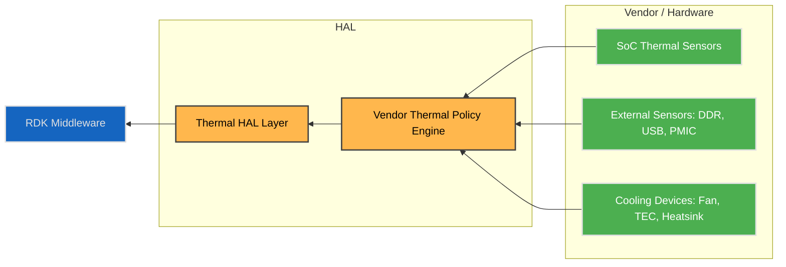
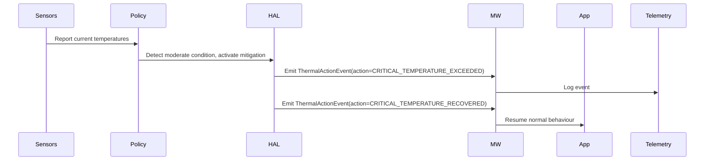
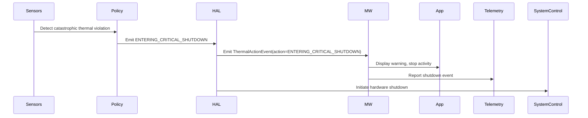

# Thermal Sensor HAL

The **Thermal Sensor HAL** manages platform thermal state signalling for RDK-E devices.
It abstracts the underlying hardware sensors, vendor thermal policy engine, and cooling device behaviour, presenting a unified, event-driven interface to the RDK Middleware.

Thermal thresholds are defined at multiple severity levels, allowing the system or user space components to **receive early warning events** and take appropriate action before critical limits are reached.
These thresholds enable proactive mitigation—such as adjusting workloads, reducing brightness, or throttling performance—without directly exposing raw temperature control or vendor logic.

The vendor thermal policy remains responsible for determining exact threshold values and corresponding mitigation strategies.
When any level is breached, the HAL emits a well-defined `ThermalActionEvent` describing the new thermal condition.

This layered model keeps thermal management flexible across hardware implementations while ensuring consistent signalling behaviour to upper layers.

---

!!! info "References"
    |||
    |-|-|
    |**Interface Definition**|[sensor/current/thermal](https://github.com/rdkcentral/rdk-halif-aidl/tree/main/sensor/current/thermal)|
    |**API Documentation**| *TBD* |
    |**HAL Interface Type**|[AIDL and Binder](../../../introduction/aidl_and_binder.md)|
    |**Initialization - TBC**| [systemd](../../../vsi/systemd/current/systemd.md) - **hal-sensor-thermal.service** |
    |**VTS Tests**| TBC |

---

!!! tip "Related Pages"
    - [Sensor Motion HAL](../motion/motion_sensor.md)
    - [Sensor Light HAL](../light/light_sensor.md)

---

## Overview

The Thermal HAL allows RDK Middleware to receive high-level **thermal action events**, triggered by vendor-defined thermal policies.

### Typical Use Cases

- Prepare for **thermal shutdown** due to high board or SoC temperature  
- Gracefully handle **shutdown** events  
- Collect **telemetry** on thermal behaviour in the field

---

## Implementation Requirements

| # | Requirement | Comments |
|---|--------------|----------|
| **HAL.THERMAL.1** | Shall provide an event-driven API to report vendor-defined thermal actions to RDK Middleware using a standard `ThermalActionType` enum. | |
| **HAL.THERMAL.2** | Shall not expose or require Middleware to manage raw temperature thresholds or thermal policy decisions. | |
| **HAL.THERMAL.3** | Shall emit all `ThermalActionEvent`s to registered Middleware clients and support registering / unregistering of such clients. | |
| **HAL.THERMAL.4** | Shall support querying the current thermal state at any time via a `getCurrentThermalState()` API. | |
| **HAL.THERMAL.5** | Shall support optional reporting of current temperature readings for platform sensors via `getCurrentTemperatures()`. | |
| **HAL.THERMAL.6** | Shall provide a `vendorInfo` string field in `ThermalActionEvent` for vendor-specific debug or telemetry purposes. | |
| **HAL.THERMAL.7** | Shall update `getCurrentThermalState()` coherently with emitted `ThermalActionEvent`s (`MITIGATION_ACTIVE` when cooling, `NORMAL` after recovery, `CRITICAL_SHUTDOWN_IMMINENT` before shutdown). | Ensures predictable state → event alignment. |

---

## Interface Definition

| Interface Definition File | Description |
| -------------------------- | ------------ |
| `com/rdk/hal/sensor/thermal/IThermal.aidl` | Main service interface for registering listeners and querying state/telemetry. |
| `com/rdk/hal/sensor/thermal/IThermalEventListener.aidl` | One-way callback for `ThermalActionEvent`s. |
| `com/rdk/hal/sensor/thermal/ActionType.aidl` | Enumeration of high-level thermal actions (`ENTERING_CRITICAL_SHUTDOWN`, `CRITICAL_TEMPERATURE_EXCEEDED`, etc.). |
| `com/rdk/hal/sensor/thermal/ActionEvent.aidl` | Parcelable event payload, including `action`, `timestampMonotonicMs`, `originSensorId`, `vendorInfo`. |
| `com/rdk/hal/sensor/thermal/State.aidl` | Simple state machine values: `NORMAL`, `MITIGATION_ACTIVE`, `CRITICAL_SHUTDOWN_IMMINENT`. |
| `com/rdk/hal/sensor/thermal/TemperatureReading.aidl` | Optional per-sensor telemetry record (°C + timestamp). |

---

## Initialization

The [systemd](../../../vsi/systemd/current/systemd.md) `hal-sensor-thermal.service` unit file is provided by the vendor layer to start the service and should include  
[`Wants`](https://www.freedesktop.org/software/systemd/man/latest/systemd.unit.html#Wants=) or [`Requires`](https://www.freedesktop.org/software/systemd/man/latest/systemd.unit.html#Requires=) directives to start any platform driver services it depends upon.

Upon starting, the service shall register the `IThermal` interface with the Service Manager using the string `IThermal.serviceName` and immediately become operational.

---

## System Context

The Thermal HAL fits into the system architecture as the **thermal state signalling layer** between **vendor-defined thermal policy engines** and the **RDK Middleware**.

It enables consistent and portable notification of **thermal state changes** to the Middleware and Applications, allowing system UX and behaviour to be adapted accordingly.

The HAL abstracts away the diversity of hardware implementations and thermal policy tuning across platforms, exposing only well-defined `ThermalActionEvent`s to the RDK stack.

## Design Principles

- **Vendor Controls Policy**
  Thermal thresholds, response logic, and mitigation strategies are entirely defined and owned by the **vendor platform**.
  These are established by the **hardware design team** as part of the thermal envelope validation process and are not configurable by RDK middleware.

  The vendor implementation must:

  - Define and enforce temperature thresholds approved for the hardware design.
  - Ensure the platform behaves **deterministically** when limits are exceeded.
  - Apply any platform-specific **thermal regulation or mitigation** automatically (e.g. fan control) if supported.
  - Trigger a **system-controlled shutdown** when required — this action is outside the control of upper software layers.
  - Update the vendor HAL layer if observed behaviour deviates from validated specifications.

  In essence, thermal compliance is a **hardware validation responsibility**, not a runtime tuning exercise. The HAL exposes events and telemetry for visibility — it does **not** make policy decisions.

- **HAL Emits `ThermalActionEvent`**

  This standardizes how temperature and mitigation state changes are reported.
  Events carry portable, structured data that allows middleware to log, visualize, or correlate system behaviour without influencing platform policy.

- **Middleware Acts on Events**

  Middleware may use events for **UX adaptation**, **application awareness**, or **telemetry**, but it does not modify hardware thresholds or take control actions.
  The separation ensures deterministic hardware behaviour even if middleware is delayed or offline.

- **Telemetry Optional**

  Middleware may periodically query temperature sensors for analytics or backend reporting.
  This is an optional diagnostic feature — it must not interfere with the vendor’s thermal control mechanisms.

- **Platform-Specific Cooling Technologies Supported**

  The HAL design accommodates vendor-unique mitigation strategies (e.g. fan profiles, passive heat spreading).
  Such features remain internal to the vendor implementation but are surfaced via standardized event types for consistent observability.

- **Explicit Shutdown Signalling**

  When a thermal limit forces a platform-controlled shutdown, the HAL must emit a final `ThermalActionEvent` indicating that condition.
  This provides clear auditability and compliance traceability for safety and user-experience requirements.



---

### Thermal Policy Ownership

| Aspect                 | Owner                 |
| ---------------------- | --------------------- |
| Sensor thresholds      | Vendor                |
| Policy decisions       | Vendor                |
| Cooling device control | Vendor                |
| Action signalling      | HAL                   |
| Middleware reaction    | RDK Middleware        |
| App reaction           | Applications (via MW) |

---

## Thermal Actions

The Thermal HAL exposes a small, extensible set of **thermal actions**, represented by the **`ThermalActionType`** enum.

These actions represent high-level system state changes determined by the platform’s vendor-defined Thermal Policy Engine.

They enable general principles of:

- Managing application behaviour
- Logging and report field telemetry
- Supporting regulatory and UX requirements

The HAL emits `ThermalActionEvent`s containing these actions, abstracting away platform-specific thresholds and control logic.

### ThermalActionType Enum

```aidl
enum ActionType {
    /** @brief No action. */
    NONE = 0,

    /** @brief Critical temperature threshold exceeded,
     *  If supported on the platform thermal migration will be active
     */
    CRITICAL_TEMPERATURE_EXCEEDED = 1,

    // --- Recovery ---
    /** @brief System has thermally recovered to normal operating conditions. */
    CRITICAL_TEMPERATURE_RECOVERED = 2,

    /** @brief Critical thermal breach leading to imminent full shutdown. */
    ENTERING_CRITICAL_SHUTDOWN = 3
}
```

---

## Thermal State Machine

`getCurrentThermalState()` returns one of the following values:

| State                              | Description                                                           |
| --------------------------------   | --------------------------------------------------------------------- |
| **NORMAL**                         | No mitigation active; platform within safe thermal limits.            |
| **CRITICAL_TEMPERATURE_EXCEEDED**  | Platform entered critcal tempature, if possible platform vendor-defined mitigation is active. |
| **CRITICAL_TEMPERATURE_RECOVERED** | Platform recovered from critcal tempature, and is returning to normal state. |
| **CRITICAL_SHUTDOWN_IMMINENT**     | Platform entering forced thermal shutdown; critical platform level actions are imminent. |

**Typical transition model:**

```text
NORMAL  →  CRITICAL_TEMPERATURE_EXCEEDED  →  CRITICAL_SHUTDOWN_IMMINENT
   ↑          ↓                    ↓
   └──────────┴──── CRITICAL_TEMPERATURE_RECOVERED (returns to NORMAL)
```

---

## Interaction Flow Examples

### Normal Operation



---

### Critical Shutdown Path



---

## Platform Policy Metadata

Vendors **may** define platform-specific thermal policy hints in the hardware configuration (HFP) for reference and telemetry use.

```yaml
sensor:
  thermal:
    - id: "soc_die"
      sensorName: "SoC Die" # Used in com.rdk.hal.sensor.thermal/TemperatureReading.aidl
      location: "CPU"       # Used in com.rdk.hal.sensor.thermal/TemperatureReading.aidl

      # -------------------------------------------------------------------------
      # SENSOR CHARACTERISTICS
      # -------------------------------------------------------------------------
      # sensor_reading_range_celsius:
      #   Absolute measurable range of the physical sensor. These limits are
      #   hardware-defined and represent what the ADC/IC can report, not what is
      #   considered safe for operation.
      sensor_reading_range_celsius:
        min: -40
        max: 125

      # operational_temperature_celsius:
      #   Normal safe operating envelope for the platform under steady-state load.
      #   Middleware should regard this as the “normal zone”.
      #   Anything above the max here enters mitigation or alarm territory.
      operational_temperature_celsius:
        min: -20
        max: 95

      # -------------------------------------------------------------------------
      # POLICY TRIGGER POINTS
      # -------------------------------------------------------------------------
      # The trigger values define how the vendor policy transitions between
      # ActionTypes and States.  They MUST satisfy:
      #   recovered  <  exceeded  <  shutdown
      #
      # • critical_temperature_recovered_celsius :
      #       Threshold below which the system is considered recovered and
      #       returns to NORMAL state.
      # • critical_temperature_exceeded_celsius :
      #       Point at which CRITICAL_TEMPERATURE_EXCEEDED is emitted and
      #       mitigation (if supported) becomes active.  This is usually a few
      #       degrees ABOVE operational max to allow early warning.
      # • entering_critical_shutdown_celsius :
      #       Hard limit at which ENTERING_CRITICAL_SHUTDOWN is emitted and
      #       hardware shutdown is initiated.
      triggers:
        critical_temperature_recovered_celsius: 90
        critical_temperature_exceeded_celsius: 98
        entering_critical_shutdown_celsius: 115

      policy:
        shutdown_min_downtime_s: 900
        recovery:
          strategy: TIME_BASED
          min_cooldown_seconds: 240

      vendor:
        vendorCode: 1001  # Used in com.rdk.hal.sensor.thermal/TemperatureReading.aidl
        vendorInfo: "Primary die sensor used for critical trip points." # Used in com.rdk.hal.sensor.thermal/TemperatureReading.aidl

    - id: "board"
      sensorName: "Mainboard Ambient" # Used in com.rdk.hal.sensor.thermal/TemperatureReading.aidl
      location: "Board"           # Used in com.rdk.hal.sensor.thermal/TemperatureReading.aidl

      # Absolute measurable range of this sensor device.
      sensor_reading_range_celsius:
        min: -20
        max: 80

      # Expected steady-state board temperature range under normal conditions.
      operational_temperature_celsius:
        min: 0
        max: 65

      # Trigger thresholds for this domain.
      #   Recovered < Exceeded < Shutdown  (must hold true)
      triggers:
        critical_temperature_recovered_celsius: 60
        critical_temperature_exceeded_celsius: 70
        entering_critical_shutdown_celsius: 72   # ~10% below sensor max

      policy:
        shutdown_min_downtime_s: 600
        recovery:
          strategy: TIME_BASED
          min_cooldown_seconds: 180

      vendor:
        vendorCode: 1002  # Used in com.rdk.hal.sensor.thermal/TemperatureReading.aidl
        vendorInfo: "Used for general system thermal monitoring." # Used in com.rdk.hal.sensor.thermal/TemperatureReading.aidl
```
