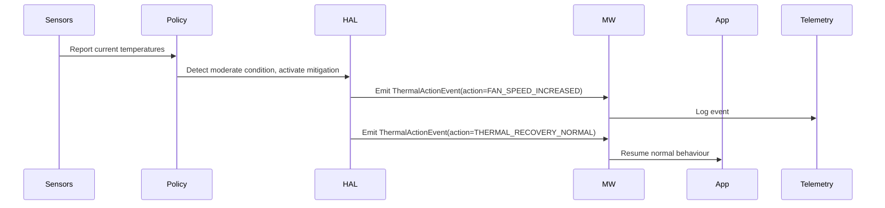
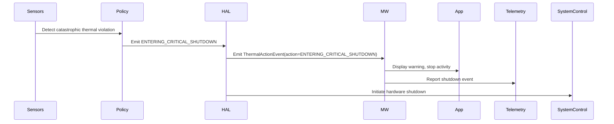
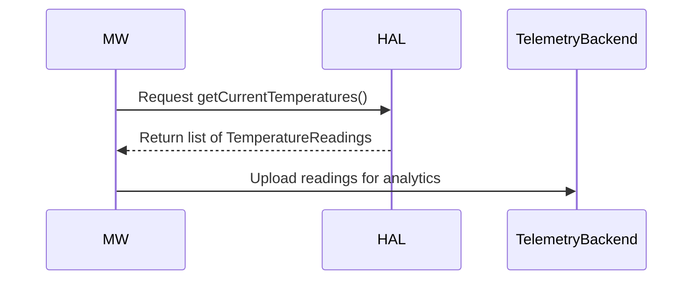

# Thermal Sensor HAL

The **Thermal Sensor HAL** manages platform thermal state signalling for RDK-E devices.  
It abstracts the underlying hardware thermal sensors, vendor thermal policy engine, and cooling device states, exposing a simple event-driven interface to the RDK Middleware.

The Thermal HAL does not expose raw temperature thresholds or control logic to upper layers.  
Instead, the vendor-specific policy determines when actions are required and signals these actions through well-defined `ThermalActionEvent`s.

This model ensures that thermal tuning remains flexible across different hardware designs, while providing consistent behaviour for Middleware and Applications.

Additionally, the Thermal HAL supports optional temperature telemetry reporting, allowing platforms to expose live temperature readings for field analytics.

---

## References

!!! info "References"
    |||
    |-|-|
    |**Interface Definition**|[sensor/current](https://github.com/rdkcentral/rdk-halif-aidl/tree/main/sensor/current)|
    |**API Documentation**| *TBD* |
    |**HAL Interface Type**|[AIDL and Binder](../../../introduction/aidl_and_binder.md)|
    |**Initialization - TBC**| [systemd](../../../vsi/systemd/current/systemd.md) - **hal-sensor-thermal.service** |
    |**VTS Tests**| TBC |

---

## Related Pages

!!! tip "Related Pages"
    - TBC

---

## Overview

The Thermal HAL allows RDK Middleware to receive high-level **thermal action events**, triggered by vendor-defined thermal policies.

### Typical Use Cases

- Prepare for **thermal shutdown** due to high board or SoC temperature  
- Gracefully handle **shutdown** events  
- Collect **telemetry** on thermal behaviour in the field

---

## Implementation Requirements

| # | Requirement | Comments |
|---|--------------|----------|
| **HAL.THERMAL.1** | Shall provide an event-driven API to report vendor-defined thermal actions to RDK Middleware using a standard `ThermalActionType` enum. | |
| **HAL.THERMAL.2** | Shall not expose or require Middleware to manage raw temperature thresholds or thermal policy decisions. | |
| **HAL.THERMAL.3** | Shall emit all `ThermalActionEvent`s to registered Middleware clients and support registering / unregistering of such clients. | |
| **HAL.THERMAL.4** | Shall support querying the current thermal state at any time via a `getCurrentThermalState()` API. | |
| **HAL.THERMAL.5** | Shall support optional reporting of current temperature readings for platform sensors via `getCurrentTemperatures()`. | |
| **HAL.THERMAL.6** | Shall provide a `vendorInfo` string field in `ThermalActionEvent` for vendor-specific debug or telemetry purposes. | |
| **HAL.THERMAL.7** | Shall update `getCurrentThermalState()` coherently with emitted `ThermalActionEvent`s (`MITIGATION_ACTIVE` when cooling, `NORMAL` after recovery, `CRITICAL_SHUTDOWN_IMMINENT` before shutdown). | Ensures predictable state → event alignment. |

---

## Interface Definition

| Interface Definition File | Description |
| -------------------------- | ------------ |
| `com/rdk/hal/sensor/thermal/IThermal.aidl` | Main service interface for registering listeners and querying state/telemetry. |
| `com/rdk/hal/sensor/thermal/IThermalEventListener.aidl` | One-way callback for `ThermalActionEvent`s. |
| `com/rdk/hal/sensor/thermal/ActionType.aidl` | Enumeration of high-level thermal actions (`ENTERING_CRITICAL_SHUTDOWN`, `FAN_SPEED_INCREASED`, etc.). |
| `com/rdk/hal/sensor/thermal/ActionEvent.aidl` | Parcelable event payload, including `action`, `timestampMonotonicMs`, `originSensorId`, `vendorInfo`. |
| `com/rdk/hal/sensor/thermal/State.aidl` | Simple state machine values: `NORMAL`, `MITIGATION_ACTIVE`, `CRITICAL_SHUTDOWN_IMMINENT`. |
| `com/rdk/hal/sensor/thermal/TemperatureReading.aidl` | Optional per-sensor telemetry record (°C + timestamp). |

---

## Initialization

The [systemd](../../../vsi/systemd/current/systemd.md) `hal-sensor-thermal.service` unit file is provided by the vendor layer to start the service and should include  
[`Wants`](https://www.freedesktop.org/software/systemd/man/latest/systemd.unit.html#Wants=) or [`Requires`](https://www.freedesktop.org/software/systemd/man/latest/systemd.unit.html#Requires=) directives to start any platform driver services it depends upon.

Upon starting, the service shall register the `IThermal` interface with the Service Manager using the string `IThermal.serviceName` and immediately become operational.

---

## System Context

The Thermal HAL fits into the system architecture as the **thermal state signalling layer** between **vendor-defined thermal policy engines** and the **RDK Middleware**.

It enables consistent and portable notification of **thermal state changes** to the Middleware and Applications, allowing system UX and behaviour to be adapted accordingly.

The HAL abstracts away the diversity of hardware implementations and thermal policy tuning across platforms, exposing only well-defined `ThermalActionEvent`s to the RDK stack.

### Design Principles

* **Vendor controls policy** → MW does not own thresholds.  
* **HAL emits `ThermalActionEvent`** → consistent and portable signals to MW.  
* **MW acts on events** → UX, apps, telemetry, graceful shutdowns.  
* **Telemetry optional** → MW may query temperatures for backend analytics.  
* **Future cooling technologies supported** → extensible action model.  
* **Explicit shutdown signalling** → supports compliance & UX clarity.

```mermaid
graph TD
    subgraph Hardware
        A1[SoC Thermal Sensors] --> B1[Vendor Thermal Policy Engine]
        A2[External Sensors: DDR, USB, PMIC] --> B1
        A3[Cooling Devices: Fan, TEC, Heatsink] --> B1
    end

    B1 --> C1[Thermal HAL Layer]

    subgraph Software Stack
        C1 --> D1[RDK Middleware Thermal Listener]
        D1 --> E1[Applications]
        D1 --> F1[Telemetry Pipeline]
    end
````

---

### Thermal Policy Ownership

| Aspect                 | Owner                 |
| ---------------------- | --------------------- |
| Sensor thresholds      | Vendor                |
| Policy decisions       | Vendor                |
| Cooling device control | Vendor                |
| Action signalling      | HAL                   |
| Middleware reaction    | RDK Middleware        |
| App reaction           | Applications (via MW) |

---

## Thermal Actions

The Thermal HAL exposes a small, extensible set of **thermal actions**, represented by the **`ThermalActionType`** enum.

These actions represent high-level system state changes determined by the platform’s vendor-defined Thermal Policy Engine.

They enable RDK Middleware to:

* Manage application behaviour (e.g., suspend apps)
* Log and report field telemetry
* Support regulatory and UX requirements

The HAL emits `ThermalActionEvent`s containing these actions, abstracting away platform-specific thresholds and control logic.

### ThermalActionType Enum

```aidl
@Backing(type="int")
enum ThermalActionType {
    NONE = 0,
    ENTERING_CRITICAL_SHUTDOWN,    // Imminent full shutdown due to thermal violation
    FAN_SPEED_INCREASED,           // Cooling or throttling activated
    FAN_SPEED_NORMAL,              // Cooling returned to nominal
    THERMAL_RECOVERY_NORMAL,       // System recovered to safe operating condition
    OTHER = 0xFFFF                 // Vendor extensions
}
```

---

## Thermal State Machine

`getCurrentThermalState()` returns one of the following values:

| State                          | Description                                                           |
| ------------------------------ | --------------------------------------------------------------------- |
| **NORMAL**                     | No mitigation active; platform within safe thermal limits.            |
| **MITIGATION_ACTIVE**          | Vendor-defined mitigation is active (fan, throttling, TEC, etc.).     |
| **CRITICAL_SHUTDOWN_IMMINENT** | Platform entering forced thermal shutdown; critical actions required. |

**Typical transition model:**

```text
NORMAL  →  MITIGATION_ACTIVE  →  CRITICAL_SHUTDOWN_IMMINENT
   ↑             ↓                    ↓
   └─────────────┴──── THERMAL_RECOVERY_NORMAL (returns to NORMAL)
```

Middleware may use this state to decide when to adjust performance, notify users, or prepare for shutdown.

---

## Interaction Flow Examples

### Normal Operation



---

### Critical Shutdown Path



---

## Telemetry Flow (Optional)



---

## ThermalActionType Mapping Table

| **Thermal Domain / IC**   | **Typical Sensors**   | **Policy / Action Triggered** | **ThermalActionType to Emit**                    |
| ------------------------- | --------------------- | ----------------------------- | ------------------------------------------------ |
| **PMIC (Power IC)**       | PMIC internal sensor  | Emergency shutdown            | ENTERING_CRITICAL_SHUTDOWN                       |
| **USB-powered devices**   | Port current + sensor | USB power cut-off             | ENTERING_CRITICAL_SHUTDOWN                       |
| **SoC package sensors**   | SoC top/bottom        | Primary policy domain         | ENTERING_CRITICAL_SHUTDOWN / FAN_SPEED_INCREASED |
| **Board ambient**         | PCB / NTC sensor      | Monitoring / Telemetry        | THERMAL_RECOVERY_NORMAL                          |
| **Fan or TEC controller** | Speed feedback / TEC  | Active cooling                | FAN_SPEED_INCREASED / FAN_SPEED_NORMAL           |
| **Vendor-specific**       | Custom domains        | Vendor-defined actions        | OTHER (with vendorInfo populated)                |

---

## Platform Policy Metadata (optional)

Vendors **may** define platform-specific thermal policy hints in the hardware configuration (HFP) for reference and telemetry use.
These values are *advisory only* — the Thermal HAL does not enforce them.

```yaml
sensor-thermal:
  defaults:
    shutdown_min_downtime_s: 600
    recovery:
      strategy: TIME_BASED
      min_cooldown_s: 180
      notes:
        - "Guidance for MW UX/telemetry; vendor policy is authoritative."

  sensors:
    - id: "soc_die"
      name: "SoC Die"
      location: "CPU"
      temperature_range:
        min: -40
        max: 125
      policy:
        shutdown_min_downtime_s: 900
        recovery:
          strategy: TIME_BASED
          min_cooldown_s: 240
      notes:
        - "Primary die sensor used for critical trip points."

    - id: "board"
      name: "Mainboard Ambient"
      location: "Board"
      temperature_range:
        min: -20
        max: 80
      policy:
        recovery:
          strategy: TIME_BASED
          min_cooldown_s: 180
      notes:
        - "Used for general system thermal monitoring."

  actions_supported:
    - ENTERING_CRITICAL_SHUTDOWN
    - FAN_SPEED_INCREASED
    - FAN_SPEED_NORMAL
    - THERMAL_RECOVERY_NORMAL
    - OTHER
```
