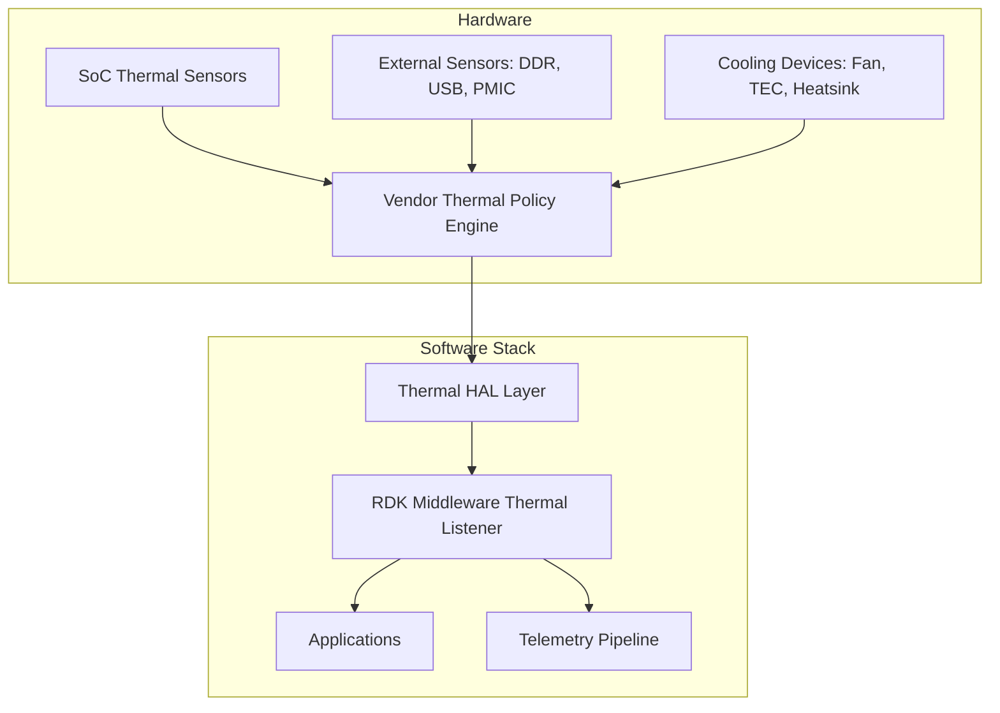
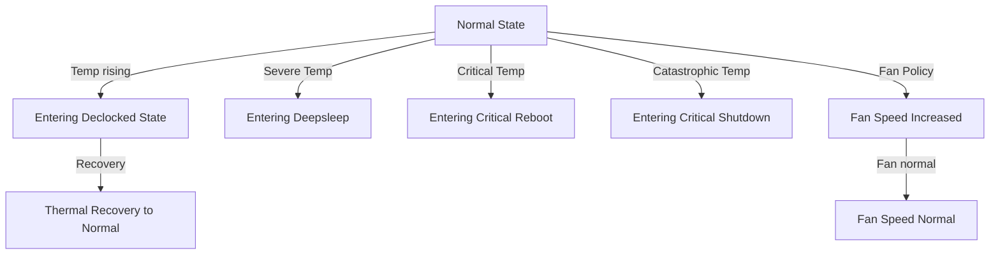
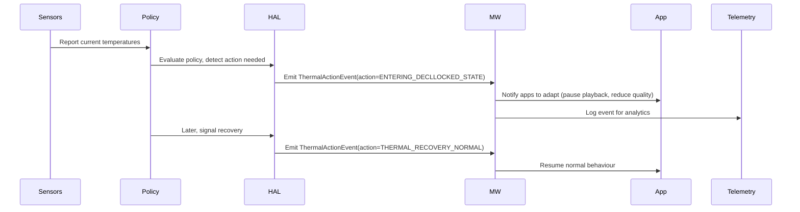
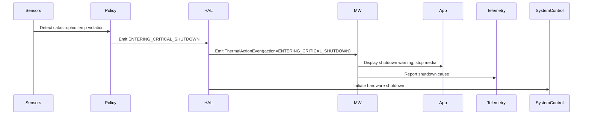
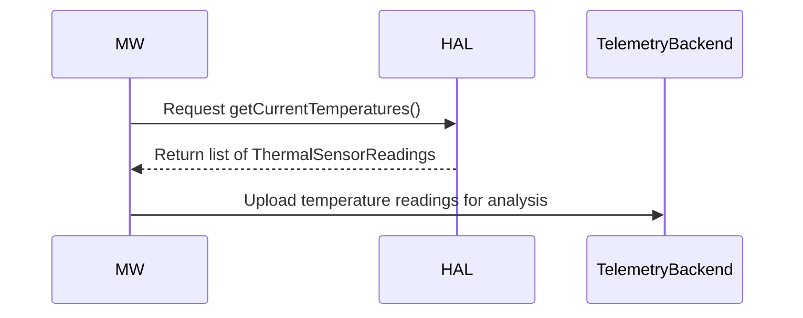

# Thermal HAL

The **Thermal HAL** manages platform thermal state signalling for RDK-E devices.
It abstracts the underlying hardware thermal sensors, vendor thermal policy engine, and cooling device states, exposing a simple event-driven interface to the RDK Middleware.

The Thermal HAL does not expose raw temperature thresholds or control logic to upper layers.
Instead, the vendor-specific policy determines when actions are required (such as clock throttling, entering deepsleep, rebooting, or shutting down), and signals these actions through well-defined ThermalActionEvents.

This model ensures that thermal tuning remains flexible across different hardware designs, while providing consistent behaviour for Middleware and Applications.

Additionally, the Thermal HAL supports optional temperature telemetry reporting, allowing platforms to expose live temperature readings for field analytics.

## References

!!! info References
    |||
    |-|-|
    |**Interface Definition**|[thermal/current](https://github.com/rdkcentral/rdk-halif-aidl/tree/main/termal/current)|
    |**API Documentation**| *TBD* |
    |**HAL Interface Type**|[AIDL and Binder](../../../introduction/aidl_and_binder.md)|
    |**Initialization - TBC** | [systemd](../../../vsi/systemd/current/systemd.md) - **hal-thermal.service** |
    |**VTS Tests**| TBC |
    |**Reference Implementation - vComponent**|**TBD**|

## Related Pages

!!! tip Related Pages
    - TBC

## Overview

The Thermal HAL allows RDK Middleware to receive high-level **thermal action events**, triggered by vendor-defined thermal policies.

Typical use cases:

- Reduce video decode load when **CPU is declocked**
- Prepare for **deepsleep** due to high board temperature
- Gracefully handle **critical reboot** or **shutdown** events
- Telemetry collection of thermal action patterns in the field
- Distinguish between **critical reboot** and **critical shutdown** events

## Implementation Requirements

| #                  | Requirement                                                                                                                                                                               | Comments |
| ------------------ | ----------------------------------------------------------------------------------------------------------------------------------------------------------------------------------------- | -------- |
| **HAL.THERMAL.1**  | Shall provide an event-driven API to report vendor-defined thermal actions to RDK Middleware using a standard ThermalActionType enum.                                                     |          |
| **HAL.THERMAL.2**  | Shall not expose or require Middleware to manage raw temperature thresholds or thermal policy decisions.                                                                                  |          |
| **HAL.THERMAL.3**  | Shall emit all ThermalActionEvents to registered Middleware clients, and support registering / unregistering of such clients.                                                             |          |
| **HAL.THERMAL.4**  | Shall support querying the current thermal state at any time via a getCurrentThermalState() API.                                                                                          |          |
| **HAL.THERMAL.5**  | Shall support emitting distinct ThermalActionTypes for ENTERING\_CRITICAL\_REBOOT and ENTERING\_CRITICAL\_SHUTDOWN, enabling Middleware to distinguish between reboot and shutdown cases. |          |
| **HAL.THERMAL.6**  | Shall not emit EXITING\_DEEPSLEEP actions, as CPU is suspended during deepsleep.                                                                                                          |          |
| **HAL.THERMAL.7**  | Shall support optional reporting of current temperature readings for platform sensors via getCurrentTemperatures().                                                                       |          |
| **HAL.THERMAL.8**  | Shall support extensible ThermalActionType enums, allowing future cooling technologies to be added without breaking API compatibility.                                                    |          |
| **HAL.THERMAL.9**  | Shall provide a vendorInfo string field in ThermalActionEvent for vendor-specific debug or telemetry purposes.                                                                            |          |
| **HAL.THERMAL.10** | Shall provide clear vendor documentation of sensor-to-action mappings, using the ThermalPolicyEngine.yaml template defined by RDK-E.                                                      |          |

## Interface Definition

|Interface Definition File | Description|
|--------------------------|------------|
|TBC|TBC|

## Initialization

The [systemd](../../../vsi/systemd/current/systemd.md) `hal-thermal.service` unit file is provided by the vendor layer to start the service and should include [Wants](https://www.freedesktop.org/software/systemd/man/latest/systemd.unit.html#Wants=) or [Requires](https://www.freedesktop.org/software/systemd/man/latest/systemd.unit.html#Requires=)  directives to start any platform driver services it depends upon.

The service depends on the Service Manager to register itself.

Upon starting, the service shall register the `IThermal` interface with the Service Manager using the String `IThermal.serviceName` and immediately become operational.

## **Goals**

* Provide a **standard HAL interface** for reporting **thermal actions** on RDK-E devices.
* Ensure **thermal policy remains vendor-controlled** — vendors tune thresholds and define actions.
* Allow Middleware and Applications to **react to thermal state changes**, without owning policy.
* Support both **current and emerging hardware** (multi-sensor SoCs, memory ICs, USB devices, fans, TECs).
* Enable **telemetry collection** on temperature readings (optional).
* Support regulatory / compliance needs by distinguishing between **Reboot** and **Shutdown** cases.

## **System Context**

The Thermal HAL fits into the system architecture as the **thermal state signalling layer** between **vendor-defined thermal policy engines** and the **RDK Middleware**.

It enables consistent and portable notification of **thermal state changes** to the Middleware and Applications, allowing system UX and behaviour to be adapted accordingly.

The HAL abstracts away the diversity of hardware implementations and thermal policy tuning across platforms, exposing only well-defined ThermalActionEvents to the RDK stack.

This design ensures that:

* Platform vendors can freely tune their **thermal policy**, thresholds, and cooling strategies.
* Middleware and Applications can react consistently without knowledge of underlying hardware details.
* The HAL remains **forward-compatible**, supporting emerging cooling technologies and new sensor domains.

### **Design Principles**

* **Vendor controls policy** → MW does not own thresholds.
* **HAL emits ThermalActionEvent** → consistent and portable signals to MW.
* **MW acts on events** → UX, apps, telemetry, graceful shutdowns.
* **Telemetry optional** → MW may query temperatures for backend analytics.
* **Future cooling technologies supported** → extensible action model.
* **Explicit shutdown vs reboot distinction** → supports compliance & UX clarity.



### **Thermal Policy Ownership**

| Aspect                 | Owner                 |
| ---------------------- | --------------------- |
| Sensor thresholds      | Vendor                |
| Policy decisions       | Vendor                |
| Cooling device control | Vendor                |
| Action signalling      | HAL                   |
| Middleware reaction    | RDK Middleware        |
| App reaction           | Applications (via MW) |

---

## **Thermal Actions**

The Thermal HAL exposes a small, extensible set of **thermal actions**, represented by the **ThermalActionType** enum.

These actions represent high-level system state changes determined by the platform’s vendor-defined Thermal Policy Engine.

They enable RDK Middleware to:

- Adapt the user experience (e.g. video quality reduction, UX dimming)
- Manage application behaviour (e.g. suspend apps on deepsleep)
- Log and report field telemetry
- Support regulatory and UX requirements (clearly distinguish shutdown vs reboot)

The HAL emits ThermalActionEvents containing these actions, abstracting away the platform’s detailed thermal thresholds and hardware-specific policies.

### ThermalActionType Enum

```aidl
@Backing(type="int")
enum ThermalActionType {
    NONE = 0,
    ENTERING_DECLLOCKED_STATE,     // CPU clocks lowered
    EXITING_DECLLOCKED_STATE,      // CPU clocks restored to normal
    ENTERING_DEEPSLEEP,            // System entering deepsleep (CPU suspend imminent)
    ENTERING_CRITICAL_REBOOT,      // Imminent reboot due to thermal violation
    ENTERING_CRITICAL_SHUTDOWN,    // Imminent full shutdown due to thermal violation (no reboot)
    FAN_SPEED_INCREASED,           // Fan raised to high speed (if present)
    FAN_SPEED_NORMAL,              // Fan returned to normal
    THERMAL_RECOVERY_NORMAL,       // System recovered to normal thermal operation (from any state)
    OTHER = 0xFFFF                 // For vendor extensions
}
```

Each action is emitted by the Thermal HAL as a **one-way notification** to registered Middleware clients via **ThermalActionEvent**.

Middleware **shall not attempt to infer raw thresholds** from these actions — platform tuning remains fully vendor-controlled.

---

### State Transition Model

The following diagram illustrates a simplified **typical state transition model** for the ThermalActionType signals.

The exact transitions, thresholds, and logic are defined per platform by the vendor Thermal Policy Engine.



- Platforms may emit **ENTERING_DECLLOCKED_STATE** first to attempt thermal mitigation before resorting to deeper actions such as deepsleep or shutdown.

- **ENTERING_CRITICAL_REBOOT** and **ENTERING_CRITICAL_SHUTDOWN** are distinct — enabling Middleware to implement correct user experience and telemetry behaviour.

- **THERMAL_RECOVERY_NORMAL** indicates the system has returned to a stable thermal condition.

- Vendors may define additional platform-specific behaviours using OTHER + vendorInfo.

---

## **Interaction Flow**

### Normal Operation Example

The diagram below illustrates a typical normal operation flow, where the vendor Thermal Policy Engine detects a moderate thermal condition and signals an **ENTERING_DECLLOCKED_STATE** action to the Middleware.

This enables Middleware and Applications to temporarily adapt system behaviour to reduce thermal load.
Once the system recovers to a safe state, the policy signals **THERMAL_RECOVERY_NORMAL**, and the Middleware resumes normal operation.



---

### Critical Event Example (Shutdown path)

The following diagram illustrates a critical shutdown path, where the Thermal Policy Engine detects a severe or catastrophic thermal violation.

The HAL signals an **ENTERING_CRITICAL_SHUTDOWN** event to Middleware, enabling it to display an appropriate shutdown message, stop media playback, and send telemetry before the hardware shutdown is initiated.



---

## **Telemetry Flow (optional)**

The optional telemetry flow allows Middleware to query the current temperature readings via the HAL, and forward them to a backend telemetry system for analysis.

This supports ongoing field monitoring of platform thermal behaviour, and helps identify thermal tuning opportunities across deployed devices.



---

## **ThermalActionType Mapping Table**

| **Thermal Domain / IC**                   | **Typical Sensors**                  | **Policy / Action Triggered**                 | **ThermalActionType to Emit**                                    |
| ----------------------------------------- | ------------------------------------ | --------------------------------------------- | ---------------------------------------------------------------- |
| **CPU**                                   | CPU internal die, SoC thermal zone   | CPU throttling (clock step down/up)           | ENTERING\_DECLLOCKED\_STATE / EXITING\_DECLLOCKED\_STATE         |
| **GPU**                                   | GPU sensor (if exposed)              | GPU clock step down/up                        | ENTERING\_DECLLOCKED\_STATE / EXITING\_DECLLOCKED\_STATE         |
| **Memory (DDR/LPDDR)**                    | DDR controller temp / PCB sensor     | Memory self-refresh, de-rate refresh rate     | ENTERING\_DECLLOCKED\_STATE / EXITING\_DECLLOCKED\_STATE         |
| **PMIC (Power Management IC)**            | PMIC internal sensor                 | Emergency shutdown or deepsleep trigger       | ENTERING\_DEEPSLEEP / ENTERING\_CRITICAL\_SHUTDOWN               |
| **Wi-Fi / BT combo chip**                 | Wi-Fi chip sensor                    | Clock scaling, disable Wi-Fi temporarily      | ENTERING\_DECLLOCKED\_STATE / EXITING\_DECLLOCKED\_STATE         |
| **Tuner IC (DOCSIS, DVB, ATSC)**          | Tuner chip internal sensor           | De-rate tuner bandwidth / temp protection     | ENTERING\_DECLLOCKED\_STATE / EXITING\_DECLLOCKED\_STATE         |
| **USB-powered external devices**          | USB port current monitoring + sensor | USB power cut-off or warning                  | ENTERING\_CRITICAL\_SHUTDOWN or OTHER                            |
| **SoC package sensors (top/bottom)**      | SoC package top/bottom sensors       | Major source for overall thermal policy       | Drives ALL actions: DEEPSLEEP, DECLLOCKED, REBOOT, SHUTDOWN      |
| **Board ambient**                         | Board-level NTC or PCB sensor        | Telemetry only, or conservative deepsleep     | ENTERING\_DEEPSLEEP / THERMAL\_RECOVERY\_NORMAL                  |
| **Fan controller / Fan IC**               | Fan speed feedback + SoC signal      | Increase/reduce fan speed                     | FAN\_SPEED\_INCREASED / FAN\_SPEED\_NORMAL                       |
| **Heatsink with TEC or advanced cooling** | TEC temp sensor / control IC         | Enable active cooling / fallback to deepsleep | FAN\_SPEED\_INCREASED / FAN\_SPEED\_NORMAL / ENTERING\_DEEPSLEEP |
| **Unknown / vendor-specific**             | Any other vendor-defined domain      | Vendor-defined thresholds/actions             | OTHER (with vendorInfo populated)                                |

---
