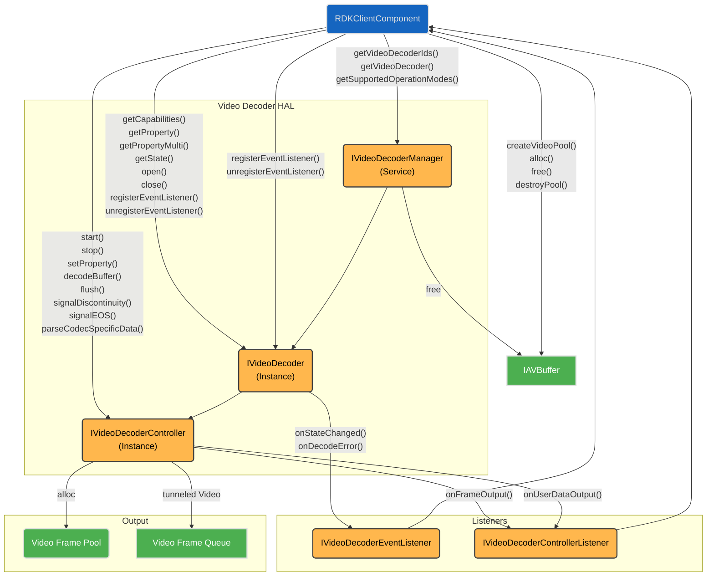
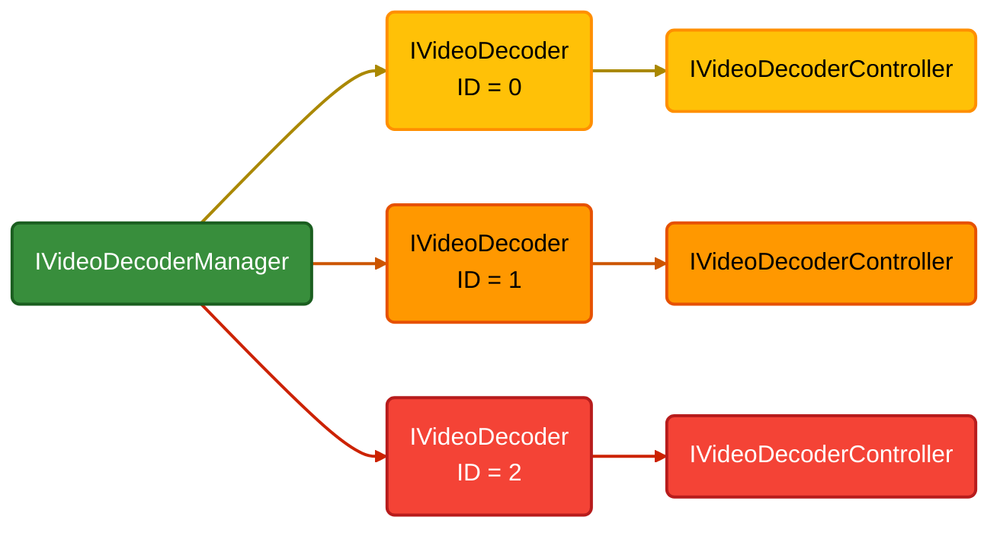
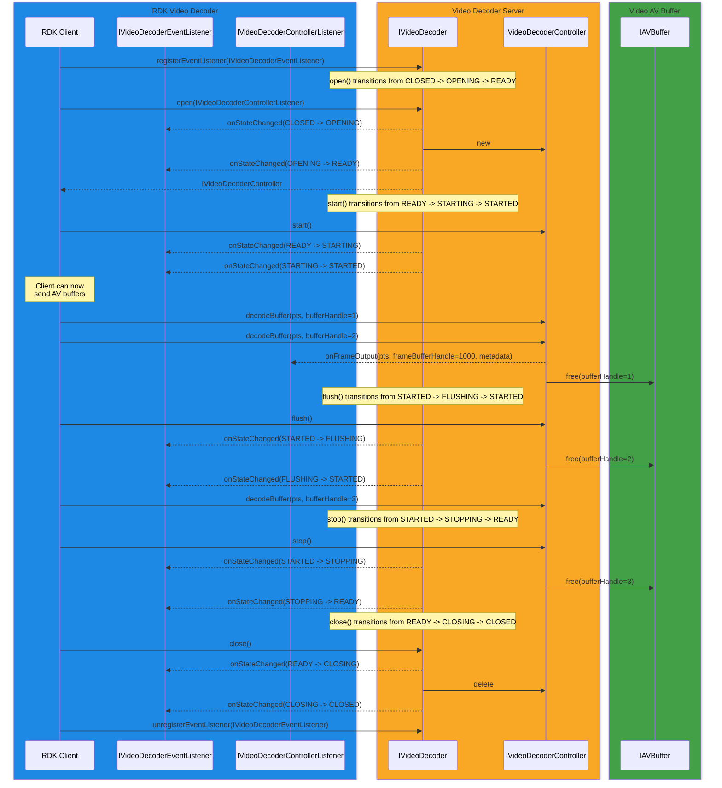

# Video Decoder

The **Video Decoder HAL** service provides interfaces for passing compressed video to the vendor layer for decoding. If the service supports secure audio processing, it may also handle secure buffers.

The output of the video decoder can follow two paths:

- **Non-tunnelled mode** – The decoded video is returned to the RDK media pipeline as a video frame buffer along with metadata.
- **Tunnelled mode** – The decoded video is passed directly through the vendor layer.

The choice between tunnelled and non-tunnelled video does not affect the operational mode of the audio decoder. It is possible to have tunnelled video while using non-tunnelled audio.

The video decoder's operational mode can be selected by the client upon initialization.

The **RDK middleware GStreamer pipeline** includes a dedicated **RDK Video Decoder** element, specifically designed to integrate with the **Video Decoder HAL** interface.

## References

!!! info References
    |||
    |-|-|
    |**Interface Definition**|[video_decoder/current](https://github.com/rdkcentral/rdk-halif-aidl/tree/main/videodecoder/current)|
    |**API Documentation**| *TBD* |
    |**HAL Interface Type**|[AIDL and Binder](../../../introduction/aidl_and_binder.md)|
    |**VTS Tests**| TBC |
    |**Reference Implementation - vComponent**|[https://github.com/rdkcentral/rdk-halif-aidl/tree/main/videodecoder/current](https://github.com/rdkcentral/rdk-halif-aidl/tree/main/videodecoder/current)|

## Related Pages

!!! tip "Related Pages"
    - [Video Sink](../../video_sink/current/video_sink.md)
    - [AV Buffer](../../av_buffer/current/av_buffer.md)
    - [Session State Management](../../key_concepts/hal/hal_session_state_management.md)

## Implementation Requirements

|#| Requirement | Comments |
|---|---|---|
| **HAL.VIDEODECODER.1** | Video elementary stream data shall be passed to the video decoder to be decoded as frames.| Decontainerisation and demuxing are performed by the RDK AV pipeline before the video decoder. |
| **HAL.VIDEODECODER.2** | Encoded video data is passed one frame at a time to the video decoder in stream, file or broadcast delivered order. |
| **HAL.VIDEODECODER.3** | Decoded video frames are output from the decoder in presentation order. |
| **HAL.VIDEODECODER.4** | Only one video frame shall be output per output frame callback from the video decoder. |
| **HAL.VIDEODECODER.5** | Encoded video data shall be passed in shared memory buffers by handle and shall be in either secure or non-secure buffer types. |The pool implementation of memory buffers for secure and non-secure memory is implemented by the vendor. See [AV Buffer](../../av_buffer/current/av_buffer.md) for details. |
| **HAL.VIDEODECODER.6** | The video decoder shall support a secure video pipeline where encoded and decoded data in secure buffers shall not be exposed to any process outside of the secure video pipeline. Secure coded video input buffers to the video decoder shall always be output in secure decoded frame buffers. |
| **HAL.VIDEODECODER.7** | The video decoder shall operate in either a tunnelled or non-tunnelled operational mode. |Only one of these operational modes needs be supported by the video decoder. |
| **HAL.VIDEODECODER.8** | The video decoder may optionally operate in a textured video operational mode. |
| **HAL.VIDEODECODER.9** | The video decoder HAL shall report on the number of video decoder instances supported and their capabilities. |
| **HAL.VIDEODECODER.10** | An opened video decoder instance shall be configured to decode only a single codec type.| No dynamic video codec switching is supported while open.  A video decoder instance must be closed and reopened to change the codec type.|
| **HAL.VIDEODECODER.11** | The video decoder shall be able to decode back to back I-frames.| Used in I-frame trick modes. |
| **HAL.VIDEODECODER.12** | The video decoder shall discard any frames until the first reference frame has been received. |
| **HAL.VIDEODECODER.13** | If a client process exits, the Video Decoder server shall automatically stop and close any Video Decoder instance controlled by that client. |

## Interface Definition

| Interface Definition File | Description |
|---|---|
| `IVideoDecoderManager.aidl` | Video Decoder Manager HAL which provides access to IVideoDecoder resource instances. |
| `IVideoDecoder.aidl` | Video Decoder interface for a single video decoder resource instance. |
| `IVideoDecoderController.aidl` | Controller interface for an IVideoDecoder resource instance. |
| `IVideoDecoderControllerListener.aidl` | Listener callbacks interface to clients from an IVideoDecoderController. |
| `IVideoDecoderEventListener.aidl` | Listener callbacks interface to clients from an IVideoDecoder. |
| `Capabilities.aidl` | Parcelable describing the capabilities of an IVideoDecoder resource instance. |
| `Codec.aidl` | Enum list of video codecs. |
| `CodecCapabilities.aidl` | Parcelable describing the capabilities of a codec supported by an IVideoDecoder. |
| `CSDVideoFormat.aidl` | Enum list of video codec specific data formats. |
| `DynamicRange.aidl` | Enum list of dynamic ranges. |
| `ErrorCode.aidl` | Enum list of video decoder error codes. |
| `FrameMetadata.aidl` | Parcelable of video frame metadata passed from the video decoder. |
| `OperationalMode.aidl` | Enum list of video decoder operational modes. |
| `PixelFormat.aidl` | Enum list of video pixel formats. |
| `Property.aidl` | Enum list of video decoder properties. |
| `PropertyKVPair.aidl` | Parcelable of a Property and PropertyValue pair. |
| `ScanType.aidl` | Enum list of video frame scan types. |

## Initialization

The [systemd](../../../vsi/systemd/current/systemd.md) `hal-video_decoder_manager.service` unit file is provided by the vendor layer to start the service and should include  [Wants](https://www.freedesktop.org/software/systemd/man/latest/systemd.unit.html#Wants=) or [Requires](https://www.freedesktop.org/software/systemd/man/latest/systemd.unit.html#Requires=) directives to start any platform driver services it depends upon.

The Video Decoder Manager service depends on the Service Manager to register itself as a service.

Upon starting, the service shall register the `IVideoDecoderManager` interface with the Service Manager using the String `IVideoDecoderManager.serviceName` and immediately become operational.

## Product Customization

The `IVideoDecoderManager.getVideoDecoderIds()` should return an array of `IVideoDecoder.Id` parcelables to uniquely represent all of the video decoder resources supported by the vendor layer.  Typically, the ID value starts at 0 for the first video decoder and increments by 1 for each additional video decoder.

The Capabilities parcelable returned by the IVideoDecoder.getCapabilities() function lists all of the Codec types and DynamicRange types supported by this video decoder instance and indicates if the secure audio path can be used.

A video decoder instance may support any number of video codecs, but can only operate on one compressed video stream in an open session.  Concurrent video decode requires multiple video decoder instances to be opened.

## System Context

The Video Decoder HAL can provide functionality to multiple clients.

Typically an RDK middleware GStreamer video decoder element will work with a single IVideoDecoder instance and pass it AV Buffer handles for decode.

The RDK middleware resource management system will examine the number of video decoder resources and their capabilities, so they can be allocated to streaming sessions.

## Resource Management

The `IVideoDecoderManager` provides access to one or more IVideoDecoder sub-interfaces which each represent a video decoder resource instance offered by the platform.

Each IVideoDecoder resource instance is assigned a unique integer ID, which is used in IVideoDecoder.Id.value and can be read from RESOURCE_ID using the IVideoDecoder.getProperty() function.

To use an IVideoDecoder resource instance it must be opened by a client, which returns an IVideoDecoderController sub-interface to access buffer decoding and additional state controls.

!!! Important
    Any number of clients can access the `IVideoDecoderManager` service and get access to the IVideoDecoder sub-interfaces, but only 1 client can open() an IVideoDecoder and access its IVideoDecoderController sub-interface.

The diagram below shows the relationship between the interfaces and resource instances.

## Codec Support

Each RDK product defines the video codecs it requires for IP streaming, apps and broadcast.

Some codecs are subject to third party licensing agreements and may therefore only be included in some products.

The list below indicates the list of video codecs which are mandatory for the platform to support as hardware/vendor decode (potentially secure).

| Codec | Typical Use Case | Hardware/Vendor Support |
|---|---|---|
| MPEG-2 H.262 up to 1080P@60fps | Broadcast streams, IP streams, files | Mandatory |
| AVC H.264 upto HP@L5.1 up to 4Kx2K@30fps | Broadcast streams, IP streams, files | Mandatory |
| HEVC H.265 upto MP-10@L5.1 up to 4Kx2K@60fps | Broadcast streams, IP streams, files | Mandatory |
| VP9 upto Profile 2-10 up to 4Kx2K@60fps | YouTube, WebM, files | Mandatory |
| AV1 upto MP-10@L5.1 up to 4Kx2K@60fps | YouTube, WebM, files | Mandatory |

## Encrypted Video Playback

Encrypted video is copied into a non-secure buffer by the application and then decrypted into a secure buffer. The secure buffer is then decoded by a video decoder accessed through the `IVideoDecoderController` interface.

## Secure Video Processing

Secure video processing (SVP) is a requirement for RDK-E. Video decoder instances shall declare themselves as secure or non-secure by setting `Capabilities.supportsSecure` appropriately.

A secure video decoder shall be able to handle secure AV buffers and decoded video frames output from the decoder shall be either contained in secure AV buffers or securely tunnelled in the vendor layer.

If any video decoder supports SVP in non-tunnelled mode then the Video Sink HAL must also support SVP to be able to process secure AV buffers of decoded video frames.

Markdown Output:

## Operational Modes

There are 3 modes that video decoders can operate in.  The `IVideoDecoderManager.getSupportedOperationalModes()` function must return all operational modes supported by the video decoders in the system.

This set of advertised operational modes must operate on all video decoder instances.

Tunnelled and non-tunnelled modes cannot operate at the same time.  It is optional for video decoders to support both modes as options, but at least one of them must be supported.

If both are supported then there shall never be a dynamic switch between the 2 modes while STARTED.

The `OPERATIONAL_MODE` property controls the operational mode the video decoder shall use.

The enum `OperationalMode` provides the constants used to specify operational modes and allows for bitwise-or of multiple values.

The video decoder may switch operational modes at any time while in a READY or STARTED state.

In all modes, AV buffers containing compressed video are passed into the video decoder through calls to `decodeBuffer()`.

| Operational Mode | Description |
|---|---|
| `TUNNELLED` | Decoded video frames are passed directly to the linked video sink and video plane for rendering.  The vendor layer is responsible for AV sync where audio and video streams are linked in the same pipeline.  Decoded video frames are never received back in frame buffers over `IVideoDecoderControllerListener.onFrameOutput()`, but the `FrameMetadata` must still be returned in the usual way.  All calls to `onFrameOutput()` shall have the `frameBufferHandle` set to -1 to indicate no video frame buffer handle is being passed back.  It is optional for video decoders to support tunnelled operational mode.  If supported, tunnelled mode may be dynamically enabled or disabled while the video decoder is `READY` or `STARTED` and may run concurrently with graphics texture mode. Tunnelled mode cannot be used at the same time as non-tunnelled mode. |
| `NON_TUNNELLED` | Decoded video frames are received back in video frame buffers over `IVideoDecoderListener.onFrameOutput()`.  Frames must be received in presentation order.  It is optional for video decoders to support non-tunnelled operational mode.  If supported, non-tunnelled mode may be dynamically enabled or disabled while the video decoder is `READY` or `STARTED` and may run concurrently with graphics texture mode.  Non-tunnelled mode cannot be used at the same time as tunnelled mode. |
| `GRAPHICS_TEXTURE` | Video frames are converted to NV12 textures.  It is optional for video decoders to support graphics texture operational mode.  If supported, graphics texture mode may be dynamically enabled or disabled while the video decoder is `READY` or `STARTED` and may run concurrently with tunnelled or non-tunnelled mode. |

## Frame Metadata

As video frames are decoded, the metadata which related to the frames must be passed to the client over `IVideoDecoderControllerListener.onFrameOutput()`.

In non-tunnelled operating mode, the frame buffer handle and metadata related to the frame must be passed in the same `onFrameOutput()` call.

To conserve CPU load, the frame metadata is only passed with the first decoded frame after a `start()`, the first decoded frame after a `flush()` or if the frame metadata changes.

If the frame metadata does not need to be passed, then the `@nullable FrameMetadata metadata` parameter should be passed as null in `onFrameOutput()`.

The same rules for frame metadata apply to all operational modes.

When operating exclusively in tunnelled mode, if there is no frame metadata to be passed, then no call to `onFrameOutput()` should be made because there is no frame buffer handle or frame metadata to return to the client.

## Low Latency Mode

A media pipeline is operating in low latency mode when the video decoder and audio decoder (if present) are set with a `LOW_LATENCY_MODE` property to 1 (enabled).

## Video Stream Discontinuities

Where the client has knowledge of PTS discontinuities in the video stream, it shall call `IVideoDecoderController.signalDiscontinuity()` between the AV buffers passed to `decodeBuffer()`.

For the first input [AV Buffer](../../av_buffer/current/av_buffer.md) video frame passed in for decode after the discontinuity, it shall indicate the discontinuity in its next output `FrameMetadata`.

## End of Stream Signalling

When the client knows it has delivered the final video frame buffer to a decoder it shall then call `IVideoDecoderController.signalEOS()`.

The Video Decoder shall continue to decode all buffers previously passed for decode, but no further video buffers should be expected unless the video decoder is first stopped and restarted or is flushed.

The Video Decoder shall emit a `FrameMetadata` with `endOfStream=true` after all video frames have been output from the decoder.

## Decoded Video Frame Buffers

Decoded video frame buffers are only passed from the video decoder to the client when operating in the non-tunnelled operational mode.

If the input [AV Buffer](../../av_buffer/current/av_buffer.md) that contained the coded video frame was passed in a secure buffer, then the corresponding decoded video frame must be output in a secure video frame buffer.

Video frame buffers are passed back as handles in the `IVideoDecoderControllerListener.onFrameOutput()` function `frameBufferHandle` parameter.  If no frame buffer handle is available to pass but the call needs to be made to provide updated FrameMetadata then `-1` shall be passed as the handle value.

The format of the data in the decoded video frame buffer is determined by the vendor driver implementation and does not need to be understood by the RDK middleware.

The frame buffer handle is later passed to the Video Sink for queuing before presentation and is then freed.

The vendor layer is expected to manage the pool of decoded frame buffers privately and report its size in the `OUTPUT_FRAME_POOL_SIZE` property.

If the frame buffer pool is empty then the video decoder cannot output the next decoded frame until a new frame buffer becomes available.  While frame output is blocked, it is reasonable for the video decoder service to either buffer additional coded input buffers or to reject new calls to `decodeBuffer()` with a false return value.

## Presentation Time for Video Frames

The presentation time base units for video frames is nanoseconds and passed in an int64 (long in AIDL definition) variable type. Audio buffers shared the same time base units of nanoseconds.

When coded video frames are passed in through [AV Buffer](../../av_buffer/current/av_buffer.md) handles to `IVideoDecoderController.decodeBuffer()` the `nsPresentationTime` parameter represents the video frame presentation time.

Calls to `IVideoDecoderControllerListener.onFrameOutput()` with frame buffer handles (non-tunnelled mode) and/or frame metadata shall use the same `nsPresentationTime`.

The video decoder shall output frames in presentation order regardless of the order of input frames which is ordered by the encoder.

## Video Decoder States

The Video Decoder HAL follows the standard Session State Management paradigm.

When an Video Decoder session enters a FLUSHING or STOPPING transitory state it shall free any AV buffers it is holding.

The sequence diagram below shows the behaviour of the callbacks.

