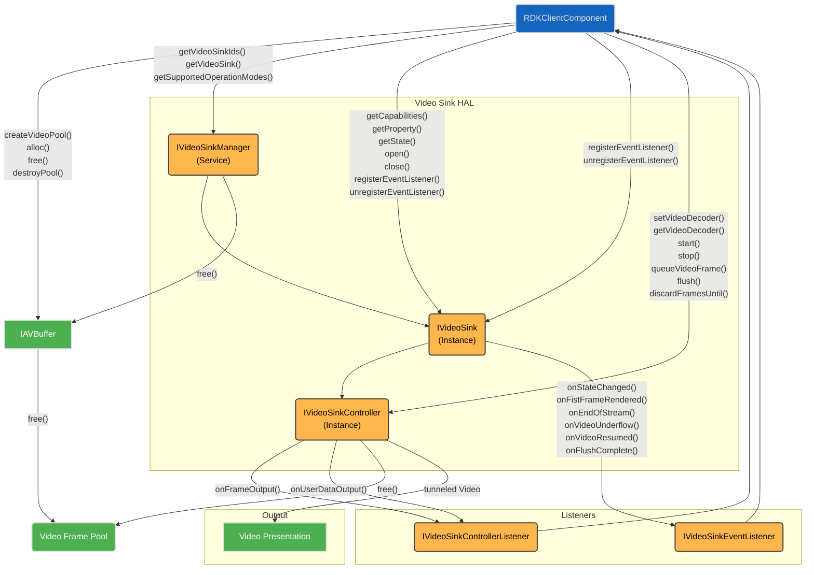
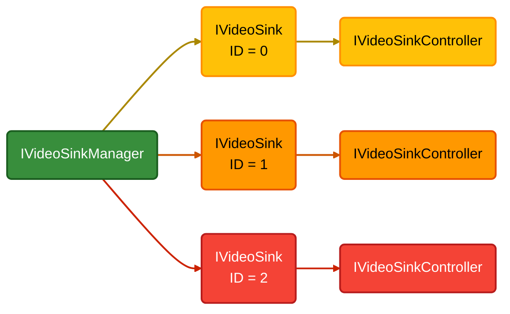
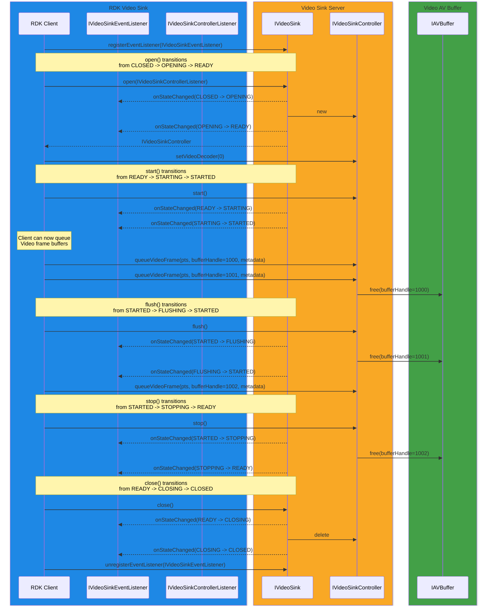

# Video Sink

The `Video Sink` HAL service manages the video frame queue and ensures timely delivery of video frames to a video plane, synchronized with the vendor’s AV timing.

In non-tunneled video modes, it facilitates the transfer of decoded video frame buffers to the video frame queue for processing.

The RDK middleware’s GStreamer pipeline includes a dedicated RDK Video Sink element, specifically designed to integrate seamlessly with the Video Sink HAL interface.

## References

!!! info References
    |||
    |-|-|
    |**Interface Definition**|[video_sink/current](https://github.com/rdkcentral/rdk-halif-aidl/tree/main/videosink/current)|
    | **API Documentation** | *TBD - Doxygen* |
    |**HAL Interface Type**|[AIDL and Binder](../../../introduction/aidl_and_binder.md)|
    |**Initialization - TBC** | [systemd](../../../vsi/systemd/current/intro.md) - **hal-video_sink.service** |
    |**VTS Tests**| TBC |
    |**Reference Implementation - vComponent**|[https://github.com/rdkcentral/rdk-halif-aidl/tree/main/videosink/current](https://github.com/rdkcentral/rdk-halif-aidl/tree/main/videosink/current)|

## Related Pages

!!! tip Related Pages
    - [Video Decoder](../../video_decoder/current/video_decoder.md)
    - [AV Buffer](../../av_buffer/current/av_buffer.md)
    - [AV Clock](../../av_clock/current/av_clock.md)
    - [Session State Management](../../key_concepts/hal/hal_session_state_management.md)

## Implementation Requirements

|#| Requirement | Comments |
|-|---|---|
| **HAL.VIDEOSINK.1** | Shall manage a queue of video frames delivered from the client and held ready for presentation, often requiring AV lip sync. ||
| **HAL.VIDEOSINK.2** | Shall support flushing of the internal queue of video frames and notify the client when a flush operation has completed. ||
| **HAL.VIDEOSINK.3** | Shall internally manage the release of video frame handles back to the internal pool after they have finished being presented or during a flush. ||
| **HAL.VIDEOSINK.4** | Shall notify the client when the first frame is presented in the session once opened or after a flush operation. ||
| **HAL.VIDEOSINK.5** | Shall notify the client when a video underflow occurs.| A video underflow condition is met if an expected frame is not queued in time for display. |
| **HAL.VIDEOSINK.6** | Shall provide an API to expose the video sink resources for the client to discover. ||
| **HAL.VIDEOSINK.7** |  ||
| **HAL.VIDEOSINK.8** | Video frames decoupled from video planes (destination plane -1) shall continue to be delivered and remain in sync with audio.  When coupled to a video plane they shall immediately become visible and be in lip sync. |To ensure if/when a video sink source is assigned to a video plane it appears in sync with audio. |
| **HAL.VIDEOSINK.9** | If a client process exits, the Video Sink server shall automatically stop and close any `IVideoSink` instance controlled by that client. ||

## Interface Definition

| Interface Definition File | Description |
|---|---|
| `IVideoSinkManager.aidl` | Video Sink Manager HAL which provides access to `IVideoSink` resource instances. |
| `IVideoSink.aidl` | `IVideoSink` interface for a single video sink resource instance. |
| `IVideoSinkController.aidl` | Controller interface for an `IVideoSink` resource instance. |
| `IVideoSinkControllerListener.aidl` | Listener callbacks interface to clients from an `IVideoSinkController`. |
| `IVideoSinkEventListener.aidl` | Listener callbacks interface to clients from an `IVideoSink`. |
| `Capabilities.aidl` | Parcelable describing the capabilities of an `IVideoSink` resource instance. |
| `Property.aidl` | Enum list of video sink properties. |

## Initialization

The [systemd](../../../vsi/systemd/current/intro.md) `hal-video_sink_manager.service` unit file is provided by the vendor layer to start the service and should include Wants or Requires directives to start any platform driver services it depends upon.

The Video Sink Manager service depends on the Service Manager to register itself as a service.

Upon starting, the service shall register the `IVideoSinkManager` interface with the Service Manager using the String `IVideoSinkManager.serviceName` and immediately become operational.

## Product Customization

The `IVideoSinkManager.getVideoSinkIds()` should return an array of `IVideoSink.Id` parcelables to uniquely represent all of the video sink resources supported by the vendor layer.  Typically, the ID value starts at 0 for the first video sink and increments by 1 for each additional video sink.

The `Capabilities` parcelable returned by the `IVideoSink.getCapabilities()` function lists all capabilities supported by this video sink instance.

A video sink instance can only operate on one video stream in an open session.  Concurrent video streams requires multiple video sink instances to be opened.

## System Context

The Video Sink HAL can provide functionality to multiple clients.

Typically an RDK middleware GStreamer video sink element will work with a single `IVideoSink` instance and pass it video frame buffers with associated metadata for display.

The RDK middleware resource management system will examine the number of video sink resources and their capabilities, so they can be allocated to streaming sessions.

## Resource Management

The `IVideoSinkManager` provides access to one or more `IVideoSink` sub-interfaces which each represent a video sink resource instance offered by the platform.

Each `IVideoSink` resource instance is assigned a unique integer ID, which is used in the `IVideoSink.Id.value` and can be read from `RESOURCE_ID` using the `IVideoSink.getProperty()` function.

To use an `IVideoSink` resource instance it must be opened by a client, which returns an `IVideoSinkController` sub-interface to access buffer queuing and additional state controls.

Any number of clients can access the `IVideoSinkManager` service and get access to the `IVideoSink` sub-interfaces, but only 1 client can `open()` an `IVideoSink` and access its `IVideoSinkController` sub-interface.

The diagram below shows the relationship between the interfaces and resource instances.

## Video Buffers

Video frame buffers only pass through the Video Sink while a video decoder is operating in non-tunnelled mode.

Video frame buffers entering the Video Sink shall be delivered as AV Buffer handles with a presentation timestamp and metadata describing the video frame through the `IVideoSinkController.queueVideoFrame()` function.

The video frame data in the buffer is vendor specific and is not decoded or understood by the RDK middleware.

Once the data in a video frame buffer has been presented or upon a flush request, the Video Sink shall free handles by calling `IAVBuffer.free()`.

## Secure Video Processing

Secure video processing (SVP) is a requirement for RDK-E.

If any video decoder supports SVP in non-tunnelled mode then the Video Sink HAL must also support SVP to be able to process secure AV buffers of decoded video frames.

## End of Stream Signalling

The Video Decoder shall emit a `FrameMetadata` with `endOfStream=true` after all video frames have been output from the decoder.

For non-tunnelled video, the Video Sink shall be passed this metadata with the final video frame buffer or after the last video frame buffer has been queued by the RDK middleware client.

All video frame buffers queued up in the Video Sink are expected to continue to be displayed in the usual way, but the Video Sink is not expecting any further video buffers to be queued.

## Video Plane Mapping

The display of decoded video frames are made on the video plane that has been mapped by a `SourceType::VIDEO_SINK` and index matching the Video Sink resource instance ID which was specified in the ID when `IVideoSinkManager.getVideoSink()` was called and can also be read back in the `RESOURCE_ID` property of the Video Sink.

Setting and changing the mapping requires a call to `IPlaneControl.setVideoSourceDestinationPlaneMapping()`.

Full details are covered in the [Plane Control HAL](../../plane_control/current/plane_control.md).

## Video Sink States

The Video Sink HAL follows the standard Session State Management paradigm.

When an Video Sink session enters a `FLUSHING` or `STOPPING` transitory state it shall free any AV buffers it is holding.

The sequence diagram below shows the behavior of the callbacks.

