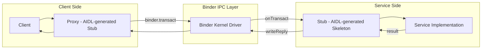

# AIDL and Binder Overview in RDK HAL Architecture

## Revision History

| Version | Date       | Author           | Changes                                    |
| ------- | ---------- | ---------------- | ------------------------------------------ |
| 1.1     | 2025-06-17 | Gerald Weatherup | Updated to include more detail |
| 1.0     | 2024-08-13 | Lucien Kennedy-Lamb| Initial version, AIDL + RDK Binder Context |

## Purpose

This document provides a comprehensive overview of how Android Interface Definition Language (AIDL) is used within the RDK platform to define and implement Hardware Abstraction Layers (HALs) using Binder IPC. It includes motivation from the 2023 RDK HAL study, a system flowchart, and references to upstream documentation and tooling.

---

## System Architecture Flow



---

## RDK HAL and Binder Design Goals

The 2023 RDK HAL study outlined a next-generation HAL strategy built on the following principles:

### Design Goals

* **Clean Separation:** Middleware and vendor code are modular and clearly separated.
* **Process Isolation:** Each HAL runs in its own process, improving stability and testability.
* **Late Binding:** Middleware and vendor components are linked only at runtime, not build-time.
* **Versioning:** AIDL interfaces support backward/forward compatibility.
* **Performance:** Binder provides efficient IPC suitable for real-time AV use cases.
* **Testability:** Vendor HALs can be tested in isolation without full stack.
* **Debuggability:** Rich tracing and tooling for diagnostics.

---

## Binder in RDK HALs

Binder is a lightweight, low-latency IPC mechanism designed for Android and now adopted in RDK HALs.

### Benefits for RDK HALs

* **Process & Memory Isolation:** HAL crashes are contained, improving robustness.
* **Late Binding:** HAL and middleware components can be delivered and updated independently.
* **Security & Debugging:** Binder integrates with SELinux and provides kernel-level tracing.

Binder is implemented as a kernel driver and must be enabled at kernel configuration time.

---

## AIDL: Interface Definition and Contract

AIDL (Android Interface Definition Language) is the mechanism used to define HAL interfaces in RDK.

### Why AIDL?

* **Contract Definition:** Precise and language-agnostic description of available APIs.
* **Tooling:** Generates proxy and stub C++ classes that reduce boilerplate and human error.
* **Binder Integration:** Seamlessly marshals and unmarshals calls across process boundaries.
* **Stable AIDL:** Allows interface evolution with runtime version negotiation.

---

## Key Concepts and Benefits

| Concept              | Description                                                         |
| -------------------- | ------------------------------------------------------------------- |
| Interface Definition | `.aidl` files describe the HAL’s public API contract                |
| Code Generation      | AIDL compiler emits client and server glue code                     |
| Proxy                | Client-side object that wraps Binder calls                          |
| Stub                 | Server-side object that receives and dispatches Binder transactions |
| Versioning           | Stable AIDL supports version negotiation and compatibility          |
| Process Isolation    | Middleware and HALs run in separate processes                       |
| Late Binding         | Middleware doesn't link directly to vendor libraries                |

---

## HAL Development Flow

1. Define an interface in `.aidl` (e.g. `IAudioSink.aidl`).
2. Use the AIDL compiler to generate proxy/stub code.
3. Implement the server-side service in the vendor HAL.
4. Bind the service using a `ServiceManager`.
5. Middleware connects via the AIDL proxy.

---

## Example: Audio Sink AIDL

```aidl
interface IAudioSink {
    void play();
    void stop();
    int getLatencyMs();
}
```

Generates:

* `BpAudioSink` (Proxy)
* `BnAudioSink` (Stub)
* `IAudioSink.h` (Interface definition)

## Component Directory Structure and Interface Versioning

Each RDK HAL component is maintained as a self-contained module. The working version of each component lives under a `current/` subdirectory, which includes AIDL interfaces, build configuration, and metadata. Interface versioning is not embedded in the directory structure during development; instead, it is applied during the release process.

### Example: `audiosink` Component Layout

```text
audiosink/
└── current/
    ├── CMakeLists.txt
    ├── com/
    │   └── rdk/
    │       └── hal/
    │           └── audiosink/
    │               ├── Capabilities.aidl
    │               ├── ContentType.aidl
    │               ├── ErrorCode.aidl
    │               ├── IAudioSink.aidl
    │               ├── IAudioSinkController.aidl
    │               ├── IAudioSinkControllerListener.aidl
    │               ├── IAudioSinkEventListener.aidl
    │               ├── IAudioSinkManager.aidl
    │               ├── PlatformCapabilities.aidl
    │               ├── Property.aidl
    │               ├── Volume.aidl
    │               └── VolumeRamp.aidl
    └── hfp-audiosink.yaml
```

### Breakdown of Key Elements

* `current/`:
  The active development version of the component. This is the authoritative source for both the AIDL definitions and the associated HAL feature metadata.

* `com/rdk/hal/audiosink/*.aidl`:
  The AIDL files define the complete Binder IPC interface set for the `audiosink` HAL. Each file represents a distinct part of the interface, such as data types, error codes, control interfaces, and listener callbacks.

* `CMakeLists.txt`:
  Defines how to build the AIDL-generated C++ sources and any associated HAL service or unit test binaries.

* `hfp-audiosink.yaml`:
  The HAL Feature Pack (HFP) descriptor. This file maps interface implementations to service names, identifies required capabilities, and may include metadata for integration and deployment.

---

### Interface Versioning via Release Process

* The `current/` directory is **unversioned during development**.
* During the **formal release process**, the `current/` tree is:
    * Validated for stability using AIDL tooling.
    * Snapshotted or copied to a versioned directory (e.g., `1/`, `2/`)
    * Used to generate bindings against specific interface versions.

This approach allows:

* **Concurrent development** of future features in `current/` without affecting released versions.
* **Stable integration points** for validation systems.
* **Backwards compatibility** enforcement through version-aware AIDL and runtime checks.

> Stable AIDL requires a `version` declaration and enforces compatibility rules during build and test, ensuring that client/server pairs remain interoperable across versions.

## Resources

### RDK HAL & AIDL

* [RDK HAL AIDL Repository](https://github.com/rdkcentral/rdk-halif-aidl)

### Android AIDL Documentation

* [AIDL Overview](https://developer.android.com/develop/background-work/services/aidl)
* [AIDL Language Reference](https://source.android.com/docs/core/architecture/aidl/aidl-language)
* [Stable AIDL](https://source.android.com/docs/core/architecture/aidl/stable-aidl)

### Binder Internals

* [Binder Kernel Driver (v5.15)](https://git.kernel.org/pub/scm/linux/kernel/git/stable/linux.git/tree/drivers/android?h=v5.15.164)
* [Binder Tracing Tools](https://github.com/foundryzero/binder-trace)
* [Binder Explorer](https://github.com/opersys/binder-explorer-web)

